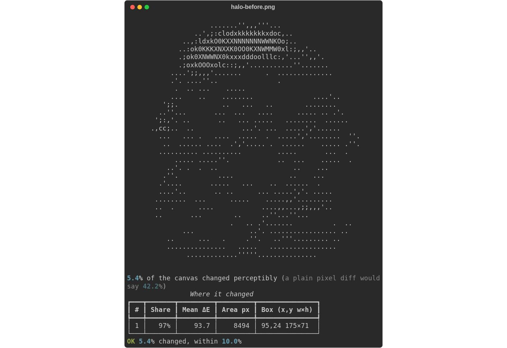
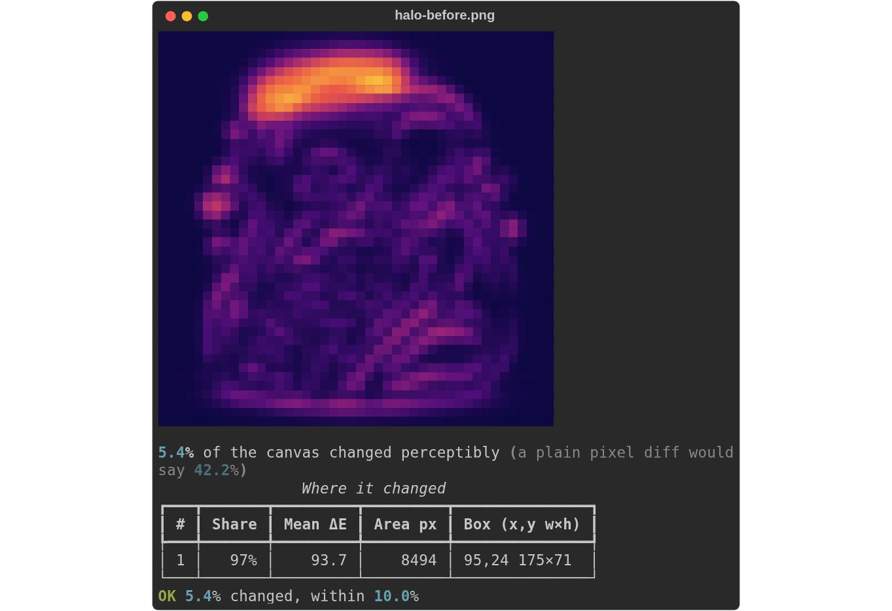

# Four CLI polish items: actual output

Captured 2026-09-10. `TERM=xterm-256color`, `COLUMNS=80`, `LINES=36`,
`NO_COLOR` unset. Both commands run with redirected stdout. The SVG/HTML files
are generated by the real CLI. JPEGs are browser screenshots of those SVGs,
without modifying the rendered product output.

## Diff before and after

```bash
rich --diff crates/rich-art/tests/fixtures/halo-before.png \
  crates/rich-art/tests/fixtures/halo-after.png --width 64 --threshold 10 \
  --export-html diff-after.html --export-svg diff-after.svg > diff-after.txt
```

The `before` files use the pre-change binary retained from the preceding CSV
review verification. The `after` files use this branch's default-feature build.
`diff-before.txt` and `diff-after.txt` are byte-identical and contain no ANSI
escapes. Before HTML has zero half-block cells; after HTML has 968. Both exit 0
and preserve the same threshold verdict. The terminal downgrade diagnostic is
recorded alongside each transcript.




## Notebook decorators and title markup

```bash
rich --ipynb .github/evidence/v0.0.3-cli-polish/release.ipynb \
  --width 64 --center --padding 0,1 --panel rounded --panel-style cyan \
  --title '[bold cyan]Release notebook[/]' \
  --caption '[italic]rs-rich-cli 0.0.3[/]' --export-svg notebook.svg > notebook.txt
```


## Verification

- Workspace tests and Clippy with warnings denied; generated CLI reference and
  manifest-version tables; strict MkDocs build; 21 release workflow regressions.
- New CLI regressions cover destination-specific diff rendering, unchanged
  stdout/diagnostics, explicit image modes, NO_COLOR, gate/save-error exits,
  notebook grouping and unequal-line alignment, title validation and demo flags.
- 19 new renderable golden cases and 2 Text-operation fixtures captured from
  pinned Python Rich 15.0.0; existing fixtures remain unchanged.
- `python3 scripts/test_cli_terminal.py --binary target/debug/rich` uses actual
  POSIX pseudo-terminals to verify the stdin EOF hint and unset/empty/non-empty
  NO_COLOR behavior; all 3 tests pass.
- Independent agent review of CLI/export changes and a separate review of the
  Windows pager/CI changes completed with no remaining findings after repairs.
- The required `Windows system pager` CI job launches native `more.com` and
  checks complete output; its Actions result is reported on the PR.
