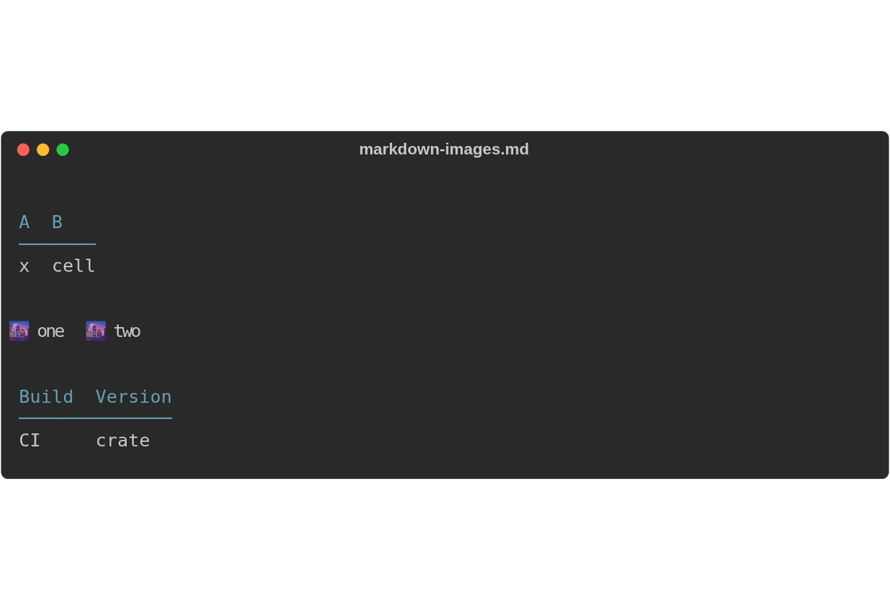
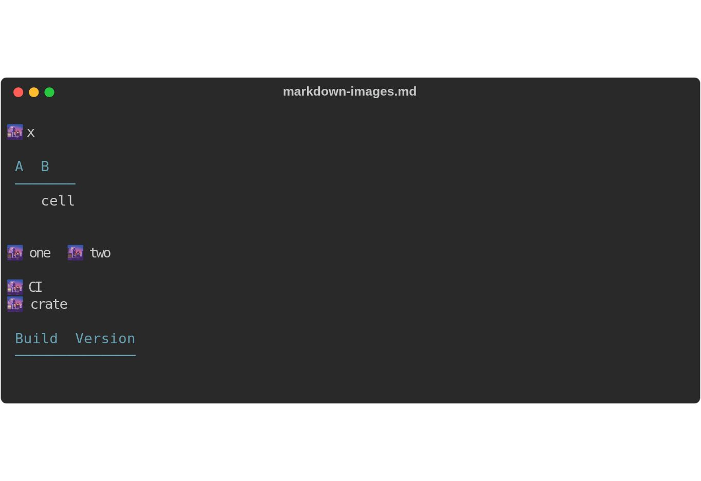
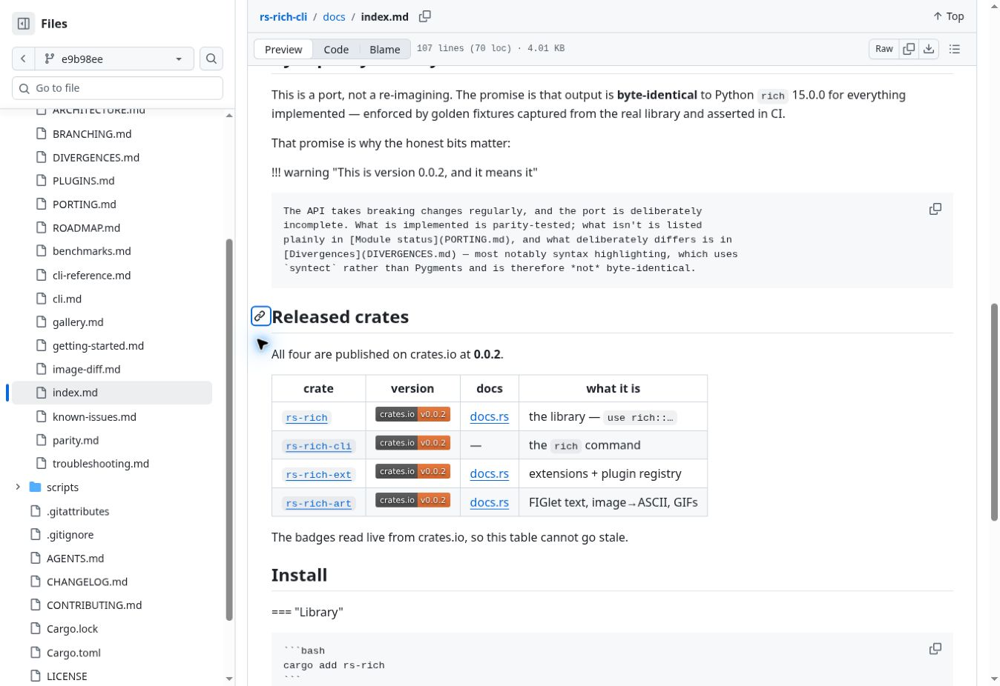
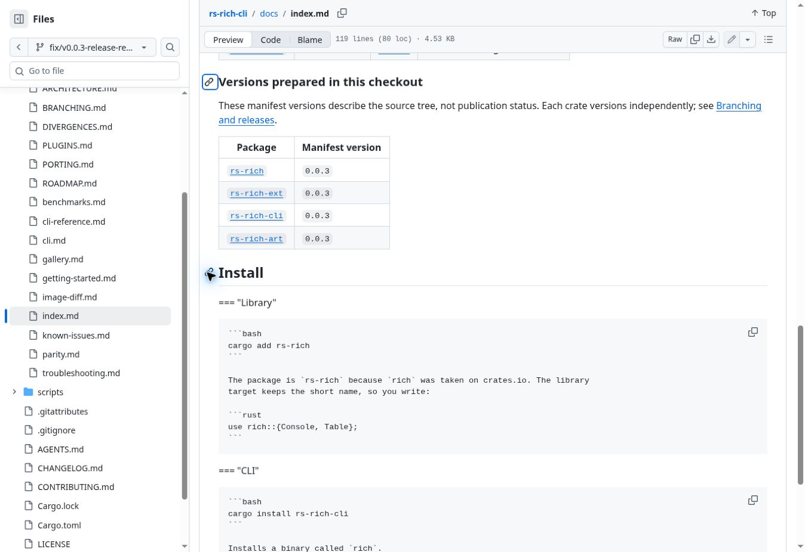

# 0.0.3 release readiness evidence

The terminal images below are **actual CLI SVG exports**, captured with the same
input and command on both builds. Browser screenshots of these exports accompany
the PR. No terminal text or test status was drawn by hand.

- Before: release branch commit `e9b98ee0ef8d48d9399afcbf2844deb45ab232f6`.
- After: this PR, integrating `main` commit `81a9d98e9109c17bf22b5bd9bea21a08cb76edd2`.
- Input: [markdown-images.md](markdown-images.md).
- `rich --version` reports `rich (rs-rich-cli) 0.0.3` for both builds; the
  changed library dependency moves from core 0.0.2 to 0.0.3.

```bash
env -u NO_COLOR TERM=xterm-256color rich \
  --markdown .github/evidence/v0.0.3/markdown-images.md --width 70 \
  --export-svg markdown-output.svg
```

## Before

Table-cell images appear as text inside their cells.



[Original SVG export](markdown-before.svg)

## After

Image placeholders move above their tables and the source cells are empty.
The paragraph retains both image placeholders. This CLI prints placeholders;
it does not fetch or display the linked image files.



[Original SVG export](markdown-after.svg)

The independent parity check regenerates fixtures from Python rich 15.0.0
and compares bytes for `markdown_image_table_cell`,
`markdown_images_one_container`, and `markdown_badge_table` (plus all existing
fixtures). These screenshots illustrate behavior; the tests prove byte parity.

## Documentation

The former page hard-coded all published versions as 0.0.2. The updated page
separates live registry badges from generated per-crate manifest versions.





## Verification

Local environment: Rust 1.98.1; declared MSRV checked separately with Rust 1.90.0;
Python 3.12 and isolated Python rich 15.0.0. Rust and golden tests ran with
`NO_COLOR` removed and `TERM=xterm-256color`.

| Gate | Result |
|---|---|
| `cargo fmt --all --check` | Passed |
| `cargo clippy --all-targets -- -D warnings` | Passed |
| `cargo test --all --locked` | 393 passed |
| CI's four feature configurations (clippy + tests) | Passed |
| `cargo +1.90.0 check --workspace --all-targets --all-features --locked` | Passed |
| Python release/readiness regressions | 21 passed |
| Golden regeneration vs rich 15.0.0 | No fixture drift |
| Generated version tables and actual CLI help | Match |
| `mkdocs build --strict` | Passed |
| `cargo publish --workspace --locked --dry-run --allow-dirty` | All four packages verified; no upload |
| `scripts/release.py plan v0.0.3` | Selects all four at 0.0.3 |

`--allow-dirty` was used only for the local packaging dry run before committing.
The release workflow continues to use clean checkouts and `--locked`.

Two image-diff CLI tests failed intermittently during earlier local runs, with
no stdout and their stderr discarded by the old assertions. They passed serially
and in the final normal parallel suite. The assertions now retain stderr for
future failures; no product behavior or test expectation was changed. The cause
of those transient failures is not established.

GitHub checks passed on implementation commit `34b779d`: [CI #122](https://github.com/buchochelliq-labs/rs-rich-cli/actions/runs/34425020022), [docs #47](https://github.com/buchochelliq-labs/rs-rich-cli/actions/runs/34425020021), and [PR hygiene #90](https://github.com/buchochelliq-labs/rs-rich-cli/actions/runs/34425020041).
