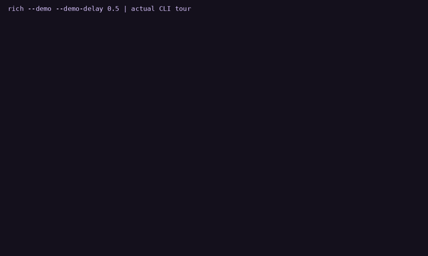
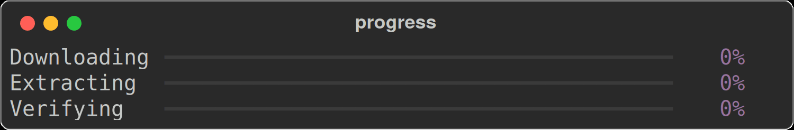

# rs-rich-cli

[](https://github.com/buchochelliq-labs/rs-rich-cli/actions/workflows/ci.yml)
[](https://crates.io/crates/rs-rich)
[](https://docs.rs/rs-rich)
[](https://github.com/buchochelliq-labs/rs-rich-cli#develop)
[](LICENSE)
[](https://buchochelliq-labs.github.io/rs-rich-cli/)

A **Rust port of the Python [`rich`](https://github.com/Textualize/rich)** library
and the [`rich-cli`](https://github.com/Textualize/rich-cli) tool — for rich text,
color, and beautiful formatting in the terminal.

**📖 [Documentation, tutorial and gallery](https://buchochelliq-labs.github.io/rs-rich-cli/)**

Currently tracking **`rich` 15.0.0** and **`rich-cli` 1.8.1**
(see [`UPSTREAM.toml`](UPSTREAM.toml)).



**[Watch the CLI and art videos](https://buchochelliq-labs.github.io/rs-rich-cli/demos/)** ·
[User guide](docs/guide/index.md) · [Output gallery](docs/gallery.md) · [CLI guide](docs/cli.md)

This preview is the recorded 0.0.11 demo tour: `inspect`, `diff`, `view`, the
`hex`, `unicode` and `ansi explain` inspectors, a theme file, a redacted
`capture`, and the new image modes.
[Tour and reproduction](docs/demos.md) ·
[0.0.11 release notes](docs/releases/0.0.11.md).

## Install and try

```bash
cargo install rs-rich-cli
rich --print '[bold magenta]Hello[/] [green]World[/]'
rich --help
rich --demo  # guided suite tour; Ctrl+C stops
```

For Rust applications, use `cargo add rs-rich` and import `rich::Console`.
See [Getting started](docs/getting-started.md) for library examples.



Progress and spinner GIFs replay exported library frames; the gallery includes
[tables, panels, trees, Markdown and JSON](docs/gallery.md).

> **Early releases, and the versions say so.** The crates version independently
> by ordinary SemVer; the number is *not* tied to the upstream release. Expect
> breaking API changes. Which upstream version is tracked lives in
> [`UPSTREAM.toml`](UPSTREAM.toml) and the line above. See [AGENTS.md](AGENTS.md)
> for why the version is not mirrored.

## Workspace

Each package follows independent SemVer. The Python releases being tracked are
recorded separately in [`UPSTREAM.toml`](UPSTREAM.toml).

A `vX.Y.Z` tag selects a coordinated workspace release; a `<crate>-vX.Y.Z`
tag selects only that crate. See [the release documentation](docs/BRANCHING.md#releases).

These are the manifest versions in this checkout. Publication status is recorded
in the release notes; the crates.io links show available packages.

<!-- BEGIN MANIFEST VERSIONS -->
| Package | Manifest version |
|---|---|
| [`rs-rich`](https://crates.io/crates/rs-rich) | `0.0.8` |
| [`rs-rich-plugin-api`](https://crates.io/crates/rs-rich-plugin-api) | `0.0.1` |
| [`rs-rich-macros`](https://crates.io/crates/rs-rich-macros) | `0.0.2` |
| [`rs-rich-ext`](https://crates.io/crates/rs-rich-ext) | `0.0.10` |
| [`rs-rich-cli`](https://crates.io/crates/rs-rich-cli) | `0.0.12` |
| [`rs-rich-art`](https://crates.io/crates/rs-rich-art) | `0.0.10` |
| [`rs-rich-mermaid`](https://crates.io/crates/rs-rich-mermaid) | `0.0.1` |
| [`rs-rich-lumis`](https://crates.io/crates/rs-rich-lumis) | `0.0.1` |
<!-- END MANIFEST VERSIONS -->

| Package | Role | Import / installed name |
|---|---|---|
| `rs-rich` | faithful port of Python rich 15.0.0 | `use rich` |
| `rs-rich-ext` | additions and plugin registry | `use rich_ext` |
| `rs-rich-macros` | checked markup and derive macros (via `rs-rich-ext`'s `macros` feature) | `use rich_ext::richf` |
| `rs-rich-cli` | CLI tracking Python rich-cli 1.8.1 | executable `rich` |
| `rs-rich-art` | FIGlet, image→ASCII, animated GIFs | `use rich_art` |
| `rs-rich` (PyPI) | Python bindings: Rich's API over the Rust core (first slice) | `import rs_rich` |

The published package names carry an `rs-` prefix because `rich` is already taken
on crates.io by an unrelated crate. The library targets keep the short names, so
you still write `use rich::…`.

The dependency arrow only ever points one way: `rich-cli → rich-ext → rich` and
`rich-cli → rich-art → rich`, with `rich-ext → rich-macros` behind ext's optional
`macros` feature. Nothing depends back on the CLI or ext. This keeps the core a clean mirror and
makes upstream syncs a mechanical diff-and-port. See
[docs/ARCHITECTURE.md](docs/ARCHITECTURE.md).

## Status

**Usable, not complete.** Read that literally — the parts listed as done are
byte-parity tested against real Python `rich` 15.0.0, and the parts that aren't
listed genuinely aren't there.

**Ported and parity-tested:** colour (truecolor/256/standard downgrade) · styles ·
markup · `Text` (wrapping, justification incl. full, overflow, spans) ·
`Console` (capture, export to HTML/SVG, paging, control codes) · `Segment` ·
themes · highlighters · `Table` · `Panel` · `Rule` · `Align` · `Padding` ·
`Columns` · `Constrain` · `Tree` · `Layout` · `Screen` · `Markdown` · `Syntax` ·
`JSON` · `Pretty` · `Traceback` · `Progress` (incl. `track()` and
`RenderableColumn`) · `Spinner` · `Status` · `Live` · `LogRender` · `Bar` ·
`Prompt` · emoji · filesize.

**Not ported:** Windows legacy-console support (so pre-Windows-10 terminals fall
back to plain output), Jupyter integration, and `inspect`/`repr` of Python objects
(no Rust equivalent — see [#19](https://github.com/buchochelliq-labs/rs-rich-cli/issues/19)).
A `log`/`tracing` handler (`RichHandler`) lives in `rs-rich-ext`.

**Known to differ from upstream**, deliberately and with reasons, in
[docs/DIVERGENCES.md](docs/DIVERGENCES.md) — most notably syntax highlighting uses
`syntect` rather than Pygments, so highlighted code is *not* byte-identical.

Per-module detail is in [docs/PORTING.md](docs/PORTING.md). What comes next, and
why, is in [docs/ROADMAP.md](docs/ROADMAP.md); the tracking epic is
[#16](https://github.com/buchochelliq-labs/rs-rich-cli/issues/16).

## Release history and development

The [0.0.11 release notes](docs/releases/0.0.11.md) document the newest
cohort; older notes are in [`docs/releases/`](docs/releases/). Later source changes are tracked in the [roadmap](docs/ROADMAP.md)
and development plans. The manifest table above describes this checkout;
crates.io is the source for available published versions.

The 0.0.9 cohort (core 0.0.5, ext 0.0.7, art 0.0.7, CLI 0.0.9) is also
[published](docs/releases/0.0.9-expanded.md). The [0.0.10 cohort](docs/releases/0.0.10.md)
(core 0.0.6, ext 0.0.8, art 0.0.8, CLI 0.0.10) is published: Progress time, rate and spinner columns, upstream's theme stack, `~~~`
strikethrough parity, multi-file watch, and quadrant, ANSI16 and grayscale image
modes with tone adjustments. The [0.0.11 cohort](docs/releases/0.0.11.md)
(core 0.0.7, macros 0.0.1 (new), ext 0.0.9, art 0.0.9, CLI 0.0.11) is
published: diagnostics, structured data, checked-markup macros,
`clap` and `tracing` integration, workflow renderables, and the `inspect`, `diff`,
`view`, `hex`, `unicode`, `env` and `capture` commands. See [copyable workflows](docs/recipes.md).

## Install

```bash
cargo add rs-rich                      # the library — then `use rich::…`
cargo install rs-rich-cli              # the `rich` command
```

## Try it

```bash
cargo run -p rs-rich-cli            # capability demo (markup, color, extensions)
cargo run -p rs-rich-cli -- --help  # every supported flag
cargo run -p rs-rich-cli -- FILE    # print a file (type auto-detected)
```

The CLI covers upstream's `--markdown` · `--syntax` · `--json` · `--csv` ·
`--ipynb` · `--print` · `--rule` · `--panel` · `--padding` · `--pager` ·
`--export-html` · `--export-svg` and alignment and width flags, plus fetching an
`http(s)` URL directly. It adds `--jsonl` · `--log` · `--image` · `--gif` ·
`--diff` · `--sanitize` · `--report json` · `--watch` · `--batch` ·
`--theme-file` · `--format`. Preferred subcommands such as `rich json`,
`rich markdown`, `rich csv`, `rich jsonl` and `rich log` coexist with the legacy
flat flags.

0.0.11 adds tool commands: `inspect`
(JSON/YAML/TOML/XML/INI/CSV with `--select`, `--compare` and experimental
`--redact`), `diff` for text and patches, `view`, `hex` (alias `hexdump`),
`unicode`, `env`, `capture` (with experimental `--redact`), `ansi explain`,
`doctor`, `bench compare`, `completions`, `docs`, `config explain|reference`,
and rich-rendered help (`rich COMMAND --help`). See the
[CLI guide](docs/guide/cli/walkthrough.md) and
[CLI reference](docs/cli-reference.md).

Library usage:

```rust
use rich::{Console, ColorSystem};
use rich_ext::ConsoleExt;

let mut console = Console::new();
console.install_extensions();                 // optional: our highlighters etc.
console.print_str("[bold red]Hello[/] [green]World[/] — 42");
```

## Develop

```bash
cargo fmt --all
cargo clippy --all-targets -- -D warnings
cargo test
```

Golden parity fixtures are captured from the real Python library:

```bash
pip install "rich==15.0.0"
python scripts/capture_golden.py
```

## Extending

Add your own highlighters/renderables in `rich-ext` and register them onto a
`Console` — the core never needs to know. See [docs/PLUGINS.md](docs/PLUGINS.md).

## Contributing / maintaining

The maintenance contract — the mirror/ext boundary, versioning, the parity
workflow, and how to sync a new upstream release — is in
[AGENTS.md](AGENTS.md) and [CONTRIBUTING.md](CONTRIBUTING.md). There are two
skills to drive the common flows: `sync-upstream` and `port-module`.

## License

MIT — matching upstream `rich`. See [LICENSE](LICENSE).
