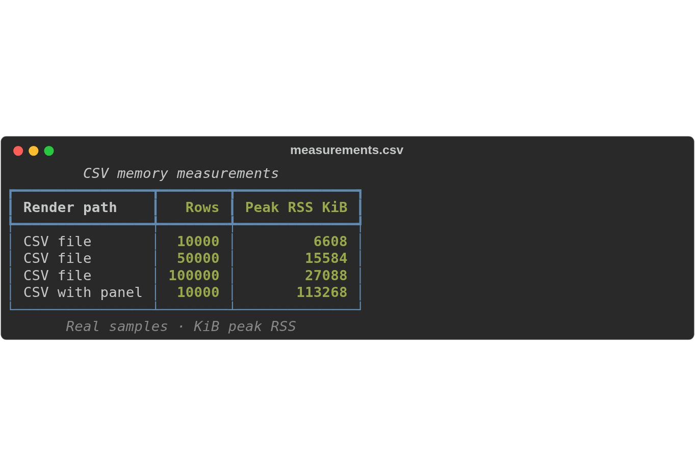
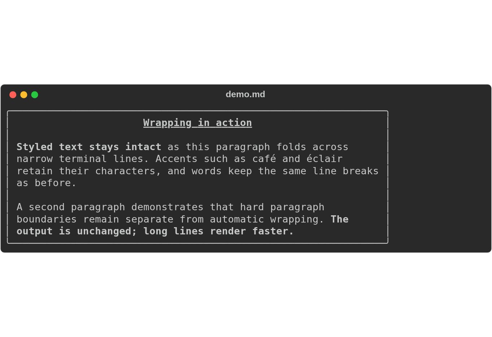
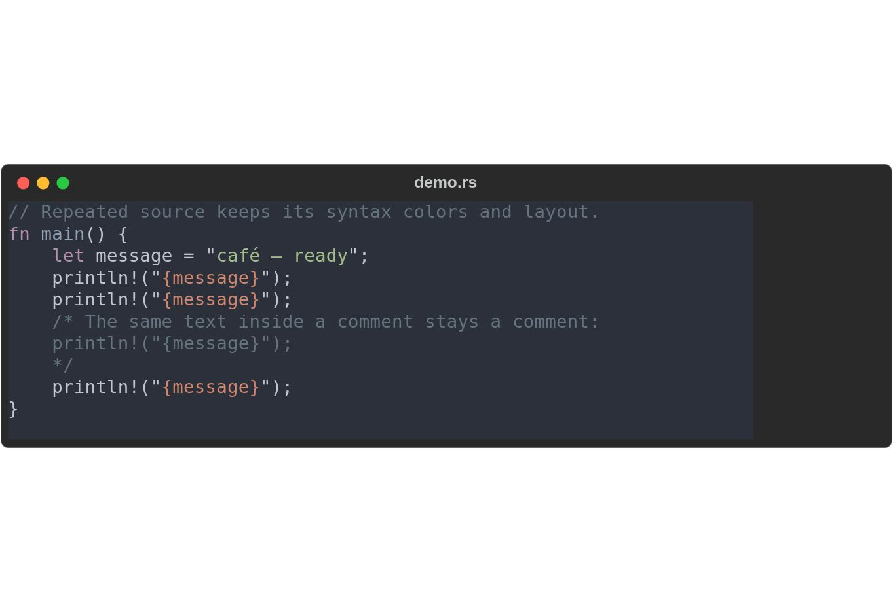

# Benchmarks

How this Rust `rich` CLI compares to the Python `rich-cli` it mirrors.

Reproduce with:

```bash
cargo build --release -p rs-rich-cli
python scripts/bench_cli.py --setup-venv
python scripts/bench_cli.py
```

## Results

Medians of 15 runs after 3 warmup runs, `--width 100`, stdout on a pipe.
Ranges are across three separate passes on one Windows 11 machine.

| case | Rust | Python | speedup |
|---|---|---|---|
| startup floor (one-line markdown) | 14–17 ms | 390–414 ms | **~26×** |
| markdown, 19 KB | 15–18 ms | 502–530 ms | **~30×** |
| JSON, 60 KB | 25–27 ms | 668–730 ms | **~27×** |
| `--rule` (no input file at all) | 12–15 ms | 316–356 ms | **~26×** |
| syntax highlight, 46 KB `.rs` | 283–306 ms | 1050–1184 ms | **~3.8×** |

Versions: this crate at 0.0.2 (release build) against `rich-cli` 1.8.1, which
pins **`rich` 12.6.0** — not the 15.0.0 that `UPSTREAM.toml` mirrors. That is
what `pip install rich-cli` gives you today, so it is the honest real-world
comparison, but it is not a controlled one.

## What the numbers mean

**The startup floor is the interesting one.** Rendering a one-line document
costs ~14 ms here and ~400 ms there, and most of that 400 ms is interpreter
start plus imports, paid on every invocation. That is the difference between a
tool you can put in a pipe, a shell hook, or `$PAGER`, and one you can't.

**Syntax highlighting is this port's weak spot.** At ~290 ms it is roughly 17×
the cost of the markdown path on a comparable file, which drags the advantage
from ~27× down to ~3.8×. It has two components:

| input | time |
|---|---|
| 30 B | 63 ms |
| 21.7 KB | 182 ms |
| 46 KB | 297 ms |
| 199 KB | 912 ms |

A fixed cost of roughly 50 ms above baseline (loading the syntax set) **plus a
linear ~4.3 ms/KB**. The linear term is the one that matters, and it is tracked
as a performance issue.

## Method, and why it is shaped this way

Both binaries are spawned as subprocesses with stdout on a pipe, so neither is
charged for the terminal's own drawing speed and both take their non-TTY path.
Verified symmetric: neither emits ANSI escapes when piped.

Process spawn cost is included on both sides. It is real cost a user pays per
invocation, and on Windows it is not negligible — but it does not favour either
implementation.

Two traps the harness exists to avoid, both of which produced wrong numbers
before they were caught:

1. **The two CLIs do not share short flags.** Python's `-x` is `--lexer`, which
   takes an argument; syntax mode is `--syntax`, and `--json` is capital `-J`.
   Each case therefore carries a separate argv per implementation.

2. **Python's `rich-cli` prints a usage message and exits 0 on an unknown
   flag.** The first version of this benchmark timed a 78-byte usage message
   against a 122 KB render and reported it as "1.1×". Exit status and timing
   both looked healthy. Every case is now validated — output must clear a
   per-case byte floor and must not contain usage text — *before* it is timed.

## Caveats

- **The ANSI path is not measured.** Piped output means neither side emits
  colour, so styling cost is excluded. This CLI has no `--force-terminal`, so
  forcing colour symmetrically is not currently possible.
- **Different `rich` versions** (12.6.0 vs the 15.0.0 this port mirrors).
- **Output is not byte-identical** and is not expected to be — among other
  differences, this port pads syntax lines to the full width where Python
  leaves them ragged (122 KB vs 47 KB for the same 1215 lines).
- **One machine, one OS.** No cross-platform claim is made.
- **Single passes are noisy.** One pass measured the JSON case at 135 ms
  against a 25–27 ms consensus across every other pass. Take the median of
  several passes before believing a number, and never quote a single run.

## 0.0.4 development baseline

Measured on 2026-09-10 against published 0.0.3 source
`d9bfe617e835d7403744d54726e24f21784a7faa`, Linux 6.18.35 x86-64,
Rust 1.98.1, optimized build. These are separate from the historical Windows
comparisons above: no Python comparison or cross-platform speed claim is made.

```bash
cargo build --release -p rs-rich-cli --locked
python3 scripts/bench_v004.py --binary target/release/rich \
  --revision "$(git rev-parse HEAD)" --output baseline.json
```

The Linux harness requires `cc`. It generates deterministic fixtures, validates
and hashes one captured warmup render, then records five end-to-end samples at
width 100 with `--no-color` and stdout redirected. A native `wait4` sampler
measures the CLI's peak RSS without inheriting the Python harness's memory
footprint. Process/sampler startup is included. Each invocation has a 10-second
timeout and process-group cleanup; timed-out cases have no fabricated median.

[Raw samples, ranges and input/output/binary SHA-256 hashes](https://github.com/buchochelliq-labs/rs-rich-cli/blob/main/.github/evidence/v0.0.4-baseline/baseline.json)
are retained alongside the harness.

| Case | Median (ms) | Peak RSS (KiB) |
|---|---:|---:|
| startup | 4.1 | 5,012 |
| syntax-46000 | 186.5 | 25,068 |
| syntax-199000 | 633.3 | 59,036 |
| csv-10000 | 96.8 | 8,900 |
| csv-stdin-10000 | 100.3 | 8,964 |
| csv-panel-10000 | 311.4 | 113,464 |
| csv-50000 | 496.2 | 27,024 |
| csv-100000 | 977.5 | 49,884 |
| wrap-ascii-65536 | 10.5 | 8,200 |
| wrap-ascii-262144 | 27.6 | 11,252 |
| wrap-ascii-1048576 | 95.8 | 24,388 |
| wrap-ascii-5242880 | 454.7 | 94,476 |
| wrap-words-5m | 601.2 | 129,964 |
| wrap-markdown-1m | 3969.1 | 24,232 |
| wrap-unicode | 8.8 | 7,964 |
| wrap-markdown-5m | >10,000 (warmup timeout) | — |

The legacy `wrap-ascii-*`, `wrap-words-5m` and `wrap-unicode` fixtures have
`.txt` extensions, which select the plain Syntax renderer. They do **not**
measure the Text wrapping path. These 5 MiB Syntax cases complete under a second
on this host, while the 5 MiB Markdown paragraph times out. The harness now also
contains extensionless `text-*` fixtures that select Text directly. Legacy case
names and raw measurements are retained for comparison. Do not apply the
original issue's 120-second observation to every input.
CSV retains source rows for global measurement; decorated output additionally
buffers rendered lines. Memory is not constant.

Before implementation, the targets are: reduce the 100k-row CSV peak RSS by at
least 40%; halve the 1 MiB Markdown paragraph time and make the 5 MiB paragraph
finish within 10 seconds; reduce the 199 KB syntax median by at least 20%.
These are engineering targets, not shipped performance guarantees. Compare on
this host with the same build settings and corpus, retain output hashes, and
report short-input regressions and decorated-path limitations separately.

## 0.0.4 CSV ownership improvement

The development build transfers parsed rows and their collection into `Table`
through an ownership extension point, and trims completed row capacity. Global
header/numeric inference and column measurement are unchanged. This removes a
second full cell copy and duplicate row-container allocation; it is not
constant-memory streaming.

| Case | 0.0.3 peak RSS (KiB) | Development peak RSS (KiB) |
|---|---:|---:|
| csv-10000 | 8,900 | 6,608 |
| csv-stdin-10000 | 8,964 | 6,604 |
| csv-panel-10000 | 113,464 | 113,268 |
| csv-50000 | 27,024 | 15,584 |
| csv-100000 | 49,884 | 27,088 |

The 100k-row case uses about 46% less peak RSS, exceeding the predeclared 40%
target. Decorated output remains dominated by rendered-line buffers. A two-pass
file reader or stdin spooling was considered; ownership transfer avoids new I/O,
disk-failure and cleanup paths while meeting this release's memory target.
Source rows and decorated/paged/exported output still need further work for
bounded-memory processing.

Timings varied with host load. A consecutive five-sample check measured 100k rows
at 1,245 ms before and 1,059 ms after (peak RSS 49,900 → 26,952 KiB); the earlier
full pass ranged more widely. This is a memory improvement, not a general speed
guarantee. [All samples and 120 output comparisons](https://github.com/buchochelliq-labs/rs-rich-cli/tree/main/.github/evidence/v0.0.4-csv)
are retained. The comparison matrix matched stdout, stderr, exit status and both
HTML/SVG exports byte-for-byte across dialects, ragged/multiline/Unicode rows,
widths 4/20/80, panels, padding, alignment, titles/captions and pager selection.

Actual CLI rendering of the recorded CSV memory measurements:



## 0.0.4 Text wrapping results

Text now converts successive character break positions to UTF-8 byte positions
by scanning only the next slice. This removes repeated prefix scans without
changing line breaks, graphemes, cropping or styles.

Same host, build profile and measurement method as above; a fresh 0.0.3 baseline
was taken for the true Text cases. Five samples follow one warmup.

| Case | 0.0.3 median (ms) | Optimized median (ms) |
|---|---:|---:|
| wrap-markdown-1m | 4142.9 | 112.6 |
| wrap-markdown-5m | >10,000 (timeout) | 531.2 |
| text-ascii-65536 | 25.0 | 8.8 |
| text-ascii-262144 | 260.3 | 24.5 |
| text-ascii-1048576 | 3997.5 | 86.9 |
| text-ascii-5242880 | >10,000 (timeout) | 411.2 |
| text-words-5m | >10,000 (timeout) | 536.0 |
| text-unicode | 11.7 | 6.2 |

The 1 MiB Markdown paragraph improves from 4.14 s to 113 ms, exceeding the
halving target; the 5 MiB paragraph now finishes in 531 ms, below the 10-second
target. The previously timed-out cases have no baseline median, so no speedup
ratio is assigned to them. These are measurements on one Linux host, not a
cross-platform guarantee. Long input still allocates source and rendered lines;
this optimization does not make memory constant.

All five completed before/after benchmark cases retain identical output hashes.
A separate 192-case comparison retains exact stdout, stderr, exit status, HTML
and SVG bytes across narrow/wide output, Unicode, tabs, empty input, Markdown
and decorators. Two additional styled Unicode wrapping goldens come from real
Rich 15.0.0; all existing goldens remain unchanged.

[Raw timings, hashes and reproducible comparisons](https://github.com/buchochelliq-labs/rs-rich-cli/tree/main/.github/evidence/v0.0.4-wrapping)
are committed with the implementation.

Actual CLI output at width 64:



## 0.0.4 repeated-source syntax results

Profiling showed parsing/highlighting dominated syntax rendering. A local cache
now reuses parse operations for exact repeated lines only when the complete
parser state is unchanged. Every line still advances the live highlighter.
Grammars, themes and the regex engine are unchanged. The cache retains the first
64 eligible distinct lines per render; it is not an adaptive or persistent cache.

| Case | 0.0.3 median (ms) | Development median (ms) |
|---|---:|---:|
| Repetitive Rust, 46 KB | 184.8 | 63.3 |
| Repetitive Rust, 199 KB | 697.7 | 159.4 |
| Real CLI source | 431.1 | 435.2 |
| Real Text source | 249.7 | 249.5 |

These are five-run Linux medians using the same inputs and optimized settings.
The repeated 199 KB fixture improves by 77%, exceeding the predeclared 20%
target. Real-source controls are essentially unchanged: this is a benefit for
repeated boilerplate, not a general syntax speedup. Source and output remain
buffered; the cache has an entry limit, not a strict memory-byte bound.

All five benchmark output hashes and 144 output/export combinations match the
pre-change binary. State-sensitive tests compare every bundled theme with
uncached Syntect. Cold-process samples and a separate repeated-library-render
probe are included in the [raw evidence](https://github.com/buchochelliq-labs/rs-rich-cli/tree/main/.github/evidence/v0.0.4-syntax).

Actual CLI syntax output, including identical text inside and outside a comment:


