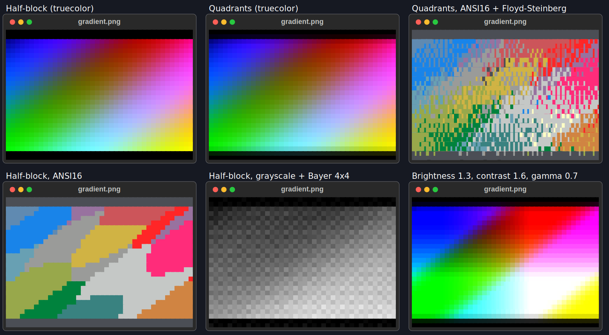
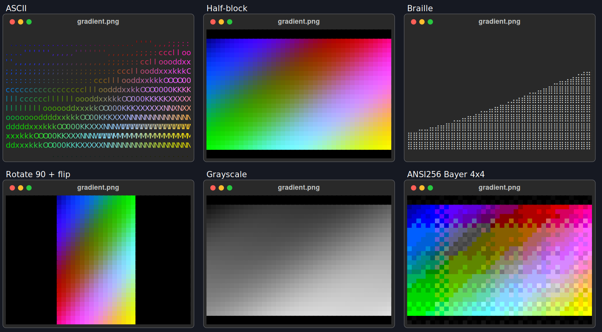
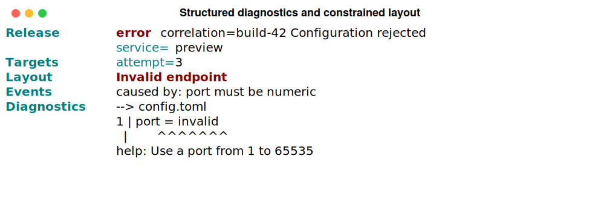

# Using the CLI

`rich` renders files that are painful to read in a terminal — Markdown, JSON,
CSV, source code, notebooks, images — and compares images, text files and
patches. It also explores structured data (`inspect`), shows any file (`view`),
looks inside bytes, characters and escape sequences (`hex`, `unicode`,
`ansi explain`), lists the environment (`env`) and captures a command's output
(`capture`). This page is organised by what you are trying to do. For the
complete list of options, see the [CLI reference](cli-reference.md).

**Assumes** you can run commands in a terminal. Examples use real CLI output
from 0.0.11, the latest published release; see the
[0.0.11 release notes](releases/0.0.11.md).

---

## Take the guided tour

```bash
rich --demo-list              # list core, workflows, art
rich --demo --demo-section workflows  # play one group
rich --demo                   # one pass, 3 seconds between sections
rich --demo --demo-delay 5    # a slower tour
rich --demo --demo-delay 0    # skip section pauses
rich --demo --no-color > tour.txt  # finite, colour-free transcript
```

The tour walks through markup, a pushed theme, tables, panels, layouts,
Markdown (including `~~~` strikethrough), syntax, progress with speed and time
remaining, notebooks, JSON Lines, logs, config profiles, batch planning and
parallel HTML/SVG exports, a two-file watch, `rich inspect`, a text `rich diff`,
`rich view`, the `hex`, `unicode` and `ansi explain` inspectors, an upstream
theme file, a `rich capture --redact` of a shell one-liner, and rich-art's
banners, Braille, half-blocks, quadrants, ASCII, ANSI16 and tone adjustments,
Atkinson dithering with OKLab colours, checkerboard and terminal-default alpha
backgrounds, crop/background controls, image diffs and GIF playback. The watch example ends itself: its last
edit writes invalid JSON, and `--watch-exit-on-error` stops the watch.
It shows commands alongside the CLI examples. URL fetching, external paging
and terminal-specific Sixel support are explained without opening a browser,
fetching a URL or launching a pager.

It runs once and exits. **Ctrl+C stops the tour**, restores the cursor and
cleans up temporary examples. Config files are ignored so the tour works
without setup; its profile example uses an isolated bundled configuration.
It never writes into your current directory. `--demo-delay` accepts 0–60
seconds and only affects section pauses on a terminal; watch/GIF examples
have their own short playback. Redirected output has no pauses or animation.
A build without the `art` feature explains that the art sections are unavailable.
`--demo-list` lists stable section names without playback. Use
`--demo --demo-section core|workflows|art` to select a group (supply one name);
unknown names fail before playback. Use `--demo` on its own for the full tour,
optionally with `--demo-section`, `--demo-delay`, `--no-color` or
`--no-config`; other rendering options and resources are rejected.

## Read a file

Point `rich` at a file and it picks a renderer from the extension: `.md`,
`.json`, `.csv`, `.tsv` and `.ipynb` get their own; **anything else with an
extension is syntax-highlighted**.

```bash
rich README.md
rich data.json
rich main.rs
```

Force a renderer when the extension is missing or misleading:

```bash
rich --markdown CHANGELOG
rich --syntax --width 100 script
rich markdown CHANGELOG
rich syntax --width 100 script
```

Code is highlighted by syntect. `--code-theme NAME` picks one of its themes
(`ansi_dark` and `ansi_light` use the terminal's own colours), and a build with
the `lumis` feature adds `--highlighter lumis` with lumis's themes. Both are
also config keys (`code_theme`, `highlighter`), which a project's `rich.toml`
may set. `rich doctor` lists the highlighters and themes available. See the
[code highlighters guide](guide/ext/code-highlighters.md).

Read from standard input with `-` (including `-p -` for markup):

```bash
cat data.csv | rich --csv -
cat data.csv | rich csv -
```

Input modes without a resource also read stdin until EOF. Interactive input
prints a hint: finish with Ctrl-D on Unix, or Ctrl-Z then Enter on Windows.
With no mode and no resource, `rich` runs its capability demo. The demo accepts
`--no-color`; layout, style, paging, hyperlink and export options require a
resource or render mode and are rejected for the demo.

Repeated scalar options use the last value, including `--width` and export paths.

## Watch a resource

Watch a local file while editing it:

```bash
rich --watch report.md
```

Local files are watched through operating-system file events (inotify,
FSEvents, ReadDirectoryChangesW or kqueue, via the `notify` crate). Each file's
*parent directory* is watched and events are filtered by path, so atomic
rename-over saves and delete-and-recreate are caught. A render only happens
when the file's contents changed: the file is hashed with a bounded buffer, so
same-size edits with preserved timestamps are detected and metadata-only
events are ignored. Atomic saves, temporary disappearance, malformed
intermediate content, and later recovery are handled as successive frames; a
failed frame is reported and the watcher keeps running. `Ctrl-C` terminates
the interactive watch.

Watch several files at once — each keeps its own render mode (auto-detected
from its extension unless a mode flag is given) and gets its own live region
with the file name as a header:

```bash
rich --watch README.md status.json data.csv
```

A change to one file re-renders only that file's region; the regions repaint in
place through the `rich-ext` Live coordinator instead of clearing the screen,
and each region is cropped to an equal share of the terminal height (a
`… N more lines` marker shows what is hidden). Errors stay visible inside the
failing file's region and clear when the file becomes valid again. On
`Ctrl-C` the last frame is left on screen and the cursor is restored. A single
watched file keeps the full-viewport clear-and-repaint of earlier releases.

| option | default | effect |
|---|---|---|
| `--watch-debounce SEC` | `0.1` | Quiet period that collapses a burst of events (an editor's write, rename and chmod) into one re-render. A file that keeps changing still refreshes at least every 10 debounce windows. `0` renders on every event. |
| `--watch-poll` | off | Skip file events and poll local files every `--watch-interval`. Use it on network filesystems (NFS, SMB, some container mounts) where events are not delivered. |
| `--watch-interval SEC` | `1` | Polling interval for `--watch-poll`, for the automatic polling fallback, and for URLs. |
| `--watch-exit-on-error` | off | End the watch when a render fails, restoring the terminal, printing the error and exiting with that render's non-zero exit code. |

If file events cannot be set up (for example the watch limit is exhausted or a
parent directory does not exist), the watcher prints one notice and falls back
to polling at `--watch-interval`. Idle watching does not busy-loop in either
mode. Recursive directory and glob watching are not supported; name each file.

URLs can be watched when the default `fetch` feature is enabled. A URL is
always polled, and must be the only watched resource:

```bash
rich --watch --watch-cache --watch-interval 5 https://example.com/data.json
```

`--watch-cache` hashes each fetched response and only renders changed bodies.
Without it, URLs are fetched and rendered every interval. When stdout is
redirected or piped, `--watch` renders exactly one snapshot and exits instead
of entering an interactive loop; with several files the snapshot is each file
rendered once, in order, byte-identical to separate `rich FILE` runs. A binary built with `--no-default-features`
does not support URL fetching, including URL watches. Watch cannot be combined
with batch or explicit/automatic paging.

!!! tip "Filenames that begin with a dash"

    Everything after a bare `--` is treated as the resource, however much it
    looks like an option: `rich -- -weird-name.md`.

## Use preferred subcommands

0.0.6 adds task-oriented subcommands while keeping every existing flat flag
working without warnings:

```bash
rich markdown README.md
rich json data.json
rich csv data.csv
rich ipynb notebook.ipynb
rich diff before.png after.png --threshold 2
rich image photo.png --width 60
```

The subcommands route through the same renderers as `--markdown`, `--json`,
`--csv`, `--ipynb`, `--diff` and `--image`. Common options such as `--width`,
`--no-color`, `--sanitize`, `--panel`, `--padding`, exports and alignment keep
their existing behavior where the mode supports them.

## Neutralize terminal controls in input

By default, the upstream modes (`rich FILE`, `--print`, `--markdown`, `--json`,
`--csv`, …) keep ESC bytes in input, matching upstream `rich` behavior. Use
`--sanitize` when displaying content you do not trust:

```bash
rich --sanitize suspicious.txt
```

The option replaces terminal controls with visible inert text before rendering,
so `ESC[2J` becomes `␛[2J` instead of clearing the screen. LF and TAB are
preserved for layout and CSV/TSV structure. The sanitizer covers decoded file,
stdin and URL text; literal `--print` input; JSON and notebook string values
decoded from escapes such as `\u001b`; panel/table titles and captions; rule
titles; and SVG document titles. It does not strip styling generated by `rich`
itself, and the upstream modes' defaults remain unchanged when the option is
absent.

`rich view` and the text `rich diff` (`--diff` on anything but two images) have
no upstream behaviour to keep, so, like `less`, they sanitize **by default**: a
file that sets the window title, writes the clipboard (OSC 52) or hides a
hyperlink shows those sequences as inert text instead. Pass `--no-sanitize` to
let such a file's escapes reach the terminal. With sanitizing on, `rich diff`
also shows controls in file names and the summary line, and two ANSI captures
are still compared by their colours: only their SGR styles are kept, and OSC
strings, C1 controls such as U+009B and stray ESC bytes are removed or shown.

`rich capture --sanitize` does the same to the captured output (keeping its
colours) before it is shown, exported, recorded with `--cast` or reported. The
command line in the capture's title is always shown inertly.

A `sanitize = false` in a working-directory `rich.toml` is ignored (see
[Config profiles](#config-profiles)); `--no-sanitize`, or `sanitize = false` in
`~/.config/rich/config.toml` or a `--config` file, still turns it off.

Error messages always show terminal controls in the paths and other input they
quote, so `rich $'x\e]0;title\a.txt'` reports `cannot read x␛]0;title␇.txt`.

## Render a CSV as a table

```bash
rich --csv team.csv --title "Team"
```

```text
             Team
┏━━━━━━━┳━━━━━━━━━━┳━━━━━━━━━┓
┃ name  ┃ role     ┃ commits ┃
┡━━━━━━━╇━━━━━━━━━━╇━━━━━━━━━┩
│ Ada   │ author   │     120 │
│ Grace │ reviewer │      98 │
└───────┴──────────┴─────────┘
```

The delimiter and whether row 1 is a header are **detected**, not assumed, so
semicolon- and tab-separated exports work without a flag. Numeric columns are
right-aligned automatically.

## Stream JSONL and logs

Use `jsonl` / `--jsonl` for newline-delimited JSON. Each line is parsed and
rendered independently, so the command can consume long streams without holding
the complete input in memory:

```bash
tail -f app.jsonl | rich jsonl -
rich --jsonl events.ndjson
```

Malformed records fail fast by default and report the line number. Use `log` /
`--log` when records follow common structured-log shapes:

```bash
tail -f app.jsonl | rich log -
```

Objects with `timestamp`, `time` or `@timestamp`, `level` or `severity`, and
`message` or `msg` are flattened into a readable log line; remaining fields are
printed as compact JSON. Other values fall back to compact JSON.

If the delimiter cannot be determined and the file is not `.csv`/`.tsv`, `rich`
reports it and **exits non-zero** rather than inventing a one-column table:

```bash
rich --csv notes.txt
```

```text
rich: Could not determine delimiter
```

## Explore structured data

`rich inspect` (or `--inspect`) reads JSON, YAML, TOML, XML, INI or dotenv from a
file, a URL or stdin and draws it as a tree. It is not in upstream rich-cli.

```bash
rich inspect deploy.yaml
```

```text
deploy.yaml
├── defaults &defaults
│   ├── retries: 3
│   └── timeout: 30
└── servers
    ├── [0]
    │   ├── name: "alpha"
    │   ├── port: 8080
    │   └── << *defaults
    │       ├── retries: 3
    │       └── timeout: 30
    └── [1]
        ├── name: "beta"
        └── port: 8081
```

The format comes from the file name, else from the content; pass
`--format json|yaml|toml|xml|ini|env` when detection cannot tell. INI and dotenv
files show as a key table with their comments. These options change the view:

| Option | Effect |
|---|---|
| `--select EXPR` | Keep what a JSONPath expression selects, e.g. `$.servers[*].name` |
| `--find TEXT` | List keys and values containing TEXT (any case), with context |
| `--flatten` | One `path` / `value` row per value |
| `--table` | Records as a table, or a path/value table |
| `--max-depth N`, `--max-length N` | Fold deeper containers; show at most N items each |
| `--show-paths` | Print each value's path next to it |
| `--redact` | Mask values under keys such as `password`, `token` or `api_key` (also spelled with dashes, `api-key`), everything nested under such a key, and XML element text |
| `--compare PATH` | List what was added, removed or changed in PATH |

A document that does not parse is reported as `file:line:column` and exits 4.

### Detect the format of piped input

Without a flag, piped text prints as plain text, as upstream does. Add
`--format auto` to detect what it is: JSON goes to the JSON renderer, YAML,
TOML, XML, INI and dotenv are highlighted, and anything else still prints as
plain text. With `--format`, no RESOURCE means stdin.

```bash
kubectl get pod web -o json | rich --format auto
curl -s https://example.com/config | rich --format yaml
```

A named format also overrides the file extension. To make detection the default,
set `format = "auto"` in your [config](#config-profiles); a mode you pick
explicitly, such as `--markdown`, ignores it.

## Render Markdown, and keep the links readable

```bash
rich notes.md
```

```text
                           Notes

See the docs (https://example.com/docs) for detail.
```

Link destinations are printed after the label, so a piped or redirected render
keeps them. Pass `-y/--hyperlinks` to emit real clickable
[OSC 8](https://gist.github.com/egmontkob/eb114294efbcd5adb1944c9f3cb5feda)
hyperlinks instead — useful in a terminal, lossy in a pipe:

```bash
rich --hyperlinks notes.md
```

## Frame and position the output

```bash
rich --panel rounded --panel-style dim --print "Ready"
```

```text
╭───────╮
│ Ready │
╰───────╯
```

A panel **shrinks to its content**. Use `-e/--expand` to fill the width instead.

- `--style` styles the content; `--panel-style` styles the border. They are
  different flags because they do different things.
- `--width N` bounds the *rendered block*, not the console, so `--center` still
  positions it within your real terminal width.
- `--title` and `--caption` interpret Rich markup; on a CSV they also become
  the table's title and caption. Rules interpret markup in their resource title.
- Notebooks use the same layout chain, so padding, panel, style, width and
  alignment apply to the complete notebook, including its outputs.

## Export what you rendered

```bash
rich report.md --export-html report.html
rich report.md --export-svg report.svg
```

The HTML is self-contained. The SVG references its font from a CDN, so it is
**not** self-contained offline. Both exports may be requested together, and
stdout is still printed once. Diff reports choose color blocks for HTML/SVG
independently of redirected stdout, which stays readable ASCII. Explicit
`--image-mode ascii`, `--image-mode none` and `--no-color` are respected; Sixel
requests use blocks in exported documents.

## Compare two images

```bash
rich --diff before.png after.png --threshold 2
```

Reports the regions that changed, and exits `5` when more than `2%` of the image
differs — which makes it usable as a CI gate. See
[Comparing images](image-diff.md) for the modes and how the comparison works.

## Compare text, source and patches

When the two files are not both images, `rich diff` compares them as text. It
is not in upstream rich-cli.

```bash
rich diff old.rs new.rs
```

```text
--- old.rs
+++ new.rs
@@ -1,4 +1,4 @@
1 1   fn main() {
2   -     let x = 1;
  2 +     let x = 2;
3 3       println!("{}", x);
4 4   }
old.rs → new.rs: 1 added, 1 removed (25.0% of lines changed)
```

- Source is syntax-highlighted by file name (or `--language NAME`), with the
  changed words emphasised inside each changed line.
- Captured terminal output (text containing escape sequences) is compared by
  its visible text, and a line whose text is the same but whose colours or
  styles changed is shown with `~`, so a colour regression is not invisible.
- `--side-by-side` puts old and new in two columns; `--context N` sets the
  unchanged lines kept around each change (default 3).
- `--threshold PCT` gates on the share of changed lines and exits `5` above
  it, as it does for images.
- Terminal controls in the files, and in their names, are shown as inert
  symbols by default, so a diff cannot clear the screen or retitle the window;
  `--no-sanitize` lets them through (see
  [Neutralize terminal controls in input](#neutralize-terminal-controls-in-input)).

A single input is read as a patch, such as `git diff` output. It renders as a
tree of the changed files with their counts, then each file's highlighted hunks:

```bash
git diff | rich diff -
git show HEAD | rich diff - --side-by-side
```

## Compare benchmark runs

```bash
rich bench compare baseline.json candidate.json --threshold 10
rich bench compare target/criterion-main target/criterion
```

Each file is a benchmark run saved by `rich_ext::qa::bench` (or a criterion
output directory). The table shows each benchmark's change with a small
min/median/p95/max sparkline and marks regressions and improvements; a change
inside `--threshold` percent (default 5) or inside the noise counts as
unchanged. A change from a 0 ns baseline shows as `+inf%` and counts as a
regression unless it is within the noise. Any regression exits `5`. `--width N`
sets the table's width; `--report json` writes the success or failure envelope
to stderr. Controls in benchmark names are shown as inert text.

## Decode escape sequences

`rich ansi explain` lists every escape sequence in a capture with what it does:
colours and styles, cursor and screen control, OSC 8 hyperlinks, window titles
and raw escapes. Then it prints the text a terminal would show.

```bash
ls --color=always | rich ansi explain
rich ansi explain capture.txt --escapes-only
```

```text
┏━━━━━━━━┳━━━━━━━━━━━━━━━━━━━━━━━━┳━━━━━━━━━┳━━━━━━━━━━━━━━━━━━━━━━━━━━━━━━━━━━┓
┃ Offset ┃ Raw                    ┃ Kind    ┃ Meaning                          ┃
┡━━━━━━━━╇━━━━━━━━━━━━━━━━━━━━━━━━╇━━━━━━━━━╇━━━━━━━━━━━━━━━━━━━━━━━━━━━━━━━━━━┩
│ 0      │ ESC[1;31m              │ SGR     │ bold on, fg red                  │
│ 7      │ ERROR                  │ text    │ 5 characters                     │
│ 12     │ ESC[0m                 │ SGR     │ reset                            │
│ 17     │ ESC]8;;https://x.yESC\ │ OSC     │ open hyperlink to https://x.y    │
│        │                        │         │ (ST-terminated)                  │
…
```

`--ansi-inline` marks the escapes inside the text instead of listing them.
`--sanitize` does not apply here: the escapes are what you asked to see, and
they are only ever printed as visible text.

## Render a still image

```bash
rich --image photo.png --width 60
rich image photo.png --image-mode blocks --height 20
```

Renders a single picture instead of a comparison: `--diff` needs exactly two
images, `--image` needs exactly one. It shares the same `--image-mode`
(auto/sixel/blocks/quadrants/braille/ascii) and capability auto-detection as `--diff`, plus a new
`--height N` to bound the rendered rows independently of `--width`. `none` is
rejected for `--image`, because it means "draw nothing" and there is no
comparison report to fall back on. See
[Comparing images](image-diff.md) for how the renderer picks a mode.

### Fit, crop and transparent backgrounds

```bash
rich image photo.png --image-mode blocks --width 44 --height 12 --image-fit contain
rich image photo.png --image-mode blocks --width 44 --height 12 --image-fit cover --image-anchor top
rich image logo.png --image-fit contain --width 44 --height 12 --image-background '#542080'
rich image logo.png --image-mode blocks --width 44 --image-background default
rich image logo.png --image-mode blocks --width 44 --height 12 --image-fit contain --image-background checkerboard
```

`contain` centres the whole image in a padded rectangle; `cover` fills the
rectangle and crops excess edges around `--image-anchor` (default `center`).
Anchors are `center`, `top`, `bottom`, `left`, `right`, `top-left`, `top-right`,
`bottom-left` and `bottom-right`. An explicit anchor requires cover fitting;
contain always keeps the whole image centered. Both preserve aspect ratio assuming
terminal cells are twice as tall as they are wide. `stretch` fills the rectangle
exactly and ignores the aspect ratio. Fitting requires `--height`; width defaults
to the terminal width and is capped by available columns.

`--image-max-width N` and `--image-max-height N` are upper bounds that never
enlarge anything. Without fitting, the image keeps its aspect ratio and narrows
to respect a height cap; with fitting, they clamp the target rectangle.

`--image-background` says what transparent pixels become:

- `'#RRGGBB'` composites them onto that colour before resizing, and colours
  contain padding. Fit padding otherwise defaults to black.
- `default` leaves them to the terminal's own background. A pixel under half
  opacity after sampling is left unpainted: a blank in ASCII, a half or quadrant
  left out of the glyph in blocks and quadrants, no Braille dot, a transparent
  Sixel pixel. Contain padding is transparent too. A fully opaque image renders
  exactly as it does without the option.
- `checkerboard` composites them onto #999999 and #666666 squares, the
  image-editor convention for previewing transparency. With fitting, each square
  is two cells wide by one tall, so it looks square; without fitting, squares are
  a sixteenth of the image's longer side.

Without either `--image-background` or fitting, existing renderer behaviour is
preserved. Fitting rejects empty/zero dimensions
and rasters above 16 megapixels, including cover's intermediate resize; extreme
aspect ratios may therefore require a smaller size. These options apply to
`image`, not GIF playback or image comparisons.

Library equivalent:

```rust
use rich_art::{ImageAnchor, ImageArt, ImageFit, ImageMode};
let art = ImageArt::from_path("logo.png")?
    .mode(ImageMode::Blocks)
    .width(44).height(12)
    .fit(ImageFit::Cover)
    .anchor(ImageAnchor::Top)
    .background([84, 32, 128]);
// or .background_mode(ImageBackground::TerminalDefault / ::Checkerboard)
```

[See the actual renderings](demos.md) and [workflow recipes](recipes.md).

### Quadrant blocks

```bash
rich image logo.png --image-mode quadrants --width 60
```

Quadrant characters (`▘ ▀ ▌ ▛ ▚ ▜ ▙ █` and their complements) split every cell
into 2×2 pixels, doubling half-blocks' horizontal detail on edges and diagonals.
A cell still has only a foreground and a background colour, so each cell tries
the eight ways of splitting its four pixels into two groups. It paints each
group in its mean colour and keeps the split with the smallest summed squared
RGB error. Exact ties keep the earlier candidate, and a uniform cell is `█`.
Transparency composites onto black as in half-block mode, unless
`--image-background default` leaves the transparent quadrants unpainted. Quadrants also draw
`--diff` heatmaps, and fall back to ASCII without colour like blocks.

### Colour modes and dithering

```bash
rich image photo.png --image-mode blocks --width 60 --image-color ansi256
rich image photo.png --image-mode ascii --width 60 --image-color ansi256 --image-dither floyd-steinberg
rich image photo.png --image-mode quadrants --width 60 --image-color ansi16 --image-dither bayer4x4
rich image photo.png --image-mode blocks --width 60 --image-color grayscale
rich image photo.png --image-mode blocks --width 60 --image-color ansi16 --image-dither atkinson --image-color-distance oklab
rich image photo.png --image-mode sixel --image-color ansi16 --image-dither atkinson
rich --gif spin.gif --gif-mode blocks --image-color ansi256 --image-dither bayer4x4
```

Truecolor and no dithering remain the defaults (`--image-color truecolor`,
`--image-dither none`). The quantized modes are:

- `ansi256`: the fixed entries 16–255.
- `ansi16`: the 16 system colours, matched against rich's standard palette (the
  170/85 VGA table). The terminal theme decides how they finally look, so output
  follows the user's theme at the cost of fidelity.
- `grayscale`: the 26 neutral entries 16, 232–255 and 231, chosen by luma.

They apply to ASCII, half-block, quadrant and Sixel still images and to GIF
frames (`--gif`). Sixel then encodes exactly the palette's colours instead of
choosing up to 256 adaptive ones. Braille draws monochrome dots, so a reduced
`--image-color` is rejected there. Floyd–Steinberg, Bayer 4×4 and Atkinson work
with every quantized mode and require one, as does `--image-color-distance`.
Unsupported combinations are rejected rather than ignored. These controls do not
apply to image comparisons. GIF frames are dithered one at a time, so Bayer
dithering flickers least.

Preprocessing runs on the final sampled raster after fitting and background
compositing, before glyph selection. ANSI256 uses fixed entries 16–255,
excluding the first 16 terminal-theme-dependent colours. By default the nearest
colour is the one at the smallest squared distance in encoded RGB (luma for
grayscale), with ties choosing the lowest palette index.
`--image-color-distance oklab` measures in OKLab, a perceptual space, instead:
hues stay truer on the small ANSI16 palette, where RGB distance often falls back
to a gray. Error diffusion still accumulates in encoded RGB. Floyd–Steinberg
visits left-to-right, top-to-bottom and discards diffusion error at image
boundaries. Atkinson (`--image-dither atkinson`) spreads only six eighths of the
error, an eighth each to two pixels on the right and three below plus one two
rows down, which keeps highlights and shadows cleaner.

```rust
use rich_art::{ColorDistance, Dither, ImageArt, ImageColorMode, ImageMode};
let art = ImageArt::from_path("photo.png")?
    .mode(ImageMode::Blocks)
    .width(60)
    .color_mode(ImageColorMode::Ansi16)
    .dither(Dither::Atkinson)
    .color_distance(ColorDistance::Oklab);
```

The reusable builders live in art; `ImageOptions` remains source-compatible.

### Brightness, contrast and gamma

```bash
rich image photo.png --image-brightness 1.2 --image-contrast 1.4 --image-gamma 0.8
```

Each defaults to `1.0` (unchanged) and acts on every encoded channel value `v`
in `0..1`, clamping after each step. Alpha is never touched:

1. brightness `b`: `v × b`
2. contrast `c`: `(v − 0.5) × c + 0.5`
3. gamma `g`: `v^(1/g)`; values above 1 brighten mid-tones

The order is fixed: rotation and flips, then brightness, contrast and gamma, then
`--image-grayscale`, fitting and background, sampling, and colour quantization.
Brightness and contrast must be finite and at least 0; gamma must be finite and
greater than 0. The same keys work in configuration files (`image_brightness`,
`image_contrast`, `image_gamma`, `image_max_width`, `image_max_height`).

```rust
use rich_art::{ImageArt, ImageColorMode, ImageMode, ImageTransforms};
let art = ImageArt::from_path("photo.png")?
    .mode(ImageMode::Quadrants)
    .width(60)
    .max_height(20)
    .color_mode(ImageColorMode::Ansi16)
    .transforms(ImageTransforms { brightness: 1.2, gamma: 0.8, ..Default::default() });
```



This is a historical capture from the 0.0.10 binary; it predates Atkinson,
OKLab and the Sixel/GIF colour modes. Every panel is the binary's own SVG export
of one gradient fixture. The script that made it,
`python scripts/capture_image_modes_010.py --binary target/release/rich`, checks
for a 0.0.10 binary.

## Watch a changing file

```bash
rich json status.json --no-config --watch --watch-interval 0.5
```

Interactive watch of one file clears and repaints the terminal viewport for
each changed frame; several files share the terminal as one live region each.
Invalid input or a missing file is recoverable. Local regular files are hashed
with a fixed 64 KiB buffer after each (debounced) file event, or on every poll
with `--watch-poll`, so same-size edits and atomic saves are detected even when
timestamps are preserved. Redirected stdout renders once and exits without
terminal clear codes. See [watch recipes](recipes.md#watch-json-while-editing).

## Use it in a script or CI

`rich` writes rendered output to stdout and diagnostics to stderr, so the two
can be separated:

```bash
rich --csv data.csv > table.txt 2> errors.txt
```

Exit codes are stable by failure class:

| Code | Meaning |
|---|---|
| `0` | Success. With `--diff --threshold`, the change is within the threshold. |
| `2` | Usage/config error, such as an invalid flag or unsupported combination. |
| `3` | Input/read/write error, such as a missing file or failed output write. |
| `4` | Parse/render data error, such as malformed JSON or JSONL. |
| `5` | Threshold/gate failure, such as `--diff --threshold` exceeded. |
| `130` | Batch interrupted with Ctrl+C. Started workers are stopped and reaped. |

`rich capture -- CMD` is the exception: once its output is shown and exported
it exits with the command's own status, or 128 + the signal number if a signal
killed it, as `time` and `env` do. With `--report json` that failure's envelope
has `"code": "command"` and the command's `status` and `signal` in `result`.

Check them:

```bash
if rich --csv "$f" > /dev/null 2>&1; then
  echo "readable"
else
  echo "could not render $f" >&2
fi
```

For automation, `--report json` emits a result/error envelope on stderr while
leaving stdout for rendered content:

```bash
rich --report json jsonl events.ndjson > rendered.txt 2> report.json
```

Successful reports include `ok`, `code`, `exit_code` and a `result` object.
Failures include the same status fields plus `message` and an `error` object.
The top-level `message` is retained for simple shell consumers; structured
consumers can read `error.message`. Informational exits such as `--help` and
`--version` print their normal text and do not emit a report envelope.

`--machine-json` is an alias for `--report json`. Doctor is an informational
exception: its JSON diagnostics are the stdout document; see below.

Colour is disabled automatically when output is not a terminal, and by
a non-empty `NO_COLOR` or `--no-color` when it is. `FORCE_COLOR` is unsupported;
setting it does not add escape sequences to redirected stdout. `COLUMNS` sets
the console width (80 when neither terminal width nor the variable is available).

`--pager` tries a non-empty `MANPAGER`, then `PAGER`, then `less` on Unix or
`more.com` on Windows. `--auto-pager` opts into paging only when stdout is a
terminal and output exceeds its viewport height; redirected stdout is never
paged. `--no-pager` disables configured explicit and automatic paging, while
`--no-auto-pager` disables only automatic paging.

GIF playback repeats once by default; `--loop 0` repeats
forever in a terminal. Pipes receive the first frame once, even with `--loop 0`.

---

The system pager also requires terminal stdin; piped input and `TERM=dumb`
fall back to printing directly. `LINES` sets the viewport height when provided.

## Convert many files at once

`--batch` takes files, directories (walked recursively) and globs, and runs each
one through the same render and export path a single-resource invocation uses:

```bash
rich --batch --markdown --export-html out.html --jobs 4 docs/
rich --batch --json 'reports/*.json' --continue-on-error
```

The plan is computed before anything is written, and it is deterministic: inputs
are sorted and de-duplicated, and each output path is decided up front. Symlinked
directories are not followed, so a link pointing at its own parent cannot make
the walk run forever. Globs apply `*` and `?` to the final path segment only.

Nothing is overwritten silently. If a planned output already exists the run stops
with exit code 3 and tells you to pass `--overwrite`. `--collision suffix` writes
`out-2.html`, `out-3.html`, … instead, stepping past both in-plan duplicates and
files already on disk; `--collision overwrite` (or `--overwrite`) opts in
explicitly.

`--jobs N` bounds concurrent subprocess workers for file exports. Their output
is spooled to temporary files to bound parent buffering, then replayed in input
order. Terminal-only batches stay serial. Default fail-fast stops scheduling new
work after an observed failure; in-flight workers finish. `--continue-on-error`
allows later scheduling. Worker startup and disk I/O mean more jobs do not
guarantee a speedup.

Batch progress shows completed, failed and total counts on stderr only when
stderr is a terminal and the report format is human. `--no-progress` disables
it; `--progress` enables the preference but still respects these destination
and report gates. Redirected stderr and `--report json` never receive progress.
Ctrl+C stops scheduling, kills and waits for started workers, and exits 130.
Machine reporting emits one interrupted envelope. Cancellation is not rollback:
exports already completed may remain; inputs are preserved.

Batch cannot be combined with `--diff`, `--gif`, `--watch`, `--pager` or
`--auto-pager`. Use `--no-pager` to disable configured paging.

Add `--dry-run` to report the plan without creating directories, export files or
worker spools:

```bash
rich --batch --markdown --export-html out.html --dry-run 'docs/tutorial/*.md'
```

Dry-run reports planning errors, including missing destination directories, but
does not render or validate each document's contents.

With `--report json` a batch emits exactly one envelope, and its `code` /
`exit_code` are the most severe class any item reached — so a data error stays 4
rather than collapsing into a generic input failure:

```json
{"ok": false, "code": "data", "exit_code": 4,
 "result": {"planned": 2, "attempted": 2, "completed": 1, "failed": 1, "skipped": 0,
            "failures": [{"resource": "b.json", "code": "data", "exit_code": 4,
                          "message": "invalid JSON: …"}]}}
```

`attempted` counts items the run actually reached and `skipped` those it never
got to after a fail-fast stop, so the numbers stay honest.

## Config profiles

Defaults can live in a `rich.toml` discovered in the working directory or the
platform config directory, or named explicitly with `--config PATH`:

```toml
[defaults]
mode = "markdown"
width = 100

[profiles.ci]
no_color = true
pager = false
collision = "suffix"
```

Select a named profile with `--profile ci`, and ignore every config file with
`--no-config`. Discovery checks `./rich.toml`, then
`$HOME/.config/rich/config.toml` (falling back to `USERPROFILE` when needed).
Both `[profiles.NAME]` and `[profile.NAME]` are accepted; the default selected
name is `default`.

Full TOML syntax is parsed against a strict schema: unknown keys, invalid types
and invalid values fail validation even in inactive profiles. Missing requested
profiles also fail. Defaults are merged first, then the selected profile,
regardless of table order. Explicit CLI values win, and an explicit subcommand
(`rich json file.json`) outranks configured `mode`. Profile `false` values cancel
inherited `true`. Inverse CLI flags such as `--no-watch`, `--no-overwrite`,
`--no-batch`, `--no-continue-on-error`, `--no-sanitize` and `--color` override
configured booleans. Option-looking values and operands after `--` remain data.
Parse errors identify the config file. A quoted `#` remains part of the value.

Inspect and validate without rendering:

```bash
rich config validate --config rich.toml --profile ci
rich config show --config rich.toml --profile ci --width 64
```

Both return JSON. `settings` includes configured values after profile and CLI
overrides, not all built-in CLI defaults. The schema supports image fit/anchor/
background, watch, sanitization, paging and batch options; see the
[workflow recipes](recipes.md) for complete examples. Machine reporting remains
a CLI option (`--report json`), not a config key. Release and validation status
are recorded in the [0.0.11 release notes](releases/0.0.11.md).

To see where each value comes from, and what it overrides:

```bash
rich config explain --config rich.toml --profile ci --width 64
rich config explain width --profile ci
rich config reference
```

`explain` tables every key across the layers the binary applies, lowest first:
built-in defaults, `NO_COLOR`, the config file's `[defaults]`, the selected
profile, then the command line. With a KEY it prints that key's chain.

A config `no_color = false` overrides `NO_COLOR`, as the
[NO_COLOR convention](https://no-color.org/) allows for user configuration, but
only from your own config: `~/.config/rich/config.toml` or a file named with
`--config`. A `rich.toml` found in the working directory belongs to the project
you are in, so it can turn colour off but not back on against `NO_COLOR`;
`config explain` notes when it was ignored. `--color` always overrides
`NO_COLOR`.

For the same reason a working-directory `rich.toml` cannot name a `theme_file`
(a file every command in that directory would read; a FIFO there would hang
them all), choose files for `rich` to write with `export_html` or `export_svg`,
or set `sanitize = false`. All are ignored: `theme_file` and the `export_*` keys
with a warning on stderr (unless the command line sets the same option), and
`config explain` notes each. Set them in your own config or on the command line
instead.
`reference` lists every source and key with its type, default and flag.

---

## Reuse named themes

Theme tables map style names to Rich style strings:

```toml
[defaults]
theme = "night"

[themes.night]
notice = "bold cyan"
warning = "bold yellow"
"markdown.h1" = "bold magenta"
```

```bash
rich --config rich.toml --theme night --print '[notice]Ready[/]'
rich --config rich.toml --theme night --theme-style 'notice=bold green' --print '[notice]Ready[/]'
```

Defaults, the selected profile's `theme`, then `--theme NAME` determine the
selected theme. Repeated `--theme-style NAME=STYLE` bindings override configured
bindings. Theme and style names start with an ASCII letter, digit or underscore;
subsequent characters may also be dots or hyphens. All definitions and references
are validated, including inactive profiles and themes. `rich config show` exposes
the selected theme. Batch workers receive the resolved bindings so parallel
exports use the same theme. These are CLI mappings onto the public `rich::Theme`
API; they add no core theme-stack behavior. `--no-color` and `NO_COLOR` still apply.

### Load an upstream theme file

`--theme-file PATH` reads a theme file in upstream rich's format, the one
`Theme.read` loads and `Theme.config` writes: a `[styles]` section of
`name = style` lines.

```ini
[styles]
notice = bold cyan
repr.number = underline magenta
```

```bash
rich --theme-file night.ini --print '[notice]Ready[/] in 42 ms'
```

The styles layer onto the built-in theme, and later layers override earlier ones:

1. The built-in default theme.
2. `--theme-file`, or `theme_file` in the config.
3. The selected config theme (`theme`, `--profile`, `--theme NAME`).
4. `--theme-style NAME=STYLE` bindings.

A `theme_file` in a config file is relative to that config file, so the config
works from any directory; an explicit `--theme-file` replaces it. A `theme_file`
in a working-directory `rich.toml` is ignored with a warning; use
`~/.config/rich/config.toml`, a `--config` file or `--theme-file`. A file that
cannot be read or parsed stops with a usage error (exit 2) that names the file
and, where there is one, the line, for example
`--theme-file night.ini: line 4: style syntax error: …`, or for a config setting
`config ~/.config/rich/config.toml: theme_file night.ini: …`. Only a regular
file of at most 1 MiB is read: a FIFO, a device or a larger file is refused. The file is parsed with
the same `configparser` rules as upstream: names are lower-cased, `;` and `#`
lines are comments, and `[DEFAULT]` options apply to `[styles]`.

## Viewers

These commands are ours; upstream has none of them.

```bash
rich view FILE [--search TEXT] [--no-line-numbers] [--no-sanitize]  # detect, render, page
rich hex FILE [--offset N] [--length N] [--bytes-per-line N] [--group N] [--search BYTES]
rich unicode FILE [--limit N]                        # graphemes, code points, widths
rich env [PATTERN...] [--show-secrets]               # variables; `rich env PATH` checks entries
rich capture [--cast FILE] [--redact] [--redact-pattern REGEX]... -- COMMAND [ARGS...]
                                                     # run, show, export or record
```

`view` routes Markdown, CSV, notebooks, JSON Lines, images, GIFs and patches to
their renderers; shows source and structured data highlighted with line
numbers; and shows binary input as a hex dump. It pages by default unless a
paging flag is given, and shows terminal controls in the file as inert text
unless `--no-sanitize` is given (see
[Neutralize terminal controls in input](#neutralize-terminal-controls-in-input)). `--search` highlights case-insensitive matches and prints
a summary to stderr; for `hex` it takes bytes (`de ad`, `0xDEAD`, or quoted
text). `env` masks the values of secret-looking names, matched by whole segment
(`DB_PASS`, `*_KEY`, `*_TOKEN`, `*_DSN`, …), and masks credentials inside any
other value (URL passwords, token prefixes, JWTs, AWS key ids); masking is best
effort, and `--show-secrets` turns it off. `capture` sets `FORCE_COLOR`,
`CLICOLOR_FORCE` and `COLUMNS` for the child (`COLUMNS` is the panel's inner
width: `--width`, or the terminal's, less the four border columns), merges
stdout and stderr in order, then exits with the command's status (128 + the
signal number when a signal ended it), and
`--cast` writes asciicast v2 (the file is created before the command runs, so an
unwritable path fails first). Once the command exits, `capture` reads for at
most one more second: a background process that keeps the output open (`sleep
60 &`) does not keep `rich` waiting, and a notice on stderr says so. The viewer
options are rejected on other commands.

### Limits

The viewers render everything they read at once, so they read a bounded amount;
an endless input such as `/dev/zero` or `yes` ends instead of exhausting memory.

| Command | Reads at most | Beyond it |
|---|---|---|
| `view` (source, plain text, patches) | 8 MiB and 20,000 lines | shows the first part, with a notice on stderr |
| `view` (Markdown, CSV) | 8 MiB | renders the first part, with a notice |
| `view` (notebooks) | 64 MiB | a notice, then an invalid-notebook error |
| `view` (binary) | 64 KiB | hex dump of the first 64 KiB, with a notice |
| `hex` without `--length` | 64 KiB from `--offset` | shows those, with a notice; `--offset`/`--length` read any window |
| `unicode` | 64 KiB | shows those, with a notice |
| `inspect` (and `--compare`) | 64 MiB per document | input error (exit 3) |
| `capture` | 1 MiB or 20,000 lines of output | stops the command, with a notice (the exit status is then its signal's) |
| `--theme-file`, `theme_file` | 1 MiB, regular files only | usage error (exit 2) |

`hex` reads only the window it shows: a file is read from `--offset` by
seeking (a pipe or FIFO by skipping), so `rich hex /dev/urandom --length 16`
ends and `--offset` into a sparse gigabyte costs only the bytes shown.
`--bytes-per-line` takes 1 to 4096, and `--group` at least 1.

!!! warning "Experimental: check the output yourself"
    `capture --redact` and `--redact-pattern` are **experimental** and best
    effort. They can miss a secret, so read the capture, and any SVG, HTML or
    cast file it writes, before you share it. If a secret gets through, or
    anything else does not work as expected, please
    [report a bug](https://github.com/buchochelliq-labs/rs-rich-cli/issues/new?template=bug_report.yml).

`capture --redact` masks secrets before anything is shown, exported
(`--export-svg`, `--export-html`) or recorded (`--cast`). It masks the values
of secret-named keys (`password=…`, `API_KEY: …`, `--token=…`), bearer tokens,
GitHub, GitLab, Slack, Stripe, npm and `sk-` tokens, AWS access key ids, JWTs
and URL passwords. `--redact-pattern REGEX` adds a pattern of your own, and
can be repeated. When the pattern has a group named `secret`, only that group
is masked. Masks are stars as wide as what they replace, so the captured
screen keeps its layout. Hyperlink targets and other escape bodies are masked
too, with plain `********`. A pattern that gives up at run time (too much
backtracking) masks the rest of its line. The command line in the title, the
cast header and the `--report json` result is masked the same way, word by
word. With `--redact`, the value of a flag with a secret name is masked too,
both `--token VALUE` and `--api-key=VALUE`. One-letter flags such as `-p` or
`-u` are not masked, because they mean different things in different tools.
Keep secrets for those in the environment or a file. Output bytes are kept as
they are unless a mask covers them. An invalid pattern is a usage error (exit 2). The
detectors are `rich_ext::redact`; see
[Badges, size bars, formatters and redaction](guide/ext/badges-and-redaction.md#redaction).

```bash
rich capture --redact --export-svg deploy.svg -- ./deploy.sh
rich capture --redact-pattern 'order (?P<secret>\d{4})' --cast run.cast -- ./report.sh
```

## Inspect your environment

```bash
rich doctor
rich doctor --report json > doctor.json
rich doctor --config rich.toml --profile ci
```

Doctor ends with a capability table: colour depth, Unicode, hyperlinks, graphics
protocol, Sixel, size, interactivity and whether animation suits the output,
each with where the value came from (`COLORTERM=truecolor`, `stdout is not a
terminal`, an override). It is the same detection library code gets from
`rich_ext::capabilities`, and `--report json` carries it as `capabilities`.
Set `RICH_COLOR`, `RICH_UNICODE`, `RICH_HYPERLINKS`, `RICH_GRAPHICS`,
`RICH_ANIMATION`, `RICH_WIDTH` or `RICH_HEIGHT` to override a value in this
report for tests or CI. Except for `RICH_GRAPHICS`, these overrides change only
what doctor reports, not how output renders. `--image` decides Sixel from the
terminal, `RICH_GRAPHICS` and `RICH_SIXEL`: on a terminal it does not
recognise, `--image-mode sixel` stops with an error that says so.
`RICH_GRAPHICS=sixel` forces Sixel on and `RICH_GRAPHICS=none` (or `kitty`,
`iterm`) rules it out; a valid `RICH_GRAPHICS` wins over `RICH_SIXEL`, which
accepts `1`/`true`/`yes`/`on` and `0`/`false`/`no`/`off`.

Doctor also reports package/build features, stdout terminal status, dimensions and
colour policy, inferred Sixel support and selected image mode, selected
config/profile and pager choice. It distinguishes detection from inference;
Sixel inference does not prove terminal support. It performs no terminal probes,
URL fetches or pager launches and does not dump the environment. It validates
configuration, so malformed config produces an actionable usage error.

Successful `doctor --report json` writes the diagnostics document to stdout,
not the rendered-content/report split used by rendering commands. Errors retain
the existing usage/error reporting contract. `--no-config` helps diagnose an
invalid local configuration independently.

## Shell completions and generated docs

```bash
rich completions bash > ~/.local/share/bash-completion/completions/rich
rich completions zsh > "${fpath[1]}/_rich"
rich docs man --output man/     # rich.1 plus one page per subcommand
rich docs markdown > rich.md
```

`--help`, the completion scripts (bash, zsh, fish, PowerShell), the Markdown and
man pages and `rich config reference` all come from one description of the
command line, so they cannot disagree. `rich <command> --help` shows one
command, such as `rich config explain --help`, `rich bench compare --help`,
`rich doctor --help` or `rich hex --help`; the viewer and tool commands list
their own options there, and every other `rich` option still applies.

## Where to go next

- [CLI reference](cli-reference.md) — every option, generated from the description behind `--help`
- [Comparing images](image-diff.md) — the image `--diff` workflow in depth
- [Troubleshooting](troubleshooting.md) — error messages and what to do about them
- [Parity with Python rich](parity.md) — how close the output is, and where it differs

<a id="reading-utf-16-text-004-development"></a>

## Reading UTF-16 text (0.0.4)

Use `rich notes.txt --encoding utf-16` for a BOM-marked file, or explicitly
select `utf-16le` / `utf-16be` for headerless input. The same option works on
stdin and URLs. See [text encoding](troubleshooting.md#text-encoding) for strict
error handling and unchanged default decoding.

<a id="gif-half-block-rendering-004-development"></a>

## GIF half-block rendering (0.0.4)

```bash
rich --gif animation.gif --gif-mode blocks --width 40 --loop 2
rich animation.gif --gif-mode ascii
rich --gif first.gif second.gif --gif-mode blocks --loop 0
```

`--gif-mode` selects the GIF renderer independently of the image-diff-only
`--image-mode` flag (used by still images and diffs). Existing invocations default to ASCII. Blocks pack two
pixel rows into each terminal cell. GIF decoding retains the existing full-canvas
transparency/disposal handling, and animations keep their individual clocks.

| Destination | Explicit blocks behavior |
|---|---|
| Truecolor terminal | Full-color half-block frames |
| 256-color terminal | Half-blocks with quantized colors |
| 16-color terminal | Half-blocks with reduced color fidelity |
| `NO_COLOR`, `--no-color`, ASCII-only console, or no color capability | ASCII fallback |
| Redirected stdout | One ASCII frame; no animation controls or waiting |

The default loop count is one; `--loop 2` plays twice and `--loop 0` repeats
until interrupted. Normal completion restores the cursor. Ctrl-C terminates
playback promptly but, as with existing ASCII playback, may leave the cursor
hidden; restore it with `printf '\033[?25h'` in a Unix shell. Sixel GIF output
and GIF HTML/SVG export are not supported. Captures below are from real CLI PTY
output, not GIF export support.

Library callers select `.blocks(true).color(true)` on `AnimatedArt`.
`render_frame(index)` honors capabilities; the original `frame(index)` API still
returns ASCII art. Block height is an aspect-preserving cap; ramp/inversion
settings apply to ASCII fallback. Mixed-renderer stages retain per-frame widths.

Sequential frames captured from actual `--gif-mode blocks` CLI playback:


[Playback recordings and reproduction commands](https://github.com/buchochelliq-labs/rs-rich-cli/tree/main/.github/evidence/v0.0.4-gif).

## Optional syntax cache

For repetitive source files, build the CLI with
`cargo build -p rs-rich-cli --release --features syntax-cache`. This feature is
off by default and changes no CLI flags. It reuses parsing work within one
render; varied source files may see no speedup. See the
[measurements](benchmarks.md#004-repeated-source-syntax-results).

For faster highlighting of any source file, build with `--features onig`. That
uses the Oniguruma regex engine (C, compiled from bundled source, so a C compiler
is needed) instead of pure-Rust `fancy-regex`: 2–4× faster, with the same
output. It is off by default ([Divergences #26](DIVERGENCES.md)).

Disabling configured watch with `watch = false` or `--no-watch` also suppresses
inherited `watch_interval`, `watch_cache`, `watch_debounce`, `watch_poll` and
`watch_exit_on_error`. Explicitly passing those watch options without enabling
watch remains a usage error.

### Destination capabilities

The CLI snapshots its selected console's capabilities for nested image rendering.
Image HTML/SVG exports render the decoded image for a noninteractive destination;
terminal raster controls are excluded. `doctor --report json` includes
`terminal.provenance` with configured, detected and inferred capability origins.
Library applications can supply an explicit `rich_ext::target::RenderTarget`
without consulting the process environment.

### Rich log presentation

`rich log events.jsonl --log-presentation rich` renders typed fields and themed
severity labels. The default `plain` presentation preserves existing output.
Configuration uses `log_presentation = "rich"`; an explicit flag overrides it.
Messages remain literal, and machine report envelopes are unchanged.

The library's coordinated Live example (`cargo run -p rs-rich-ext --example
live_regions`) demonstrates ordinary messages between independently updated
regions. Resize dimensions are supplied explicitly. Empty viewports suspend
drawing and restore the cursor; growing establishes a fresh bounded area.

### Batch directories and filename templates

```sh
rich --batch --batch-preserve-dirs --batch-input-root input \
  --batch-name-template '{index}-{stem}.{output_ext}' \
  --export-html output --dry-run input
```

With directory preservation or a name template enabled, each export path names
an **output directory**. `{stem}`, `{input_ext}`, `{output_ext}` and one-based
`{index}` supply the complete filename; no extra extension is appended. Double
braces (`{{`/`}}`) escape literal braces. Templates cannot introduce paths.
`--batch-preserve-dirs` requires local inputs under `--batch-input-root`.
Missing directories are listed by dry-run and created once before execution;
dry-run never creates them. Template-only mode requires existing parents.
Existing error/suffix/overwrite policies apply after expansion. Alias checks are
repeated before worker startup; they do not guarantee protection against another
process swapping symlinks during a write. Cancellation retains created directories
and completed exports. Config keys are `batch_preserve_dirs`, `batch_input_root`
and `batch_name_template`; explicit flags override configuration.

### Still-image transforms and exports (0.0.9)

```sh
rich image photo.png --image-mode blocks --image-rotate 90 \
  --image-flip-horizontal --image-grayscale --image-color ansi256 \
  --image-dither bayer4x4 --export-html photo.html --export-svg photo.svg
```

Rotation accepts 0, 90, 180 or 270 clockwise degrees. Flips follow rotation;
`--image-flip-vertical` is also available. Grayscale composites alpha before
conversion and includes contain padding. Transform flags require still-image
mode. Bayer, like Floyd–Steinberg and Atkinson, needs a quantized
`--image-color` (see [Colour modes and dithering](#colour-modes-and-dithering)).
Defaults remain unchanged.

Config keys are `image_rotate` (integer), `image_flip_horizontal`,
`image_flip_vertical`, `image_grayscale` (booleans), `image_dither` and
`image_color_distance` (strings).
CLI flags override config, including `--no-image-flip-horizontal`,
`--no-image-flip-vertical` and `--no-image-grayscale`. Batch workers inherit the
resolved options. HTML/SVG exports render against an explicit noninteractive
text target; Auto never selects Sixel for an export, and explicit Sixel fails.

### Directory-preserving batch names

```sh
rich --batch input/ --batch-preserve-dirs --batch-input-root input/ \
  --batch-name-template '{index}-{stem}.{output_ext}' --export-html rendered/ --dry-run
rich --batch input/ --batch-preserve-dirs --batch-input-root input/ \
  --batch-name-template '{index}-{stem}.{output_ext}' --export-html rendered/ --jobs 4
rich --batch input/*.json --batch-name-template '{stem}.{output_ext}' --export-svg rendered/
```

Shells expand unquoted globs; directory traversal is performed by the CLI. In
these new naming modes export arguments identify directories. Templates produce
one complete leaf using `{stem}`, `{input_ext}`, `{output_ext}`, and one-based
`{index}`; `{{` and `}}` emit braces. Parent traversal, separators and invalid
platform names fail before rendering. Relative subdirectories come from the
canonical input root. Dry runs report missing directories without creating them.
Collision policies remain `error`, `suffix`, `overwrite`. Preflight rejects input
aliases. Batch exports retain directory handles in the parent and render into
private worker staging files. Publication uses those handles, rejects symlink or
junction traversal below the acquired root, and never truncates an existing file
through a symlink or hard link. Overwrite replaces the destination entry; other
hard links retain their original contents. Without overwrite permission, a file
that appears after planning causes an error, including in `suffix` mode: the
planned name is not silently changed or overwritten.

Only successful workers publish exports. HTML and SVG are published individually,
not as a transaction. Failed/cancelled batches retain completed exports and created
directories. A copy failure while creating a new output may leave a partial new
file; overwrite prepares a complete temporary file before replacement. Replacement
creates a new inode: on Unix replacement exports are owner-readable/writable only
(mode `0600`); on Windows a protected owner-only DACL is installed while the empty
temporary file is exclusively held, before copying any content. Other existing inode metadata is not
preserved. Publication checks cancellation between 64 KiB chunks and before
replacement; an individual operating-system filesystem call can still block.

Authority attaches to the directory objects acquired at batch startup (or the
nearest existing ancestor for a missing root). A later pathname replacement cannot
redirect the export. Renaming an acquired directory may relocate that same object
and its exports; the CLI does not freeze the filesystem namespace. This is not
input snapshotting, a sandbox for a compromised CLI account/private temporary
storage, or protection against privileged mount changes. Existing symlink roots
are resolved at initial acquisition; symlink subdirectories below that boundary
are rejected, even when their target is inside the root. See
[filesystem hardening #196](https://github.com/buchochelliq-labs/rs-rich-cli/issues/196).
The CLI currently requires UTF-8 output paths; it rejects unsupported paths rather
than silently replacing bytes. Legacy flat naming remains unchanged.

### Typed log presentation

`rich log events.jsonl --log-presentation rich` renders typed JSON fields using
`rich-ext::StructuredEvent`. The default `plain` presentation is unchanged.
Library users can attach caller-supplied diagnostics and opt into `log`/`tracing`
adapters without installing a global logger automatically.





These are real renderer outputs; reproduce them with
`python scripts/capture_expanded_v9.py --binary target/debug/rich` after building.
Raw HTML/SVG exports, source fixture and provenance accompany the previews.
Braille uses fixed luminance thresholding with 2×4 dot cells; half-block uses top
foreground/bottom background pairs. Tests enumerate all eight Braille positions,
partial transparent cells and odd block heights. Quadrant blocks shipped in 0.0.10
(see above); GIF block playback continues to consume the existing block renderer.
