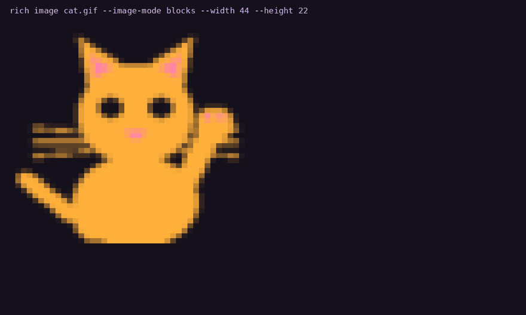
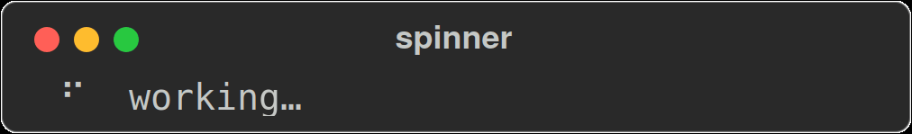

# Gallery

These are committed snapshots of actual library output, exported with
`Console::export_svg` by `scripts/capture_screenshots.sh`. Regenerate them when
rendering changes. Progress and spinner GIFs replay the exported SVG frames.

| What you want to do | Start here |
|---|---|
| Animate images in the terminal | [Rich-art videos and commands](demos.md) |
| Style text | [Markup tutorial](tutorial/02-markup.md) |
| Present structured data | [Table tutorial](tutorial/03-tables.md) |
| Arrange output | [Layout tutorial](tutorial/04-layout.md) |
| Show running work | [Progress and live output](tutorial/05-live.md) |
| Format files from the shell | [CLI guide](cli.md) |

## Rich-art in motion

[Watch or download the videos](demos.md), including fresh image, fit/crop, watch and batch clips. Capture details are on that page.

## Markup

Tags nest, and `\[` escapes a literal bracket.

## Automatic highlighting

No markup required — numbers, paths, URLs, UUIDs and booleans are recognised and
coloured, exactly as upstream does.

## Tables

Columns size themselves to their content, wrap when they must, and take
per-column justification. Borders, titles and captions are all styleable.

## Panels

## Trees

## Columns

Items are packed into as many equal columns as the width allows.

## Rules

## Alignment and padding

## Markdown

## Syntax highlighting

!!! note "Not byte-parity"

    Syntax highlighting uses `syntect`, not Pygments. The colours are close but
    not identical to Python `rich` — see [Divergences](DIVERGENCES.md).

## JSON

## Pretty-printing

## Progress

## Spinners

## Text overflow

The same over-long word under each overflow method.

