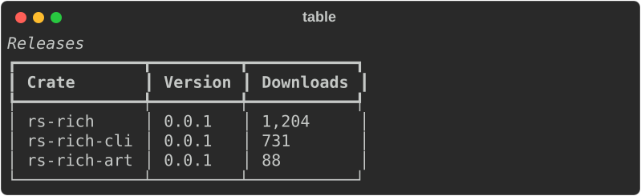
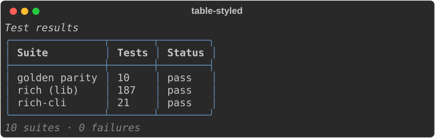
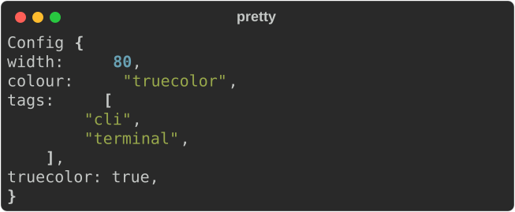
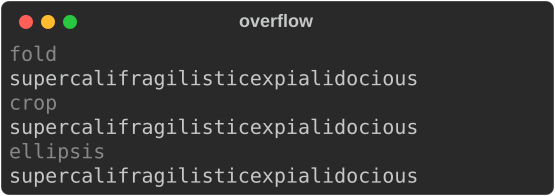

# Gallery

Everything here is rendered by the library and exported with
`Console::export_svg`, by `scripts/capture_screenshots.sh`. If rendering changes,
these images change with it — they cannot go stale.

## Markup

Tags nest, and `\[` escapes a literal bracket.

## Automatic highlighting

No markup required — numbers, paths, URLs, UUIDs and booleans are recognised and
coloured, exactly as upstream does.

## Tables

Columns size themselves to their content, wrap when they must, and take
per-column justification. Borders, titles and captions are all styleable.

## Panels

## Trees

## Columns

Items are packed into as many equal columns as the width allows.

## Rules

## Alignment and padding

## Markdown

## Syntax highlighting

!!! note "Not byte-parity"

    Syntax highlighting uses `syntect`, not Pygments. The colours are close but
    not identical to Python `rich` — see [Divergences](DIVERGENCES.md).

## JSON

## Pretty-printing

## Progress

## Spinners

## Text overflow

The same over-long word under each overflow method.

