# Gallery

These are committed snapshots of actual core library output, exported with
`Console::export_svg` by `scripts/capture_screenshots.sh`. Regenerate them when
rendering changes. Progress and spinner GIFs replay the exported SVG frames.
The [extensions, art and CLI](#beyond-the-core) are shown at the end, and every
guide page has more.

| What you want to do | Start here |
|---|---|
| See the CLI used interactively | [Terminal recordings](recordings.md) |
| Animate images in the terminal | [CLI and art videos](demos.md) |
| Style text | [Markup tutorial](tutorial/02-markup.md) |
| Present structured data | [Table tutorial](tutorial/03-tables.md) |
| Arrange output | [Layout tutorial](tutorial/04-layout.md) |
| Show running work | [Progress and live output](tutorial/05-live.md) |
| Format files from the shell | [CLI guide](cli.md) |

## Rich-art in motion

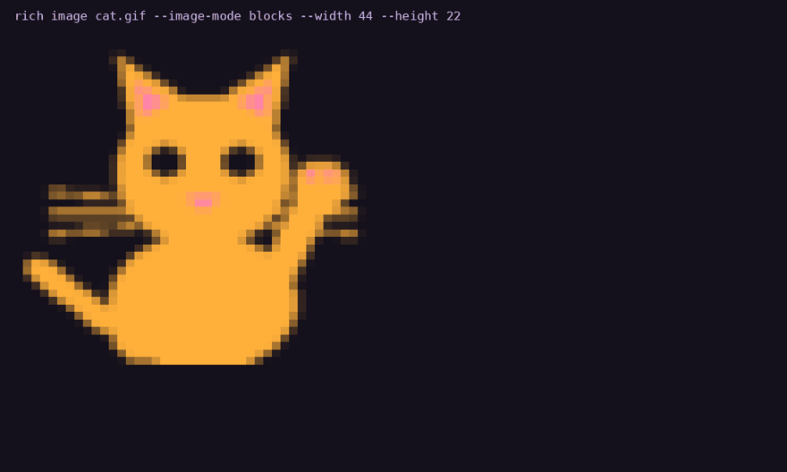

[Watch or download the videos](demos.md), including fresh image, fit/crop, watch and batch clips. Capture details are on that page.

## Markup

Tags nest, and `\[` escapes a literal bracket.

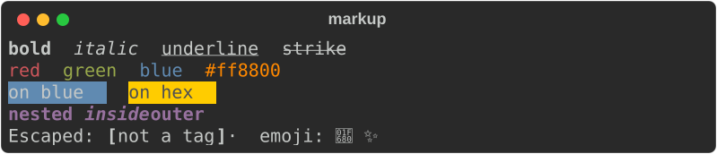

## Automatic highlighting

No markup required — numbers, paths, URLs, UUIDs and booleans are recognised and
coloured, exactly as upstream does.

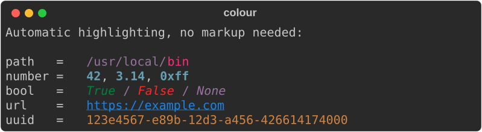

## Tables

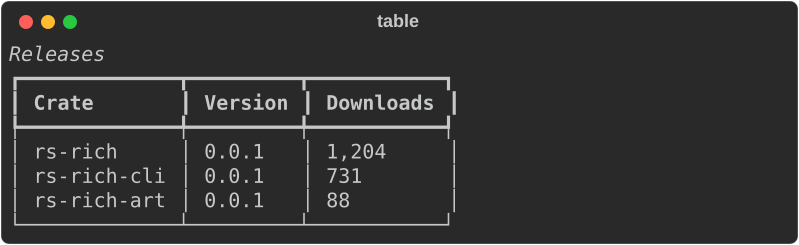

Columns size themselves to their content, wrap when they must, and take
per-column justification. Borders, titles and captions are all styleable.

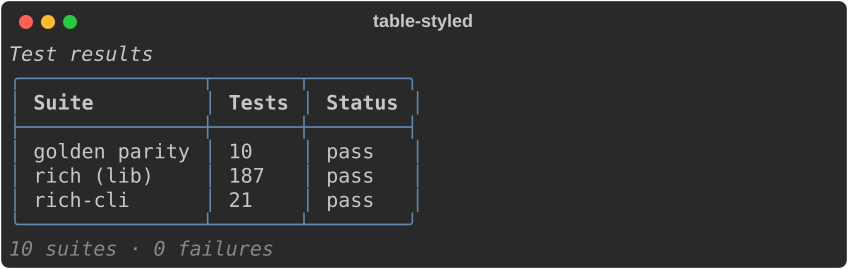

## Panels

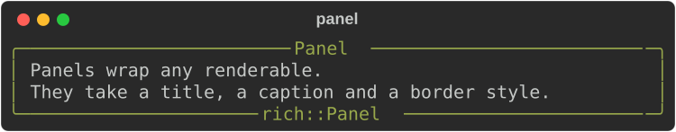

## Trees

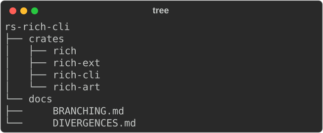

## Columns

Items are packed into as many columns as the width allows, each as wide as its
widest item (`Columns::equal` makes them all the same width).

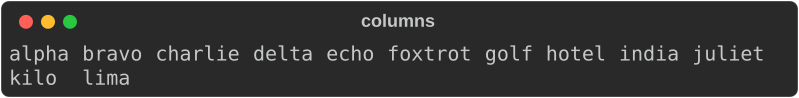

## Rules

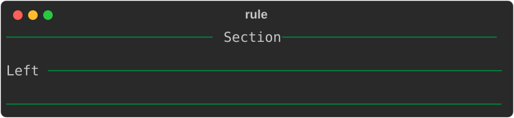

## Alignment and padding

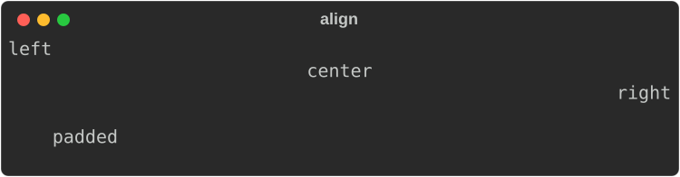

## Markdown

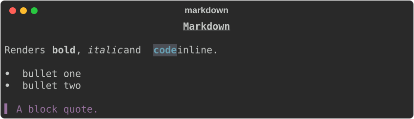

## Syntax highlighting

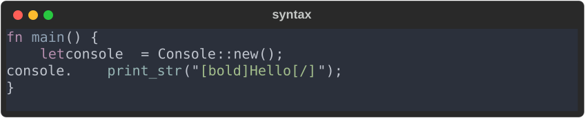

!!! note "Not byte-parity"

    Syntax highlighting uses `syntect`, not Pygments. The colours are close but
    not identical to Python `rich` — see [Divergences](DIVERGENCES.md).

## JSON

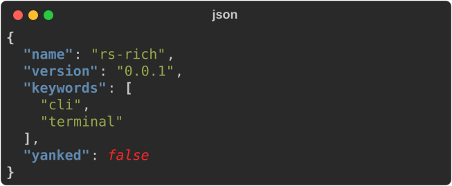

## Pretty-printing

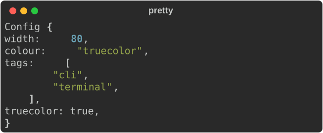

## Progress

## Spinners

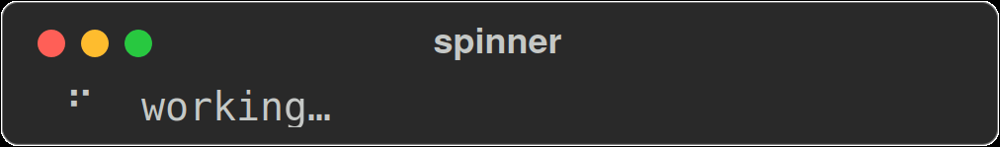

## Text overflow

The same over-long word under each overflow method.

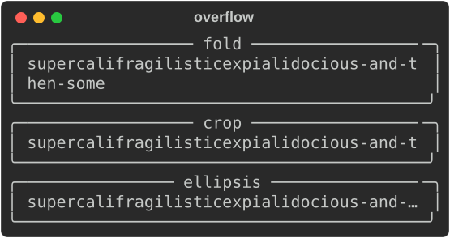

## Beyond the core

These come from `rs-rich-ext`, `rs-rich-art`, `rs-rich-diagram` and the `rich` command. Each image
is the real output of a guide example or CLI command; follow the link for the
code.

### Diagnostics and stack traces

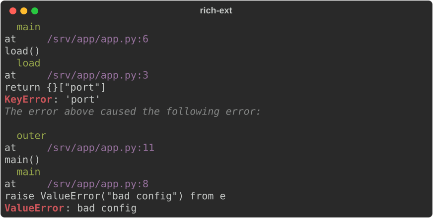

[Diagnostics guide](guide/ext/diagnostics.md)

### Structured data

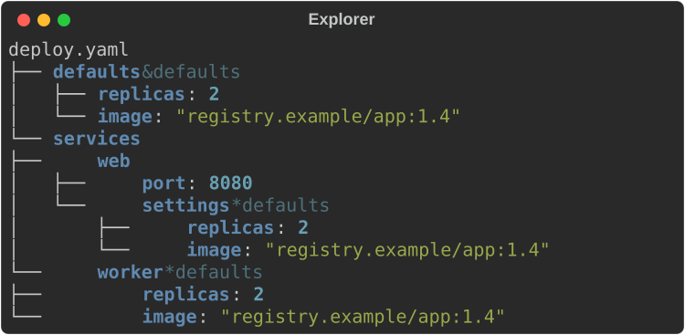

[Structured data guide](guide/ext/structured-data.md)

### Workflows

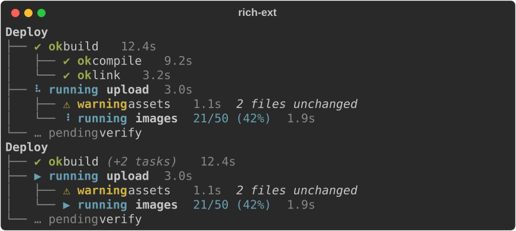

[Workflows guide](guide/ext/workflows.md)

### Diffs

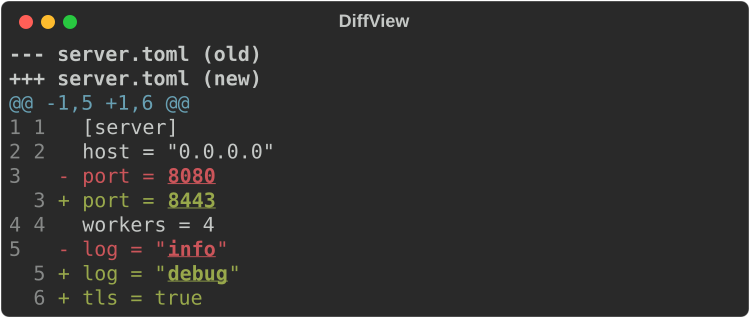

[Diffs and test reports guide](guide/ext/diffs-and-test-reports.md)

### Charts

[Charts guide](guide/ext/charts.md) · [`rich chart` recording](recordings.md#charts-from-data)

### Data and schemas

[`rich profile`](recordings.md#profile-a-data-file) and [`rich schema --er`](recordings.md#schemas-and-er-diagrams) recordings

### Diagrams

[Diagrams guide](guide/diagram/index.md) · [Dependencies and schemas](guide/ext/sources.md) · [`rich deps`](recordings.md#dependency-trees), [`rich deps --features`](recordings.md#crate-features), [`rich diff --conflicts`](recordings.md#merge-conflicts) and [DOT in Markdown](recordings.md#dot-in-markdown) recordings

### Images

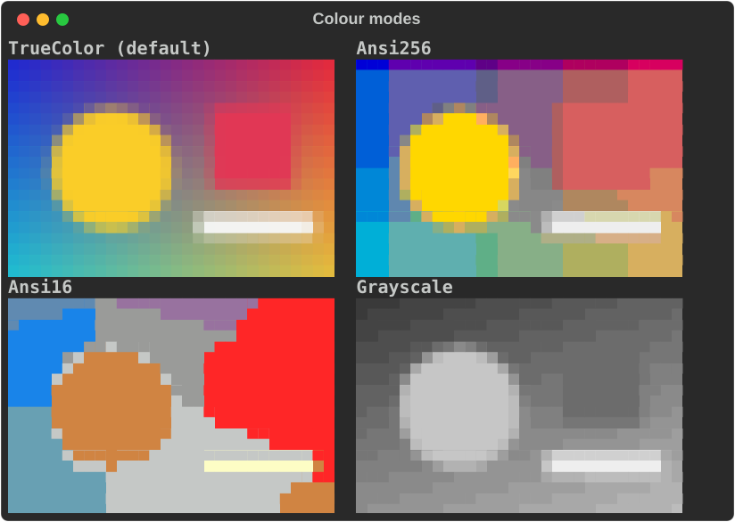

[Images guide](guide/art/images.md)

### CLI viewers

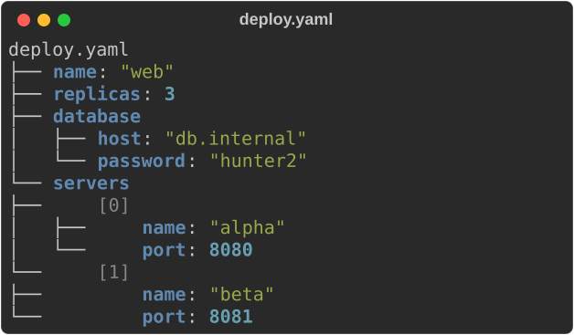

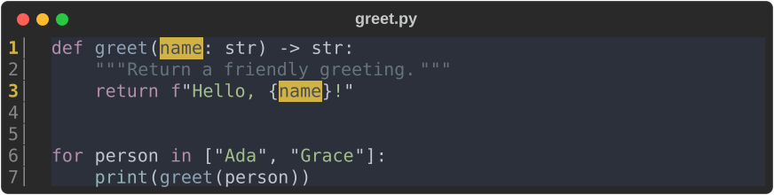

[CLI walkthrough](guide/cli/walkthrough.md)
