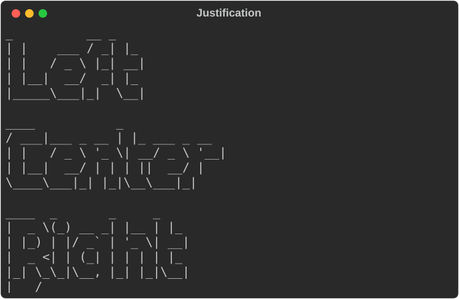
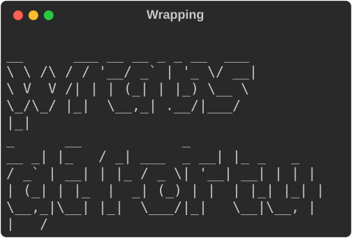
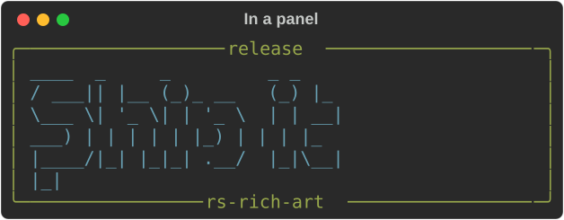
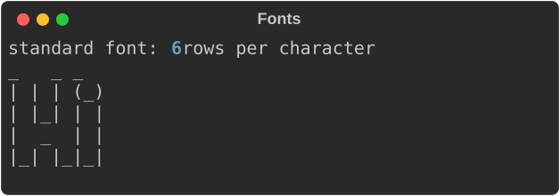

# Text banners

`Figlet` draws text in large letters made of ordinary characters, the way the
classic `figlet` program does. Use it for a title screen, a release banner or a
section heading that has to stand out in a wall of log output.

Banners need no Cargo features and no image decoders.

## The smallest example

```rust
--8<-- "crates/rich-art/examples/guide_banners.rs:quickstart"
```


`console.print` takes any renderable; a `Figlet` is one. The output is
byte-identical to `pyfiglet` for the bundled `standard` font.

## Style

`.style()` paints every row of the banner with a `rich` style:

```rust
--8<-- "crates/rich-art/examples/guide_banners.rs:styled"
```


## Justification

`.justify()` positions the banner within the available width. The default is
`Justify::Left`.

```rust
--8<-- "crates/rich-art/examples/guide_banners.rs:justify"
```



## Width and wrapping

A banner lays out to the console's width. `.width(n)` overrides it. When a line
would not fit, the banner wraps onto another row of big letters, breaking at
spaces as `figlet` does:

```rust
--8<-- "crates/rich-art/examples/guide_banners.rs:wrap"
```



## Compose it with other renderables

A banner is a renderable like a `Text` or a `Table`, so it can go inside a
`Panel`, a `Table` cell or a `Layout`:

```rust
--8<-- "crates/rich-art/examples/guide_banners.rs:panel"
```



## Plain text

`to_text(width)` returns the banner as a `String`, with no console and no
styling. Use it for a file header, a `--version` message or a test:

```rust
--8<-- "crates/rich-art/examples/guide_banners.rs:to-text"
```

## Fonts

Fonts are FIGfont (`.flf`) files. The crate bundles one, `standard`, and uses
it by default. `FigletFont::parse` reads any other FIGfont from its text:

```rust
--8<-- "crates/rich-art/examples/guide_banners.rs:font"
```



The parser supports the FIGfont header, comment block, the required character
set and code-tagged characters (decimal, `0x` hex and octal). Layout supports
full width, kerning, controlled smushing rules 1–6, universal overlapping and
hardblanks. A malformed font is a `FontError`, not a panic.

## Gotchas

- Only the `standard` font ships with the crate. Other fonts are separate
  files; check their licences before you redistribute them.
- Banners are wide. At 80 columns the `standard` font fits roughly a
  dozen characters per row, so keep banner text short or let it wrap.
- `style` colours the whole banner. For a gradient or per-letter colours,
  build several banners or post-process `to_text`.

## See also

- [rich-art overview](index.md)
- [Images](images.md) — pictures rather than letters
- The `banner` example: `cargo run -p rs-rich-art --example banner -- "your text"`
