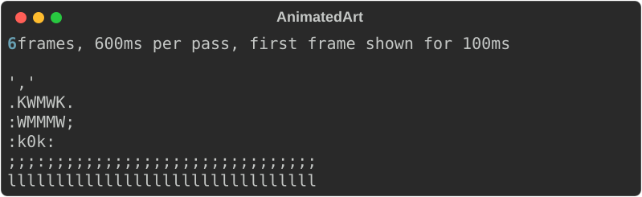
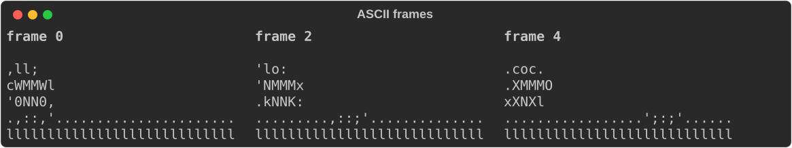
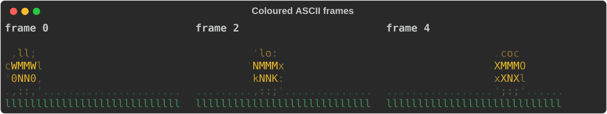
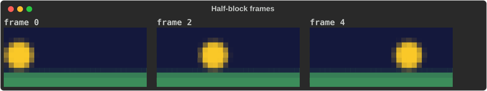

# Animated GIFs

`AnimatedArt` plays an animated GIF in place in the terminal, honouring each
frame's own delay. `Stage` plays several side by side, each on its own clock.
Both need the `gif` feature (`cargo add rs-rich-art --features gif`).

Use them for a splash screen, a mascot in a demo, or to preview a GIF without
opening a viewer. For a still picture, use [`ImageArt`](images.md) instead.

## The smallest example

The examples on this page encode their own six-frame GIF, so they need no file:

```rust
--8<-- "crates/rich-art/examples/guide_gifs.rs:make-gif"
```

Load it, look at it, and print its first frame:

```rust
--8<-- "crates/rich-art/examples/guide_gifs.rs:load"
```



`AnimatedArt::from_path("spin.gif")?` reads a file instead. Decoding happens
once, up front: every frame is composited to a full canvas, so the GIF's
disposal rules (background, previous) are already applied and frames never
smear.

## Playing it

```rust
--8<-- "crates/rich-art/examples/guide_gifs.rs:play"
```

`play_stdout` (or `play` with any writer) draws each frame in place through
`rich`'s `Live` display and returns when the repeats are done. It hides the
cursor while playing and restores it at the end.

- A frame with a zero delay is shown for 100 ms, as browsers do.
- `.max_fps(fps)` holds fast frames longer. Colour frames are many bytes each;
  an uncapped GIF can outrun a slow terminal and tear.
- When the console is not a terminal (output piped or redirected), `play` writes
  the first frame once and returns, even with `Repeat::Forever`.

Run the example with `-- --play` to watch it.

## How frames are drawn

Frames use the same backends as still images. The three screenshots below show
frames 0, 2 and 4 of the same GIF.

### ASCII (default)

```rust
--8<-- "crates/rich-art/examples/guide_gifs.rs:ascii"
```



`.ramp(…)` sets the characters (darkest first) and `.invert(true)` swaps dark
and light, for light-on-dark terminals.

### Coloured ASCII

```rust
--8<-- "crates/rich-art/examples/guide_gifs.rs:color"
```



### Half blocks

```rust
--8<-- "crates/rich-art/examples/guide_gifs.rs:blocks"
```



`.blocks(true)` only takes effect together with `.color(true)` on a colour
terminal. Without colour, or when the output is not a terminal, frames fall
back to ASCII. In block mode `.height(rows)` caps the rows and keeps the aspect
ratio; the ramp and inversion settings apply to the ASCII fallback.

To render one frame yourself, use `render_frame(index)`, which returns a
renderable honouring these settings. The older `frame(index)` always returns
an `AsciiArt`.

## Repeats

| `Repeat` | Plays |
|---|---|
| `Repeat::Once` | One pass (the default). |
| `Repeat::Times(n)` | `n` passes. |
| `Repeat::Forever` | Until the process is interrupted. |

`duration()` is the length of one pass after any frame-rate cap;
`frame_count()` and `frame_delay(index)` give the rest.

## Several at once: Stage

```rust
--8<-- "crates/rich-art/examples/guide_gifs.rs:stage"
```

A `Stage` lays animations out left to right, `gap` columns apart (default 2),
and plays them together. Each keeps its own frame clock, so a 40 ms GIF and a
250 ms GIF both run at their real speed. The stage sleeps until the next frame
is due and only redraws when something changed.

`.until(…)` decides when it stops:

- `Until::AllFinished` (default) — once every animation has played its repeats.
  One set to `Repeat::Forever` never finishes.
- `Until::Elapsed(duration)` — after a fixed wall-clock time.

A finished animation holds its last frame while the others play on.

## Gotchas

- **Ctrl-C leaves the cursor hidden.** An interrupt ends the process without
  unwinding, so the cursor is not restored. If you install a signal handler,
  print `rich_art::gif::show_cursor_sequence()` on the way out.
- Playback blocks the calling thread for the whole animation.
- GIFs cannot be exported to HTML or SVG as animations. `console.print(&art)`
  records the first frame.
- Still-image options (fit, palette reduction, tone, rotation) do not apply to
  GIFs.

## See also

- [rich-art overview](index.md)
- [Images](images.md)
- [`rich gif` on the command line](../cli/walkthrough.md#images-gifs-and-image-diffs)
- The `gif`, `stage` and `make_demo_gif` examples in `crates/rich-art/examples/`
