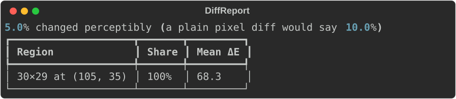
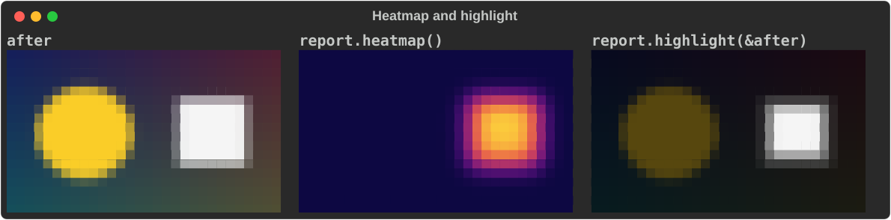
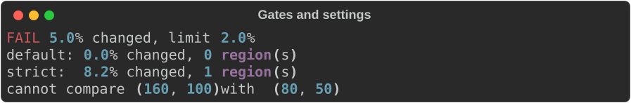

# Image diff

`rich_art::imagediff` compares two images the way a person would: it reports
how much of the picture changed *perceptibly*, and ranks the regions that
changed. It is the library behind `rich diff before.png after.png`. It needs
the `image` feature.

Use it for visual regression tests: comparing a rendered screenshot, chart or
UI capture against a baseline, where a byte-for-byte comparison would fail on
every anti-aliasing or re-encoding difference.

This page covers the Rust API. For the command line — the output, the drawing
modes and the CI gate — see [Comparing images](../../image-diff.md).

## The smallest example

The examples draw a pair of "screenshots" in code. The second adds a white
badge:

```rust
--8<-- "crates/rich-art/examples/guide_image_diff.rs:pair"
```

Compare them and print the report:

```rust
--8<-- "crates/rich-art/examples/guide_image_diff.rs:diff"
```



A plain pixel comparison counts every pixel of the badge: 10% of the canvas.
The perceptual figure is lower, 5%, because blurring softens the badge's edges
below the ΔE threshold and only its core counts. Either way there is exactly
one region, and it holds all of the change. On real screenshots the gap is much
wider: anti-aliasing and re-encoding noise inflate the plain figure, and the
blur removes them.

## How it decides

1. **Blur** both images (`blur`, default radius 6), so sub-pixel noise and
   re-encoding artefacts stop counting as change.
2. **Convert to CIELAB**, where distance approximates perceived difference.
3. **ΔE per pixel** (CIE76), and mark pixels above `threshold` (default 60).
4. **Morphological open** (erode, then dilate) with an `open_kernel`×`open_kernel`
   square (default 11), dropping speckle.
5. **Label connected regions**, drop those under `min_region` pixels
   (default 400), and rank the rest by area × severity. Keep the `top`
   (default 3).

[Comparing images](../../image-diff.md#how-it-decides) explains why each step
is there.

## The report

`diff(&before, &after, &settings)` returns a `DiffReport`:

| Field | Meaning |
|---|---|
| `width`, `height` | The image size. |
| `changed_fraction` | Share of pixels (0–1) above the ΔE threshold, measured *before* the open. |
| `naive_changed_fraction` | Share a plain byte comparison would call changed (any channel off by more than 32), on the unblurred images. |
| `mean_delta_e`, `max_delta_e` | Over the whole image. |
| `regions` | Ranked `Region`s: `x`, `y`, `width`, `height`, `area_px` (after the open), `share_of_change` (0–1) and `mean_delta_e`. |
| `delta_e` | Per-pixel ΔE, row-major, `width * height` long. |

`share_of_change` is the region's part of *all* changed pixels, including
regions too small to list, so the shares need not add up to 100%.
`mean_delta_e` says how strong a change is, independent of its size.

## Pictures

Two helpers turn a report into an image you can draw with
[`ImageArt`](images.md) or save with the `image` crate:

```rust
--8<-- "crates/rich-art/examples/guide_image_diff.rs:pictures"
```



- `heatmap()` maps ΔE from dark blue through magenta to yellow. The scale is
  normalised to this image's range, so a small intense change is still
  visible.
- `highlight(&after)` dims the after image except inside the reported regions:
  the "where" at a glance.

## Gates and tuning

A gate compares `changed_fraction` with a limit:

```rust
--8<-- "crates/rich-art/examples/guide_image_diff.rs:gate"
```

The defaults were tuned on regenerated artwork, which is noisy. Screenshots are
much cleaner, so a lower `threshold` and a smaller `min_region` catch subtler
changes:

```rust
--8<-- "crates/rich-art/examples/guide_image_diff.rs:settings"
```

Images of different sizes are an error rather than a meaningless result:

```rust
--8<-- "crates/rich-art/examples/guide_image_diff.rs:mismatch"
```



## Gotchas

- Align and crop both images to the same size first; `diff` will not resize.
- `changed_fraction` and `regions` measure different things (before and after
  the open), so a small change can have a non-zero fraction and no regions.
- The CLI rounds both percentages to one decimal before applying
  `--threshold`. Round the same way if your gate must agree with it.

## See also

- [Comparing images](../../image-diff.md) — `rich diff` for images, and why a
  perceptual diff
- [Images](images.md) — drawing the heatmap and highlight
- The `diff_report` example prints a report as JSON:
  `cargo run -p rs-rich-art --features image --example diff_report -- before.png after.png`
