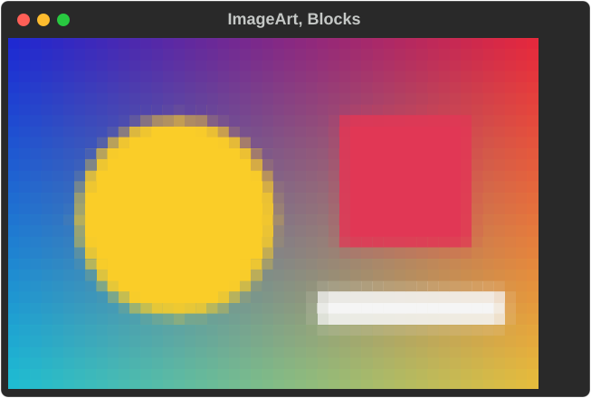
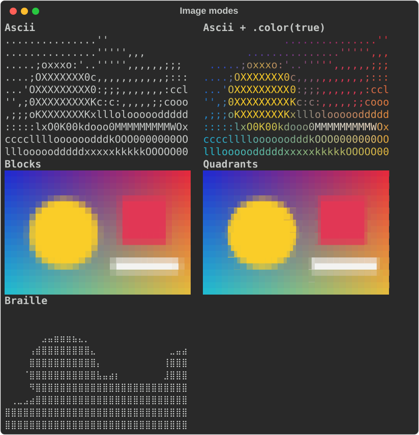
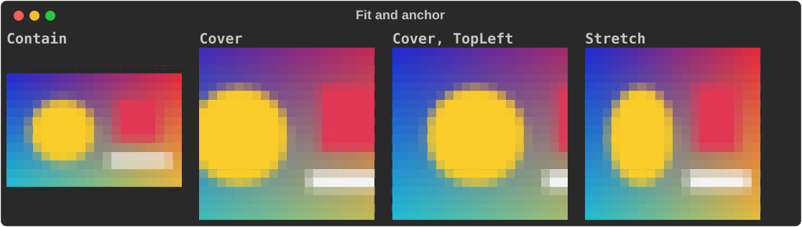
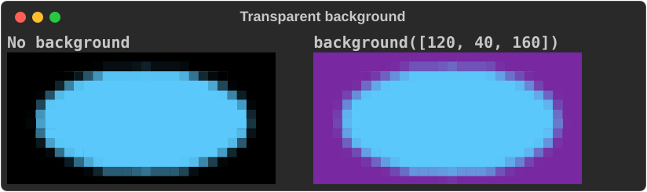
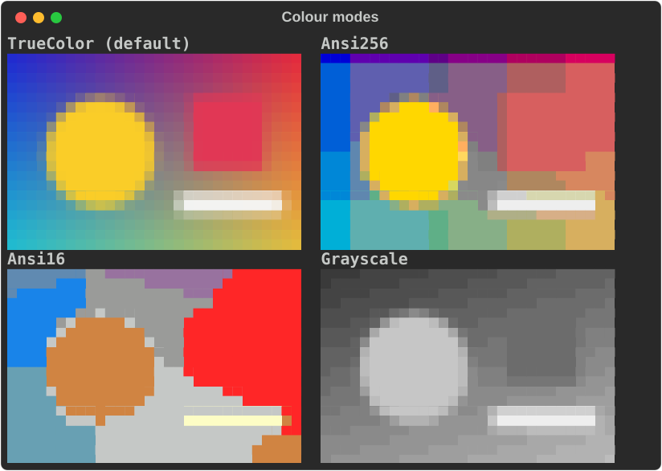
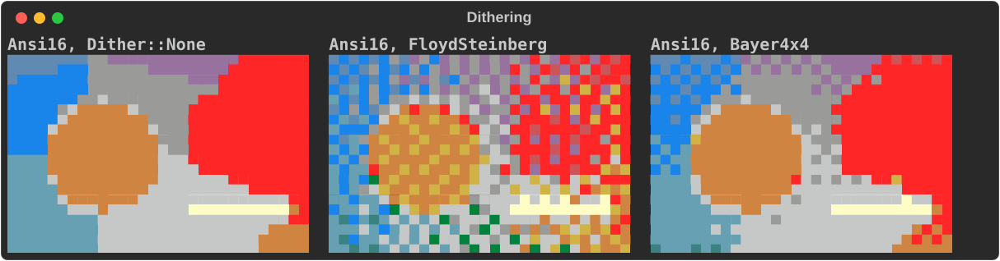
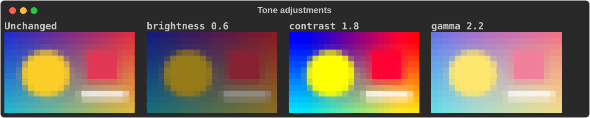
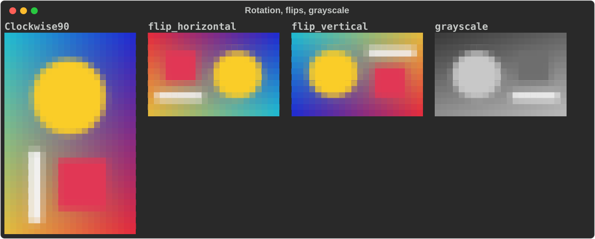
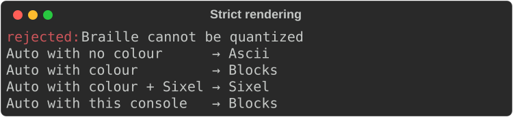

# Images

`ImageArt` draws a still image in the terminal. It owns the decoded picture,
picks a backend (ASCII, Braille, half blocks, quadrants or Sixel), and applies
the optional steps in between: fitting and cropping, flattening transparency,
reducing colours, dithering, tone adjustments, rotation and flips.

Use it for thumbnails, previews, a logo in a report, or the picture half of a
tool that already prints tables. It needs the `image` feature
(`cargo add rs-rich-art --features image`).

## The smallest example

The examples on this page draw their own test card, so they need no image file:

```rust
--8<-- "crates/rich-art/examples/guide_images.rs:test-image"
```

Render it with half blocks, 48 columns wide:

```rust
--8<-- "crates/rich-art/examples/guide_images.rs:quickstart"
```



For a file, use `ImageArt::from_path("photo.png")?` (PNG and JPEG with the
`image` feature; GIF too with `gif`). `ImageArt::from_bytes` decodes from memory
and `ImageArt::new` takes an `image::DynamicImage` you already have.

## Modes

`.mode(ImageMode::…)` pins a backend. Each one trades detail, colour and
compatibility differently:

```rust
--8<-- "crates/rich-art/examples/guide_images.rs:modes"
```



| Mode | What to notice |
|---|---|
| `Ascii` | One character per pixel, chosen by brightness from a density ramp (`rich_art::DEFAULT_RAMP`, spaces through `M`). Works with no colour at all. `.color(true)` also colours each character with its pixel. |
| `Blocks` | `▀` with the top pixel as foreground and the bottom one as background: twice ASCII's vertical detail and every cell painted. Needs colour. |
| `Quadrants` | Splits each cell into 2×2 pixels. A cell still has only two colours, so it picks the split with the smallest error. Sharper edges than blocks. |
| `Braille` | 2×4 dots per cell, each on or off by a fixed brightness threshold. Monochrome. |
| `Sixel` | Real pixels. See [Sixel](#sixel) below. |
| `Auto` | The default. ASCII without colour, Sixel where it is compiled in and looks supported, otherwise blocks. |

Terminal cells are about twice as tall as they are wide. Every backend corrects
for that, so a square image stays square.

## Size

- `.width(columns)` sets the width. Without it the image fills the console
  width (or the table cell, panel or column it is placed in).
- `.height(rows)` sets the height. Without `.fit`, the backends treat it
  differently: ASCII uses it as an exact row count, the others as a cap that
  keeps the aspect ratio.
- `.max_width(columns)` and `.max_height(rows)` are upper bounds that never
  enlarge anything. They are useful when the width comes from the terminal.

## Fit and crop

`.fit(…)` makes the image fill an exact `width` × `height` box of cells. It
needs both dimensions.

```rust
--8<-- "crates/rich-art/examples/guide_images.rs:fit"
```



| Fit | Effect |
|---|---|
| `ImageFit::Contain` | The whole image, centred, with background-coloured padding. |
| `ImageFit::Cover` | Fills the box and crops what overflows. `.anchor(…)` picks what to keep. |
| `ImageFit::Stretch` | Fills the box exactly, ignoring the aspect ratio. |

`ImageAnchor` is `Center` (the default), `Top`, `Bottom`, `Left`, `Right`,
`TopLeft`, `TopRight`, `BottomLeft` or `BottomRight`. It only matters for
`Cover`.

Fitting clamps the width to the space available, and refuses boxes above 16
megapixels (including the intermediate image cover resizes to). Invalid sizes
are reported by [`render`](#strict-rendering); `console.print` then draws
nothing.

## Transparency

Without a background, transparent pixels read as black (in ASCII, as the
darkest character). `.background([r, g, b])` flattens transparency onto a colour
of your choice before resizing, and also colours `Contain` padding:

```rust
--8<-- "crates/rich-art/examples/guide_images.rs:background"
```



## Colour depth

By default colours are sent as 24-bit truecolor. `.color_mode(…)` reduces them
to a palette, for terminals (or recordings) that cannot show truecolor:

```rust
--8<-- "crates/rich-art/examples/guide_images.rs:color-modes"
```



| `ImageColorMode` | Palette |
|---|---|
| `TrueColor` | The sampled RGB, unchanged (default). |
| `Ansi256` | The fixed entries 16–255. Entries 0–15 are left out because terminal themes redefine them. |
| `Ansi16` | The 16 system colours. The terminal theme decides how they look, so output follows the user's theme at the cost of fidelity. |
| `Grayscale` | The 26 neutral entries (16, 232–255 and 231), chosen by luma. |

The nearest colour is found by squared distance in encoded RGB, with ties going
to the lowest palette index. It is deterministic, not perceptual.

## Dithering

Reducing colours creates flat bands. `.dither(…)` trades them for a pattern
that averages to the right colour from a distance:

```rust
--8<-- "crates/rich-art/examples/guide_images.rs:dither"
```



- `Dither::FloydSteinberg` diffuses each pixel's error to its neighbours,
  scanning left to right, top to bottom. Error at the edges is dropped.
- `Dither::Bayer4x4` adds a fixed 4×4 threshold pattern anchored at the top-left
  corner. It is stable from frame to frame.

Dithering needs a reduced palette (`Ansi256`, `Ansi16` or `Grayscale`).

Palette reduction and dithering work with the `Ascii`, `Blocks` and `Quadrants`
backends. Braille has no colour and Sixel does its own palette, so both reject
them.

## Tone adjustments

`ImageTransforms` carries brightness, contrast and gamma. Each defaults to
`1.0`, which leaves the image untouched:

```rust
--8<-- "crates/rich-art/examples/guide_images.rs:tone"
```



They act on each colour channel `v` in `0..1`, clamping after each step, and
never touch alpha:

1. brightness `b`: `v × b`
2. contrast `c`: `(v − 0.5) × c + 0.5`
3. gamma `g`: `v^(1/g)`, so values above 1 brighten the mid-tones

Brightness and contrast must be finite and at least 0; gamma must be finite and
above 0. Anything else is `ImageArtError::InvalidAdjustment`.

## Rotation, flips and grayscale

The same struct rotates clockwise in quarter turns, flips, and converts to
grayscale:

```rust
--8<-- "crates/rich-art/examples/guide_images.rs:transforms"
```



The order is fixed: rotation, horizontal flip, vertical flip, brightness,
contrast, gamma, grayscale; then fitting and background, sampling, palette
reduction and dithering, and finally the backend picks characters. Rotation and
flips keep transparency. Grayscale composites onto the background first (and
turns contain padding gray too).

These transforms apply to still images only, not to GIFs or image diffs.

## Strict rendering

`console.print(&art)` cannot fail, so when a request is impossible — an
explicit Sixel without the feature, palette reduction with Braille, a bad
adjustment — it quietly falls back to ASCII. Call `render` instead when you want
to know why:

```rust
--8<-- "crates/rich-art/examples/guide_images.rs:strict"
```

`render` returns the segments on success, or an `ImageArtError`:

| Error | Cause |
|---|---|
| `FeatureNotEnabled { mode, feature }` | An explicit mode this build cannot draw, e.g. Sixel without `sixel`. |
| `NonTerminalDestination` | Sixel requested for output that is not a terminal. |
| `SixelNotSupported` | Sixel requested on a terminal not known to support it; `RICH_SIXEL=1` or `RICH_GRAPHICS=sixel` forces it. |
| `SixelEncodeFailed` | The encoder rejected this image or size. |
| `SixelTooLarge` | The Sixel raster would exceed 16 megapixels (8×16 pixels per cell); narrow it or cap its height. |
| `InvalidFitDimensions` | Fitting without a positive width and height, or above 16 megapixels. |
| `UnsupportedColorOptions` | Palette reduction or dithering with a backend that cannot do it, or dithering with truecolor. |
| `InvalidAdjustment` | Brightness, contrast or gamma out of range. |

To see what `Auto` would choose, ask `resolve_mode` with the capabilities you
care about. `RenderCapabilities::from_console` reads them off a console:

```rust
--8<-- "crates/rich-art/examples/guide_images.rs:resolve"
```



A console with an attached `rich::protocol::RenderEnvironment` (as the CLI
uses) is honoured by `render`; `render_with_environment` takes one explicitly.
Through an environment, `Auto` picks ASCII when Unicode is unavailable.

## Sixel

Sixel draws real pixels, so a photo keeps its detail. It needs the `sixel`
feature and a terminal that understands it, such as Windows Terminal 1.22+,
WezTerm, mintty, foot or mlterm.

```rust
--8<-- "crates/rich-art/examples/guide_images.rs:sixel"
```

There is no reliable way to ask a terminal whether it supports Sixel without a
round trip on a tty, so support is guessed from environment variables (`TERM`,
`TERM_PROGRAM`, `WT_SESSION`).
`RICH_GRAPHICS=sixel` forces Sixel on and `RICH_GRAPHICS=none` (or `kitty`,
`iterm`) rules it out; otherwise `RICH_SIXEL=1` or `RICH_SIXEL=0` overrides the
guess. With the feature on you can also use `SixelArt` directly:

```rust
--8<-- "crates/rich-art/examples/guide_images.rs:sixel-direct"
```

Sixel output is terminal graphics, not text, so it cannot be exported to HTML
or SVG; exports use blocks instead. Run the example with `-- --sixel` in a Sixel
terminal to see it.

## The individual backends

`ImageArt` is a front end. The backends are public too, for when you want one
and none of the preprocessing: `AsciiArt` (with `.ramp()`, `.invert()`,
`.color()`, and `to_text()` for a plain `String`), `BlockArt`, `QuadrantArt`,
`BrailleArt` and `SixelArt`. Each has `new(image)`, `width` and `height`.

## Gotchas

- Colour backends (blocks, quadrants) need colour. With `NO_COLOR`, or output
  that is not a terminal, prefer `Ascii` or `Braille`; `Auto` does this for you.
- The image is resampled to the cell grid, so fine text in a screenshot will
  not survive at 40 columns. Sixel is the only mode that keeps pixels.
- `.color(true)` only affects ASCII; the colour backends are always in colour.

## See also

- [rich-art overview](index.md)
- [Animated GIFs](gifs.md)
- [`rich image` on the command line](../cli/walkthrough.md#images-gifs-and-image-diffs)
  and [every image option](../../cli.md#render-a-still-image)
- [Image mode recordings](../../demos.md)
