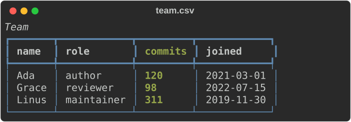

# The `rich` command

`rich` renders files that are hard to read raw — Markdown, JSON, CSV, source
code, Jupyter notebooks, logs, YAML — as formatted, coloured terminal output.
It can also compare files and images, decode escape sequences, convert whole
folders to HTML or SVG, and gate a CI job on a threshold.

It is a Rust port of Python's [`rich-cli`](https://github.com/Textualize/rich-cli)
built on this repository's port of `rich`. It starts in a few milliseconds and
has no Python dependency.



## Install

```bash
cargo install rs-rich-cli     # installs a binary called `rich`
rich --version
```

The package is `rs-rich-cli`; the binary is `rich`. Two default Cargo features
can be turned off for a smaller, network-free binary:

| Feature | Adds |
|---|---|
| `fetch` | `http(s)://` URLs as input |
| `art` | images, GIFs and image diffs (`rich image`, `rich gif`, `rich diff a.png b.png`) |

```bash
cargo install rs-rich-cli --no-default-features   # text only, no network
rich doctor                                       # shows which features a binary has
```

## The mental model

Every rendering command has the same four parts:

```text
rich  [MODE]  RESOURCE  [decoration and export options]  [--config/--profile]
```

1. **RESOURCE** — what to render: a file path, an `http(s)` URL, or `-` for
   standard input. With `print` and `rule` it is the text itself.
2. **Render mode** — how to read it. Without one, `rich` picks from the file
   extension: `.md`, `.json`, `.csv`/`.tsv` and `.ipynb` get their own
   renderer, and any other extension is syntax-highlighted. Choose one with a
   subcommand (`rich json data.txt`) or the equivalent flag (`rich --json data.txt`).
3. **Decoration and export** — options that work on any mode's output:
   `--width`, `--left/--center/--right`, `--panel`, `--padding`, `--title`,
   `--caption`, `--style`, and `--export-html` / `--export-svg` to also write the
   output to a file.
4. **Configuration** — defaults from a `rich.toml` in the current directory or
   `~/.config/rich/config.toml`, a named `--profile`, and named `--theme`s.
   Explicit flags always win.

Rendered output goes to stdout and diagnostics to stderr, so pipes and
redirects stay clean. Colour turns off automatically when stdout is not a
terminal, and with `NO_COLOR` or `--no-color`.

## Upstream and additions

The port tracks upstream `rich-cli` 1.8.1 for the features it mirrors: the
flat mode flags (`-p`, `-m`, `-j`, `-x`, `--csv`, `--ipynb`, `--rule`), width
and justification, panels and padding, stdin, URL fetching, HTML/SVG export
and `--pager`.

On top of that it adds, without changing the mirrored behaviour:

- subcommands (`rich markdown FILE`) alongside the flags;
- new modes: JSON Lines and logs, `inspect` for structured data, text and
  patch diffs, perceptual image diffs, still images and GIFs, `ansi explain`,
  and the viewers `view`, `hex`, `unicode`, `env` and `capture`;
- workflow features: `--watch`, `--batch`, config profiles and themes,
  `--report json`, stable exit codes, `doctor`, `bench compare`, generated
  completions and man pages, and a guided `--demo`.

The [module status page](../../PORTING.md)
records exactly which parts are upstream and which are additions.

## Every command and mode

| Command | Flag | Purpose | Tour |
|---|---|---|---|
| `rich FILE` | — | Auto-detect the mode from the extension | [Rendering files](walkthrough.md#rendering-files) |
| `print` | `-p`, `--print` | Render the RESOURCE as console markup text | [Markup](walkthrough.md#markup-and-rules) |
| `markdown`, `md` | `-m`, `--markdown` | Render Markdown | [Rendering files](walkthrough.md#markdown) |
| `syntax`, `code` | `-x`, `--syntax` | Syntax-highlight source code | [Rendering files](walkthrough.md#source-code) |
| `json` | `-j`, `--json` | Pretty-print JSON | [Rendering files](walkthrough.md#json) |
| `csv`, `tsv` | `--csv` | Render CSV/TSV as a table | [Rendering files](walkthrough.md#csv-and-tsv) |
| `ipynb`, `notebook` | `--ipynb` | Render a Jupyter notebook | [Rendering files](walkthrough.md#notebooks) |
| `jsonl`, `ndjson` | `--jsonl` | Stream JSON Lines records | [Streams](walkthrough.md#json-lines-and-logs) |
| `log`, `logs` | `--log` | Stream structured-log records as log lines | [Streams](walkthrough.md#json-lines-and-logs) |
| `rule` | `--rule` | Draw a horizontal rule with a title | [Markup](walkthrough.md#markup-and-rules) |
| `inspect` | `--inspect` | Explore JSON, YAML, TOML, XML, INI or dotenv as a tree | [Structured data](walkthrough.md#structured-data) |
| — | `--format auto` | Detect the format of piped or extensionless input | [Piped input](walkthrough.md#detecting-piped-input) |
| `diff` | `--diff` | Compare two text files, render a patch, or compare two images | [Diffs](walkthrough.md#comparing-text-and-patches) |
| `image` | `--image` | Draw a still image | [Images](walkthrough.md#images-gifs-and-image-diffs) |
| `gif` | `--gif` | Play animated GIFs | [Images](walkthrough.md#images-gifs-and-image-diffs) |
| `ansi explain` | `--ansi-explain` | List and decode escape sequences in a capture | [Escape sequences](walkthrough.md#decoding-escape-sequences) |
| `view` | — | Show any file: rendered, numbered and highlighted, or as hex; paged and searchable | [Viewers](walkthrough.md#viewing-and-inspecting-anything) |
| `hex`, `hexdump` | — | Hex dump with offsets, byte groups and an ASCII panel | [Viewers](walkthrough.md#viewing-and-inspecting-anything) |
| `unicode` | — | Graphemes, code points, UTF-8 bytes, widths and invalid sequences | [Viewers](walkthrough.md#viewing-and-inspecting-anything) |
| `env` | — | Environment variables, with secret-named values and credentials inside values masked (best effort); PATH entries checked | [Viewers](walkthrough.md#viewing-and-inspecting-anything) |
| `capture` | — | Run a command and show, export or record its output | [Viewers](walkthrough.md#viewing-and-inspecting-anything) |
| — | `--watch` | Re-render files as they change | [Watch](walkthrough.md#watching-files) |
| — | `--batch` | Convert many files to HTML/SVG | [Batch](walkthrough.md#converting-many-files) |
| — | `--pager`, `--auto-pager` | Page long output | [Paging](walkthrough.md#paging) |
| `config show`, `validate`, `explain`, `reference` | — | Inspect and validate configuration | [Configuration](walkthrough.md#configuration-profiles-and-themes) |
| `completions` | — | Print a bash, zsh, fish or PowerShell completion script | [Completions](walkthrough.md#completions-and-generated-docs) |
| `docs markdown`, `man`, `config` | — | Generate reference docs and man pages | [Completions](walkthrough.md#completions-and-generated-docs) |
| `doctor` | — | Show build features, terminal capabilities, config and pager | [Doctor](walkthrough.md#diagnosing-your-terminal) |
| `bench compare` | — | Compare two benchmark runs; exit 5 on regression | [Benchmarks](walkthrough.md#comparing-benchmark-runs) |
| — | `--report json` | Machine-readable result on stderr | [Scripts and CI](walkthrough.md#scripts-ci-and-exit-codes) |
| — | `--demo` | A guided tour of everything | [Demo](walkthrough.md#the-guided-demo) |

## Exit codes

| Code | Meaning |
|---|---|
| `0` | Success |
| `2` | Usage or configuration error |
| `3` | Input, read or write error |
| `4` | Parse or render error in the data |
| `5` | A threshold or gate failed (`diff --threshold`, `bench compare`) |
| `130` | A batch was interrupted with Ctrl+C |

`rich capture` is the exception: it exits with the captured command's own
status, or 128 plus the signal number when a signal ended it.

## Where to go next

- [Walkthrough](walkthrough.md) — a hands-on tour of every command with real
  output.
- [Smoke test](smoke.md) — check a build of the binary end to end.
- [Using the CLI](../../cli.md) — task-oriented reference with every detail.
- [CLI reference](../../cli-reference.md) — every option, generated from
  `--help`.
- [Workflow recipes](../../recipes.md) and [Troubleshooting](../../troubleshooting.md).
