# Walkthrough

A hands-on tour of every `rich` command. Each step gives the exact command, a
screenshot of what it printed, and what to notice. Work through it top to
bottom in about twenty minutes, or jump to a section from the
[command table](index.md#every-command-and-mode).

This page is the tutorial path. For every option of every command, see
[Using the CLI](../../cli.md) and the [CLI reference](../../cli-reference.md).

!!! note "The screenshots are real"

    Each image is the binary's own `--export-svg` output for the command shown,
    run against the sample files below at a fixed width. They are regenerated by
    `python3 scripts/smoke_cli.py --screenshots docs/media/guide` (see
    [Smoke test](smoke.md)). Your terminal's colours and font will differ.

## Set up

You need the `rich` binary (`cargo install rs-rich-cli`, or
`cargo build -p rs-rich-cli` in a checkout, which puts it in `target/debug/`)
and a scratch directory.

The quickest way to get every sample file, including the images, is the smoke
tool from a checkout of the repository:

```bash
python3 scripts/smoke_cli.py --fixtures rich-tour
cd rich-tour
```

Without a checkout, paste this block. It creates the same text files; the image
sections further down need the smoke tool (or your own PNG files).

````bash
mkdir -p rich-tour/docs rich-tour/site && cd rich-tour

cat > notes.md <<'EOF'
# Release notes

Version **1.2** makes the tool *faster* and adds `--csv`.

## Added

- Tables from CSV files
- A [changelog](https://example.com/changelog)

> Upgrading needs no configuration changes.

```python
print("hello")
```
EOF

cat > greet.py <<'EOF'
def greet(name: str) -> str:
    """Return a friendly greeting."""
    return f"Hello, {name}!"


for person in ["Ada", "Grace"]:
    print(greet(person))
EOF

cat > greet_v2.py <<'EOF'
def greet(name: str, excited: bool = False) -> str:
    """Return a friendly greeting."""
    mark = "!" if excited else "."
    return f"Hello, {name}{mark}"


for person in ["Ada", "Grace"]:
    print(greet(person))
EOF

cat > data.json <<'EOF'
{"name": "rs-rich", "version": "0.0.11", "tags": ["cli", "terminal"],
 "stable": false, "license": null, "downloads": {"week": 1204, "total": 88410}}
EOF

printf '{"name": "rs-rich",\n' > broken.json

cat > team.csv <<'EOF'
name,role,commits,joined
Ada,author,120,2021-03-01
Grace,reviewer,98,2022-07-15
Linus,maintainer,311,2019-11-30
EOF

cat > events.jsonl <<'EOF'
{"timestamp": "2026-09-23T10:00:00Z", "level": "info", "message": "server started", "port": 8080}
{"timestamp": "2026-09-23T10:00:02Z", "level": "warning", "message": "slow request", "path": "/api", "ms": 870}
{"timestamp": "2026-09-23T10:00:05Z", "level": "error", "message": "database unreachable", "retry": true}
EOF

cat > deploy.yaml <<'EOF'
name: web
replicas: 3
database:
  host: db.internal
  password: hunter2
servers:
  - name: alpha
    port: 8080
  - name: beta
    port: 8081
EOF

cat > deploy-prod.yaml <<'EOF'
name: web
replicas: 5
database:
  host: db.prod.internal
  password: hunter2
servers:
  - name: alpha
    port: 8080
EOF

cat > analysis.ipynb <<'EOF'
{"cells": [
  {"cell_type": "markdown", "metadata": {},
   "source": ["# Analysis\n", "Adding up the *commits* column."]},
  {"cell_type": "code", "execution_count": 1, "metadata": {},
   "outputs": [{"name": "stdout", "output_type": "stream", "text": ["529\n"]}],
   "source": ["commits = [120, 98, 311]\n", "print(sum(commits))"]}],
 "metadata": {"kernelspec": {"display_name": "Python 3", "language": "python", "name": "python3"},
              "language_info": {"name": "python"}},
 "nbformat": 4, "nbformat_minor": 5}
EOF

printf '\033[1;31mERROR\033[0m disk full\n\033[32mok\033[0m \033]8;;https://example.com\033\\docs\033]8;;\033\\\n' > capture.ans

cat > rich.toml <<'EOF'
version = 1

[defaults]
theme = "night"

[profiles.ci]
no_color = true
width = 60
panel = "rounded"

[themes.night]
notice = "bold cyan"
warning = "bold yellow"
EOF

printf '# Intro\n\nWelcome.\n' > docs/intro.md
printf '# Usage\n\nRun `rich FILE`.\n' > docs/usage.md
````

!!! warning "The tour directory has a `rich.toml`"

    `rich` reads `./rich.toml` automatically, so every command in this
    directory uses its `[defaults]` (only a theme, which changes nothing
    unless you use its style names). Pass `--no-config` to ignore it.

## Rendering files

With no mode, `rich` picks a renderer from the file extension.

### Markdown

```bash
rich notes.md
```

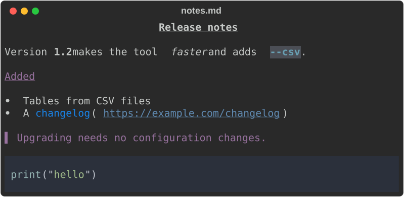

- Headings, emphasis, lists, block quotes and fenced code are all rendered.
- The link keeps its URL in brackets, so it survives a pipe. Add
  `--hyperlinks` (`-y`) to emit a clickable OSC 8 link instead.
- `rich markdown FILE` (or `md`, or `-m`) forces Markdown for any extension.

### Source code

```bash
rich greet.py
```

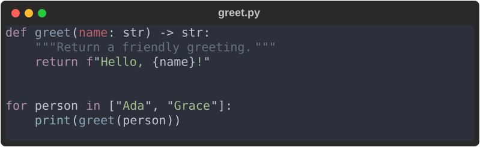

Any extension without a dedicated renderer is syntax-highlighted, with the
language taken from the extension. `rich syntax FILE` (`code`, `-x`) forces it.

### JSON

```bash
rich data.json
```

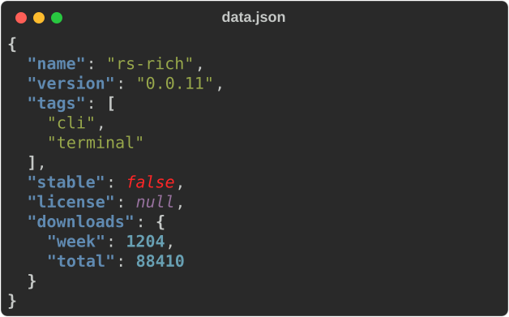

The one-line-ish input comes out indented, with strings, numbers, booleans and
`null` each in their own colour. Invalid JSON is an error (exit code `4`), not a
best-effort print.

### CSV and TSV

```bash
rich team.csv --title Team
```


- The delimiter and the header row are detected, not assumed, so
  semicolon- and tab-separated files work too.
- Numeric columns are right-aligned.
- `--title` and `--caption` become the table's title and caption.

From standard input, name the mode: `cat team.csv | rich csv -`.

### Notebooks

```bash
rich analysis.ipynb
```

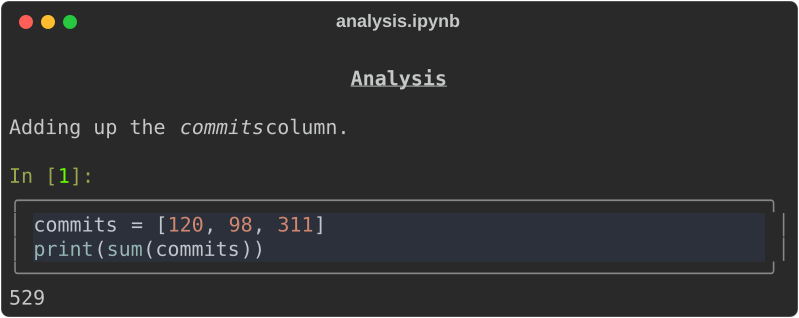

Markdown cells are rendered, code cells are highlighted in a box with their
`In [n]` label, and stream outputs follow.

## Markup and rules

`print` treats its RESOURCE as [console markup](../../tutorial/02-markup.md)
rather than a file name:

```bash
rich print '[bold magenta]Hello[/] from [green]rich[/]!'
```


`-` reads the markup from standard input: `echo '[b]hi' | rich print -`. Bad
markup, such as an unmatched `[/tag]`, is an error with exit code `4`.

!!! info "About the screenshot titles"

    An exported SVG is titled after its RESOURCE when that is a file path or
    URL. Literal text, from `print` or `rule`, and stdin give the title `rich`.

`rule` draws a horizontal rule with the RESOURCE as its title:

```bash
rich rule 'Chapter 1'
```


## JSON Lines and logs

`jsonl` renders newline-delimited JSON one record at a time, so it can follow
a stream that never ends (`tail -f app.jsonl | rich jsonl -`):

```bash
rich jsonl events.jsonl
```

```text
{
  "timestamp": "2026-09-23T10:00:00Z",
  "level": "info",
  "message": "server started",
  "port": 8080
}
{
  "timestamp": "2026-09-23T10:00:02Z",
  …
```

`log` recognises common structured-log fields (`timestamp`/`time`,
`level`/`severity`, `message`/`msg`) and prints one line per record, with the
remaining fields at the end:

```bash
rich log events.jsonl
rich log events.jsonl --log-presentation rich
```

```text
2026-09-23T10:00:00Z INFO server started {"port":8080}
2026-09-23T10:00:02Z WARNING slow request {"path":"/api","ms":870}
2026-09-23T10:00:05Z ERROR database unreachable {"retry":true}

2026-09-23T10:00:00Z info server started port=8080
2026-09-23T10:00:02Z warn slow request path=/api ms=870
2026-09-23T10:00:05Z error database unreachable retry=true
```

`--log-presentation rich` types the fields and colours the level labels. A
malformed line stops the stream with its line number and exit code `4`.

Streams are rendered as they arrive, so `jsonl` and `log` cannot be exported to
HTML or SVG (that is why this section shows text).

## Structured data

`inspect` reads JSON, YAML, TOML, XML, INI or dotenv and draws it as a tree:

```bash
rich inspect deploy.yaml
```


The options change the view:

```bash
rich inspect deploy.yaml --select '$.servers[*].name'   # a JSONPath query
```

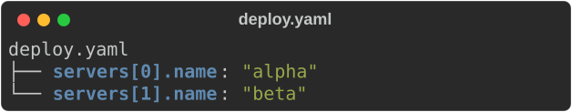

```bash
rich inspect deploy.yaml --find alpha        # search keys and values
```

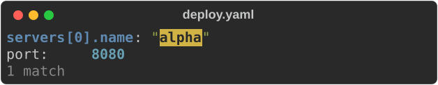

```bash
rich inspect deploy.yaml --flatten           # one path = value row per value
```

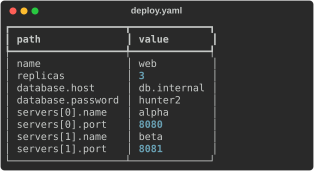

```bash
rich inspect deploy.yaml --redact            # mask password, token, api_key …
```

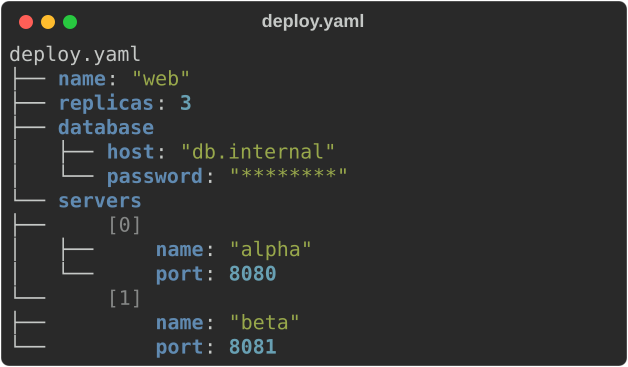

```bash
rich inspect deploy.yaml --compare deploy-prod.yaml
```

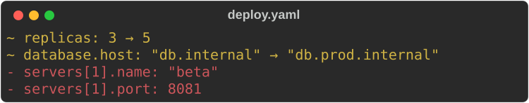

`--compare` lists what changed (`~`), was added (`+`) or removed (`-`) in the
second document. Other options: `--table`, `--max-depth N`, `--max-length N`
and `--show-paths`. A document that does not parse is reported as
`file:line:column` with exit code `4`.

## Detecting piped input

Piped text prints as plain text, as upstream does. `--format auto` detects what
it is instead:

```bash
echo '{"ok": true, "items": [1, 2]}' | rich --format auto
```

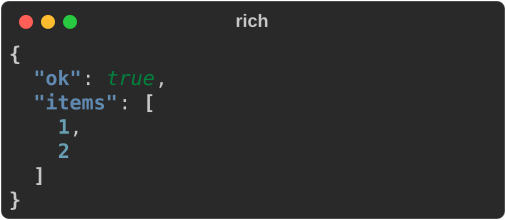

JSON goes to the JSON renderer; YAML, TOML, XML, INI and dotenv are
highlighted; anything else stays plain text. `--format yaml` (or `json`, `toml`
…) names the format outright, overriding a file's extension too. To make
detection the default, put `format = "auto"` in your config.

## Comparing text and patches

Two text files give a line diff, syntax-highlighted by file name, with the
changed words emphasised:

```bash
rich diff greet.py greet_v2.py
```

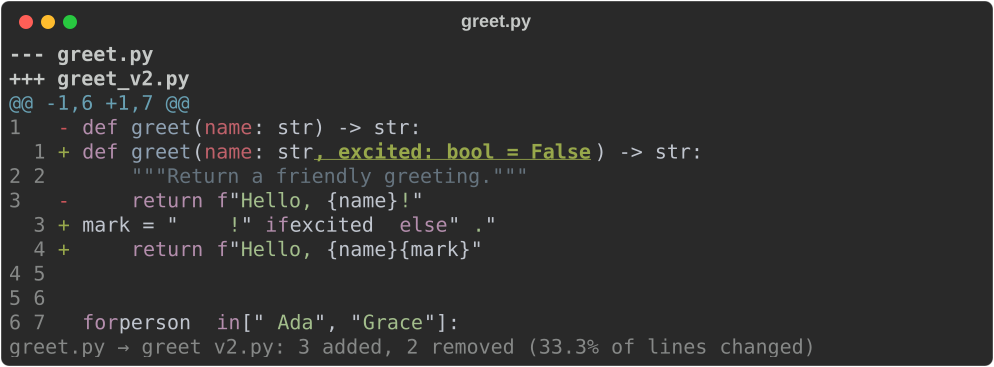

```bash
rich diff greet.py greet_v2.py --side-by-side
```

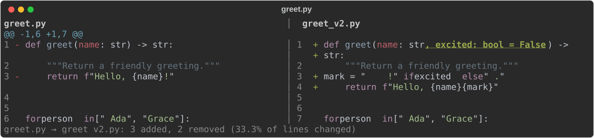

A single input is read as a patch, such as `git diff` output. It renders a tree
of the changed files, then each file's hunks:

```bash
git diff | rich diff -
rich diff - < greet.patch          # the smoke tool writes this sample patch
```

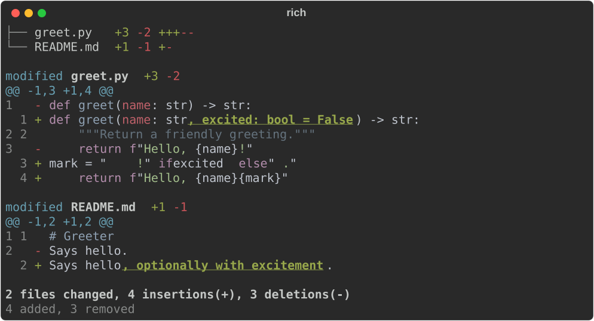

`--threshold PCT` turns a diff into a gate. Above the threshold it prints
`FAIL` and exits `5`:

```bash
rich diff greet.py greet_v2.py --threshold 10
echo $?    # 5
```

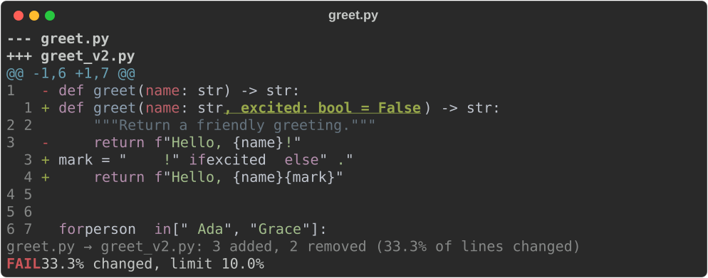

`--context N` sets the unchanged lines around each change (default 3) and
`--language NAME` overrides the highlighting language.

## Images, GIFs and image diffs

These need a binary with the `art` feature (the default) and the sample images
from `python3 scripts/smoke_cli.py --fixtures DIR`: `before.png` and
`after.png` (a gradient with a disc; `after.png` adds a white badge),
`logo.png` (a disc on a transparent background) and `ball.gif`.

### Still images

```bash
rich image before.png --image-mode blocks --width 48
```


`--image-mode` picks how the picture is drawn:

| Mode | Draws with |
|---|---|
| `auto` | Sixel where it looks supported, else half blocks, else ASCII (default) |
| `blocks` | `▀` half blocks: two pixels per cell, needs colour |
| `quadrants` | 2×2 pixels per cell in two colours |
| `braille` | 2×4 dots per cell, monochrome |
| `ascii` | a character ramp; works without colour |
| `sixel` | real pixels, in terminals that support Sixel |

```bash
rich image before.png --image-mode ascii --width 48
rich image before.png --image-mode quadrants --width 48
```

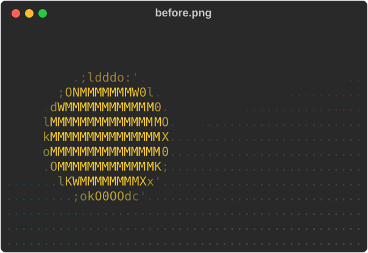

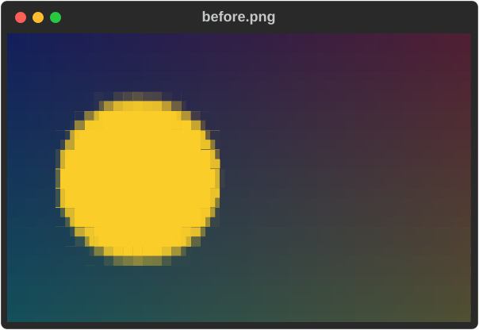

Fit it into an exact box, cropping around an anchor:

```bash
rich image before.png --image-mode blocks --width 30 --height 12 \
  --image-fit cover --image-anchor right
```

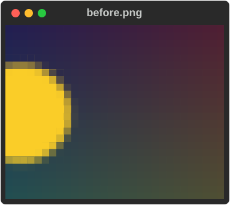

Flatten transparency onto a colour:

```bash
rich image logo.png --image-mode blocks --width 40 --image-background '#542080'
```

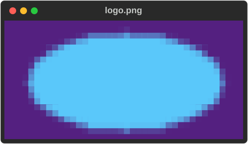

Reduce the colours, with dithering:

```bash
rich image before.png --image-mode blocks --width 48 \
  --image-color ansi16 --image-dither bayer4x4
```

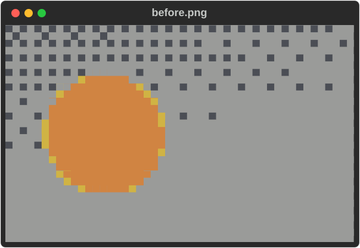

Rotate, convert to grayscale and adjust the tone:

```bash
rich image before.png --image-mode blocks --width 24 \
  --image-rotate 90 --image-grayscale --image-contrast 1.4
```

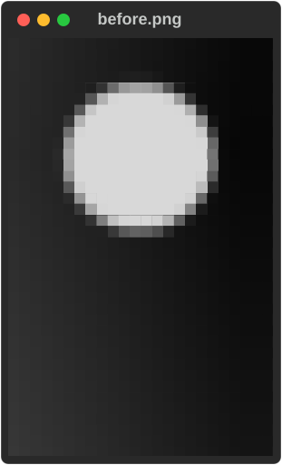

What to notice:

- Explicit `blocks` and `quadrants` need colour. When stdout is redirected they
  still print their characters without colour, so pick `ascii` or `braille` for
  plain-text output. `--export-html`/`--export-svg` render in colour even
  then (unless you pass `--no-color`).
- `--image-fit` needs `--height`; `--image-anchor` needs `--image-fit cover`.
- [Images](../art/images.md) explains every option, and
  [Using the CLI](../../cli.md#render-a-still-image) lists the exact rules.

### GIFs

```bash
rich gif ball.gif --gif-mode blocks --width 48 --loop 2
```

In a terminal this plays the animation in place, twice; `--loop 0` repeats
until Ctrl+C. Piped or redirected, it prints the first frame once and says so on
stderr:

```text
rich: GIF animation needs a terminal; rendering the first frame only
```

Several GIFs play side by side, each at its own speed:
`rich gif a.gif b.gif`. GIFs cannot be exported to HTML or SVG. If Ctrl+C
leaves the cursor hidden, `printf '\033[?25h'` brings it back.

### Image diffs

When both inputs are images, `diff` compares them perceptually: would a person
notice the change, and where?

```bash
rich diff before.png after.png --image-mode blocks --width 64
```

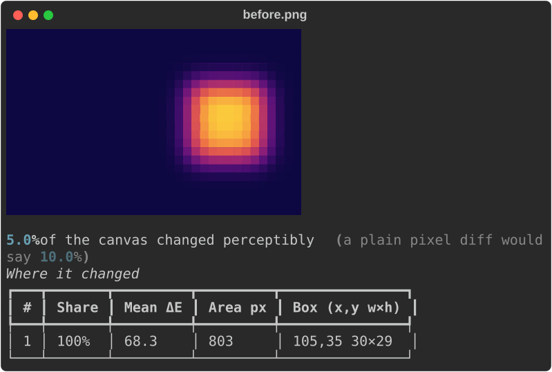

- The headline compares the perceptual figure (5.0%) with what a plain pixel
  comparison would say (10.0%).
- The table ranks the regions that changed, with their share of the change,
  strength (mean ΔE), area and bounding box.
- `--threshold 2` makes it a CI gate: `FAIL`, exit `5`. `--image-mode none`
  prints the numbers only.

[Comparing images](../../image-diff.md) covers the method and the gate in
depth; [Image diff](../art/image-diff.md) covers the library.

## Decoding escape sequences

`ansi explain` lists every escape sequence in a capture of terminal output and
what it does, then the text a terminal would show:

```bash
rich ansi explain capture.ans
ls --color=always | rich ansi explain -
```

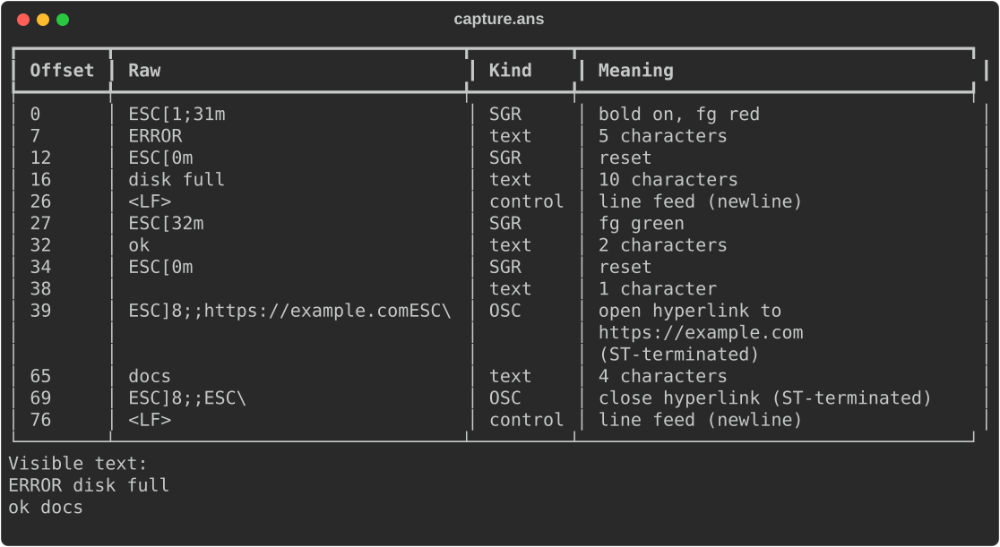

`--ansi-inline` marks the escapes inside the text instead
(`⟨bold on, fg red⟩ERROR⟨reset⟩ disk full`), and `--escapes-only` drops the
text rows from the table.

Related: `--sanitize` replaces control characters in *any* input with visible,
inert symbols (`ESC[2J` becomes `␛[2J`). Use it for files you do not trust.

## Viewing and inspecting anything

`view` shows a file the way it should be read, and pages it when it is taller
than the terminal:

```bash
rich view src/main.rs
rich view src/main.rs --search todo     # highlight matches; a summary goes to stderr
cat config.yaml | rich view -           # the format is detected from the content
```

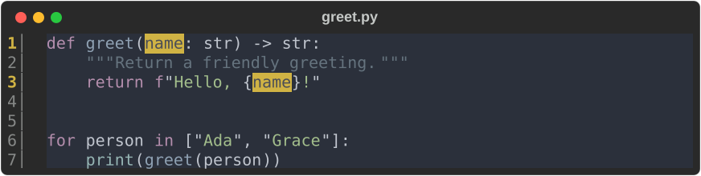

| The file is | `view` shows it as |
|---|---|
| Markdown, CSV/TSV, a notebook, JSON Lines | the matching renderer, as `rich FILE` does |
| an image or GIF | the image or animation |
| a `.diff` / `.patch`, or text starting with `diff --git` | a rendered patch |
| source code, JSON, YAML, TOML, XML, INI or plain text | highlighted, with line numbers (`--no-line-numbers` leaves them out) |
| binary (a NUL byte, or not UTF-8) | a hex dump |

Paging is on by default; any paging flag, on the command line or in the
config, overrides it. Folding and interactive search are left to your pager.

`hex` is a hex dump in the style of `hexdump -C`: offsets, bytes in groups,
an ASCII panel, and `*` for runs of repeated lines. `--offset` and `--length`
slice the input, `--bytes-per-line` and `--group` shape it, and `--search`
highlights a byte string:

```bash
rich hex logo.png --length 48 --search "49 48 44 52"
rich hex firmware.bin --offset 0x200 --search '"MAGIC"'
```

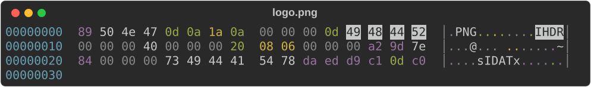

`unicode` splits text into graphemes and shows each one's code points, UTF-8
bytes, width in cells, an escape you can paste into Rust, and a kind
(combining, emoji, zero-width, control…). Invalid UTF-8 gets a row of its own:

```bash
printf 'cafe\u0301 👍🏽 ok' | rich unicode -
```

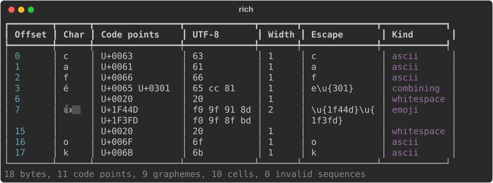

`env` lists environment variables. Values whose names look secret (`TOKEN`,
`PASSWORD`, `API_KEY`, `AUTH` as a whole word…) are masked unless you pass
`--show-secrets`. Arguments filter the names, as substrings or `*` globs, and a
single PATH-like variable is checked entry by entry, flagging missing,
duplicate and empty ones:

```bash
rich env AWS
rich env PATH
```

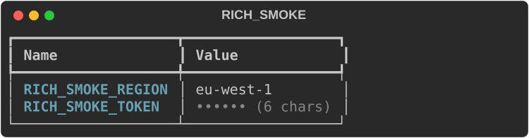

`capture` runs a command as a colour terminal would (`FORCE_COLOR`,
`CLICOLOR_FORCE` and `COLUMNS` set), then shows its output in a panel titled with
the command, with its exit status and duration below. stdout and stderr share
one pipe, so they interleave in the order they were written. Every export
works, and `--cast FILE` also writes an asciicast v2 recording:

```bash
rich capture -- cargo test
rich capture --export-svg test-run.svg --cast test-run.cast -- cargo test
asciinema play test-run.cast
```

`capture` exits with the command's own status (128 + the signal number if a
signal killed it) after drawing the panel and writing any exports, so
`rich capture -- cargo test` fails a CI step when the tests fail. Append
`|| true` to ignore it. With `--report json` a failed command's envelope has
`"code": "command"` and its status. There is no PNG export.

## Panels, padding, alignment and style

These options decorate the output of any mode:

```bash
printf '[b]Build passed[/]\n3 targets, 0 warnings\n' |
  rich print - --panel rounded --title CI --caption main \
    --padding 1,2 --panel-style green
```

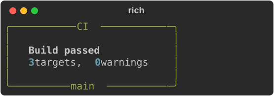

- `--panel BOX` wraps the output (`rounded`, `square`, `heavy`, `double`,
  `ascii`, `ascii2`). A panel shrinks to fit its content; `-e`/`--expand` fills
  the width instead.
- `--padding` takes 1, 2 or 4 comma-separated numbers, like CSS.
- `--style` styles the content; `-S`/`--panel-style` styles the border.

```bash
rich print Centered --center --width 24 --panel heavy --style 'bold white on #303060'
```


`--width N` sizes the rendered block, not the terminal, so `--center` (or
`--left`, `--right`) still positions it within the full terminal width.

## Exporting HTML and SVG

Any rendering can also be written to a file, while still printing to stdout:

```bash
rich notes.md --export-html notes.html
rich notes.md --export-svg notes.svg
```

- The HTML is self-contained. The SVG loads its font from a CDN.
- Exports keep colour even when stdout is redirected; `--no-color` turns it
  off. Image exports draw with coloured blocks unless you choose `ascii`.
- The SVG width follows the terminal width; set `COLUMNS=64` for a fixed size.
  Every screenshot on this page is such an export.
- `jsonl`, `log`, `gif`, `doctor`, `config` and `bench` output cannot be
  exported.

## Paging

```bash
rich notes.md --pager          # always page
rich notes.md --auto-pager     # page only if taller than the terminal
```

The pager is `MANPAGER`, then `PAGER`, then `less` (`more.com` on Windows).
Redirected output is never paged, so `rich --pager notes.md > out.txt` just
writes the file. `--no-pager` cancels paging set in a config file.

## Watching files

```bash
rich --watch notes.md
rich --watch notes.md data.json events.jsonl
```

In a terminal, `--watch` re-renders a file every time it is saved, until
Ctrl+C. It uses operating-system file events, catches editors that save by
rename, and only re-renders when the content really changed. Several files each
get their own region with the file name as a header, and only the changed one
is redrawn. A file that fails to parse shows its error in its region and
recovers on the next good save.

Useful options: `--watch-debounce SEC` (default `0.1`), `--watch-poll` for
network filesystems, `--watch-interval SEC` and `--watch-exit-on-error`. URLs
can be watched too, with `--watch-cache` to skip unchanged responses.

When stdout is not a terminal, `--watch` renders once and exits. No screenshot
here: it is an interactive mode. See the
[watch recipe](../../recipes.md#watch-json-while-editing).

## Converting many files

`--batch` takes files, directories and globs, and runs each one through the
same renderer. Plan first with `--dry-run`, which writes nothing:

```bash
rich --batch --markdown --export-html site/page.html --dry-run docs
```

```text
docs/intro.md
  HTML: site/intro.html
docs/usage.md
  HTML: site/usage.html
Dry run: 2 file(s), 0 error(s); no files written.
```

Each output is named after its input, in the directory of the export path you
gave. Then run it, here with two parallel workers and a JSON report:

```bash
rich --batch --markdown --export-html site/page.html --jobs 2 --report json docs
```

```text
{"ok":true,"code":"success","exit_code":0,"result":{"planned":2,"attempted":2,"completed":2,"failed":0,"skipped":0,"failures":[]}}
```

- Existing outputs stop the run (exit `3`) unless you pass `--overwrite` or
  `--collision suffix`.
- The run stops at the first failure unless you pass `--continue-on-error`.
- `--batch-preserve-dirs`, `--batch-input-root` and `--batch-name-template`
  mirror a directory tree. See [Using the CLI](../../cli.md#convert-many-files-at-once).

## Configuration, profiles and themes

The sample `rich.toml` has a `[defaults]` table, a `ci` profile and a `night`
theme. Check that it is valid and see what a profile resolves to:

```bash
rich config validate --config rich.toml --profile ci
rich config show --config rich.toml --profile ci
```

```json
{
  "valid": true,
  "source": "/…/rich-tour/rich.toml",
  "profile": "ci",
  "disabled": false,
  "theme": "night",
  "theme_styles": {
    "notice": "bold cyan",
    "warning": "bold yellow"
  },
  "settings": {
    "no_color": true,
    "panel": "rounded",
    "theme": "night",
    "width": 60
  }
}
```

Explain where one value comes from, and what it overrides:

```bash
rich config explain width --config rich.toml --profile ci --width 72
```

```text
width = 72
  ✔ command line          72  effective
  ✗ profile (profile ci)  60  overridden by command line
```

Without a key, `config explain` tables every key across the layers — built-in
defaults, `NO_COLOR`, the config file, the profile and the command line — and
`config reference` lists every key with its type, default and flag.

`no_color = false` in your own config (`~/.config/rich/config.toml`, or a file
named with `--config`) overrides `NO_COLOR`. A `rich.toml` found in the working
directory belongs to the project, so it can turn colour off but not back on
while `NO_COLOR` is set; pass `--color` to override it for one run.

Themes give names to styles. The `night` theme defines `notice` and `warning`:

```bash
echo '[notice]Ready[/] [warning]2 warnings[/]' | rich --config rich.toml print -
```


`--theme NAME` picks another theme and `--theme-style 'notice=bold green'`
overrides one style for a single run. Unknown keys, bad values and missing
profiles are errors (exit `2`), even in profiles you did not select.

## Completions and generated docs

```bash
rich completions bash > ~/.local/share/bash-completion/completions/rich
rich completions zsh  > "${fpath[1]}/_rich"
rich completions fish > ~/.config/fish/completions/rich.fish
rich completions powershell >> $PROFILE
```

The same description of the command line generates `--help`, the completion
scripts, and reference documentation:

```bash
rich docs markdown > rich.md       # the CLI reference as Markdown
rich docs config                   # the configuration reference as Markdown
rich docs man --output man/        # rich.1 plus one page per subcommand
man ./man/rich.1
```

`rich COMMAND --help` shows one command, for example `rich config explain --help`.

## Diagnosing your terminal

```bash
rich doctor
```

```text
Rich doctor — rs-rich-cli 0.0.11
Build features: {"art":true,"fetch":true,"syntax-cache":false,"json-escape-safe":false}
Terminal: stdout TTY=false, 80×25 cells, colour=none (detected); NO_COLOR=false
Image backend: ascii; Sixel support=false (inferred, no probe)
Configuration: source="/…/rich-tour/rich.toml", profile="default", disabled=false
Pager: less from platform default; availability not checked; never launched

┏━━━━━━━━━━━━━┳━━━━━━━┳━━━━━━━━━━━━━━━━━━━━━━━━━━━━━━━━━━━━━━━━━━┓
┃ Capability  ┃ Value ┃ Source                                   ┃
┡━━━━━━━━━━━━━╇━━━━━━━╇━━━━━━━━━━━━━━━━━━━━━━━━━━━━━━━━━━━━━━━━━━┩
│ color       │ none  │ inferred: stdout is not a terminal       │
│ unicode     │ yes   │ environment (LC_CTYPE): LC_CTYPE=C.UTF-8 │
│ hyperlinks  │ no    │ inferred: stdout is not a terminal       │
│ graphics    │ none  │ inferred: stdout is not a terminal       │
│ sixel       │ no    │ inferred: stdout is not a terminal       │
│ width       │ 80    │ environment (COLUMNS): COLUMNS=80        │
│ height      │ 25    │ default: default 25                      │
│ interactive │ no    │ inferred: stdout is not a terminal       │
│ animation   │ no    │ inferred: not interactive                │
└─────────────┴───────┴──────────────────────────────────────────┘
```

This was run with stdout redirected, so colour and interactivity are off; in a
terminal you will see what your terminal supports. Every value names its
source. `doctor` never probes the terminal, fetches a URL or starts the pager.
`rich doctor --report json` prints the same as JSON on stdout. Environment
variables such as `RICH_COLOR`, `RICH_SIXEL` or `RICH_WIDTH` override a
detected value.

## Comparing benchmark runs

`bench compare` compares two benchmark runs saved by `rich_ext::qa::bench` (or
two criterion output directories). The smoke tool writes a sample pair:

```bash
rich bench compare bench-base.json bench-new.json --threshold 10
echo $?    # 5
```

```text
┏━━━━━━━━━━━━━┳━━━━━━━━━━┳━━━━━━━━━━━┳━━━━━━━━┳━━━━━━━━━━━┳━━━━━━━━━━━━━┓
┃ Benchmark   ┃ Baseline ┃ Candidate ┃ Change ┃ Spread    ┃ Verdict     ┃
┡━━━━━━━━━━━━━╇━━━━━━━━━━╇━━━━━━━━━━━╇━━━━━━━━╇━━━━━━━━━━━╇━━━━━━━━━━━━━┩
│ table/80    │ 1.00 µs  │ 1.30 µs   │ +30.0% │ ▆▆▆▆ ████ │ regression  │
│ markdown/80 │ 2.00 µs  │ 1.50 µs   │ -25.0% │ ████ ▆▆▆▆ │ improvement │
└─────────────┴──────────┴───────────┴────────┴───────────┴─────────────┘
2 benchmarks: 1 regression, 1 improvement, 0 unchanged, 0 new, 0 removed
```

A change inside `--threshold` percent (default 5), or inside the noise, counts
as unchanged. Any regression exits `5`, so it can gate CI.

## Scripts, CI and exit codes

`rich` exits with a code for each class of failure:

| Code | Meaning | Try it |
|---|---|---|
| `0` | Success | `rich data.json` |
| `2` | Usage or configuration error | `rich --no-such-flag` |
| `3` | Input, read or write error | `rich missing.md` |
| `4` | Parse or render error in the data | `rich json broken.json` |
| `5` | A threshold or gate failed | `rich diff greet.py greet_v2.py --threshold 10` |
| `130` | A batch was interrupted with Ctrl+C | |

`--report json` adds a one-line result envelope on **stderr**, leaving stdout
for the rendered output:

```bash
rich --report json json data.json > out.txt
rich --report json json broken.json
```

```text
{"ok":true,"code":"success","exit_code":0,"result":{}}
{"ok":false,"code":"data","exit_code":4,"message":"invalid JSON: json parse error: key must be a string at line 1 column 20","error":{"message":"invalid JSON: json parse error: key must be a string at line 1 column 20"}}
```

In a shell script:

```bash
if rich --csv "$f" > /dev/null 2>&1; then
  echo "readable"
else
  echo "could not render $f (exit $?)" >&2
fi
```

## The guided demo

```bash
rich --demo-list
```

```text
core       Core renderables and extensions
workflows  Configuration, batch, exports and watch
art        Banners, images, image diff and GIF
```

```bash
rich --demo                            # the whole tour, 3 s between sections
rich --demo --demo-section art         # one section
rich --demo --demo-delay 0             # no pauses
rich --demo --no-color > tour.txt      # a plain transcript
```

The demo is offline, ignores your config, writes only to a temporary directory
and stops cleanly on Ctrl+C. With no RESOURCE and no mode, `rich` alone shows a
short capability demo instead.

## Where to go next

- [Smoke test](smoke.md) — run every command above against a build, in one go.
- [Using the CLI](../../cli.md) — every option, organised by task.
- [Workflow recipes](../../recipes.md) — watch, batch, profiles and CI setups.
- [Troubleshooting](../../troubleshooting.md) — error messages and fixes.
