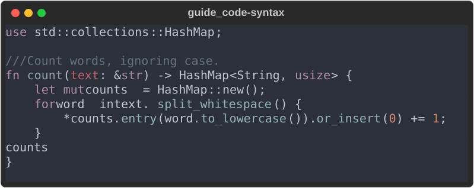
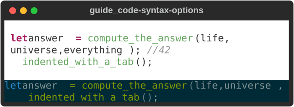
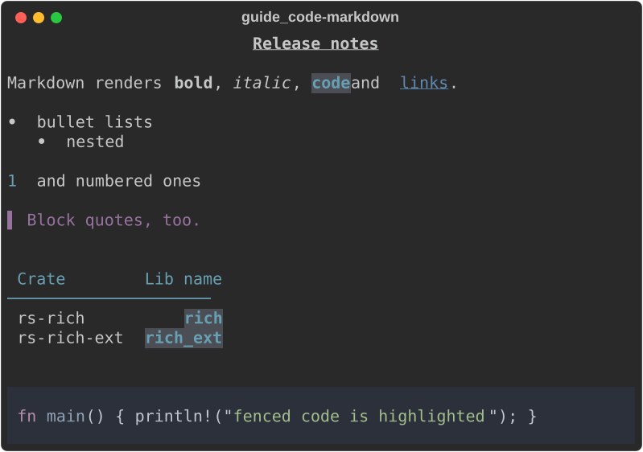
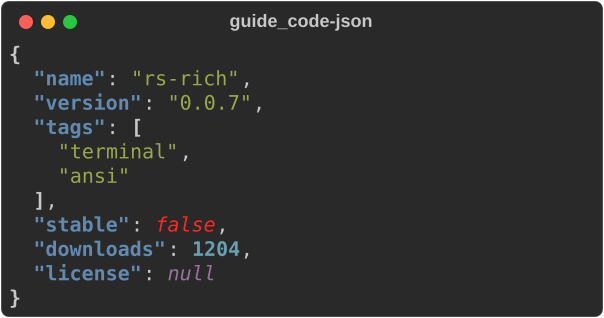
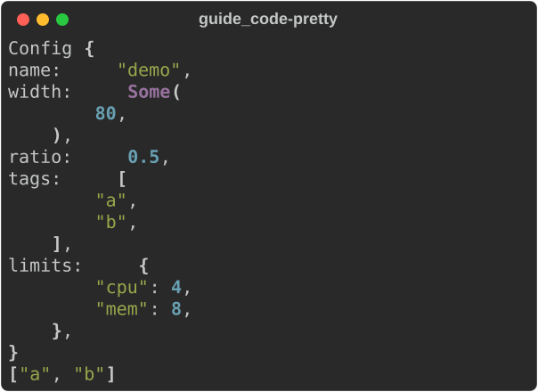

# Code and data

Four renderables turn source text and values into readable terminal output:

| Type | Renders | Upstream |
|---|---|---|
| [`Syntax`](#syntax) | source code, highlighted | `rich.syntax.Syntax` |
| [`Markdown`](#markdown) | a CommonMark document | `rich.markdown.Markdown` |
| [`Json`](#json) | a JSON document, indented and coloured | `rich.json.JSON` |
| [`Pretty`](#pretty) | any `Debug` value, highlighted | `rich.pretty.Pretty` |

The examples use these imports:

```rust
--8<-- "crates/rich/examples/guide_code.rs:imports"
```

## Syntax

```rust
--8<-- "crates/rich/examples/guide_code.rs:syntax"
```



`Syntax::new(code, language)` takes a language name or file extension
(`"rust"`, `"rs"`, `"py"`, `"json"`, `"toml"`, `"sh"` …). An empty or unknown
language renders the code as plain text on the theme background.

```rust
--8<-- "crates/rich/examples/guide_code.rs:syntax_options"
```



| Method | Default | Effect |
|---|---|---|
| `theme(name)` | `"base16-ocean.dark"` | a `syntect` theme: `base16-ocean.dark`, `base16-eighties.dark`, `base16-mocha.dark`, `base16-ocean.light`, `InspiredGitHub`, `Solarized (dark)`, `Solarized (light)`; unknown names fall back to the default |
| `word_wrap(bool)` | `false` | wrap long lines; off, they are cropped at the width |
| `padding(n)` | `0` | `n` cells of background on every side |
| `tab_size(n)` | `4` | tabs are expanded to spaces before highlighting |

`highlight()` returns the highlighted code as a `Text` instead of a padded
block — for embedding in your own layout:

```rust
--8<-- "crates/rich/examples/guide_code.rs:highlight"
```

!!! note "Colours differ from Python rich"

    Upstream highlights with Pygments; this port uses
    [`syntect`](https://docs.rs/syntect), which ships different grammars and
    themes. The layout matches; the colours do not
    ([divergence #18](../../DIVERGENCES.md)). Pygments style names such as
    `monokai` are not recognised.

### Not yet ported

`line_numbers`, `line_range`, `highlight_lines`, `start_line`,
`indent_guides`, `code_width`, `background_color`, `dedent` and
`Syntax.from_path`. To show part of a file, slice the lines before passing
them in; to number lines, a two-column `Table::grid()` of line numbers and
`highlight()` output works.

## Markdown

```rust
--8<-- "crates/rich/examples/guide_code.rs:markdown"
```



Headings, paragraphs, emphasis, inline code, links, bullet and numbered lists
(nested), block quotes, horizontal rules, tables with column alignment, and
fenced code blocks (highlighted by `Syntax`) are all rendered, as upstream
does.

```rust
--8<-- "crates/rich/examples/guide_code.rs:markdown_options"
```

| Method | Default | Effect |
|---|---|---|
| `hyperlinks(bool)` | `true` | `true`: link text becomes an OSC 8 hyperlink. `false`: written as `text (url)` |
| `justify(Justify)` | `Left` | paragraph justification (headings keep their own) |
| `style(Style)` | none | base style for all text |
| `code_theme(name)` | the `Syntax` default | theme for fenced code blocks |
| `inline_code_lexer(lang)` | none | highlight `inline code` as this language |
| `inline_code_theme(name)` | the code theme | theme for highlighted inline code |

!!! tip "Hyperlinks off for piped output"

    An OSC 8 link is only written when the console has colour. With hyperlinks
    on, output redirected to a file keeps the link text and loses the URL.
    That is why upstream's `rich` CLI turns them off by default; do the same
    when your output may be piped.

Markdown styles come from the theme: `markdown.h1`, `markdown.code`,
`markdown.link`, `markdown.block_quote` and so on. See
[divergence #9](../../DIVERGENCES.md) for the few elements that differ.

## JSON

```rust
--8<-- "crates/rich/examples/guide_code.rs:json"
```



- `Json::new(text)` parses and returns `Err` for invalid JSON. The output is
  re-indented (two spaces) with keys, strings, numbers, booleans and `null`
  styled through the theme (`json.key`, `json.str`, …).
- `.no_wrap(true)` crops long lines instead of wrapping them — what upstream
  does for a `JSON` nested inside another renderable. The default wraps, which
  matches a top-level print.
- The `json-escape-safe` feature adds `.escape_safe(true)`, which never splits
  an escape sequence at a line break ([divergence #22](../../DIVERGENCES.md)).

Upstream's `indent`, `sort_keys` and `ensure_ascii` options are not ported;
format with `serde_json` first if you need them.

## Pretty

Python rich pretty-prints any object via its `repr`. Rust has no runtime
reflection, so [`Pretty`](https://docs.rs/rs-rich/latest/rich/pretty/struct.Pretty.html)
uses the value's `Debug` implementation and runs the repr highlighter over it.

```rust
--8<-- "crates/rich/examples/guide_code.rs:pretty"
```



- `Pretty::new(&value)` formats with `{:#?}` (multi-line); `Pretty::compact`
  with `{:?}`.
- Numbers, strings, `None`, paths and URLs are coloured. Rust's lowercase
  `true`/`false` are left plain, since the highlighter targets Python's
  spelling ([divergence #19](../../DIVERGENCES.md)).
- Line breaking is `Debug`'s, not upstream's width-aware layout: `max_length`,
  `max_string`, `max_depth` and `indent_guides` are not available.

## See also

- [Text and style](text-and-style.md) — themes that restyle these renderables
- [Tables](tables.md) — `Syntax`, `Markdown`, `Json` and `Pretty` can sit in cells
- The CLI renders files with these types: [Using the CLI](../../cli.md)
- API: [`Syntax`](https://docs.rs/rs-rich/latest/rich/syntax/struct.Syntax.html) ·
  [`Markdown`](https://docs.rs/rs-rich/latest/rich/markdown/struct.Markdown.html) ·
  [`Json`](https://docs.rs/rs-rich/latest/rich/json/struct.Json.html) ·
  [`Pretty`](https://docs.rs/rs-rich/latest/rich/pretty/struct.Pretty.html)
