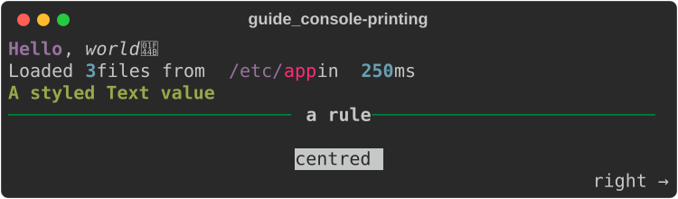
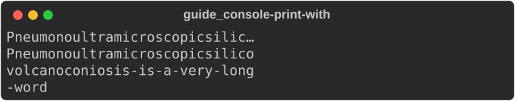
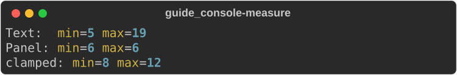
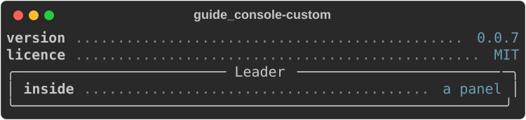

# Console and printing

A [`Console`](https://docs.rs/rs-rich/latest/rich/console/struct.Console.html)
is where output goes. It knows how wide the terminal is, which colours it
supports and which theme to use, and it turns anything
[renderable](#the-renderable-trait) into styled text. Most programs create one
console and print everything through it.

```rust
use rich::Console;

fn main() {
    let console = Console::new();
    console.print_str("[bold magenta]Hello[/], world");
}
```

The examples on this page use these imports:

```rust
--8<-- "crates/rich/examples/guide_console.rs:imports"
```

## Printing

| Method | Takes | Use it for |
|---|---|---|
| `print_str(&str)` | console markup | Strings: parses `[tags]`, expands `:emoji:`, applies highlighting |
| `try_print_str(&str)` | console markup | The same, but returns an error for malformed markup instead of printing it raw |
| `print(&dyn Renderable)` | any renderable | `Text`, `Table`, `Panel`, your own types |
| `print_justified(&str, Justify)` | console markup | A line aligned left, centre, right or fully justified |
| `print_with(&dyn Renderable, &ConsoleOptions)` | any renderable | Overriding width, justify, overflow or wrapping for one print |

Every print ends with a newline.

```rust
--8<-- "crates/rich/examples/guide_console.rs:printing"
```



Upstream's `console.rule()` and `console.line()` are spelled as plain prints
here: `console.print(&Rule::new("title"))` and `console.print_str("")`.
Upstream's `console.log()` has no method on the console; print a
[`LogRecord`](logging-and-errors.md) instead.

!!! warning "Escape text you did not write"

    `print_str` parses markup, so user-supplied text containing `[` can change
    your formatting. Pass it through `rich::markup::escape` first, or build a
    `Text::new(untrusted)` and `print` that — `Text::new` never parses markup.
    See [markup](text-and-style.md#markup).

### Per-print options

`print_with` takes a
[`ConsoleOptions`](https://docs.rs/rs-rich/latest/rich/console/struct.ConsoleOptions.html).
Start from `console.options()` and change the fields you need: `max_width`,
`height`, `justify`, `overflow`, `no_wrap`.

```rust
--8<-- "crates/rich/examples/guide_console.rs:print_with"
```



!!! note "A printed `Text` uses the print's options"

    When a `Text` is printed directly, its own `justify`, `overflow` and
    `no_wrap` are dropped in favour of the print's options — upstream does the
    same. Set them through `print_with`, or put the `Text` inside a container
    (a `Panel`, a table cell), where its own settings apply.

## Configuring the console

`Console::new()` detects everything. `Console::builder()` lets you override it:

```rust
--8<-- "crates/rich/examples/guide_console.rs:builder"
```

| Builder method | Default | Effect |
|---|---|---|
| `width(usize)` | `COLUMNS`, else the terminal width, else 80 | The width everything is rendered into |
| `height(usize)` | `LINES`, else the terminal height, else 25 | Used by height-filling renderables such as `Layout` |
| `color_system(Option<ColorSystem>)` | detected from `COLORTERM`/`TERM`; `None` when not a terminal | `Standard` (16), `EightBit` (256), `Truecolor`, or `None` for no colour at all |
| `force_terminal(bool)` | detected | Treat stdout as a terminal: keep styles and control codes when piped |
| `no_color(bool)` | on when `NO_COLOR` is set and non-empty | Disable styled output (see the note below) |
| `highlight(bool)` | `true` | Automatic highlighting of numbers, strings, paths, URLs… |
| `emoji(bool)` | `true` | Expand `:rocket:`-style shortcodes in markup |
| `theme(Theme)` | `Theme::default_theme()` | The style names markup and renderables look up ([themes](text-and-style.md#themes)) |
| `legacy_windows(bool)`, `safe_box(bool)` | `false`, `true` | On a legacy Windows console, swap `ROUNDED`/`HEAVY` boxes for `SQUARE` |
| `ascii_only(bool)` | `false` | Draw every box with ASCII characters |

Read the result back with `console.width()`, `height()`, `color_system()`,
`is_terminal()` and `no_color()`.

!!! note "`no_color` drops all styling"

    In this port `no_color` makes `color_system()` return `None`, so bold,
    italic and underline disappear along with the colours. Upstream's
    `no_color` removes only the colours. If you need attributes without colour,
    leave `no_color` off and use styles that set no colour.

!!! tip "Pin the console in tests"

    Output depends on the terminal. For snapshot tests and generated docs, set
    `width`, `force_terminal(true)` and `color_system(...)` so the same code
    produces the same bytes everywhere. Every screenshot in this guide is made
    that way ([how](export.md#how-the-guides-screenshots-are-made)).

Upstream's `Console(record=True)` has no builder flag here: recording is
scoped to a closure instead — see [capturing](#capturing-output).

## Capturing output

Instead of printing, you can capture what *would* be printed. Each method runs
a closure that receives the same console; everything the closure prints is
collected rather than written, and captures nest.

```rust
--8<-- "crates/rich/examples/guide_console.rs:capture"
```

| Method | Returns |
|---|---|
| `capture(f)` | the ANSI string `f` would have written |
| `export_text(f)` | the same, styles stripped |
| `record_output(f)` | the raw `Vec<Segment>`, to render into several formats from one pass |
| `render_to_string(&r)` | one renderable as ANSI, without the trailing newline |
| `render_export(&r)` | one renderable exactly as `print` writes it, newline included |
| `render_str_to_string(&str)` | one markup string, as `print_str` would render it |
| `export_html(f)`, `export_svg(…)` | documents — see [Exporting](export.md) |

`build_text(&str)` gives you the styled `Text` that `print_str` would print, so
you can wrap markup in another renderable.

## Measuring

A [`Measurement`](https://docs.rs/rs-rich/latest/rich/measure/struct.Measurement.html)
is the minimum and maximum number of cells a renderable needs. Containers use
it to lay out their children; you rarely need it directly, but it explains a
lot of layout behaviour.

```rust
--8<-- "crates/rich/examples/guide_console.rs:measure"
```



- **`Text`** measures from its content: the minimum is its longest word, the
  maximum its longest line.
- **`Table`, `Tree`, `Padding`, `Align` and `Constrain`** measure their
  content, as upstream's do, so they size to it in a
  [table cell](tables.md#renderables-in-cells) or under `Align`.
- **`Panel`** fills the width unless built with `Panel::fit` (or given a
  `width`); a fitted panel measures its content plus its border and padding.
- **Everything else** — `Columns`, `Layout`, and any `Renderable` that does
  not override `measure` — reports the full available width. Wrap it in
  [`Constrain`](layout.md#constrain-and-styled) to make it narrower.
- `Syntax`, `Json`, `Pretty`, `ProgressBar` and `Styled` measure their content.
- `Measurement::get` normalizes and caps a renderable's answer at
  `options.max_width`; `clamp` and `with_maximum` adjust one.

## The `Renderable` trait

[`Renderable`](https://docs.rs/rs-rich/latest/rich/protocol/trait.Renderable.html)
is the Rust form of upstream's `__rich_console__`. One method is required:

```rust
fn rich_render(&self, console: &Console, options: &ConsoleOptions) -> Vec<Segment>;
```

`measure` is optional (the default asks for the whole width).

### Writing your own renderable

This one draws a dotted leader between a key and a value, filling whatever
width it is given — so it works at the top level and inside a panel:

```rust
--8<-- "crates/rich/examples/guide_console.rs:custom"
```



Rules for a well-behaved renderable:

- **Stay inside `options.max_width`.** The console crops lines that run past
  the terminal edge, but a container gives you less than the full width and
  expects you to respect it.
- **Separate lines with newline segments** (`Segment::line()`), and do not
  end with one: the console adds the final newline.
- **Measure honestly** if you want to sit in a table column or be centred:
  `Measurement::new(min, max)` with the narrowest and widest you can render.
- **Reuse the built-ins.** Build a `Text`, `Table` or `Panel` and return its
  `rich_render(console, options)` rather than drawing boxes by hand.

## Segments

A [`Segment`](https://docs.rs/rs-rich/latest/rich/segment/struct.Segment.html)
is a piece of text with an optional `Style` and a `control` flag (for cursor
movement and other terminal control codes). It is the unit every renderable
produces and every export consumes.

```rust
--8<-- "crates/rich/examples/guide_console.rs:segments"
```

Useful helpers on `Segment`: `line()`, `cell_length()`, `split_lines`,
`apply_style`, `adjust_line_length` (pad or crop a line to a width),
`simplify` (merge neighbours with the same style), `crop_lines`. For whole
lines at a fixed width, `console.render_lines(&r, &options, pad)` returns
`Vec<Vec<Segment>>`, one entry per line — that is what `Panel` and `Layout` use
internally.

## Gotchas

- **Piped output is plain.** When stdout is not a terminal, `Console::new()`
  drops colour and control codes. That is usually right (`> out.txt` gives
  clean text); use `force_terminal(true)` when it is not.
- **Malformed markup prints raw.** `print_str("[/oops]")` prints the text
  as-is rather than failing, which is friendlier than upstream's exception but
  can hide mistakes. Use `try_print_str` / `try_build_text` for markup that
  comes from users or config ([divergence #2](../../DIVERGENCES.md)).
- **Adding highlighters and themes needs `&mut`.** `add_highlighter`,
  `push_theme` and `use_theme` take `&mut self`; configure the console before
  sharing it.

## See also

- [Text and style](text-and-style.md) — markup, styles, highlighters, themes
- [Exporting](export.md) — HTML, SVG and text output
- [Tutorial: your first output](../../tutorial/01-hello.md)
- API: [`Console`](https://docs.rs/rs-rich/latest/rich/console/struct.Console.html) ·
  [`ConsoleBuilder`](https://docs.rs/rs-rich/latest/rich/console/struct.ConsoleBuilder.html) ·
  [`Renderable`](https://docs.rs/rs-rich/latest/rich/protocol/trait.Renderable.html) ·
  [`Segment`](https://docs.rs/rs-rich/latest/rich/segment/struct.Segment.html) ·
  [`Measurement`](https://docs.rs/rs-rich/latest/rich/measure/struct.Measurement.html)
