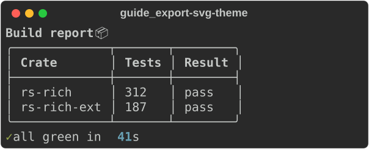
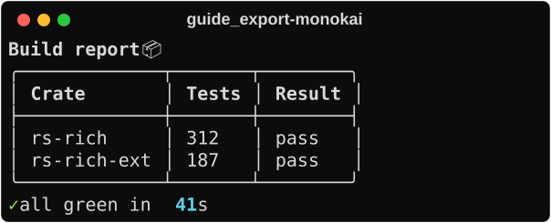
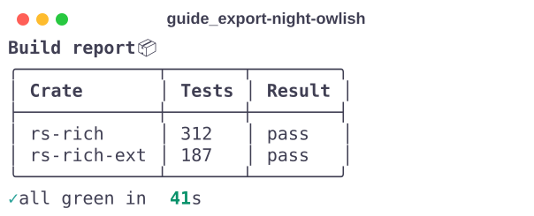

# Exporting

Anything you can print you can also save: as plain text, as an HTML page, or
as an SVG picture of a terminal window. Exports are self-contained — no
external CSS, fonts or images — and deterministic, so they diff cleanly and
work as test fixtures.

The examples use these imports and this small report:

```rust
--8<-- "crates/rich/examples/guide_export.rs:imports"
```

```rust
--8<-- "crates/rich/examples/guide_export.rs:report"
```

## Exporting a render

Each export method takes a closure, runs it with output recorded instead of
written, and returns the document:

```rust
--8<-- "crates/rich/examples/guide_export.rs:exports"
```

| Method | Produces | Upstream |
|---|---|---|
| `export_text(f)` | plain text, styles stripped | `export_text()` |
| `capture(f)` | the ANSI text a terminal would receive | `capture()` |
| `export_html(f)` | HTML with inline `style="…"` on each span | `export_html(inline_styles=True)` |
| `export_html_classes(f)` | HTML with a `<style>` block and `.r1`, `.r2` … classes | `export_html()` |
| `export_svg(title, unique_id, f)` | an SVG of a terminal window with `title` in its title bar | `export_svg(title=…, unique_id=…)` |

!!! tip "Pin the console first"

    An export captures whatever the console renders at the console's width
    and with its theme. Styles are kept even when stdout is piped (HTML and
    SVG do not depend on the colour system), but the width does depend on the
    terminal. Build the console with an explicit `width` — plus
    `force_terminal(true)` and a colour system if you also compare `capture`
    output — so the file is the same wherever the program runs.

!!! note "`unique_id` is required"

    SVG class names and ids are prefixed with `unique_id`, so several SVGs can
    share one HTML page. Upstream derives a default by hashing Python `repr()`
    output, which Rust cannot reproduce, so here you pass it. Given the same id
    and the same render, the bytes are identical to upstream's
    ([divergence #15](../../DIVERGENCES.md)).

## Terminal themes

Styles name abstract colours ("red", "the default foreground"). A
[`TerminalTheme`](https://docs.rs/rs-rich/latest/rich/terminal_theme/struct.TerminalTheme.html)
decides what RGB those become in the exported file. Every export has a
`_themed` variant:

```rust
--8<-- "crates/rich/examples/guide_export.rs:themed"
```

The same report under three of the bundled palettes:

=== "SVG_EXPORT_THEME"

    

=== "MONOKAI"

    

=== "NIGHT_OWLISH"

    

| Theme | Default for |
|---|---|
| `SVG_EXPORT_THEME` | `export_svg` |
| `DEFAULT_TERMINAL_THEME` | `export_html` (black on white) |
| `MONOKAI`, `DIMMED_MONOKAI`, `NIGHT_OWLISH` | — |

A `TerminalTheme` is a plain struct (`background`, `foreground`, and the 16
`ansi` colours as `ColorTriplet`s), so you can define your own. Truecolor and
256-colour styles are exported as-is; only the 16 standard colours and the
defaults go through the theme.

## Render once, export many

The closure-based methods render once per call. To produce the terminal
output *and* several files from a single render — which matters when the
render consumes something, like standard input — record the segments and
export them yourself:

```rust
--8<-- "crates/rich/examples/guide_export.rs:record"
```

[`export::export_html_inline`](https://docs.rs/rs-rich/latest/rich/export/fn.export_html_inline.html),
[`export::export_html_classes`](https://docs.rs/rs-rich/latest/rich/export/fn.export_html_classes.html)
and [`svg::export_svg`](https://docs.rs/rs-rich/latest/rich/svg/fn.export_svg.html)
take the segments directly. This is upstream's `Console(record=True)` plus
`save_html(clear=False)`, with the buffer handed to you instead of kept on the
console. It is also how `rich --export-html … --export-svg …` works in the
[CLI](../../cli.md).

## How the guide's screenshots are made

Every picture in this guide is an `export_svg` of the example program that
contains the snippet next to it. Each program takes an optional
`--svg DIR`; with it, each "shot" is rendered on a pinned console:

```rust
--8<-- "crates/rich/examples/guide_support/mod.rs:pinned"
```

and written to `DIR/guide_<topic>-<shot>.svg`, with the file name as the
unique id so a regenerated image only changes when the rendering does:

```rust
--8<-- "crates/rich/examples/guide_support/mod.rs:export"
```

Regenerate them all with:

```bash
for ex in console text tables layout tree progress code logging prompts export; do
    cargo run -p rs-rich --example guide_$ex -- --svg docs/media/guide
done
```

## Not yet ported

- `save_text`, `save_html`, `save_svg` — write the returned string with
  `std::fs::write`.
- `export_html(code_format=…)` and `export_svg(code_format=…)` custom
  templates, and the SVG `font_aspect_ratio` option.

## See also

- [Console and printing](console.md#capturing-output) — capture and record
- [Tutorial: the CLI's exports](../../tutorial/06-cli.md#exporting)
- API: [`Console::export_svg`](https://docs.rs/rs-rich/latest/rich/console/struct.Console.html#method.export_svg) ·
  [`export`](https://docs.rs/rs-rich/latest/rich/export/index.html) ·
  [`svg`](https://docs.rs/rs-rich/latest/rich/svg/index.html) ·
  [`terminal_theme`](https://docs.rs/rs-rich/latest/rich/terminal_theme/index.html)
