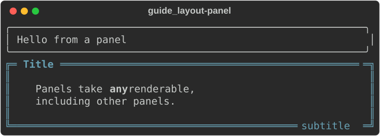
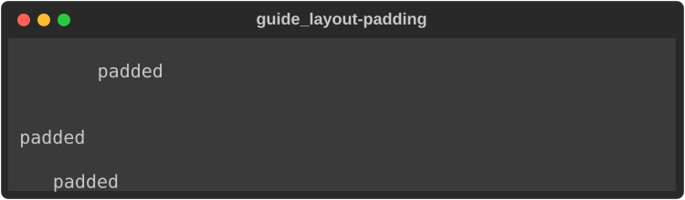
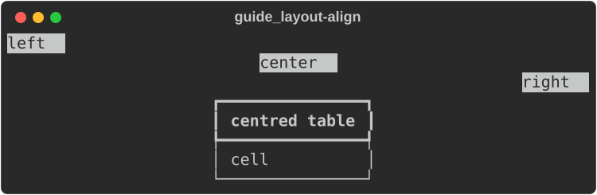
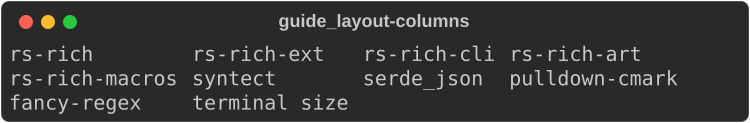
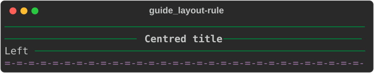
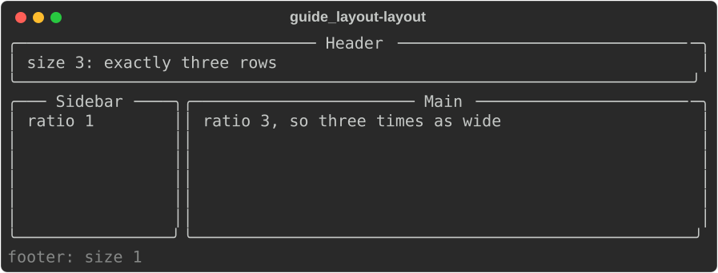
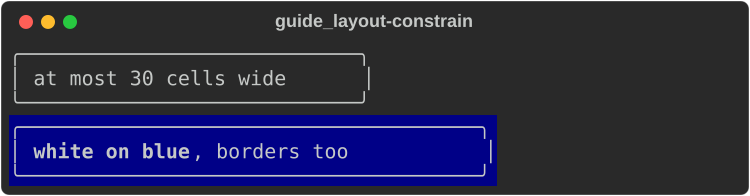

# Layout

The layout renderables arrange *other* renderables: put a border around them,
pad them, align them, place them side by side, or divide the screen into
regions. Each one wraps a child given as a `Box<dyn Renderable>`, so they nest
in any combination.

| Type | Does | Upstream |
|---|---|---|
| [`Panel`](#panel) | a border with a title | `rich.panel.Panel` |
| [`Padding`](#padding) | blank space around a child | `rich.padding.Padding` |
| [`Align`](#align) | left, centre or right within the width | `rich.align.Align` |
| [`Columns`](#columns) | items packed into as many columns as fit | `rich.columns.Columns` |
| [`Rule`](#rule) | a horizontal line with an optional title | `rich.rule.Rule` |
| [`Layout`](#layout) | split the screen into rows and columns | `rich.layout.Layout` |
| [`Constrain`](#constrain-and-styled) | cap a child's width | `rich.constrain.Constrain` |
| [`Styled`](#constrain-and-styled) | apply a style under a whole child | `rich.styled.Styled` |

The examples use these imports:

```rust
--8<-- "crates/rich/examples/guide_layout.rs:imports"
```

## Panel

```rust
--8<-- "crates/rich/examples/guide_layout.rs:panel"
```



| Method | Default | Effect |
|---|---|---|
| `title(markup)`, `subtitle(markup)` | none | text in the top and bottom border |
| `title_align(..)`, `subtitle_align(..)` | `Center` | `HorizontalAlign::Left`, `Center`, `Right` |
| `box_set(BOX)` | `ROUNDED` | the border characters ([gallery](#box-styles)) |
| `padding((top, right, bottom, left))` | `(0, 1, 0, 1)` | space between border and content |
| `border_style(Style)` | none | style of the border and title line |

A panel always fills the width it is given. For a narrower one, wrap it in
[`Constrain`](#constrain-and-styled).

## Padding

```rust
--8<-- "crates/rich/examples/guide_layout.rs:padding"
```



- `Padding::new(child, (top, right, bottom, left))` — CSS order, like upstream.
- `Padding::uniform(child, n)` and `Padding::symmetric(child, vertical, horizontal)`.
- `.style(s)` styles the padding (and the blank lines above and below).

## Align

```rust
--8<-- "crates/rich/examples/guide_layout.rs:align"
```



`Align` renders its child, then places the resulting block of lines within
the width. It works on anything narrower than the width — text, a table, a
tree. A child that fills the width (a `Panel`) has nothing to align;
`Constrain` it first.

## Columns

```rust
--8<-- "crates/rich/examples/guide_layout.rs:columns"
```



`Columns::new(Vec<String>)` fits as many columns as the width allows, filling
row by row with a one-space gap. Items are plain text (not markup). For
columns of other renderables, use [`Layout::split_row`](#layout) or a
[`Table::grid()`](tables.md#grids).

## Rule

```rust
--8<-- "crates/rich/examples/guide_layout.rs:rule"
```



- `Rule::line()` has no title; `Rule::new(markup)` has a centred one.
- `.align(HorizontalAlign::Left | Right)` moves the title.
- `.characters("=-")` repeats any string; `.style(s)` styles the line (default
  theme name: `rule.line`).

## Layout

[`Layout`](https://docs.rs/rs-rich/latest/rich/layout/struct.Layout.html)
divides a fixed-size region into rows and columns, like a tiling window
manager. A leaf holds a renderable; a branch splits its space among children.

```rust
--8<-- "crates/rich/examples/guide_layout.rs:layout"
```



- `split_column(children)` stacks children top to bottom; `split_row(children)`
  places them left to right.
- Each child takes `.size(n)` (fixed rows or cells), or a share of what is left
  by `.ratio(n)` (default 1), never less than `.minimum_size(n)` (default 1).
- Every leaf is rendered at exactly its region's width **and height**: content
  is cropped or padded to fit.
- A layout fills a height: `options.height` when set (as above, via
  `print_with`), otherwise the console's full height. Printing one with the
  default options fills the whole screen — usually what you want for a full-screen
  display, rarely what you want inline.

`Layout` is the core of a full-screen dashboard: redraw it in a
[`Live`](progress-and-live.md#live) display on each update.

## Constrain and Styled

```rust
--8<-- "crates/rich/examples/guide_layout.rs:constrain"
```



- `Constrain::new(child, Some(width))` renders the child at no more than
  `width` cells (`None` leaves it alone). It is how you get a panel, rule or
  table narrower than the terminal.
- `Styled::new(child, style)` lays `style` under every segment the child
  renders; the child's own styles still win where they are set.

## Box styles

Panels and tables draw their borders from a
[`Box`](https://docs.rs/rs-rich/latest/rich/box/struct.Box.html) — a set of
characters for each edge, corner and divider. The constants in
[`rich::r#box`](https://docs.rs/rs-rich/latest/rich/box/index.html), drawn as
small tables so the header separator shows:

```rust
--8<-- "crates/rich/examples/guide_layout.rs:boxes"
```


A panel uses only the outer edges; the head and row separators matter for
tables.

## Not yet ported

- `Panel`: `expand=False` / `Panel.fit`, `width`, `height`, `style`,
  `highlight` — use `Constrain` for width.
- `Align`: vertical alignment, `width`, `style`; `Align.center` on a `Panel`
  needs a `Constrain` first.
- `Columns`: renderable items, `equal`, `expand`, `column_first`,
  `right_to_left`, `align`, `title`, custom padding.
- `Layout`: named regions (`layout["body"]`), `visible`, `update`, and the
  placeholder drawn for an empty region (it renders blank —
  [divergence #11](../../DIVERGENCES.md)).
- `Rule`: `end`.

## See also

- [Tables](tables.md) — grids for side-by-side alignment
- [Progress and live displays](progress-and-live.md) — redraw a layout in place
- [Tutorial: layout](../../tutorial/04-layout.md)
- API: [`Panel`](https://docs.rs/rs-rich/latest/rich/panel/struct.Panel.html) ·
  [`Padding`](https://docs.rs/rs-rich/latest/rich/padding/struct.Padding.html) ·
  [`Align`](https://docs.rs/rs-rich/latest/rich/align/struct.Align.html) ·
  [`Columns`](https://docs.rs/rs-rich/latest/rich/columns/struct.Columns.html) ·
  [`Rule`](https://docs.rs/rs-rich/latest/rich/rule/struct.Rule.html) ·
  [`Layout`](https://docs.rs/rs-rich/latest/rich/layout/struct.Layout.html) ·
  [`Constrain`](https://docs.rs/rs-rich/latest/rich/constrain/struct.Constrain.html) ·
  [`Styled`](https://docs.rs/rs-rich/latest/rich/styled/struct.Styled.html)
