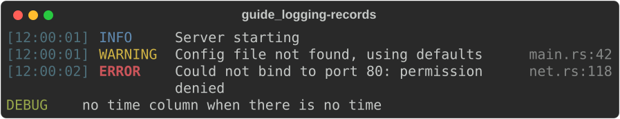
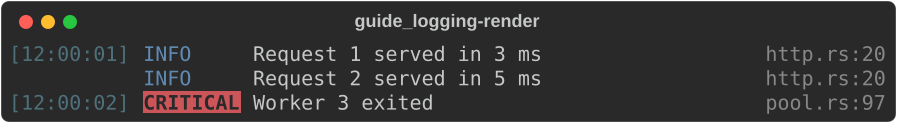
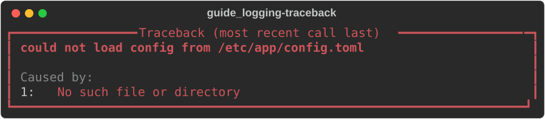
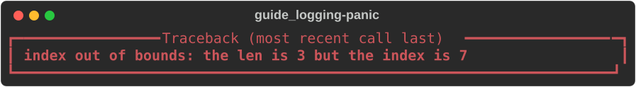

# Logging and errors

The core crate has the rendering half of upstream's logging and traceback
support:

- [`LogRecord`](#log-records) and [`LogRender`](#logrender) lay out log lines
  the way upstream's `RichHandler` and `Console.log` do: time, level, message,
  source path.
- [`Traceback`](#traceback) renders a Rust error and its chain of causes in a
  panel.

Hooking these into the [`log`](https://docs.rs/log) or
[`tracing`](https://docs.rs/tracing) ecosystems is not upstream behaviour, so
it lives in `rs-rich-ext`:
[`RichHandler`](https://docs.rs/rs-rich-ext/latest/rich_ext/log_handler/index.html).

The examples use these imports:

```rust
--8<-- "crates/rich/examples/guide_logging.rs:imports"
```

## Log records

A [`LogRecord`](https://docs.rs/rs-rich/latest/rich/log_render/struct.LogRecord.html)
is one formatted log line: a level, a message, and optionally a time and a
source location.

```rust
--8<-- "crates/rich/examples/guide_logging.rs:records"
```



- `LogLevel` has `Trace`, `Debug`, `Info`, `Warn` and `Error`. They print as
  Python's `logging` names (`WARNING`, not `WARN`) in the
  `logging.level.<name>` theme styles.
- `.time(s)` takes the time **already formatted**. The core has no clock or
  date dependency; format with `chrono`, `time` or `std::time` as you like.
- `.path(file)` and `.line(n)` fill the right-hand column.
- The message is plain text, not markup, and wraps within its column.

## LogRender

`LogRecord` is a convenience over
[`LogRender`](https://docs.rs/rs-rich/latest/rich/log_render/struct.LogRender.html),
the port of upstream's `_log_render.LogRender`. Use `LogRender` directly for a
stream of records: it remembers the last time it printed and blanks a repeated
one, as upstream does.

```rust
--8<-- "crates/rich/examples/guide_logging.rs:render"
```



| Option | Default | Effect |
|---|---|---|
| `show_time(bool)` | `true` | the time column |
| `show_level(bool)` | `false` | the level column |
| `show_path(bool)` | `true` | the path column |
| `omit_repeated_times(bool)` | `true` | blank a time equal to the previous one |
| `level_width(Option<usize>)` | `Some(8)` | fixed level width, or `None` to fit |

`render(console, message, time, level, path, line, link_path)` returns a
`Table` (a grid) for one record; print it. The message is a `Text`, so it can
be styled or built from markup. `level_text(name)` styles any level name the
way upstream's `RichHandler` does, including names the enum lacks
(`CRITICAL`). Passing `link_path` makes the path an OSC 8 `file://` link.

## Traceback

Upstream's `Traceback` renders a Python stack trace with source code. Rust
errors carry no frames, so this port's
[`Traceback`](https://docs.rs/rs-rich/latest/rich/traceback/struct.Traceback.html)
renders what a Rust error does have: its message and its
[`source()`](https://doc.rust-lang.org/std/error/trait.Error.html#method.source)
chain.

```rust
--8<-- "crates/rich/examples/guide_logging.rs:traceback"
```



`Traceback::new(&error)` takes any `&dyn Error` — including errors from
`anyhow`, `thiserror` or `std::io`. `Traceback::from_message(s)` takes a plain
string:

```rust
--8<-- "crates/rich/examples/guide_logging.rs:panic"
```



### Panics

A panic hook can render panics the same way:

```rust
--8<-- "crates/rich/examples/guide_logging.rs:hook"
```

For stack frames, capture a `std::backtrace::Backtrace` in the hook and print
it after the panel. `rs-rich-ext` can parse and render Rust, Python and Java
stack traces from text:
[`stacktrace`](https://docs.rs/rs-rich-ext/latest/rich_ext/stacktrace/index.html).

## Not yet ported

- `Console.log()` — print a `LogRecord` (or a `LogRender` row) instead.
  Upstream's automatic caller path (`log_locals`, `_stack_offset`) has no
  Rust equivalent; pass `file!()` and `line!()` yourself.
- `Traceback`'s frames, source excerpts, `show_locals`, `suppress`, `width`,
  `theme` and `install()` — see [divergence #19](../../DIVERGENCES.md).

## See also

- [Tables](tables.md) — `LogRender` returns a grid table
- [Text and style](text-and-style.md#themes) — the `log.*` and `logging.level.*` styles
- API: [`log_render`](https://docs.rs/rs-rich/latest/rich/log_render/index.html) ·
  [`Traceback`](https://docs.rs/rs-rich/latest/rich/traceback/struct.Traceback.html) ·
  [`rich_ext::RichHandler`](https://docs.rs/rs-rich-ext/latest/rich_ext/log_handler/struct.RichHandler.html)
