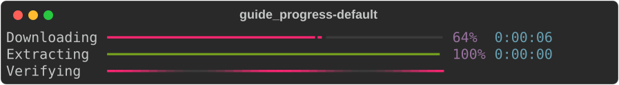
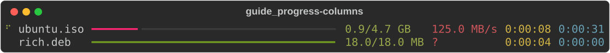
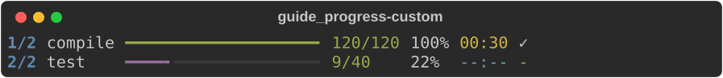
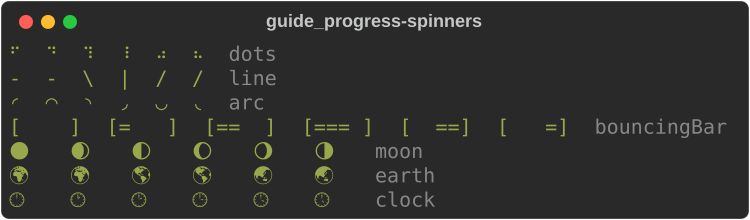
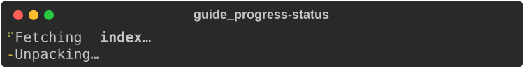

# Progress and live displays

These types show work in progress, redrawing in place instead of scrolling:

| Type | Use it for |
|---|---|
| [`track`](#the-one-liner-track) | a progress bar over an iterator, in one line |
| [`Progress`](#progress) | several tasks with bars, percentages, speeds and times |
| [`Live`](#live) | redrawing *any* renderable in place |
| [`Status`](#status-and-spinners) and [`Spinner`](#status-and-spinners) | "working on it" with an animation |
| [`ProgressBar`](#progressbar) | a bare bar to embed in your own layout |

The screenshots on this page are single frames rendered with a fixed clock;
the code runs the real animation in a terminal.

The examples use these imports:

```rust
--8<-- "crates/rich/examples/guide_progress.rs:imports"
```

## The one-liner: `track`

`rich::track` wraps an iterator and draws a live bar on stdout while you
consume it. The total comes from the iterator's exact size, if it has one.

```rust
--8<-- "crates/rich/examples/guide_progress.rs:track"
```

The display stops when the iterator is exhausted or dropped. The second half
shows `LiveProgress::track`, which adds a task to a display you already have
running.

## Progress

A [`Progress`](https://docs.rs/rs-rich/latest/rich/progress/struct.Progress.html)
holds a list of tasks and a list of columns. It is a renderable: printing it
draws one frame. To animate it, start it as a live display.

### Running it live

```rust
--8<-- "crates/rich/examples/guide_progress.rs:live_progress"
```

- `start(console, writer, refresh_per_second)` moves the progress to a
  background thread that redraws it on a timer, and returns a
  [`LiveProgress`](https://docs.rs/rs-rich/latest/rich/progress/struct.LiveProgress.html)
  handle. `writer` is usually `std::io::stdout()`; any `Write + Send` works.
- Through the handle: `add_task`, `advance`, `update`, `reset`, `refresh`,
  `track`, `wrap_read` (count bytes as they are read), `open` (a file, sized
  from its metadata) and `with(|progress| …)` for anything else.
- `stop()` draws the final frame, joins the thread and gives back the
  `Progress` and the writer. Dropping the handle stops it too.
- `.transient(true)` erases the display when it stops; `.disable(true)` shows
  nothing while tasks still update.

### Tasks

```rust
--8<-- "crates/rich/examples/guide_progress.rs:default"
```



| Method | Does |
|---|---|
| `add_task(description, total, completed)` | a started task; returns its `TaskId`. `total` is `f64` or `None` (indeterminate: the bar pulses) |
| `add_unstarted_task(…)` | a task whose clock has not started (`start_task` starts it) |
| `add_task_with(…, start, fields)` | with custom fields for format strings |
| `advance(id, amount)` | add to `completed` and record a speed sample |
| `update(id, TaskUpdate)` | change `total`, `completed`, `advance`, `description`, `visible`, fields |
| `reset(id, start, total, completed)` | start over |
| `start_task`, `stop_task`, `remove_task` | lifecycle |
| `task(id)`, `tasks()`, `finished()` | read back: each `Task` has `percentage()`, `speed()`, `elapsed()`, `time_remaining()`… |

`TaskUpdate::default().completed(100.0).description("done")` builds an
update; `.refresh(true)` makes a running display redraw immediately.

### Columns

`Progress::new()` uses upstream's default columns. Replace them with
`.columns(vec![…])`:

```rust
--8<-- "crates/rich/examples/guide_progress.rs:columns"
```



| `ProgressColumn` | Shows |
|---|---|
| `Description` | the task description (markup) |
| `Bar`, `BarWith(BarColumn)` | the bar; `BarColumn` sets width and styles |
| `Percentage` | `64%` |
| `MofN` | `9/40` |
| `TaskProgress { show_speed }` | percentage, or speed for indeterminate tasks |
| `Download`, `BinaryDownload` | `0.9/4.7 GB` (decimal or binary units) |
| `TransferSpeed` | `125.0 MB/s` |
| `FileSize`, `TotalFileSize` | completed or total as a size |
| `TimeElapsed` | `0:00:08` |
| `TimeRemaining(..)`, `time_remaining()` | estimated time left; `TimeRemainingColumn::new(compact, elapsed_when_finished)` |
| `Spinner(..)`, `spinner()` | a spinner, replaced by `finished_text` when the task completes |
| `Text(String, Style)` | fixed text |
| `TextFormat(TextColumn)` | a format string over the task |
| `Renderable(Arc<…>)` | any renderable, the same on every row |
| `WithTableColumn(..)` / `.with_table_column(ColumnOptions)` | set the grid column's width, ratio or justify |

### Format strings and custom fields

`TextColumn` expands a Python-style format string against the task, as
upstream does: `{task.description}`, `{task.completed}`,
`{task.percentage:>3.0f}`, `{task.fields[name]}`. The result is markup unless
you call `.markup(false)`.

```rust
--8<-- "crates/rich/examples/guide_progress.rs:custom"
```



### Deterministic time

Time-based columns (speed, elapsed, remaining, spinners) read the progress
clock. Replace it with `.clock(f)` — a function returning seconds — to get the
same frame every run, which is how the screenshots here are made and how you
should test progress output:

```rust
--8<-- "crates/rich/examples/guide_progress.rs:clock"
```

## Live

[`Live`](https://docs.rs/rs-rich/latest/rich/live/struct.Live.html) redraws a
renderable in place: each update moves the cursor back over the previous frame
and draws the new one. It has two modes.

**Manual:** you call `update` (or `refresh`) and each call redraws.

```rust
--8<-- "crates/rich/examples/guide_progress.rs:live"
```

**Auto-refresh:** `Live::spawn` runs the display on a background thread that
redraws on a timer; `update` sends it a new renderable. The renderable, the
console and the writer move to the thread, so they must be `Send`.

```rust
--8<-- "crates/rich/examples/guide_progress.rs:auto_live"
```

- `Live::new(renderable, console, writer)`; `.transient(true)` erases the
  display on `stop`.
- `start()` hides the cursor and draws the first frame; `stop()` draws the
  last frame and restores the cursor.
- For an auto-refreshing display, `Live::spawn_with(…, transient)` and
  [`AutoLive`](https://docs.rs/rs-rich/latest/rich/live/struct.AutoLive.html)'s
  `update`, `refresh`, `refresh_wait` and `stop`.

!!! warning "One live display at a time"

    A live display owns the cursor. Anything else printed to the same terminal
    while it runs — including from another thread — lands in the middle of its
    redraws.

!!! note "When stdout is not a terminal"

    `Live` draws nothing while running, and `stop` writes the final frame once,
    without a trailing newline (upstream's behaviour for files). Print a
    newline after `stop` if more output follows. `LiveProgress::stop` does this
    for you.

## Status and spinners

A [`Spinner`](https://docs.rs/rs-rich/latest/rich/spinner/struct.Spinner.html)
is an animation of frames; `render(seconds)` returns the frame for that
moment as a `Text`. The first call fixes the start of the animation, so keep
one spinner for the whole animation.

```rust
--8<-- "crates/rich/examples/guide_progress.rs:spinners"
```



`Spinner::new(name)` accepts every upstream spinner name (`dots`, `dots2` …
`dots12`, `line`, `arc`, `bouncingBar`, `bouncingBall`, `moon`, `earth`,
`clock`, `material`, `aesthetic` and more); an unknown name falls back to
`dots`. `.text(markup)` adds text after the frame, `.style(s)` styles the
frame, `.speed(x)` scales the rate.

A [`Status`](https://docs.rs/rs-rich/latest/rich/status/struct.Status.html) is
a spinner plus a message, styled `status.spinner`:

```rust
--8<-- "crates/rich/examples/guide_progress.rs:status"
```



A status in a `Live` animates on its own. The auto-refresh example above
renders `status.renderable().render(elapsed)` instead, to choose each frame.

!!! note "Spinners read the console clock"

    As upstream's does, a `Spinner` or `Status` renders the frame for
    `console.get_time()`, so one placed directly in a `Live` animates on
    every refresh. For reproducible output, such as tests or screenshots, pin
    the clock with `ConsoleBuilder::get_time`, or render a given moment with
    `render(elapsed_seconds)` as the examples on this page do.

## ProgressBar

[`ProgressBar`](https://docs.rs/rs-rich/latest/rich/progress_bar/struct.ProgressBar.html)
is the bar on its own — for a table cell, a panel, or your own renderable.

```rust
--8<-- "crates/rich/examples/guide_progress.rs:bars"
```


`ProgressBar::new(total, completed)`, `.width(n)` (default: the full width),
`.style`, `.complete_style`, `.finished_style`, `.pulse_style`, `.pulse(true)`
and `ProgressBar::indeterminate()`; `.animation_time(t)` picks the pulse frame.

## Not yet ported

- `Console.status()` / `with console.status(...)`: create a `Status` and drive
  it with `Live` as shown above.
- `Live`: `screen=True` (alternate screen), `redirect_stdout`/`redirect_stderr`,
  `vertical_overflow`, and `get_renderable` callbacks.
- `Progress`: `console.print` through the display (`progress.console`), and
  `redirect_stdout`.

## See also

- [Layout](layout.md) — build a dashboard to redraw with `Live`
- [Tutorial: progress and live output](../../tutorial/05-live.md)
- API: [`progress`](https://docs.rs/rs-rich/latest/rich/progress/index.html) ·
  [`track`](https://docs.rs/rs-rich/latest/rich/progress/fn.track.html) ·
  [`Live`](https://docs.rs/rs-rich/latest/rich/live/struct.Live.html) ·
  [`Status`](https://docs.rs/rs-rich/latest/rich/status/struct.Status.html) ·
  [`Spinner`](https://docs.rs/rs-rich/latest/rich/spinner/struct.Spinner.html) ·
  [`ProgressBar`](https://docs.rs/rs-rich/latest/rich/progress_bar/struct.ProgressBar.html)
