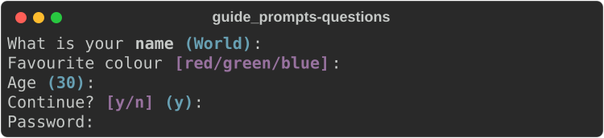
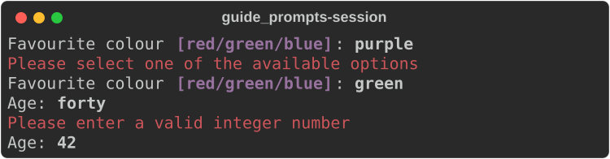

# Prompts

[`rich::prompt`](https://docs.rs/rs-rich/latest/rich/prompt/index.html) asks
the user a question on the terminal, validates the answer, and asks again
until it gets a valid one.

| Type | Returns | Accepts |
|---|---|---|
| `Prompt` | `String` | any text, or one of a list of choices |
| `Confirm` | `bool` | `y` or `n`, any case |
| `IntPrompt` | `i64` | a whole number |
| `FloatPrompt` | `f64` | a number |

The prompts are not re-exported at the crate root:

```rust
--8<-- "crates/rich/examples/guide_prompts.rs:imports"
```

## Asking

```rust
--8<-- "crates/rich/examples/guide_prompts.rs:ask"
```

- `ask(&console, default)` writes the question, reads a line from standard
  input, and returns `std::io::Result<T>`. An empty answer returns the
  default, when there is one.
- End of input (stdin closed, `Ctrl-D`) returns the default — or the type's
  zero value (`""`, `false`, `0`) when there is none — instead of looping.
- An invalid answer prints a message and asks again.

This page has no screenshot of `ask` itself — it waits for a keyboard.
The pictures below show the same questions rendered through the API that
`ask` uses.

## What the user sees

The question is console markup, followed by the choices in
`prompt.choices` style, the default in `prompt.default` style, and `: `.
`make_prompt` returns that line as a `Text` without asking anything:

```rust
--8<-- "crates/rich/examples/guide_prompts.rs:questions"
```



| Option | On | Effect |
|---|---|---|
| `choices([...])` | `Prompt` | only these answers are accepted; shown as `[a/b/c]` |
| `case_sensitive(false)` | `Prompt` | match choices in any case; returns the choice as spelled in the list |
| `show_choices(false)` | `Prompt`, `Confirm` | hide `[a/b/c]` but still enforce it |
| `show_default(false)` | all | hide `(default)` but still use it |

A rejected answer is reported in the `prompt.invalid` or
`prompt.invalid.choice` style, and the question is asked again:



## Without a keyboard

Every `ask` has an `ask_from` twin that reads from an
[`InputSource`](https://docs.rs/rs-rich/latest/rich/prompt/trait.InputSource.html)
instead of stdin. `ScriptedInput` replays a list of lines, so the whole loop —
defaults, rejections, re-asking — runs in a test:

```rust
--8<-- "crates/rich/examples/guide_prompts.rs:scripted"
```

Implement `InputSource` (one method, `read_line`) to read from anything else:
a socket, a GUI field, a file of answers.

To test only the validation, call `process_response`, which does no I/O at all:

```rust
--8<-- "crates/rich/examples/guide_prompts.rs:validate"
```

## Gotchas

- **No hidden input.** Upstream's `password=True` (no echo) is not ported;
  read secrets with a crate such as `rpassword`.
- **`IntPrompt` is `i64`, `FloatPrompt` is `f64`.** Convert and range-check
  after asking; there is no custom validator hook.

## See also

- [Console and printing](console.md) — the console a prompt writes to
- [Text and style](text-and-style.md#themes) — restyle `prompt.*` names in a theme
- API: [`prompt`](https://docs.rs/rs-rich/latest/rich/prompt/index.html) ·
  [`Prompt`](https://docs.rs/rs-rich/latest/rich/prompt/struct.Prompt.html) ·
  [`Confirm`](https://docs.rs/rs-rich/latest/rich/prompt/struct.Confirm.html) ·
  [`IntPrompt`](https://docs.rs/rs-rich/latest/rich/prompt/struct.IntPrompt.html) ·
  [`ScriptedInput`](https://docs.rs/rs-rich/latest/rich/prompt/struct.ScriptedInput.html)
