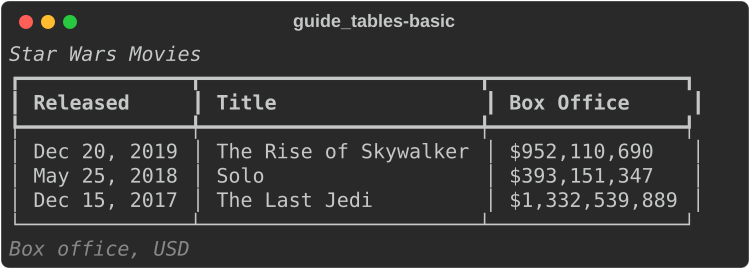
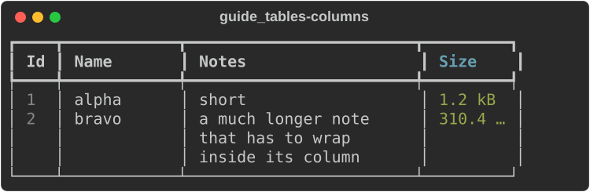
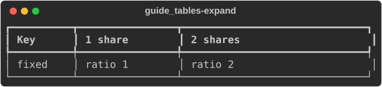
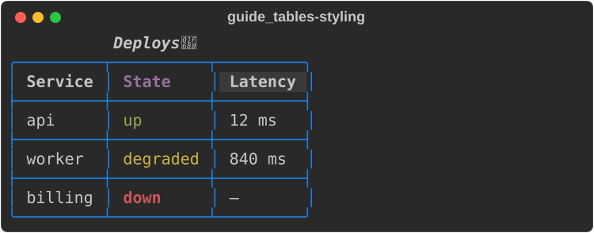
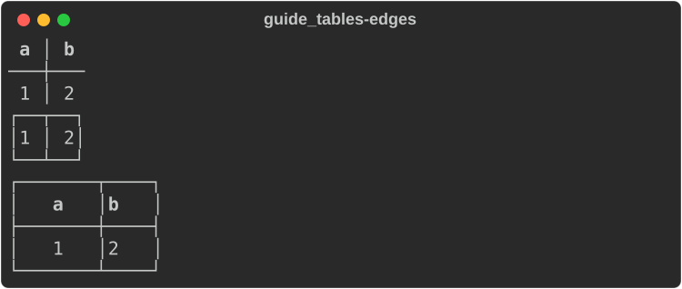
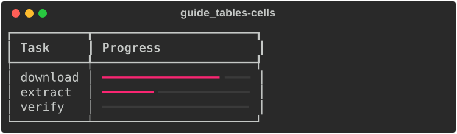
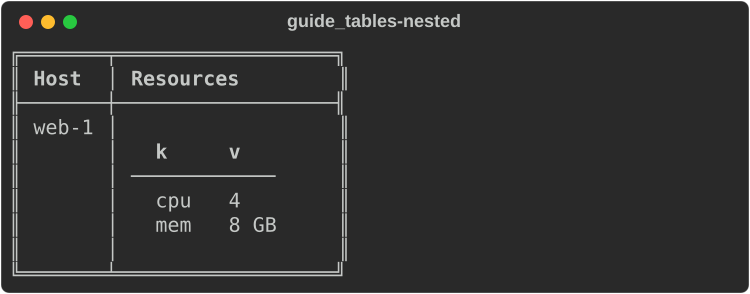
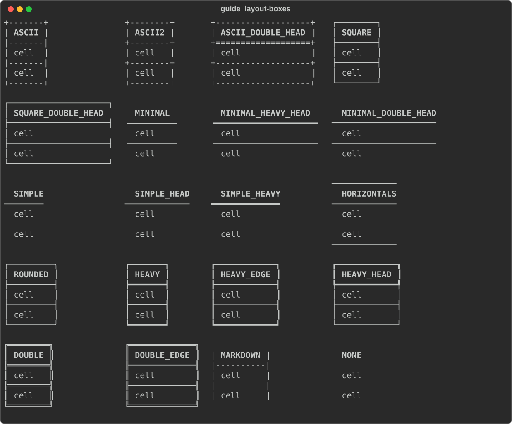

# Tables

[`Table`](https://docs.rs/rs-rich/latest/rich/table/struct.Table.html) lays
out rows and columns inside a box. Columns size themselves to their content,
wrap when the terminal is too narrow, and can be justified, styled, fixed or
flexed. Use a table for anything with rows — and, with `Table::grid()`, for
aligning things side by side without borders.

The examples use these imports:

```rust
--8<-- "crates/rich/examples/guide_tables.rs:imports"
```

## A first table

Add columns, then rows. A row is a slice of strings, one per column.

```rust
--8<-- "crates/rich/examples/guide_tables.rs:basic"
```



- `title` sits above the table and `caption` below, both centred. Both are
  console markup.
- Missing cells render empty; extra cells are ignored.
- The default box is `HEAVY_HEAD`, the header is bold, and cells have one
  space of padding left and right — upstream's defaults.

!!! note "Plain `&str` cells are markup"

    As upstream does, `add_row(&["[b]x[/b]"])` renders `x` in bold, and so do
    headers passed to `add_column`. Cells are parsed when the table renders,
    with emoji codes and highlighting where the table or column enables it.
    For data that must stay literal, such as file names or user input, pass
    `Text` values with `add_row_text` or `add_column_text`; a `Text` is never
    re-parsed.

## Columns

Every `add_column*` call returns `&mut Table`, and the `column_*` setters
change **the most recently added column**, so you configure a column by
chaining onto the call that created it. `add_column_with` takes everything at
once in a
[`ColumnOptions`](https://docs.rs/rs-rich/latest/rich/table/struct.ColumnOptions.html),
the equivalent of upstream's `add_column(header, **kwargs)`.

```rust
--8<-- "crates/rich/examples/guide_tables.rs:columns"
```



| Setter | `ColumnOptions` field | Effect |
|---|---|---|
| `add_column_justify(h, j)` | `justify` | `Left` (default), `Center`, `Right`, `Full` |
| `column_width(n)` | `width` | a fixed content width |
| `column_min_width(n)` | `min_width` | never narrower than `n` |
| `column_max_width(n)` | `max_width` | never wider than `n`; longer content wraps |
| `column_ratio(n)` | `ratio` | share of the spare width when the table expands |
| `column_no_wrap()` | `no_wrap` | one line per cell; over-long text is cut |
| `column_overflow(o)` | `overflow` | `Ellipsis` (default for cells), `Fold`, `Crop` |
| `column_style(s)` | `style` | style of the body cells |
| `column_header_style(s)` | — | style of the header text |
| `column_header_fill(s)` | — | style of the whole header cell, padding included |

`add_column_text(Text, Justify)` takes a styled header.

### Sizing and `expand`

Without `expand`, a table is as wide as its content needs, up to the console
width; past that, columns shrink and their cells wrap. With `.expand(true)` it
fills the width, and the spare space goes to the columns with a `ratio`, in
proportion:

```rust
--8<-- "crates/rich/examples/guide_tables.rs:expand"
```



## Styling

```rust
--8<-- "crates/rich/examples/guide_tables.rs:styling"
```



| Table method | Effect |
|---|---|
| `box_set(BOX)` | the border characters — see the [box gallery](#box-styles) |
| `border_style(s)` | style of the border and dividers |
| `style(s)` | base style of the whole table (the border sits on top of it) |
| `show_lines(true)` | a separator between every row |
| `show_header(false)` | no header row |
| `show_edge(false)` | no outer border |
| `pad_edge(false)` | no padding on the outer sides of the first and last column |
| `padding(top, right, bottom, left)` | cell padding (default `0, 1, 0, 1`) |
| `collapse_padding(true)` | adjacent cells share their padding |
| `expand(true)` | fill the width |
| `title(markup)`, `caption(markup)` | text above and below |

`add_row_text(Vec<Text>)` takes one styled `Text` per cell. A cell's own
`justify`, `overflow` and `no_wrap` override the column's.

The edge and padding options side by side:

```rust
--8<-- "crates/rich/examples/guide_tables.rs:edges"
```



## Renderables in cells

A cell can hold any renderable that is `Send + Sync`: another table, a
`ProgressBar`, a `Syntax` block, your own type. Wrap it in
`Cell::Renderable(Arc::new(…))` and add the row with `add_row_cells`;
`Cell::from("text")` and `Cell::from(text)` make ordinary cells.

```rust
--8<-- "crates/rich/examples/guide_tables.rs:cells"
```



### Nested tables

```rust
--8<-- "crates/rich/examples/guide_tables.rs:nested"
```



A cell's width comes from measuring its content, and a nested `Table`,
`Tree` or `Padding` measures by its own content, as upstream's do. A `Panel`
fills the width it is given unless it is built with `Panel::fit`.

!!! note "Not every renderable can be a cell"

    `Cell::Renderable` needs `Send + Sync`. `Panel`, `Padding`, `Align`,
    `Constrain`, `Styled` and `Layout` hold a plain `Box<dyn Renderable>` and
    are neither, so they cannot go in a cell. `Table`, `Text`, `Tree`,
    `Columns`, `Rule`, `ProgressBar`, `Syntax`, `Markdown`, `Json` and `Pretty`
    can.

## Grids

`Table::grid()` is a table with no box, no header, no edge and no padding —
a tool for aligning things in columns:

```rust
--8<-- "crates/rich/examples/guide_tables.rs:grid"
```


Add `.padding(0, 1, 0, 0)` for a gap between columns. Grids are how the
progress display and log records are laid out internally.

## Box styles

Pass any constant from
[`rich::r#box`](https://docs.rs/rs-rich/latest/rich/box/index.html) to
`box_set`. `HEAVY_HEAD` is the default; `ROUNDED` and `SIMPLE_HEAD` are common
choices; `MARKDOWN` produces a Markdown table.



On a legacy Windows console the fancy boxes fall back to `SQUARE`, and with
`Console::builder().ascii_only(true)` every box is drawn in ASCII.

## Not yet ported

- Footers (`show_footer`, `Column.footer`).
- Alternating row styles (`row_styles`), per-row `style`/`end_section`, and
  `add_section`.
- `title_style`, `caption_style`, `title_justify`, `caption_justify`,
  `header_style` on the table, `min_width`/`width` on the table.

## See also

- [Layout](layout.md) — panels, columns and alignment around tables
- [Tutorial: tables](../../tutorial/03-tables.md)
- API: [`Table`](https://docs.rs/rs-rich/latest/rich/table/struct.Table.html) ·
  [`ColumnOptions`](https://docs.rs/rs-rich/latest/rich/table/struct.ColumnOptions.html) ·
  [`Cell`](https://docs.rs/rs-rich/latest/rich/table/enum.Cell.html) ·
  [`box`](https://docs.rs/rs-rich/latest/rich/box/index.html)
