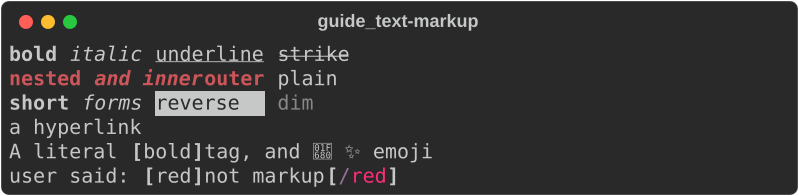
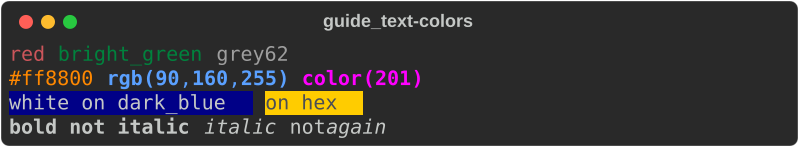
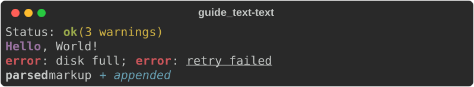
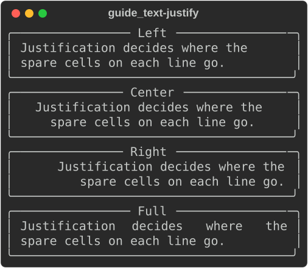
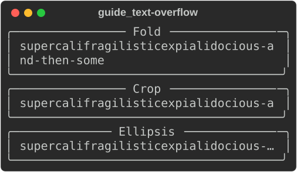
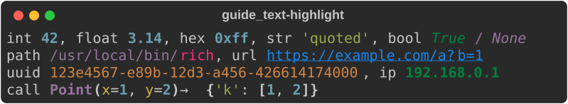
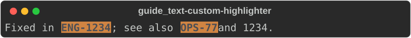

# Text and style

Styled output is built from three pieces:

- a [`Style`](https://docs.rs/rs-rich/latest/rich/style/struct.Style.html) —
  colours plus attributes such as bold or underline;
- a [`Text`](https://docs.rs/rs-rich/latest/rich/text/struct.Text.html) — a
  plain string with styles applied to ranges of it (spans);
- **console markup** — the `[bold red]…[/]` syntax, a compact way to write a
  `Text`.

Use markup for strings you write in code, `Text` when you build output
programmatically, and `Style` when you need a style as a value.

## Markup

`console.print_str` parses markup. So do panel and table titles, rule titles,
spinner and status text, and prompt questions.

```rust
--8<-- "crates/rich/examples/guide_text.rs:markup"
```



The rules:

| Write | Meaning |
|---|---|
| `[bold red]…[/]` | open a style; `[/]` closes the most recent tag |
| `[bold]…[/bold]` | close a tag by name; tags nest, and names are normalised so `[b]…[/bold]` matches |
| `[link=https://…]…[/link]` | an OSC 8 hyperlink (clickable in terminals that support it) |
| `\[` | a literal `[` |
| `:rocket:` | an emoji shortcode (turn off with `Console::builder().emoji(false)`) |
| `[danger]…[/]` | a style *name*, looked up in the console's [theme](#themes) |

A `[` that could not start a tag (`[1, 2]`) is left alone. An unknown style
name renders unstyled, as upstream does; a closing tag with nothing to close is
an error.

!!! warning "Escape text you did not write"

    `rich::markup::escape(s)` backslash-escapes anything in `s` that would parse
    as a tag. Use it for file names, user input, error messages — anything that
    might contain `[`.

`Text::from_markup(&str)` parses markup into a `Text` without a console, and
returns a `Result` — use it when a markup mistake should be an error.
`console.print_str` is lenient instead: malformed markup is printed as-is
(`try_print_str` reports it).

## Styles and colours

A style definition is a space-separated list of words — the same grammar
inside a markup tag and in `Style::parse`.

```rust
--8<-- "crates/rich/examples/guide_text.rs:colors"
```



| Part | Examples |
|---|---|
| Attributes | `bold` `dim` `italic` `underline` `blink` `blink2` `reverse` `conceal` `strike` `underline2` `frame` `encircle` `overline` |
| Short forms | `b` `d` `i` `u` `r` `c` `s` `uu` `o` |
| Negation | `not bold`, `not i` — explicitly off, which beats an inherited `bold` |
| Named colour | `red`, `bright_green`, `grey62`, `dark_blue` — the 256 standard names |
| Hex | `#ff8800` |
| RGB | `rgb(255,136,0)` |
| 256-palette | `color(208)` |
| Background | `on blue`, `white on #202020` |
| Link | `link https://example.com` |
| Nothing | `none` |

### `Style` values

```rust
--8<-- "crates/rich/examples/guide_text.rs:style"
```

- `Style::parse` returns `Err` for a definition it does not understand.
- `a.combine(&b)` layers `b` over `a`; `definition()` turns a style back into
  its text form.
- [`Color`](https://docs.rs/rs-rich/latest/rich/color/struct.Color.html) has
  `parse`, `from_rgb`, `from_ansi`, `get_truecolor` and `downgrade`. You rarely
  downgrade by hand: the console converts every colour to the terminal's
  [`ColorSystem`](https://docs.rs/rs-rich/latest/rich/color/enum.ColorSystem.html)
  (16, 256 or truecolor) as it writes.

## `Text`

A `Text` is a string plus spans. Build it up, style ranges, then print it — or
pass it to anything that takes a renderable.

```rust
--8<-- "crates/rich/examples/guide_text.rs:text"
```



| Method | Does |
|---|---|
| `Text::new(s)` | plain text; **never parses markup** |
| `Text::styled(s, style)` | text with a base style (a `Style` or a style name) |
| `Text::from_markup(s)` | parse markup |
| `append(s, Some(style))` | add a run, optionally styled |
| `append_text(&other)` | add another `Text`, keeping its styles (consumes and returns `self`) |
| `stylize(style, start, end)` | style a **byte** range |
| `highlight_words(&[..], style, case_sensitive)` | style every occurrence of some words |
| `highlight_regex(pattern, style, prefix)` | style every match; named groups get the style `prefix + name` |
| `justify(..)`, `overflow(..)`, `no_wrap(..)` | layout, see below |
| `plain()`, `spans()`, `cell_len()` | inspect |

Anywhere a style is accepted you can pass a `Style` or a `&str`. A string is a
*style name* (or definition) resolved when the text is rendered, against the
theme of the console doing the rendering.

!!! note "Offsets are bytes"

    `stylize` and `Span` use byte offsets into `plain()`, not character
    indices. For ASCII they are the same; for other text, compute offsets with
    `str::find` or `char_indices` ([divergence #3](../../DIVERGENCES.md)).

### Justify, overflow and wrapping

`Justify` decides where spare cells go on each line: `Left`, `Center`,
`Right` or `Full` (stretch the gaps; the last line stays left).

```rust
--8<-- "crates/rich/examples/guide_text.rs:justify"
```



`Overflow` decides what happens to a word that is wider than the line:
`Fold` (the default) breaks it, `Crop` cuts it, `Ellipsis` cuts it and adds
`…`, `Ignore` leaves it alone. `no_wrap(true)` keeps each line on one line, so
the overflow method applies to the whole line.

```rust
--8<-- "crates/rich/examples/guide_text.rs:overflow"
```



A `Text`'s own justify and overflow apply inside containers (panels, table
cells). A `Text` printed directly uses the print's options instead — see
[per-print options](console.md#per-print-options).

## Emoji

Markup expands `:name:` shortcodes — `:rocket:` 🚀, `:sparkles:` ✨,
`:package:` 📦 — before parsing tags. `rich::emoji::replace(s)` does the same
for any string. Disable it per console with `.emoji(false)`.

## Highlighting

A console runs a **highlighter** over every string printed with `print_str`.
The built-in
[`ReprHighlighter`](https://docs.rs/rs-rich/latest/rich/highlighter/struct.ReprHighlighter.html)
colours what looks like code: numbers, strings, booleans, `None`, paths, URLs,
UUIDs, IP addresses, call syntax.

```rust
--8<-- "crates/rich/examples/guide_text.rs:highlight"
```



It is on by default, as upstream. `Console::builder().highlight(false)` turns
it off. Explicit markup always wins over the highlighter: `[green]42[/]` is
green.

### Your own highlighter

[`RegexHighlighter::new(prefix, patterns)`](https://docs.rs/rs-rich/latest/rich/highlighter/struct.RegexHighlighter.html)
styles each **named group** of each pattern with the style name
`prefix + group`. Register it on the console, and give the name a style in the
theme:

```rust
--8<-- "crates/rich/examples/guide_text.rs:custom_highlighter"
```



- Patterns use [`fancy-regex`](https://docs.rs/fancy-regex) syntax, so
  lookaround works.
- For anything a regex cannot express, implement the
  [`Highlighter`](https://docs.rs/rs-rich/latest/rich/protocol/trait.Highlighter.html)
  trait: one method, `highlight(&self, text: &mut Text)`, that adds spans.
- Registered highlighters run **before** the built-in `ReprHighlighter`, and
  later spans win where they overlap, so repr styles (numbers, for one) paint
  over yours. The screenshot above was taken on a console built with
  `.highlight(false)` for that reason.
  Adding highlighters is this port's plugin seam; upstream takes a single
  `highlighter=` instead (see [Extending](../../PLUGINS.md)).
- `ISO8601Highlighter` (dates and times) ships too.

## Themes

A [`Theme`](https://docs.rs/rs-rich/latest/rich/theme/struct.Theme.html) maps
style names to styles. Every built-in renderable styles itself through names —
`repr.number`, `rule.line`, `table.header`, `bar.complete`,
`logging.level.error`, `prompt.choices` and about 150 more — so a theme
restyles all of them at once, and adds names for your own markup.

```rust
--8<-- "crates/rich/examples/guide_text.rs:theme"
```


- `Theme::default_theme()` is upstream's default set; `Theme::new()` is empty.
- `Theme::from_styles([(name, definition), …], inherit)` builds one from
  pairs, like upstream's `Theme({...})`; `inherit = true` starts from the
  defaults.
- `theme.names()` lists every name; `theme.get(name)` looks one up.

### The theme stack

A console keeps a stack of themes, as upstream does. `use_theme` pushes one
until the returned guard is dropped; print through the guard while it lives.

```rust
--8<-- "crates/rich/examples/guide_text.rs:theme_stack"
```

### Theme files

Upstream's theme file format (an INI `[styles]` section) loads unchanged, so a
theme shared with Python rich users works here too:

```rust
--8<-- "crates/rich/examples/guide_text.rs:theme_file"
```

## Not yet ported

- `Text` methods for which Rust has other idioms (`Text.assemble`,
  `Text.from_ansi`) — use `append`/`append_text`, and
  [`AnsiDecoder`](https://docs.rs/rs-rich/latest/rich/ansi/struct.AnsiDecoder.html)
  to turn ANSI output back into `Text`.
- Upstream's `Style(bold=True, color="red")` keyword constructor: use
  `Style::parse("bold red")` or `Style::from_color`.

## See also

- [Console and printing](console.md) — where markup gets printed
- [Tutorial: markup and style](../../tutorial/02-markup.md)
- [Extending](../../PLUGINS.md) — highlighters as plugins
- API: [`Text`](https://docs.rs/rs-rich/latest/rich/text/struct.Text.html) ·
  [`Style`](https://docs.rs/rs-rich/latest/rich/style/struct.Style.html) ·
  [`Color`](https://docs.rs/rs-rich/latest/rich/color/struct.Color.html) ·
  [`markup`](https://docs.rs/rs-rich/latest/rich/markup/index.html) ·
  [`Theme`](https://docs.rs/rs-rich/latest/rich/theme/struct.Theme.html) ·
  [`highlighter`](https://docs.rs/rs-rich/latest/rich/highlighter/index.html)
