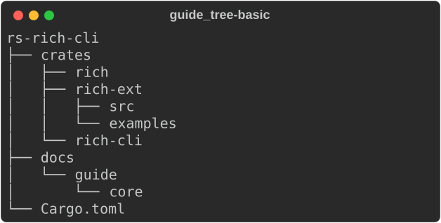
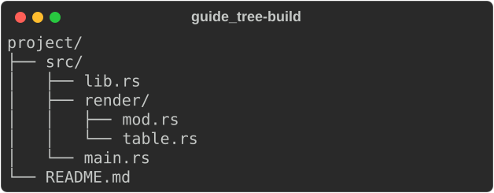
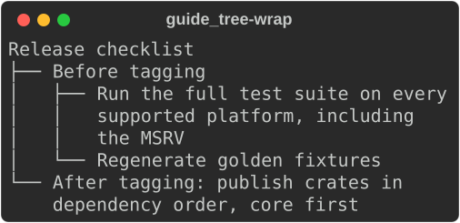
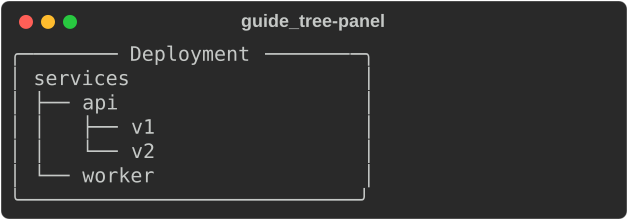

# Tree

[`Tree`](https://docs.rs/rs-rich/latest/rich/tree/struct.Tree.html) draws a
hierarchy with guide lines — a directory listing, a dependency graph, a
nested configuration. Each node has a label and any number of children.

```rust
use rich::{Console, Tree};
```

## Building a tree

`Tree::new(label)` makes the root. `add(label)` appends a child and returns
`&mut Tree` for it, so you descend by binding the result:

```rust
--8<-- "crates/rich/examples/guide_tree.rs:basic"
```



- Chaining `add` goes one level deeper each time:
  `tree.add("docs").add("guide").add("core")`.
- To add siblings, keep the parent's `&mut Tree` in a variable and call `add`
  on it repeatedly. Each child borrows the parent mutably, so finish with one
  branch before starting the next — or build recursively, as below.

## Building from data

A recursive function that takes `&mut Tree` maps any nested structure onto a
tree:

```rust
--8<-- "crates/rich/examples/guide_tree.rs:build"
```



## Long labels

Labels wrap to the available width, and continuation lines keep the guides
of their branch:

```rust
--8<-- "crates/rich/examples/guide_tree.rs:wrap"
```



## Trees inside other renderables

A `Tree` is a renderable like any other: put it in a panel, a table cell or a
layout region.

```rust
--8<-- "crates/rich/examples/guide_tree.rs:panel"
```



A tree reports the full available width when measured (see
[measuring](console.md#measuring)), so in a table cell pin the column with
`column_width`. `Align::center` works as expected: it aligns the block of
lines the tree actually draws.

## Not yet ported

This port covers upstream's default tree: thin guides and plain-text labels.
Not yet available:

- `guide_style` and the bold, double and ASCII guide sets.
- Labels as renderables or markup (`Tree("[bold]root")`, `tree.add(Panel(…))`)
  — labels are plain text; `[b]` shows literally.
- `style`, `highlight`, `hide_root` and `expanded=False`.

## See also

- [Layout](layout.md) — panels and constraints around a tree
- [Tutorial: layout](../../tutorial/04-layout.md#trees)
- API: [`Tree`](https://docs.rs/rs-rich/latest/rich/tree/struct.Tree.html)
