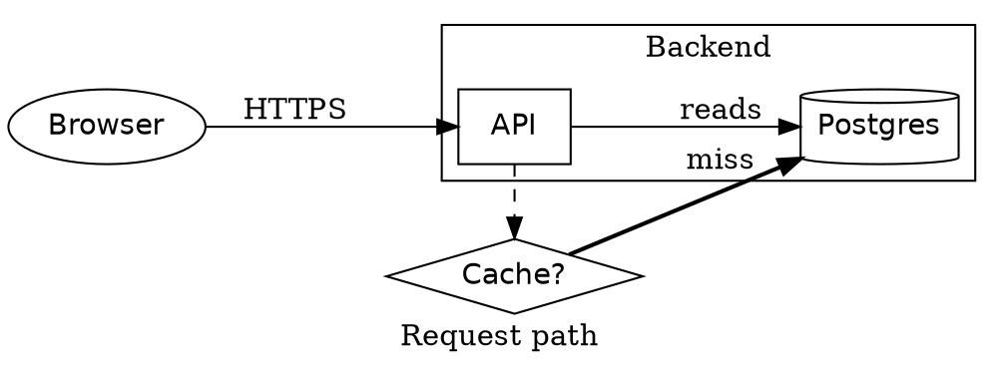

# Diagrams (rs-rich-diagram)

`rs-rich-diagram` (`rich_diagram`, new in 0.0.15) draws graphs in the
terminal: a graph model, a layered layout, and a `Diagram` renderable that
draws the result with box-drawing characters, or ASCII. It also reads DOT
(Graphviz) sources natively ([below](#dot-graphviz)). `rich` draws no
graphs, so this crate is an rs-rich addition, not a port; it depends on core
`rs-rich` only, and core is unchanged.

The layout is the one [`rs-rich-mermaid`](https://crates.io/crates/rs-rich-mermaid)
has drawn flowcharts with since 0.0.12, lifted out so that every diagram
source draws the same way. A Mermaid flowchart is now converted into a
`rich_diagram::Graph` and drawn here, and a graph built in code draws exactly
as the equivalent Mermaid source does.

## Building a graph in code

`Graph`'s builder chains. `node` and `edge` add items; `label` changes
whichever was added last, `shape` the last node, and `stroke`, `heads` and
`min_length` the last edge. An edge to an id with no node yet adds one,
labelled with its id.

```rust
use rich::Console;
use rich_diagram::{Diagram, Direction, Graph, Shape, Stroke};

let graph = Graph::new(Direction::TopDown)
    .node("web", "Browser").shape(Shape::Round)
    .node("api", "API")
    .node("db", "Postgres").shape(Shape::Cylinder)
    .node("jobs", "Job queue")
    .node("worker", "Worker").shape(Shape::Subroutine)
    .edge("web", "api").label("HTTPS")
    .edge("api", "db").label("reads")
    .edge("api", "jobs").stroke(Stroke::Dotted)
    .edge("jobs", "worker")
    .edge("worker", "db").stroke(Stroke::Thick).label("writes");

Console::new().print(&Diagram::new(graph));
```

`cargo run -p rs-rich-diagram --example services` prints:

```text
      ╭─────────╮
      │ Browser │
      ╰────┬────╯
           │
         HTTPS
           ▼
        ┌─────┐
        │ API │
        └─┬─┬─┘
          ┆ │
      ┌┄┄┄┘ └──┐
      ▼        │
┌───────────┐  │
│ Job queue │  │
└─────┬─────┘  │
      │        │
      ▼        │
┌┬─────────┬┐  │
││ Worker  ││  │
└┴────┬────┴┘  │
      ┃        │
      └━━━┐ ┌──┘
   writes ┃ │ reads
          ▼ ▼
     ╭───────────╮
     │ Postgres  │
     ╰───────────╯
```

`Graph::from_parts(direction, nodes, edges)` takes finished `Node`s and
`Edge`s instead, as a parser builds them.

## The model

- **Direction**: `TopDown`, `BottomUp`, `LeftRight` or `RightLeft`.
- **Nodes**: an id, a label (`\n` breaks a line) and a `Shape`: `Rect`,
  `Round`, `Stadium`, `Subroutine`, `Cylinder`, `Circle`, `DoubleCircle`,
  `Asymmetric` (a flag), `Rhombus` (a decision diamond), `Hexagon`,
  `Parallelogram`, `ParallelogramAlt`, `Trapezoid` and `TrapezoidAlt`. Each
  is a box whose corners and sides suggest the shape.
- **Edges**: a source and a target, an optional label, a `Stroke` (`Solid`,
  `Thick`, `Dotted`, or `Invisible`: laid out but not drawn), a `Head` at each
  end (`None`, `Arrow`, `Circle`, `Cross`), and a minimum number of ranks to
  span (at most 10). `edge` adds an arrow; `link` adds an undirected edge,
  with no heads; `heads(Head::Arrow, Head::Arrow)` makes it two-way.

Clusters (subgraph frames) are not drawn yet: the layout lays every node out
in one graph, as Mermaid's subgraphs always have been. DOT clusters are
parsed and listed in a note under the drawing.

Two more sources draw through this layout from the CLI: `rich deps --graph`
(Cargo dependencies) and DOT. See
[Dependency graphs and JSON Schemas](../ext/sources.md) for `rich deps` and
`rich schema`.

## The layout

`rich_diagram::draw(&graph, ascii)` returns a `Drawing`: plain lines of text
and their width. The layout is layered (Sugiyama-style):

1. cycles are broken by reversing the edges a depth-first search finds going
   back, and nodes are ranked by longest path;
2. edges spanning several ranks get one-cell dummy points;
3. each rank is ordered by barycentre sweeps, keeping the order with the
   fewest crossings;
4. nodes are placed along the rank by averaging their neighbours' centres;
5. every edge is routed orthogonally, with its own port on a node and its own
   track in the gap between two ranks.

A self-loop is marked `↻` (`@` in ASCII). The layout refuses graphs needing
more than 5000 points (nodes, plus one per rank a long edge crosses) and
drawings over 2 million cells; `Diagram` shows a one-line note instead.

## Width and ASCII

The layout takes no width: a drawing is as wide as the graph needs. `Diagram`
measures to that width, so it sits in a `Table` cell, a `Panel` or
`Columns` like any renderable, and given less it **crops**: each line is cut
at the right edge and rows left empty are dropped. The output never exceeds
the width it is given, and the same graph at the same width always crops the
same way. `Diagram::drawing` gives the whole drawing when you want to scroll
or page it instead. (Mermaid adds a note saying how much it cropped; the
lines above the note are the same.)

ASCII follows the console (`Console::ascii_only`, set for a non-UTF
encoding) unless you choose with `Diagram::ascii(true)`. The same graph, with
`cargo run -p rs-rich-diagram --example services -- 80 ascii`:

```text
      .---------.
      | Browser |
      '----+----'
           |
         HTTPS
           v
        +-----+
        | API |
        +-+-+-+
          : |
      +...+ +--+
      v        |
+-----------+  |
| Job queue |  |
+-----+-----+  |
      |        |
      v        |
++---------++  |
|| Worker  ||  |
++----+----++  |
      |        |
      +===+ +--+
   writes | | reads
          v v
     .-----------.
     | Postgres  |
     '-----------'
```

Labels have their control characters removed before drawing, so a label
from untrusted input cannot reach the terminal as an escape sequence.

## DOT (Graphviz)

`rich_diagram::dot` reads the DOT people write by hand and draws it through
the same layout, natively: no Graphviz needed.

```rust
use rich::Console;
use rich_diagram::Dot;

let source = std::fs::read_to_string("services.dot").unwrap();
Console::new().print(&Dot::new(source));
```

`dot::parse(source)` gives the `DotGraph` instead: the `Graph`, whether it is
directed and `strict`, its name and `label`, its clusters, and notes on what
was accepted but is not drawn.

**Supported:**

- `graph` and `digraph`, optionally `strict` (repeated edges merge into one),
  named or not;
- node statements (`a [label="A", shape=box]`) and edge statements, chains
  included (`a -> b -> c`), with `{ … }` groups as endpoints
  (`a -> { b c }`);
- attribute lists, and `node [ … ]`, `edge [ … ]` and `graph [ … ]` defaults,
  scoped to the subgraph they are set in. Nodes take `label` (`\n`, `\l` and
  `\r` break lines; `\N` is the node's name) and `shape`; edges take `label`,
  `style` (`dashed`/`dotted` draw dotted, `bold` thick, `invis` invisible),
  `dir`, `arrowhead`, `arrowtail` and `minlen`; the graph takes `rankdir`
  (`TB`, `LR`, `BT`, `RL`) and `label`, drawn under the graph;
- subgraphs; one named `cluster…` is a cluster, with its `label`;
- quoted IDs (with `+` concatenation), numerals, and `//`, `/* */` and `#`
  comments.

Shapes map to the nearest box: `box`/`rect` → `Rect`, `ellipse` (the
default) and `style=rounded` → `Round`, `circle` → `Circle`, `diamond` →
`Rhombus`, `cylinder` → `Cylinder`, `hexagon` → `Hexagon`, `parallelogram`,
`trapezium`, `component` → `Subroutine`, and so on; an unknown shape is a
box, as Graphviz draws it. Attributes that only change how Graphviz paints
(`color`, `fontname`, `penwidth`, …) are accepted and ignored.

**Refused**, with an error naming the construct and its line, never drawn
partially: node ports (`a:out -> b`), HTML-like labels (`label=<…>`), the
`record` and `Mrecord` shapes, a `subgraph` referred to without a body, and
more than one graph in a file:

```text
line 3: a node port (`a:…`) is not supported (connect the node itself)
```

The `Dot` renderable shows that message under a dim `DOT:` note, with the
source; `rich dot` prints it as an error and exits 4.

**Accepted but not drawn:** cluster frames (the nodes are laid out with the
rest, and a note names each cluster's members) and `rank` constraints. Both
come with a note under the drawing.

The service map in `crates/rich-diagram/tests/fixtures/dot/services.dot`:



draws as:

```text
                               ╱────────╲
                     ┌─────┐ ┌►< Cache? >━┐        ╭──────────╮
╭─────────╮ ┌─HTTPS─►│ API ├┄┘ ╲────────╱ └━miss━━►│ Postgres │
│ Browser ├─┘        │     ├─┐            ┌─reads─►│          │
╰─────────╯          └─────┘ └────────────┘        ╰──────────╯
Request path
DOT: clusters are drawn without their frames: Backend (api, db)
```

### The plugin and the CLI

With the `plugin` feature, `rich_diagram::plugin::DotPlugin` registers `dot`
and `graphviz` fence renderers and a `dot` source renderer, as
`rs-rich-mermaid` registers Mermaid. The `rich` CLI includes it:

```bash
rich dot services.dot           # alias: rich graphviz; .dot and .gv files are detected
rich README.md                  # ```dot fences draw as diagrams
rich README.md --dot-backend off   # ... or stay code blocks, as upstream renders them
```

### Graphviz's own SVG

The `graphviz` feature adds `rich_diagram::graphviz::render_svg`, which runs
Graphviz's `dot -Tsvg` (installed separately) for its full layout. The
source goes to `dot` on its standard input, never through a shell; the
process gets a timeout (20 s) and size caps on what goes in (256 KiB) and
comes out (16 MiB).

In the CLI, `--dot-backend graphviz` makes `--export-svg OUT.svg` write
Graphviz's SVG instead of the text drawing's, while the terminal still shows
the native drawing:

```bash
rich dot services.dot --dot-backend graphviz --export-svg services.svg
```

Like `mmdc` for Mermaid, it only runs where you chose it: on the command
line, or in your own config (`~/.config/rich/config.toml` or `--config`). A
project's `./rich.toml` with `dot_backend = "graphviz"` is ignored with a
warning, so running `rich` in a cloned repository never starts a program it
names. Without `dot` installed the export falls back to the text drawing's
SVG with a warning.

## From Mermaid

The Mermaid source for the first graph draws the same lines:

```text
graph TD
  web(Browser) -->|HTTPS| api[API]
  api -->|reads| db[(Postgres)]
  api -.-> jobs[Job queue]
  jobs --> worker[[Worker]]
  worker ==>|writes| db
```

`rich_mermaid::Flowchart::to_graph` gives the `Graph` a parsed flowchart
draws through. Mermaid's tests check both directions: its snapshots built
with the builder, and random graphs written both ways.
