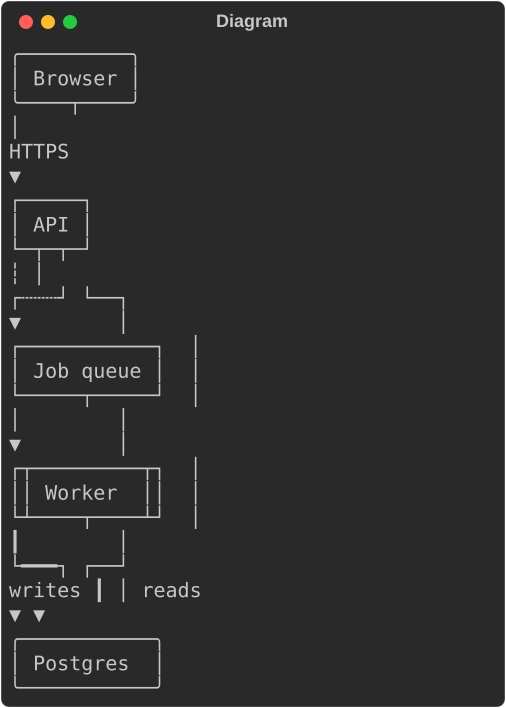
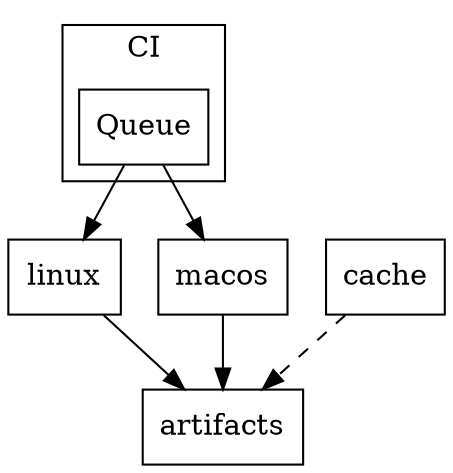
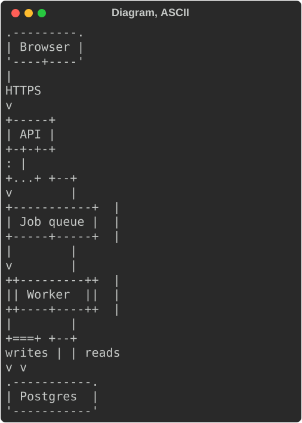
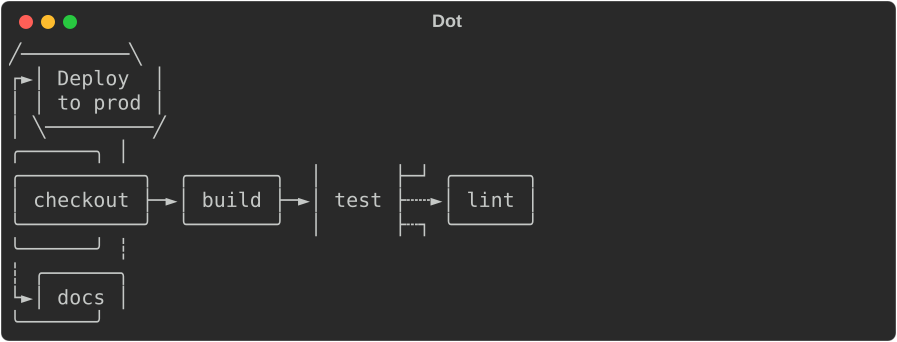
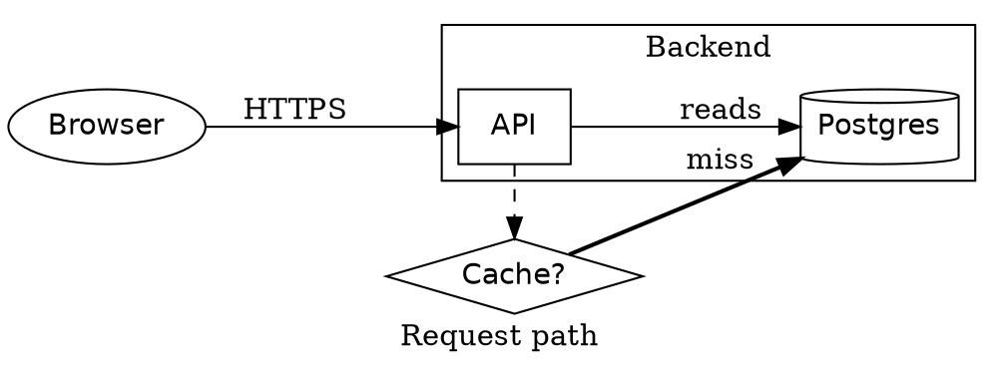

# Diagrams (rs-rich-diagram)

`rs-rich-diagram` (`rich_diagram`, new in 0.0.15) draws graphs in the
terminal: a graph model, a layered layout, and a `Diagram` renderable that
draws the result with box-drawing characters, or ASCII. It also reads DOT
(Graphviz) sources natively ([below](#dot-graphviz)), frames clusters
([below](#clusters-and-same-rank-groups)), and draws entity-relationship
diagrams ([below](#er-diagrams)). `rich` draws no
graphs, so this crate is an rs-rich addition, not a port; it depends on core
`rs-rich` only, and core is unchanged.

The layout is the one [`rs-rich-mermaid`](https://crates.io/crates/rs-rich-mermaid)
has drawn flowcharts with since 0.0.12, lifted out so that every diagram
source draws the same way. A Mermaid flowchart is now converted into a
`rich_diagram::Graph` and drawn here, and a graph built in code draws exactly
as the equivalent Mermaid source does.

## Building a graph in code

`Graph`'s builder chains. `node` and `edge` add items; `label` changes
whichever was added last, `shape` the last node, and `stroke`, `heads` and
`min_length` the last edge. An edge to an id with no node yet adds one,
labelled with its id.

```rust
use rich::Console;
use rich_diagram::{Diagram, Direction, Graph, Shape, Stroke};

let graph = Graph::new(Direction::TopDown)
    .node("web", "Browser").shape(Shape::Round)
    .node("api", "API")
    .node("db", "Postgres").shape(Shape::Cylinder)
    .node("jobs", "Job queue")
    .node("worker", "Worker").shape(Shape::Subroutine)
    .edge("web", "api").label("HTTPS")
    .edge("api", "db").label("reads")
    .edge("api", "jobs").stroke(Stroke::Dotted)
    .edge("jobs", "worker")
    .edge("worker", "db").stroke(Stroke::Thick).label("writes");

Console::new().print(&Diagram::new(graph));
```

In Python the same graph is built with [`rs_rich.diagram`](https://buchochelliq-labs.github.io/rs-rich-cli/python/diagram/).



`cargo run -p rs-rich-diagram --example services` prints:

```text
      ╭─────────╮
      │ Browser │
      ╰────┬────╯
           │
         HTTPS
           ▼
        ┌─────┐
        │ API │
        └─┬─┬─┘
          ┆ │
      ┌┄┄┄┘ └──┐
      ▼        │
┌───────────┐  │
│ Job queue │  │
└─────┬─────┘  │
      │        │
      ▼        │
┌┬─────────┬┐  │
││ Worker  ││  │
└┴────┬────┴┘  │
      ┃        │
      └━━━┐ ┌──┘
   writes ┃ │ reads
          ▼ ▼
     ╭───────────╮
     │ Postgres  │
     ╰───────────╯
```

`Graph::from_parts(direction, nodes, edges)` takes finished `Node`s and
`Edge`s instead, as a parser builds them.

## The model

- **Direction**: `TopDown`, `BottomUp`, `LeftRight` or `RightLeft`.
- **Nodes**: an id, a label (`\n` breaks a line) and a `Shape`: `Rect`,
  `Round`, `Stadium`, `Subroutine`, `Cylinder`, `Circle`, `DoubleCircle`,
  `Asymmetric` (a flag), `Rhombus` (a decision diamond), `Hexagon`,
  `Parallelogram`, `ParallelogramAlt`, `Trapezoid` and `TrapezoidAlt`. Each
  is a box whose corners and sides suggest the shape. `Table` (0.0.2) centres
  the label's first line as a header and rules it off from the lines below,
  drawn left-aligned: what ER diagrams draw entities as.
- **Edges**: a source and a target, an optional label, a `Stroke` (`Solid`,
  `Thick`, `Dotted`, or `Invisible`: laid out but not drawn), a `Head` at each
  end (`None`, `Arrow`, `Circle`, `Cross`), and a minimum number of ranks to
  span (at most 10). `edge` adds an arrow; `link` adds an undirected edge,
  with no heads; `heads(Head::Arrow, Head::Arrow)` makes it two-way.

- **Clusters** (0.0.2): a `Cluster` has an id, an optional label, its nodes
  and an optional parent cluster; it is drawn as a frame around its nodes.
  See [below](#clusters-and-same-rank-groups).
- **Same-rank groups** (0.0.2): nodes to draw side by side in one rank.

Two more sources draw through this layout from the CLI: `rich deps --graph`
(Cargo dependencies) and DOT. See
[Dependency graphs and JSON Schemas](../ext/sources.md) for `rich deps` and
`rich schema`.

## Clusters and same-rank groups

A cluster is drawn as a dashed frame around its nodes (`╌`, `╎` and square
corners; `-`, `:` and `+` in ASCII), its label in the top border. Clusters
nest: a cluster with a parent is framed inside it, and its nodes count as the
parent's too. `Graph::cluster(id, label, members)` adds a top-level one by
node id; `Graph::add_cluster(Cluster::new(id).label(..).nodes(..).parent(..))`
adds any, by node index.

```rust
use rich_diagram::{draw, Direction, Graph};

let graph = Graph::new(Direction::LeftRight)
    .edge("web", "api")
    .edge("api", "db")
    .cluster("backend", "Backend", ["api", "db"]);
println!("{}", draw(&graph, false).unwrap().lines.join("\n"));
```

```text
         ┌╌ Backend ╌╌╌╌╌╌┐
┌─────┐  ╎ ┌─────┐  ┌────┐╎
│ web ├───►│ api ├─►│ db │╎
└─────┘  ╎ └─────┘  └────┘╎
         └╌╌╌╌╌╌╌╌╌╌╌╌╌╌╌╌┘
```

How the layout keeps frames apart:

- every point belongs to a cluster: a node to its innermost one, a long
  edge's dummy points to the innermost cluster holding both its ends, and a
  cluster with no point in a rank it spans gets an invisible placeholder
  there, so its frame has a place in every rank;
- each rank keeps a cluster's points together, and clusters with the same
  parent in the same left-to-right order in every rank, so frames are
  rectangles that cannot interleave;
- after placement, points move right until each frame clears whatever is
  outside it by a cell, and the gaps between ranks gain a row (a column,
  left to right) for each frame border.

Edges cross frames: a frame is drawn last, in the cells nothing else uses,
so a crossing edge stays whole. The label goes where no edge crosses the top
border, or in the bottom border when edges cross the top everywhere.
Top-down, a frame is made wide enough for its label; left to right, the
frame is made long enough along the ranks.

**When a frame cannot be drawn as asked.** A node listed in two clusters
that do not nest is framed in the deeper one (the first listed, at equal
depth), and `Drawing::notes` says so. A cluster with no nodes is not drawn,
and a parent that comes after its child is ignored (the child is framed at
the top level). The separation is bounded; should it not settle, the graph
is drawn without frames and a note says so.

**Same-rank groups.** `Graph::same_rank(ids)` (or `add_same_rank` by index)
asks for nodes to share a rank; the layout ranks the group as one node. A
layered drawing has no edges within a rank, so a group that an edge joins
(directly, or through another group sharing a node) is dropped, with a note
in `Drawing::notes`. A cycle through a group is broken like any other cycle:
one of its edges is drawn pointing back.

In DOT, `subgraph cluster_…` is a cluster (nested subgraphs nest) and
`{ rank=same; a; b }` a same-rank group. This build farm
(`crates/rich-diagram/tests/fixtures/dot/clusters.dot`):



draws as:

```text
┌╌ CI ╌╌╌╌╌╌╌╌╌╌╌╌╌╌╌╌╌╌╌╌╌┐
╎                          ╎
╎         ┌───────┐        ╎
╎         │ Queue │        ╎
╎         └──┬─┬──┘        ╎
╎            │ │           ╎
╎       ┌────┘ └───┐       ╎
╎       │          │       ╎
╎ ┌╌╌╌╌╌│ Runners ╌│╌╌╌╌╌┐ ╎
╎ ╎     ▼          ▼     ╎ ╎
╎ ╎ ┌───────┐  ┌───────┐ ╎ ╎ ┌───────┐
╎ ╎ │ linux │  │ macos │ ╎ ╎ │ cache │
╎ ╎ └───┬───┘  └───┬───┘ ╎ ╎ └───┬───┘
╎ └╌╌╌╌╌│╌╌╌╌╌╌╌╌╌╌│╌╌╌╌╌┘ ╎     ┆
└╌╌╌╌╌╌╌│╌╌╌╌╌╌╌╌╌╌│╌╌╌╌╌╌╌┘     ┆
        │          │             ┆
        └────────┐ │ ┌┄┄┄┄┄┄┄┄┄┄┄┘
                 ▼ ▼ ▼
             ┌───────────┐
             │ artifacts │
             └───────────┘
```

## The layout

`rich_diagram::draw(&graph, ascii)` returns a `Drawing`: plain lines of text
and their width. The layout is layered (Sugiyama-style):

1. cycles are broken by reversing the edges a depth-first search finds going
   back, and nodes are ranked by longest path;
2. edges spanning several ranks get one-cell dummy points;
3. each rank is ordered by barycentre sweeps, keeping the order with the
   fewest crossings;
4. nodes are placed along the rank by averaging their neighbours' centres;
5. every edge is routed orthogonally, with its own port on a node and its own
   track in the gap between two ranks.

Same-rank groups rank as one node in step 1, and clusters change steps 3 and
4 ([below](#clusters-and-same-rank-groups)); a graph with neither draws
exactly as it did in 0.0.1.

A self-loop is marked `↻` (`@` in ASCII). The layout refuses, before any
layout work, graphs of more than 2000 edges (`rich_diagram::MAX_EDGES`) or
5000 nodes; then graphs needing more than 5000 points (nodes, plus one per
rank a long edge crosses) and drawings over 2 million cells. `Diagram` shows
a one-line note instead; nothing is drawn in part.

## Width and ASCII

The layout takes no width: a drawing is as wide as the graph needs. `Diagram`
measures to that width, so it sits in a `Table` cell, a `Panel` or
`Columns` like any renderable, and given less it **crops**: each line is cut
at the right edge and rows left empty are dropped. The output never exceeds
the width it is given, and the same graph at the same width always crops the
same way. `Diagram::drawing` gives the whole drawing when you want to scroll
or page it instead. (Mermaid adds a note saying how much it cropped; the
lines above the note are the same.)

ASCII follows the console (`Console::ascii_only`, set for a non-UTF
encoding) unless you choose with `Diagram::ascii(true)`. The same graph, with
`cargo run -p rs-rich-diagram --example services -- 80 ascii`:



```text
      .---------.
      | Browser |
      '----+----'
           |
         HTTPS
           v
        +-----+
        | API |
        +-+-+-+
          : |
      +...+ +--+
      v        |
+-----------+  |
| Job queue |  |
+-----+-----+  |
      |        |
      v        |
++---------++  |
|| Worker  ||  |
++----+----++  |
      |        |
      +===+ +--+
   writes | | reads
          v v
     .-----------.
     | Postgres  |
     '-----------'
```

Labels have their control characters removed before drawing, so a label
from untrusted input cannot reach the terminal as an escape sequence.

## DOT (Graphviz)

`rich_diagram::dot` reads the DOT people write by hand and draws it through
the same layout, natively: no Graphviz needed.



```rust
use rich::Console;
use rich_diagram::Dot;

let source = std::fs::read_to_string("services.dot").unwrap();
Console::new().print(&Dot::new(source));
```

`dot::parse(source)` gives the `DotGraph` instead: the `Graph`, whether it is
directed and `strict`, its name and `label`, its clusters, and notes on what
was accepted but is not drawn.

**Supported:**

- `graph` and `digraph`, optionally `strict` (repeated edges merge into one),
  named or not;
- node statements (`a [label="A", shape=box]`) and edge statements, chains
  included (`a -> b -> c`), with `{ … }` groups as endpoints
  (`a -> { b c }`);
- attribute lists, and `node [ … ]`, `edge [ … ]` and `graph [ … ]` defaults,
  scoped to the subgraph they are set in. Nodes take `label` (`\n`, `\l` and
  `\r` break lines; `\N` is the node's name, `\G` the graph's) and `shape`;
  edges take `label` (`\T` is the tail's name, `\H` the head's, `\E` the
  edge's, `a->b`; an escape the object has no name for stands for its
  letter, as in Graphviz), `style` (`dashed`/`dotted` draw dotted, `bold`
  thick, `invis` laid out but not drawn),
  `dir`, `arrowhead`, `arrowtail` and `minlen`; the graph takes `rankdir`
  (`TB`, `LR`, `BT`, `RL`) and `label`, drawn under the graph;
- subgraphs; one named `cluster…` is a cluster, framed with its `label`
  (a cluster opened inside another nests in it), and `rank=same` in a
  subgraph puts its nodes in one rank;
- quoted IDs (with `+` concatenation), numerals (lexed as Graphviz lexes
  them: `1.2.3` is `1.2` then `.3`, and a `.` without a digit is an error),
  and `//`, `/* */` and `#` comments, anywhere between tokens.

Shapes map to the nearest box: `box`/`rect` → `Rect`, `ellipse` (the
default) and `style=rounded` → `Round`, `circle` → `Circle`, `diamond` →
`Rhombus`, `cylinder` → `Cylinder`, `hexagon` → `Hexagon`, `parallelogram`,
`trapezium`, `component` → `Subroutine`, and so on; an unknown shape is a
box, as Graphviz draws it. Attributes that only change how Graphviz paints
(`color`, `fontname`, `penwidth`, …) are accepted and ignored.

**Refused**, with an error naming the construct and its line, never drawn
partially: node ports (`a:out -> b`), HTML-like labels (`label=<…>`), the
`record` and `Mrecord` shapes, a `subgraph` referred to without a body, and
more than one graph in a file. So are sources past the parser's bounds, the
same as Mermaid's: over 64 KB (`rich_diagram::MAX_SOURCE`), more than 500
nodes (`MAX_NODES`) or 2000 edges (`MAX_EDGES`, counted as `{ … }` groups
expand, so `{a b c} -> {d e f}` is nine; repeats a `strict` graph merges
do not count), or `{ … }` groups and subgraphs nested more than 64 deep
(`dot::MAX_NESTING`):

```text
line 3: a node port (`a:…`) is not supported (connect the node itself)
```

The `Dot` renderable shows that message under a dim `DOT:` note, with the
source; `rich dot` prints it as an error and exits 4.

**Clusters and ranks:** `cluster…` subgraphs are framed and `rank=same` in
a subgraph is honoured where the layout can
([above](#clusters-and-same-rank-groups)); other `rank` values (`min`,
`max`, `source`, `sink`, or `rank` on the whole graph) are accepted with a
note under the drawing, as is anything the layout could not do. **Drawn
differently, with a note naming the nodes:** invisible nodes (`style=invis`) are drawn, and nodes without an
outline (`shape=plaintext`, `plain`, `none`) are drawn in a box: the layout
has no borderless shape. With ASCII, the notes are ASCII too (`...` for
`…`).

The service map in `crates/rich-diagram/tests/fixtures/dot/services.dot`:



draws as:

```text
                                 ╱────────╲
                               ┌►< Cache? >━┐
╭─────────╮                    ┆ ╲────────╱ ┃
│ Browser ├─┐                  ┆            ┃
╰─────────╯ │        ┌╌╌╌╌╌╌╌╌╌┆ Backend ╌╌╌┃╌╌╌╌╌╌╌╌╌╌╌╌╌╌╌╌╌╌╌╌┐
            │        ╎ ┌─────┐ ┆            ┃        ╭──────────╮╎
            └─HTTPS───►│ API ├┄┘            └━miss━━►│ Postgres │╎
                     ╎ │     ├─┐            ┌─reads─►│          │╎
                     ╎ └─────┘ └────────────┘        ╰──────────╯╎
                     └╌╌╌╌╌╌╌╌╌╌╌╌╌╌╌╌╌╌╌╌╌╌╌╌╌╌╌╌╌╌╌╌╌╌╌╌╌╌╌╌╌╌╌┘
Request path
```

### The plugin and the CLI

With the `plugin` feature, `rich_diagram::plugin::DotPlugin` registers `dot`
and `graphviz` fence renderers and a `dot` source renderer, as
`rs-rich-mermaid` registers Mermaid. The `rich` CLI includes it:

```bash
rich dot services.dot           # alias: rich graphviz; .dot and .gv files are detected
rich README.md                  # ```dot fences draw as diagrams
rich README.md --dot-backend off   # ... or stay code blocks, as upstream renders them
```

[DOT in Markdown](../../recordings.md#dot-in-markdown) and
[dependency trees](../../recordings.md#dependency-trees) are recorded in a
terminal.

### Graphviz's own SVG

The `graphviz` feature adds `rich_diagram::graphviz::render_svg`, which runs
Graphviz's `dot -Tsvg` (installed separately) for its full layout. The
source goes to `dot` on its standard input, never through a shell; the
process gets a timeout (20 s) and size caps on what goes in (256 KiB) and
comes out (16 MiB).

In the CLI, `--dot-backend graphviz` makes `--export-svg OUT.svg` write
Graphviz's SVG instead of the text drawing's, while the terminal still shows
the native drawing:

```bash
rich dot services.dot --dot-backend graphviz --export-svg services.svg
```

Like `mmdc` for Mermaid, it only runs where you chose it: on the command
line, or in your own config (`~/.config/rich/config.toml` or `--config`). A
project's `./rich.toml` with `dot_backend = "graphviz"` is ignored with a
warning, so a cloned repository's `rich.toml` cannot make `rich` start
Graphviz or any other program it names. Without `dot` installed the export
falls back to the text drawing's SVG with a warning.

One command does run a program for the directory it is in: `rich deps`
without `--metadata FILE` runs `cargo metadata`, and Cargo reads that
project's `.cargo/config.toml`. `rich deps` turns off the `rustc` wrappers
such a file can name, but the rest is Cargo's behaviour (see
[Running Cargo](../ext/sources.md#running-cargo)); in a checkout you do not
trust, use `cargo metadata` output you made yourself, with `--metadata
FILE`, which runs nothing.

## ER diagrams

`rich_diagram::er` (0.0.2, #247) draws entity-relationship diagrams. Its
model, `ErModel`, is built in code and knows no source format, so a reader of
SQL DDL or of another schema model fills it (the `rich-ext` schema model and
a `CREATE TABLE` reader are bridged to it outside this crate, which depends
on core only):

- `Entity`: a name and its `Column`s; a column has a name, an optional
  type, and `primary_key`, `foreign_key`, `unique` and `nullable` flags;
- `Relationship`: from one entity's columns to another's (a foreign key reads
  from the referencing table to the referenced one), with an optional
  `Cardinality` (`1:1`, `1:N`, `N:1`, `N:M`) and an optional label;
- `Group`: entities drawn in one frame (a cluster).

All are plain public structs with chaining constructors. `ErDiagram` draws a
model, left to right by default (`.direction(..)` changes it): each entity a
`Shape::Table` box, its name ruled off from one aligned `name  type  keys`
row per column (`PK`, `FK`, `UQ`, and `?` after the type for a nullable
column); each relationship an edge to the referenced entity, labelled with
its columns and cardinality; each group a cluster frame. Edges attach to an
entity's box, below its header, not to the column's own row: the label names
the columns.

```rust
use rich::Console;
use rich_diagram::er::{Cardinality, Column, Entity, ErDiagram, ErModel, Group, Relationship};
use rich_diagram::Direction;

let model = ErModel::new()
    .entity(Entity::new("customers")
        .column(Column::new("id").data_type("int").primary_key())
        .column(Column::new("email").data_type("text").unique())
        .column(Column::new("name").data_type("text").nullable()))
    .entity(Entity::new("orders")
        .column(Column::new("id").data_type("int").primary_key())
        .column(Column::new("customer_id").data_type("int").foreign_key())
        .column(Column::new("placed_at").data_type("timestamp")))
    .entity(Entity::new("order_lines")
        .column(Column::new("order_id").data_type("int").primary_key().foreign_key())
        .column(Column::new("product_id").data_type("int").primary_key().foreign_key())
        .column(Column::new("quantity").data_type("int")))
    .entity(Entity::new("products")
        .column(Column::new("id").data_type("int").primary_key())
        .column(Column::new("sku").data_type("varchar(32)").unique()))
    .relationship(Relationship::new("orders", "customers")
        .columns(["customer_id"], ["id"])
        .cardinality(Cardinality::ManyToOne))
    .relationship(Relationship::new("order_lines", "orders").columns(["order_id"], ["id"]))
    .relationship(Relationship::new("order_lines", "products").columns(["product_id"], ["id"]))
    .group(Group::new("Sales", ["orders", "order_lines"]));

Console::new().print(&ErDiagram::new(model).direction(Direction::TopDown));
```

```text
┌╌ Sales ╌╌╌╌╌╌╌╌╌╌╌╌╌╌╌╌╌╌╌╌╌╌╌╌╌╌╌╌╌╌╌╌╌╌╌╌╌╌┐
╎                                              ╎
╎                  ┌─────────────────────────┐ ╎
╎                  │       order_lines       │ ╎
╎                  ├─────────────────────────┤ ╎
╎                  │ order_id    int  PK FK  │ ╎
╎                  │ product_id  int  PK FK  │ ╎
╎                  │ quantity    int         │ ╎
╎                  └───────────┬─┬───────────┘ ╎
╎                              │ │             ╎
╎                ┌─────────────┘ └───────────────────────────┐
╎          order_id → id                       ╎      product_id → id
╎                ▼                             ╎             ▼
╎ ┌─────────────────────────────┐              ╎ ┌───────────────────────┐
╎ │           orders            │              ╎ │       products        │
╎ ├─────────────────────────────┤              ╎ ├───────────────────────┤
╎ │ id           int        PK  │              ╎ │ id   int          PK  │
╎ │ customer_id  int        FK  │              ╎ │ sku  varchar(32)  UQ  │
╎ │ placed_at    timestamp      │              ╎ └───────────────────────┘
╎ └──────────────┬──────────────┘              ╎
└╌╌╌╌╌╌╌╌╌╌╌╌╌╌╌╌│╌╌╌╌╌╌╌╌╌╌╌╌╌╌╌╌╌╌╌╌╌╌╌╌╌╌╌╌╌┘
                 │
      customer_id → id (N:1)
                 ▼
       ┌───────────────────┐
       │     customers     │
       ├───────────────────┤
       │ id     int    PK  │
       │ email  text   UQ  │
       │ name   text?      │
       └───────────────────┘
```

What it cannot draw is a dim `ER:` note under the drawing: a relationship
naming an entity that does not exist (left out), a column an entity does not
have (drawn as given), a repeated entity name (the first is drawn), a group
member that does not exist. `ErModel::to_graph` gives the `Graph` and those
notes, for drawing it another way.

## From Mermaid

The Mermaid source for the first graph draws the same lines:

```text
graph TD
  web(Browser) -->|HTTPS| api[API]
  api -->|reads| db[(Postgres)]
  api -.-> jobs[Job queue]
  jobs --> worker[[Worker]]
  worker ==>|writes| db
```

`rich_mermaid::Flowchart::to_graph` gives the `Graph` a parsed flowchart
draws through. It does not pass Mermaid's subgraphs on as clusters yet, so
they are still drawn without frames (with a note). Mermaid's tests check both directions: its snapshots built
with the builder, and random graphs written both ways.

From the shell, `rich mermaid flow.mmd` (alias `mmd`; `.mmd` and `.mermaid`
files are detected) draws a flowchart, and ```` ```mermaid ```` fences draw in
Markdown; `--mermaid-backend mmdc` renders every diagram type through
Mermaid's own CLI in a build with the `mmdc` feature. In Python, the same
graphs, DOT sources and Mermaid diagrams are
[`rs_rich.diagram`](https://buchochelliq-labs.github.io/rs-rich-cli/python/diagram/)
and [`rs_rich.mermaid`](https://buchochelliq-labs.github.io/rs-rich-cli/python/mermaid/).
