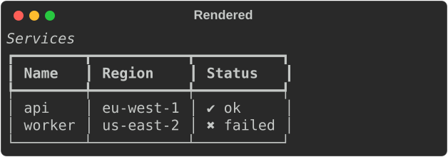
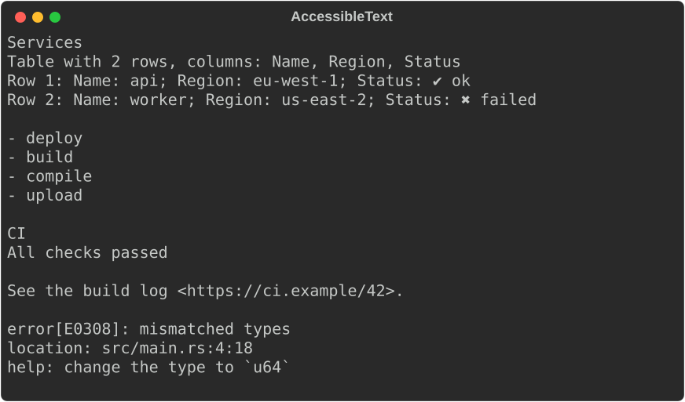
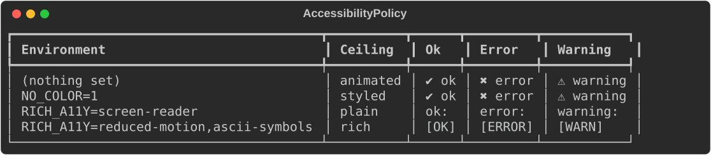
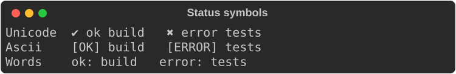
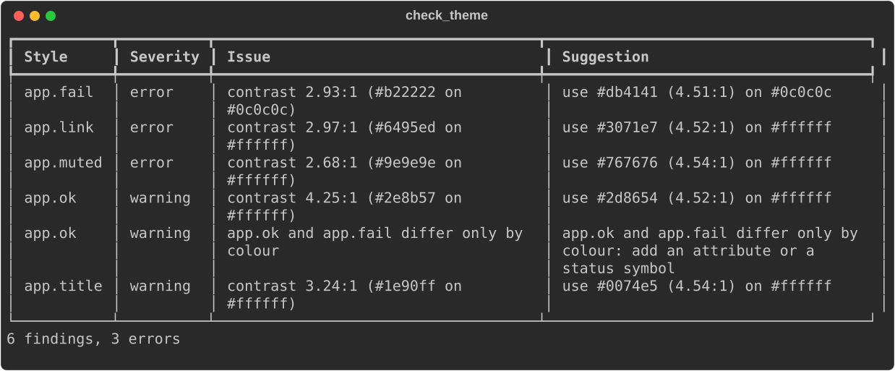

# Accessibility

Terminal output is often read by people who cannot rely on colour, borders
or animation. Screen-reader users hear box-drawing characters read aloud.
Colour-blind users cannot tell red from green. Some users turn motion off.
`rich_ext::a11y` has three parts:

- **Semantic text** (`AccessibleText`): the content of a table, tree, panel,
  rule, text or diagnostic in reading order, without decoration.
- **Policies** (`AccessibilityPolicy`): the user's preferences, read from
  `RICH_A11Y` and `NO_COLOR`, applied to themes, fidelity and status symbols.
- **Theme checks** (`check_theme`): WCAG contrast, styles that differ only by
  colour, and pairs that look alike under colour vision deficiencies.

The examples come from
[`guide_a11y.rs`](https://github.com/buchochelliq-labs/rs-rich-cli/blob/main/crates/rich-ext/examples/guide_a11y.rs).
The module needs no feature; the JSON form of findings needs `serde`:

```bash
cargo run -p rs-rich-ext --example guide_a11y --features serde
```

## Semantic text

A table as the eye sees it:



`accessible_text(width)` returns the same content as linear, undecorated
text. Tables name their columns in each row, trees become indented lists,
panels keep their title, and links read as `text <url>`:

```rust
--8<-- "crates/rich-ext/examples/guide_a11y.rs:semantic"
```



`AccessibleText` is implemented for core `Table`, `Tree`, `Panel`, `Rule` and
`Text`, for markup strings (`str`), and for
[`Diagnostic`](diagnostics.md). `semantic_text(&renderable, width)` handles
any other renderable: it renders plainly and drops the decoration.

Use it when you know the output goes to a screen reader or a log, for
example under the screen-reader policy below. Implement `AccessibleText` for
your own renderables to give them a reading order.

!!! note "How structure is recovered"
    Core `Table`, `Tree`, `Panel` and `Rule` keep their contents private, as
    upstream does. The implementations here recover the structure from a
    plain render. Columns come from border junctions, tree depth from the
    guides, and titles from the borders. A cell that contains a border
    character, a table with `show_header(false)` and `show_lines(true)`, or a
    `Table::grid()` can be misread.

## Policies

`AccessibilityPolicy::from_env(&env)` reads the user's preferences:

- `NO_COLOR` (non-empty) turns on `monochrome`.
- `RICH_A11Y` is a comma-separated list of `screen-reader`,
  `reduced-motion`, `no-animation`, `high-contrast`, `compact` and
  `monochrome`, plus a symbol set: `ascii-symbols` or `word-symbols`.
  Unknown items are ignored and listed in `policy.warnings`.

Pass `SystemEnvironment` for the real process, or a `MapEnvironment` in
tests (see [Capabilities](capabilities.md#detect-from-a-fixed-environment)).
Presets exist for the common cases: `screen_reader()`, `reduced_motion()`,
`high_contrast()` and `monochrome()`.

```rust
--8<-- "crates/rich-ext/examples/guide_a11y.rs:policy"
```



### Applying a policy

| Method | Effect |
|---|---|
| `theme(&theme)` | High contrast drops `dim` and turns black, grey and dark blue foregrounds into readable ones. Monochrome removes colours but keeps bold, underline and other attributes. |
| `console_builder(builder)` | Applies the adjusted theme, sets no colour when monochrome, and turns off emoji and highlighting for screen readers |
| `fidelity_ceiling()` | The highest [fidelity](capabilities.md#fidelity-levels): screen reader → `Plain`, monochrome → `Styled`, no animation or reduced motion → `Rich`, otherwise `Animated` |
| `fidelity_policy()` | A fidelity `Policy` with that ceiling and animation allowed or not |
| `status(Status::Ok)` | The status marker for this policy's symbol set |

```rust
--8<-- "crates/rich-ext/examples/guide_a11y.rs:apply"
```

### Status symbols

A status must not depend on colour alone. Every `SymbolSet` carries the
meaning in text: `Unicode` pairs a symbol with a word (`✔ ok`), `Ascii` uses
a bracketed tag (`[OK]`), and `Words` a word only (`ok:`). `Status` covers
`Ok`, `Warning`, `Error`, `Info`, `Pending` and `Skipped`, and
`Status::label(set, message)` prefixes a message:



The [lint](qa.md#lint) and [capability matrix](qa.md#capability-matrix)
tools flag output that tells statuses apart only by colour, or uses Unicode
symbols on ASCII terminals.

## Theme checks

`check_theme(&theme, &options)` checks every style that sets a colour, `dim`
or `reverse`:

- **Low contrast**: the WCAG contrast ratio against each background in
  `options.backgrounds` (default rich's white export palette and Monokai).
  Below `min_ratio` (4.5, WCAG AA for normal text) is a warning, and below
  `error_ratio` (3.0) an error. The finding suggests the nearest colour that
  passes.
- **Colour-only distinctions**: two styles in a group that become identical
  without colour. The default groups are the logging levels, `repr.bool_true`
  / `repr.bool_false`, and `error` / `warning` / `info` / `success`.
- **Colour-blind confusion**: pairs in a group whose colours are closer than
  `cvd_threshold` (CIEDE2000 ΔE 10) under simulated protanopia, deuteranopia
  or tritanopia (Viénot/Brettel simulation).

Findings are sorted by style name, so a report is stable across runs.
`ContrastReport` renders them:

```rust
--8<-- "crates/rich-ext/examples/guide_a11y.rs:contrast"
```



Each `Finding` has the style name, a `FindingKind` (with the ratio and
colours, or the pair and deficiency), a `Severity` and a suggestion.
`describe()` gives a one-line summary. The colour maths is public in
`a11y::contrast`: `contrast_ratio`, `relative_luminance`, `simulate`,
`delta_e` and `suggest_color`.

### JSON for CI

With the `serde` feature, findings serialize, so a CI job can fail on errors
or post annotations:

```rust
--8<-- "crates/rich-ext/examples/guide_a11y.rs:json"
```

```json
{
  "style_name": "app.fail",
  "kind": {
    "kind": "low_contrast",
    "ratio": 2.93,
    "fg": "#b22222",
    "bg": "#0c0c0c"
  },
  "severity": "error",
  "suggestion": "use #db4141 (4.51:1) on #0c0c0c"
}
```

Policies, capability reports and [ANSI explanations](ansi.md) serialize the
same way.

## Gotchas

- **`NO_COLOR` is a preference, not a capability.** It changes both the
  capability report (colour: none) and the policy (monochrome), so check
  both, as the [capabilities page](capabilities.md#gotchas) explains.
- **Semantic text from a render is a best effort** for core types; see the
  note above. Your own `AccessibleText` implementations can be exact.
- **Contrast depends on the background.** A style that passes on a dark
  palette can fail on a light one. Keep both default backgrounds unless you
  control the terminal.

## See also

- [`rich_ext::a11y` on docs.rs](https://docs.rs/rs-rich-ext/latest/rich_ext/a11y/index.html)
- [`AccessibilityPolicy`](https://docs.rs/rs-rich-ext/latest/rich_ext/a11y/policy/struct.AccessibilityPolicy.html),
  [`check_theme`](https://docs.rs/rs-rich-ext/latest/rich_ext/a11y/contrast/fn.check_theme.html)
- [Capabilities and fidelity](capabilities.md): what the terminal can do
- [Quality assurance](qa.md): lint and the screen-reader profile in the matrix
