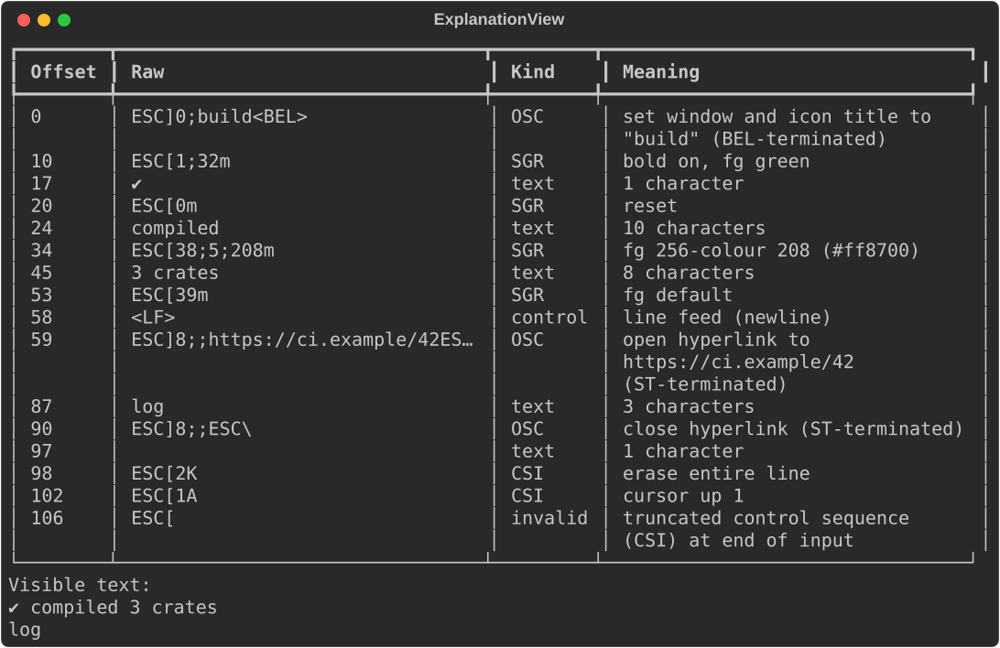
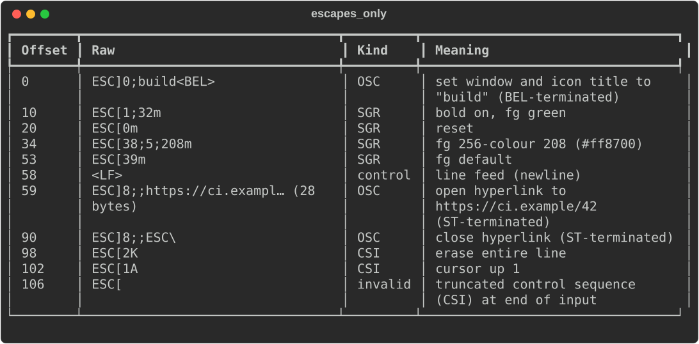
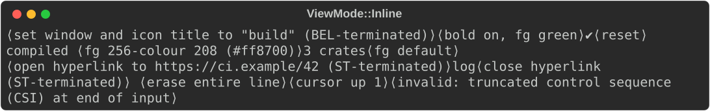

# Explaining ANSI output

Captured terminal output is hard to read: `\x1b[1;38;5;208m` means nothing at
a glance, and a stray escape can break a log or a test snapshot.
`rich_ext::ansi_explain` splits text into tokens, describes every escape
sequence in words, and gives the text a terminal would show.

Use it to debug output that looks wrong, to check what a program writes to
a pipe, or to show a readable failure when a snapshot contains escapes.
`rich ansi explain` is the same thing on the command line.

The examples come from
[`guide_ansi.rs`](https://github.com/buchochelliq-labs/rs-rich-cli/blob/main/crates/rich-ext/examples/guide_ansi.rs)
(no features needed):

```bash
cargo run -p rs-rich-ext --example guide_ansi
```

## Explain a capture

`explain(&str)` returns an `Explanation`: the `tokens`, each with its byte
`offset` and `len`, and the `visible_text`. `ExplanationView` renders it as a
table of offset, raw input, kind and meaning, followed by the visible text:

```rust
--8<-- "crates/rich-ext/examples/guide_ansi.rs:explain"
```



The capture above sets a window title, colours text, opens and closes an OSC
8 hyperlink, erases a line, moves the cursor, and ends with a truncated
escape. The last one is reported as `invalid` rather than dropped.

## What it recognises

| Kind | Examples | Meaning given |
|---|---|---|
| `SGR` | `ESC[1;31m`, `ESC[38;5;208m`, `ESC[4:3m` | Each effect: bold, colours (16, 256 with its hex value, and RGB), underline styles and colour, resets |
| `CSI` | `ESC[2K`, `ESC[1A`, `ESC[?25l` | Cursor movement, erasing, scrolling, private modes |
| `OSC` | `ESC]0;title BEL`, `ESC]8;;url ESC\` | Window titles, hyperlinks, colours and other commands, and whether BEL or ST ended them |
| `ESC` | `ESC 7`, `ESC ( B` | Plain escape sequences |
| `DCS`, `APC`, `PM`, `SOS` | Sixel images | Summarised by length; the payload is never dumped |
| `control` | `\n`, `\t`, `\r`, BEL | The control's name |
| `invalid` | A truncated or interrupted sequence | Why it is invalid |
| `text` | Anything else | Its length in characters |

Both 7-bit (`ESC [`) and 8-bit C1 introducers (U+009B CSI, U+009D OSC, …)
are recognised. `explain_bytes(&[u8])` reads raw bytes: valid UTF-8 is
decoded, lone bytes 0x80–0x9F become the C1 controls they are in 8-bit mode,
and other invalid bytes become U+FFFD. Offsets then refer to the decoded
string.

## View options

| Method | Effect |
|---|---|
| `escapes_only(true)` | Leave text runs out of the table |
| `show_visible(false)` | Leave out the visible text after the table |
| `raw_width(n)` | Characters of raw input shown per row before eliding (default 40, minimum 8) |
| `mode(ViewMode::Inline)` | Show the text with `⟨…⟩` markers where the escapes were |

```rust
--8<-- "crates/rich-ext/examples/guide_ansi.rs:options"
```



```rust
--8<-- "crates/rich-ext/examples/guide_ansi.rs:inline"
```



`inline_text(ascii)` returns the inline form as a `String`. With
`ascii = true` it uses `<…>` markers. The view needs no colour to carry its
meaning.

## Work with tokens

`Token` is an enum (`Text`, `Sgr`, `Csi`, `Osc`, `Esc`, `Dcs`, `Control`,
`Invalid`) with the parsed parts of each sequence. `kind()`, `raw()` and
`meaning()` work on any token. `Explanation::escapes()` iterates over
everything except text, and `invalid()` over the invalid tokens only, which
makes a quick test that output is clean.

```rust
--8<-- "crates/rich-ext/examples/guide_ansi.rs:tokens"
```

```text
4:3;58;2;255;0;0: underline on (curly), underline colour #ff0000
0: reset
```

The building blocks are public: `sgr_effects(params)`, `csi_meaning(params,
intermediates, final)`, `osc_meaning(body)`, `control_name(byte)`,
`escape_visible(raw)` and `decode_bytes(bytes)`. With the `serde` feature an
`Explanation` serializes, tokens tagged by `type`.

## On the command line

```bash
ls --color=always | rich ansi explain
rich ansi explain capture.txt --escapes-only
rich ansi explain capture.txt --ansi-inline
```

`rich ansi explain [FILE|-]` (or `rich --ansi-explain FILE`) prints the
table and the visible text. `--escapes-only` and `--ansi-inline` match the
view options above. The escapes are only ever printed as visible text, so
explaining a capture cannot change your terminal's state. See
[Using the CLI](../../cli.md#decode-escape-sequences).

## Gotchas

- **No cursor emulation.** `visible_text` is the text runs plus tabs and
  newlines. A carriage return, backspace or cursor movement does not
  overwrite anything, so progress-bar captures show every frame.
- **Offsets are bytes** into the input (or into the decoded string for
  `explain_bytes`), not characters or cells.

## See also

- [`rich_ext::ansi_explain` on docs.rs](https://docs.rs/rs-rich-ext/latest/rich_ext/ansi_explain/index.html)
- [Diffs and test reports](diffs-and-test-reports.md#ansi-captures): compare
  two ANSI captures, including style-only changes
- [Quality assurance](qa.md#explain): explain why a render lost colour or
  fell back to ASCII
