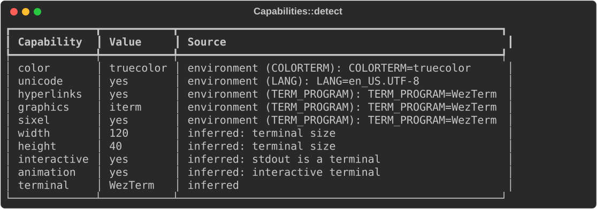
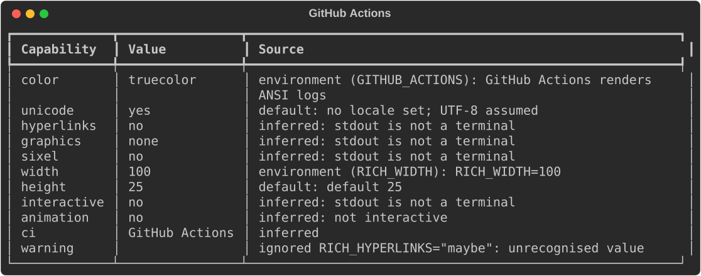
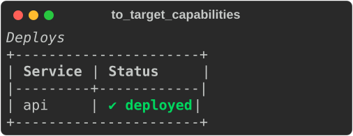
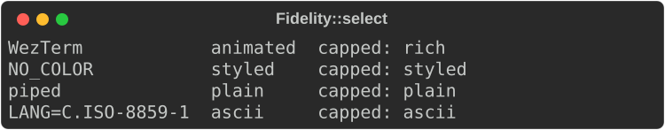
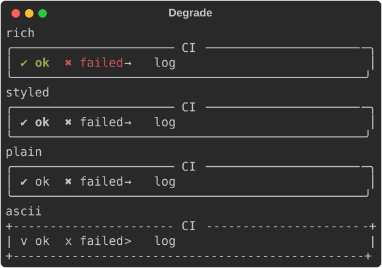
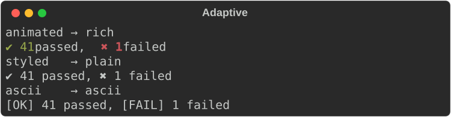

# Capabilities and fidelity

Terminals differ. Some show 16 colours and some 16 million. Some lack
Unicode or hyperlinks, and output is often piped to a file or a CI log. Two
modules deal with this:

- **`rich_ext::capabilities`** decides what the output can use (colour depth,
  Unicode, OSC 8 links, graphics, size, interactivity, animation) and records
  where each answer came from.
- **`rich_ext::fidelity`** turns those answers into one level, from
  `Animated` down to `Ascii`, and renders any renderable at that level.

Neither module probes the terminal. Detection reads environment variables
and tty facts through an `Environment` trait, so tests can supply a fixed
one.

The examples come from
[`guide_capabilities.rs`](https://github.com/buchochelliq-labs/rs-rich-cli/blob/main/crates/rich-ext/examples/guide_capabilities.rs).
Detection needs no feature; the JSON form needs `serde`:

```bash
cargo run -p rs-rich-ext --example guide_capabilities --features serde
```

## Detect the real terminal

```rust
--8<-- "crates/rich-ext/examples/guide_capabilities.rs:system"
```

`Capabilities::system()` returns a `Report`. Each field is a `Field<T>` with
the `value`, its `origin` and a human-readable `reason`. `CapabilityReport`
renders the report as a table. `rich doctor` prints this same table.

## Detect from a fixed environment

For tests, and anywhere results must not depend on the machine, use
`MapEnvironment`: variables, whether stdout is a terminal (`tty()` or
`terminal(bool)`), the terminal size and whether it is Windows.

```rust
--8<-- "crates/rich-ext/examples/guide_capabilities.rs:map"
```



Implement `Environment` (`var`, `is_terminal`, `size`, `is_windows`) to read
facts from anywhere else.

### Provenance

`Origin` says where a value came from:

| Origin | Meaning |
|---|---|
| `Override` | An explicit `Overrides` value from your code |
| `Environment(name)` | An environment variable, named (`COLORTERM`, `RICH_WIDTH`, …) |
| `Inferred` | Derived from other facts: tty status, the terminal's identity, the platform |
| `Default` | Nothing said anything; the documented default |

### The rules, briefly

Each field takes the first rule that matches: an `Overrides` value, then a
`RICH_*` variable, then these heuristics.

- **Colour**: a non-empty `NO_COLOR` gives none. `FORCE_COLOR` forces a depth.
  Output that is not a terminal gets none, except on CI services whose logs
  render ANSI (GitHub Actions gets truecolor; GitLab, Buildkite, CircleCI and
  others get 16). `COLORTERM=truecolor`, Windows Terminal, kitty, iTerm2,
  WezTerm, VS Code and ghostty get truecolor, and a `TERM` containing `256`
  gets 256.
- **Unicode**: the locale (`LC_ALL`, `LC_CTYPE`, `LANG`). Yes by default.
- **Hyperlinks**: only on a terminal known to support OSC 8, and not inside
  tmux or screen. Alacritty is left out because it does not publish a
  version; set `RICH_HYPERLINKS=1` there.
- **Graphics and Sixel**: kitty, iTerm-style inline images, or the Sixel
  heuristic, on a terminal only.
- **Size**: `RICH_WIDTH`/`RICH_HEIGHT`, then `COLUMNS`/`LINES`, then the
  terminal, then 80×25.
- **Animation**: an interactive terminal, not CI, not `TERM=dumb`, and no
  reduced-motion preference in `RICH_A11Y`.

The [module docs](https://docs.rs/rs-rich-ext/latest/rich_ext/capabilities/index.html)
list every rule.

### RICH_* overrides

Users and CI scripts can override any answer:

| Variable | Values |
|---|---|
| `RICH_COLOR` | `none`, `16`, `256`, `truecolor` |
| `RICH_UNICODE` | `0` / `1` |
| `RICH_HYPERLINKS` | `0` / `1` |
| `RICH_GRAPHICS` | `none`, `sixel`, `kitty`, `iterm` |
| `RICH_SIXEL` | `0` / `1` (kept from the CLI; `1` means sixel graphics) |
| `RICH_ANIMATION` | `0` / `1` |
| `RICH_WIDTH`, `RICH_HEIGHT` | a number of cells |

Booleans also accept `true/false`, `yes/no` and `on/off`. An invalid value is
ignored and listed in `Report::warnings`, and the table shows it:

```rust
--8<-- "crates/rich-ext/examples/guide_capabilities.rs:ci"
```



## Overrides from your own flags

`Overrides` holds values your program decided, such as from `--color` or
`--ascii` flags. `detect_with(env, &overrides)` applies them last, with
`Origin::Override`. `report.apply(&overrides)` does the same to an existing
report. `rows()` returns `(name, value, origin, reason)` tuples for your own
output:

```rust
--8<-- "crates/rich-ext/examples/guide_capabilities.rs:overrides"
```

With the `serde` feature a `Report` serializes. `rich doctor --report json`
includes this as `capabilities`:

```rust
--8<-- "crates/rich-ext/examples/guide_capabilities.rs:json"
```

## Render for a report

`to_target_capabilities()` converts a report into core's
`TargetCapabilities`, which a `RenderTarget` renders for. Nothing else is
detected along the way. `to_detected()` gives the older
`DetectedCapabilities` shape.

```rust
--8<-- "crates/rich-ext/examples/guide_capabilities.rs:target"
```



The box is drawn in ASCII, but `✔` in the cell text is not replaced: core
only swaps box characters. Wrap the renderable in
[`Degrade`](#degrade-any-renderable) to replace glyphs too.

## Fidelity levels

`Fidelity` orders what output may use, lowest first:

| Level | Output |
|---|---|
| `Ascii` | ASCII glyphs only, no styles |
| `Plain` | Unicode, no styles |
| `Styled` | Unicode with bold, italic and underline, but no colour |
| `Rich` | Static full colour |
| `Animated` | Full colour plus live updates and animation |

`Fidelity::select(&source, &policy)` picks a level:

1. no Unicode gives `Ascii`;
2. no colour gives `Styled` on an interactive terminal (attributes still
   work there; `NO_COLOR` removes only colour) and `Plain` elsewhere;
3. colour, animation allowed and interactive gives `Animated`;
4. anything else gives `Rich`.

A `Policy` then applies a `ceiling` (never higher) and a `floor` (never
lower; the floor wins, because the caller insists). `allow_animation: false`
rules out `Animated`. The source can be a `Report`, core
`TargetCapabilities`, or `FidelityFacts` given directly.
`Fidelity::for_console(&console, &policy)` selects from a console.

```rust
--8<-- "crates/rich-ext/examples/guide_capabilities.rs:fidelity"
```



## Degrade any renderable

`Degrade` renders any renderable, then post-processes its segments for a
level:

- `Styled` strips colour and keeps attributes;
- `Plain` strips all styles;
- `Ascii` also replaces glyphs with ASCII look-alikes of the same cell width
  (`╭` becomes `+`, `✔` becomes `v`, `→` becomes `>`), and `?` where none
  exists.

Without `.level(…)` it selects the level from the console it renders on.
`.policy(…)` caps that selection. `Degrade::new(value)` takes ownership, and
`Degrade::borrowed(&value)` borrows.

```rust
--8<-- "crates/rich-ext/examples/guide_capabilities.rs:degrade"
```



The helpers are public too: `strip_color`, `strip_styles`, `ascii_fallback`
and `degrade_segments` work on segments, `ascii_text` on a string, and
`style_without_color` on a style.

## Adaptive renderables

Stripping works for any renderable, but a renderable can do better by
offering its own forms. Implement `Degradable`: `levels()` lists the levels
it renders natively, and `render_at(level, …)` renders one. `Adaptive`
picks the best offered level that is not above the selected level. When
every offered level is above it, `Adaptive` renders the lowest one and
degrades it generically.

```rust
--8<-- "crates/rich-ext/examples/guide_capabilities.rs:adaptive"
```



`resolve(&console)` returns both the selected and the rendered level, which
is useful in tests.

## `rich doctor`

`rich doctor` ends with the capability table above, one row per capability
with its source. `rich doctor --report json` includes the same data under
`capabilities`. It never probes the terminal, so it is safe in scripts.

```bash
rich doctor
RICH_COLOR=256 RICH_UNICODE=0 rich doctor   # see overrides take effect
rich doctor --report json > doctor.json
```

See [Using the CLI](../../cli.md#inspect-your-environment) for the rest of its
report.

## Gotchas

- **Capabilities are not preferences.** A terminal that can show colour may
  belong to someone who asked for none. Combine a report with an
  [`AccessibilityPolicy`](accessibility.md): its `fidelity_policy()` is a
  ceiling for `Fidelity::select`.
- **Sixel is inferred, not confirmed.** `to_target_capabilities` reports
  Sixel as confirmed only when an override or `RICH_*` variable says so.
- **Core `TargetCapabilities` has no animation fact.** When selecting from
  them, an interactive target counts as able to animate.

## See also

- [`rich_ext::capabilities` on docs.rs](https://docs.rs/rs-rich-ext/latest/rich_ext/capabilities/index.html)
- [`rich_ext::fidelity` on docs.rs](https://docs.rs/rs-rich-ext/latest/rich_ext/fidelity/index.html)
- [Accessibility](accessibility.md): user preferences such as `NO_COLOR` and
  `RICH_A11Y`
- [Quality assurance](qa.md): render across 16 capability profiles, and
  explain colour and glyph fallbacks
