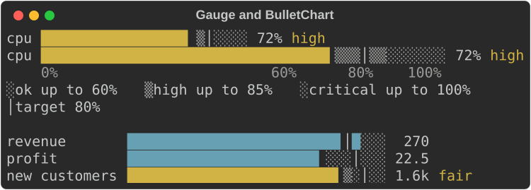
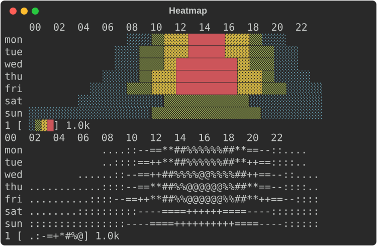
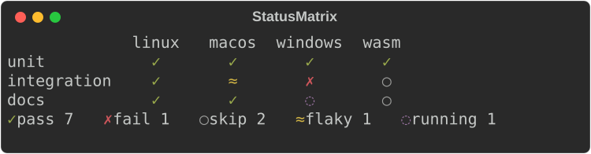
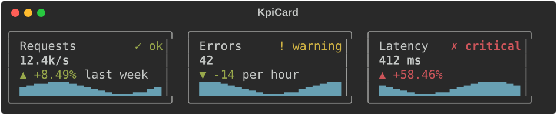
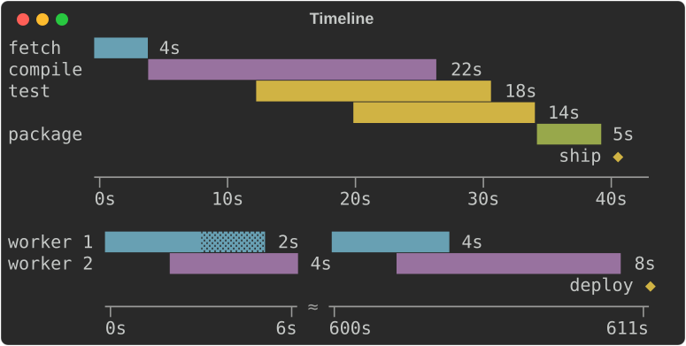
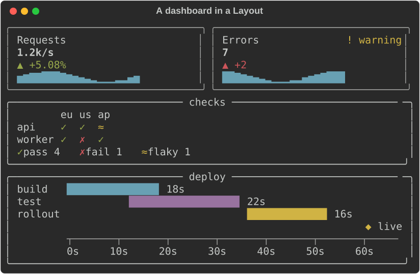

# Charts

`rich_ext::chart` draws data with text:

- **`Sparkline`**: one line, one cell per value.
- **`BarChart`**: a label, a bar and a value per row.
- **`Histogram`**: raw values counted into bins, drawn as bars.
- **`LineChart`**: one or more series as lines or scattered points, with
  axes and a legend.

And the pieces of a dashboard:

- **`Gauge`** and **`BulletChart`**: a value against a range, with a target
  and threshold bands, on one line or the full width.
- **`Heatmap`**: a labelled grid of values drawn as shades, with a legend.
- **`StatusMatrix`**: rows and columns of states (pass, fail, skip, flaky
  or your own), each a symbol and a colour.
- **`KpiCard`**: a label, a value, its change, a sparkline and a status.
- **`Timeline`**: labelled ranges on a numeric or seconds scale, overlaps
  stacked, with milestones; a Gantt strip when every range has its own row.

Each chart is a renderable. It measures itself, so it works in a `Table`
cell, a `Panel` or a `Live` display. It never writes a line wider than the
width it is given: when space is short it drops labels, values and axes
before it drops data.

The examples come from
[`guide_charts.rs`](https://github.com/buchochelliq-labs/rs-rich-cli/blob/main/crates/rich-ext/examples/guide_charts.rs).
The module needs no feature:

```bash
cargo run -p rs-rich-ext --example guide_charts
cargo run -p rs-rich-ext --example charts            # every chart on one screen
cargo run -p rs-rich-ext --example charts -- --ascii
cargo run -p rs-rich-ext --example kpi_dashboard     # cards, a matrix and a timeline, live
```

The styles are theme keys (`chart.*`). Pass `rich_ext::extended_theme()` to
the console builder to get them, or define them in your own theme. Without
them the same defaults are used.

The same charts are in Python as [`rs_rich.chart`](https://buchochelliq-labs.github.io/rs-rich-cli/python/chart/),
and in the shell as [`rich chart`](#from-the-shell-rich-chart).

## Sparklines

`Sparkline::new(values)` draws each value as a cell whose height shows where
it falls between the smallest and largest value:

```rust
--8<-- "crates/rich-ext/examples/guide_charts.rs:sparkline"
```


- It is one cell per value wide. Given fewer cells, it **resamples**: the
  values are split into as many equal buckets as there are cells, and each
  cell shows the mean of its bucket's values.
- `.min_max(true)` styles the lowest and highest cell (`chart.min`,
  `chart.max`) and writes `min 12 max 52` after the line.
- `.threshold(40.0)` styles the cells above 40 with `chart.over` and writes
  `4 > 40` (four values are above it).
- The words are what make the extremes and the threshold readable without
  colour. They are the first thing left out when the line does not fit.
- `.range(min, max)`, `.min(v)` and `.max(v)` fix the scale; values outside
  it are clamped. NaN and infinite values are gaps.

## Bars

`BarChart` draws a row per bar: the label, the bar and the value.

```rust
--8<-- "crates/rich-ext/examples/guide_charts.rs:bars"
```


- Bars are measured from zero. The scale runs from the smallest to the
  largest value and always includes zero; `.max(100.0)` or `.range(..)`
  fix it.
- Blocks give eighth-cell precision (`█▉▊▋▌▍▎▏`). A value above zero always
  shows at least a sliver.
- Negative values extend left of zero, at whole-cell precision, in
  `chart.negative`. The written value keeps its minus sign, so the chart
  reads the same without colour.
- `Bar::new(label, value).style(..)` styles one bar; `.style(..)` on the
  chart styles them all. Both take a theme key or a style definition.
- The bar is 40 cells by default (`.bar_width(n)`). When the width is short
  the bar shrinks to 4 cells, then the values go, then the labels are cut
  with `…`.
- `.show_values(false)` leaves the values out; `.format(ValueFormat::Fixed(1))`
  writes them with one decimal instead of the compact form (`1.2k`, `3.4M`).

### Vertical bars

`.orientation(Orientation::Vertical)` stands the bars up side by side, with
the labels underneath:

```rust
--8<-- "crates/rich-ext/examples/guide_charts.rs:vertical"
```


- `.bar_width(rows)` is the tallest bar's height here, 8 rows by default.
- Blocks give eighth-row precision (`▁▂▃▄▅▆▇█`), Braille half rows (`⣤⣿`),
  ASCII `#` and a half `.`. A value above zero always shows at least a
  sliver.
- Each bar gets a slot as wide as the widest label or value, with a cell
  between slots, and is up to 3 cells thick. Each value sits just above
  its bar.
- Negative values hang below the zero line at whole-row precision, their
  values under them.
- When the width is short the values go first, then the labels are cut
  (and left out below two cells), then the gaps between bars. Bars that
  still do not fit are left off the right.
- `Histogram` takes `.orientation(..)` too.

## Histograms

`Histogram::new(values).bins(n)` counts raw values into `n` bins of equal
width and draws them as a `BarChart`:

```rust
--8<-- "crates/rich-ext/examples/guide_charts.rs:histogram"
```


- Each label is `[low, high)`, and the last `[low, high]`, so every value
  falls in exactly one bin, the one its label names: a value on an edge
  counts in the bin that edge starts.
- The edges are written exactly, never rounded: when the compact form would
  round one (`1250` as `1.2k`), they are all written in full
  (`[1000, 1250)`). `.edges()` returns them without floating-point noise
  (`0.3`, not `0.30000000000000004`).
- Without `.range(min, max)`, the bin width is rounded up to 1, 2, 2.5 or 5
  times a power of ten and the first edge down to a multiple of it, so the
  labels are round numbers. The last bins may then be empty.
- With `.range(min, max)` the bins split that range exactly, and values
  outside it are not counted. NaN and infinite values are never counted.
- `.counts()` and `.edges()` return the numbers; `.to_bar_chart()` the chart.

## Line and scatter charts

A `LineChart` plots one or more `Series`. `Series::line(name, points)` joins
its points, `Series::scatter(name, points)` does not, and
`Series::from_values(name, values)` puts the values at x = 0, 1, 2, …

```rust
--8<-- "crates/rich-ext/examples/guide_charts.rs:line"
```


- The plot is Braille by default: each cell holds 2×4 dots, so a chart 60
  cells wide has 120 points across.
- Every row and column of the plot stands for one exact value, at its
  centre. Axis labels sit on evenly spaced rows and columns, and each label
  is the value of the row or column it is on; nothing is rounded to fit.
- Without `.y_range(..)` and `.x_range(..)`, each scale rounds out to a
  step of 1, 2, 2.5 or 5 times a power of ten that falls on whole rows or
  columns. The x scale may then run a little past the last point.
- When the compact format cannot write those round values exactly, as with
  years (`2015` would read `2.0k`) or millisecond timestamps, the labels are
  all written in full (`2015`, `2016`, …) rather than spreading the data
  thinly over a coarser, writable step.
- With a fixed range, a row or column gets a label only when the format
  writes its value exactly, so a range must divide into the rows for every
  label to show: `.y_range(0.0, 100.0)` on 11 rows labels every 20, on 10
  rows only `0` and `100`. `.y_format(..)` and `.x_format(..)` write the
  labels.
- It is `.height(rows)` rows of plot, an axis line, a row of x labels and
  the legend. Without `.height(..)` it takes 6 to 10 rows, near 8, picking
  the height its y labels divide best. It fills the width it is given, or
  `.width(n)`. When the width is short it drops the y labels, then the
  axes.
- A NaN or infinite value breaks a line.

### Without colour

Series are told apart by colour (`chart.series.1` to `chart.series.5`) and
by marker: the legend shows each series' marker in its colour. Braille dots
have no shape, so when the console shows no colour and there is more than
one series, the chart plots at cell resolution with each series' marker
instead:

```rust
--8<-- "crates/rich-ext/examples/guide_charts.rs:plain"
```


"No colour" is the console's [fidelity](capabilities.md) below `Rich`: no
colour system, `NO_COLOR`, or `no_color(true)`. `Series::marker('#')` picks
a series' marker; `.charset(Charset::Blocks)` asks for markers even with
colour.

## ASCII

`Charset` picks the glyphs: `Blocks`, `Braille` or `Ascii`. The default,
`Auto`, is blocks for sparklines and bars and Braille for line charts. An
ASCII-only console (its encoding is not UTF-8, or its fidelity is `Ascii`)
always gets `Ascii`, whatever the chart asks for, and its output holds no
character above U+007F:

```rust
--8<-- "crates/rich-ext/examples/guide_charts.rs:ascii"
```


| Chart | ASCII |
|---|---|
| `Sparkline` | the ramp `_.-:=+*#`, lowest to highest |
| `BarChart`, `Histogram` | `#` for a cell, `=` for half a cell |
| `LineChart` | `*`, `+`, `o`, `x`, `.` per series; axes drawn with `-`, `+` and a vertical bar |
| `Gauge`, `BulletChart` | `#` and `=` for the bar, `.` and `:` for the bands, a vertical bar for the target |
| `Heatmap` | ten shades, ` .:-=+*#%@`, and `?` for a missing value |
| `StatusMatrix` | each state's ASCII symbol: `+` pass, `X` fail, `-` skip, `~` flaky |
| `KpiCard` | a border of `+`, `-` and vertical bars, `^` and `v` for the delta, the status's ASCII symbol |
| `Timeline` | `#` and `=` for ranges, `*` for milestones, `~` where a gap is cut |

Labels with characters above U+007F are written with `?` in their place, as
[`fidelity::ascii_text`](capabilities.md) does.

## ratatui-style charts and canvases

`LineChart` decides its own scales, labels and legend. For a chart laid
out exactly as ratatui's `Chart` (so a ported app looks the same) or one
whose every part you set, use `Chart`:

```rust
use rich_ext::chart::{Axis, AxisScale, Chart, Dataset, GraphType, Labels, Marker};

let cpu = Dataset::new([(0.0, 0.0), (5.0, 4.0), (10.0, 1.0)])
    .name("cpu")
    .graph_type(GraphType::Line)
    .marker(Marker::Ascii('*'));
let chart = Chart::new(vec![cpu])
    .x_axis(Axis::default().bounds(0.0, 10.0).title("t").labels(Labels::Auto(3)))
    .y_axis(Axis::default().bounds(0.0, 4.0).title("%").labels(Labels::Auto(3)))
    .hidden_legend_fraction(0.5, 0.5)
    .height(8);
```

```text
4│%        ***     ┌───┐
 │       **   **** │cpu│
 │     **         *└───┘
2│   **               **
 │ **
0│*                    t
 └──────────────────────
  0         5         10
```

- **`Axis`**:
  - bounds (or the data's extent);
  - a title and its style;
  - labels: `None` (no axis line), `Auto(n)`, `Values` at given values, or
    `Text` spread evenly;
  - a scale: `Linear` or `Log`, where log labels fall on powers of ten;
  - a style.

  An axis with an empty `Values` list draws its line and takes no room
  for labels, as scope-tui's do.
- **`Dataset`**:
  - points;
  - a name for the legend;
  - a graph type: `Scatter`, `Line`, or `Bar` (a line down to zero);
  - a marker: `Braille` (2×4 dots a cell), `HalfBlock`, `Block`, `Dot`, or
    `Ascii(c)`;
  - a style.

  Later datasets win a cell.
- **The legend** is a box in a corner (`LegendPosition`). It hides itself
  when it would cover more than `hidden_legend_fraction` of the plot.
- **The layout** is ratatui's:
  - the y labels sit left of a `│` line and the x labels under a `─` line,
    meeting at `└`;
  - the y title sits at the top of the plot, and the x title at the right
    of its last row;
  - a short or narrow chart gives up parts in ratatui's order.

`Canvas` draws shapes in world coordinates, as ratatui's `Canvas` does:

```rust
use rich_ext::chart::{Canvas, Marker};

let canvas = Canvas::new()
    .x_bounds(-1.0, 1.0)
    .y_bounds(-1.0, 1.0)
    .height(10)
    .marker(Marker::Braille)
    .paint(|p| {
        p.circle(0.0, 0.0, 0.8, "cyan");
        p.line(-1.0, -1.0, 1.0, 1.0, "red");
        p.layer();
        p.print(-0.2, 0.0, "hi", "bold");
    });
```

`points`, `line`, `polyline`, `rect`, `circle` and `print` are clipped to
the bounds; `layer()` starts a layer drawn over the ones before, and text
is drawn last. Both are renderables: print them, put them in a table or a
panel, or show them in an [intuiTUIve](../intuituive/index.md) app with
`renderable(move || chart(...))`, which draws again when the signals it
reads change.

## In tables and panels

A sparkline measures to one cell per value and a bar chart to its label, bar
and value, so they fit table columns. A line chart takes the width it is
given, or `.width(n)`:

```rust
--8<-- "crates/rich-ext/examples/guide_charts.rs:table"
```


## Gauges and bullet charts

A `Gauge` shows one value against a range. `.target(t)` draws a `│` across
the bar where the target is, and each `Band` is a threshold: the band runs
up to its value, the bar takes the band's style while the value is in it,
and the band's name is written after the value.

```rust
--8<-- "crates/rich-ext/examples/guide_charts.rs:gauge"
```



- The bar fills with eighth-cell blocks (`█▉▊▋▌▍▎▏`), half-cell Braille, or
  `#` and a half `=` in ASCII. The rest of the track is shaded by band,
  alternating `░` and `▒` (`.` and `:`), so each band's extent shows
  without colour.
- The scale runs from 0 (or the smallest of the value, the target and the
  bands) to the largest of them; `.range(min, max)` fixes it.
- The compact form is one line, with a bar of `.bar_width(n)` cells (20 by
  default). `.full_width(true)` fills the width and adds a scale line (the
  bounds, the target and the band edges, each at its cell) and a legend
  (`░ ok up to 60%  │ target 80%`).
- Given less width the bar shrinks to 4 cells, then the band's name goes,
  then the value, then the label is cut.
- `BulletChart` stacks gauges with their labels, bars, values and band
  names in aligned columns. Each keeps its own scale, target and bands.

## Heatmaps

A `Heatmap` is a grid of values, a row per label and a column per header,
each cell a shade from the lowest value to the highest:

```rust
--8<-- "crates/rich-ext/examples/guide_charts.rs:heatmap"
```



- Values are scaled into equal steps: five in blocks (` ░▒▓█`), ten in
  ASCII (` .:-=+*#%@`). The shade is the value, so the grid reads in black
  and white; with colour each step also takes a `chart.heat.N` style, cold
  to hot. `.range(min, max)` fixes the scale.
- A NaN or infinite value is drawn `·` (`?` in ASCII), never as a low value,
  and the legend says so.
- Each value is `.cell_width(n)` cells wide (2 by default). A header is
  written at its column's first cell when it fits with a space after the
  one before, so with narrow cells every second or third header shows.
- Given less width the cells narrow to one, then the row labels are cut,
  then neighbouring columns are merged, each showing the mean of its
  values, so every value still counts.

## Status matrices

A `StatusMatrix` is rows and columns of states, such as a test suite
across platforms. Each state is a **symbol and a colour**, never colour
alone, and the legend counts the cells in each:

```rust
--8<-- "crates/rich-ext/examples/guide_charts.rs:matrix"
```



| State | Symbol | ASCII | Theme key |
|---|---|---|---|
| `pass` | `✓` | `+` | `chart.state.pass` |
| `fail` | `✗` | `X` | `chart.state.fail` |
| `skip` | `○` | `-` | `chart.state.skip` |
| `flaky` | `≈` | `~` | `chart.state.flaky` |

- `State::new(name, symbol, ascii, style)` adds a state, or replaces a
  built-in one with the same name. A symbol must take one cell; a wide one
  is replaced by its ASCII form.
- A name with no state is drawn `?` in `chart.state.unknown` and named in
  the legend as it is. A row shorter than the headers leaves its last cells
  blank.
- Columns are as wide as their widest header. Given less width the headers
  are cut (and left out below three cells), then the row labels, then the
  gaps; columns that still do not fit are left off the right.
- `.counts()` returns how many cells are in each state.

## KPI cards

A `KpiCard` is one key number: a label, the value, its change, an optional
sparkline and an optional `Status`:

```rust
--8<-- "crates/rich-ext/examples/guide_charts.rs:cards"
```



- The change is an arrow and a signed number: `▲ +8.49%`, `▼ -14`, `= 0`
  (`^`, `v` and `=` in ASCII). `.delta(d)` gives an amount,
  `.delta_percent(p)` a percentage and `.previous(v)` the percentage change
  from `v`. A change that is NaN or too large for an `f64` reads `= -`: no
  sign, and the flat arrow. It is styled `chart.delta.good` or `chart.delta.bad` by whether
  the change is for the better: `.higher_is_better(false)` for errors,
  latency and costs. The arrow and the sign carry the direction without
  colour.
- `Status::Ok`, `Warning`, `Critical` and `Unknown` are a symbol and a word
  (`✓ ok`, `! warning`, `✗ critical`, `? unknown`) in `chart.ok`,
  `chart.warning`, `chart.critical` or `chart.unknown`.
- A card measures to its content, so cards sit side by side in `Columns` or
  a table. `.width(n)` fixes its width, border included, and `.expand(true)`
  fills what it is given, as in a `Layout`. Cards with the same parts have
  the same height, so a row of them lines up.
- `.border(false)` leaves the border out; below 5 cells it goes anyway.

## Timelines and Gantt strips

A `Timeline` puts labelled ranges on a numeric scale, such as the steps of
a build in seconds. Ranges with the same row label share a row:

```rust
--8<-- "crates/rich-ext/examples/guide_charts.rs:timeline"
```



- Ranges on one row that overlap are **stacked** onto extra lines, so none
  hides another. A range that starts where the one before it on its line
  ends is drawn `▓` instead of `█` (`=` instead of `#`), so both show.
- A range covers every column whose centre value is inside it, and at least
  one. Its length is written after it when there is room
  (`.durations(false)` leaves them out), so it reads without the axis.
- `.milestone(label, at)` marks a point with `◆` (`*`) on a line under the
  ranges, its label beside it.
- The axis labels sit on evenly spaced columns and name each column's exact
  value, as on a line chart; `.unit("s")` writes a unit after every value.
  The scale is plain numbers: pass seconds (or any unit) as `f64`.
- **Compression:** when the range is wider than the plot, so that the
  shortest range would get less than a column, idle gaps are cut out when
  they are longer than both four times the shortest range and three
  columns' worth of the uncut scale. Each cut takes three columns with
  `≈` (`~`) on the axis, and each stretch is labelled at its start and end.
  `.compress(false)` keeps the scale linear; `.range(min, max)` fixes it.
- It fills the width given, or `.width(n)`. Given less, the row labels are
  cut so the plot keeps 8 columns.

## A dashboard

Cards, a matrix and a timeline in a `Layout`, rebuilt and passed to
`Live::update` on every tick, make a live dashboard. The
[`kpi_dashboard`](https://github.com/buchochelliq-labs/rs-rich-cli/blob/main/crates/rich-ext/examples/kpi_dashboard.rs)
example runs one; this is a frame of a smaller one:

```rust
--8<-- "crates/rich-ext/examples/guide_charts.rs:dashboard"
```



Cards take `.expand(true)` to fill their region. The layout fills the
console's height, so give `Live` a console with a fixed `.height(n)` or let
it take the terminal's.

## From the shell: `rich chart`

`rich chart` draws data from a file, a URL or stdin with these charts, so a
shell pipeline can end in a picture. It reads CSV and TSV (the dialect
sniffed as `rich --csv` sniffs it), JSON (an array of records, of numbers or
of rows, or an object of columns), JSON Lines, or whitespace-separated
numbers.

```bash
rich chart sales.csv                                  # every numeric column as a line
rich chart sales.csv --kind bar --x month --y api     # a bar per row, labelled
rich chart sales.csv --kind heatmap                   # rows by series, as shades
seq 1 20 | rich chart --kind spark                    # numbers piped in
rich chart metrics.json --kind scatter --x t --y p50 --y p99
```

| Option | Meaning |
|---|---|
| `--kind spark\|bar\|line\|scatter\|heatmap` | What to draw; `line` by default |
| `--x COLUMN` | The positions (line, scatter: numbers) or labels (bar, heatmap). Default: the row number; for labels, the first column that is not all numbers |
| `--y COLUMN` | A series; repeat for several. Default: every numeric column but `--x` |
| `--width N` | The width to draw in |

Columns go by header or by 1-based number, so a CSV without a header works
too (its columns are `1`, `2`, ...). An empty cell or a JSON `null` is a gap.
A column that is not there, or a value that is not a number, is refused with
exit code 4 and a message naming the row (counted from 1, after the header)
and the column:

```text
$ rich chart sales.csv --y mobile
rich: no column "mobile"; the columns are "month", "api", "web"
$ rich chart sales.csv --x month
rich: row 1, column "month": "Jan" is not a number (a line or scatter chart's --x is a position; --kind bar takes labels)
```

```text
$ rich chart sales.csv --kind bar --y api --width 50
Jan ███████████████████████▌                 30
Feb █████████████████████████████████        42
Mar ███████████████████████████▌             35
Apr ████████████████████████████████████████ 51
May █████████████████████████████████████▋   48
```

[The recording](../../recordings.md#charts-from-data) shows it in a
terminal.

## The shared pieces

| Type | What it does |
|---|---|
| `Scale` | A linear scale. `Scale::from_values` skips NaN and infinities and never has an empty range: when every value is `v` the range is twice as wide as `v` with `v` in the middle (`0..1` for 0), and no values gives `0..1`. `.nice(n)` widens to round bounds; `.ticks(n)` gives about `n` round values inside it; `.normalize(v)` maps to 0..1 |
| `ValueFormat` | `Compact` (`950`, `0.25`, `1.2k`, `3.4M`, `1.0e15` from a thousand trillion) or `Fixed(decimals)` (at most `ValueFormat::MAX_DECIMALS`, 17; more are capped) |
| `Status` | A health level for a `KpiCard`: a symbol, a word and a theme key |
| `State` | A state of a `StatusMatrix` cell: a name, a symbol, an ASCII symbol and a style |
| `Band`, `Span`, `Milestone` | A gauge's threshold band; a timeline's range and point |
| `Charset` | `Auto`, `Blocks`, `Braille`, `Ascii` |
| `DotCanvas` | The Braille canvas the line chart draws on: set dots, draw lines, read cells |

Theme keys:

| Key | Default | Used for |
|---|---|---|
| `chart.axis` | `bright_black` | Axes and ticks |
| `chart.label`, `chart.value` | none | Labels, tick labels and values |
| `chart.bar` | `cyan` | Bars |
| `chart.negative` | `magenta` | Bars below zero |
| `chart.spark` | `cyan` | Sparklines |
| `chart.over` | `bold red` | Sparkline values above the threshold |
| `chart.min`, `chart.max` | `blue`, `bold green` | Sparkline extremes |
| `chart.series.1` … `.5` | `cyan`, `magenta`, `yellow`, `green`, `blue` | Series, by position (they cycle); timeline rows |
| `chart.track` | `bright_black` | A gauge's track and band shades |
| `chart.target` | `bold` | A gauge's target marker |
| `chart.ok`, `chart.warning`, `chart.critical`, `chart.unknown` | `green`, `yellow`, `bold red`, `bright_black` | `Status`, and bands that name them |
| `chart.delta.good`, `chart.delta.bad`, `chart.delta.flat` | `green`, `red`, `bright_black` | A KPI card's change |
| `chart.kpi.label`, `chart.kpi.value`, `chart.kpi.border` | none, `bold`, `bright_black` | A KPI card |
| `chart.heat.1` … `.5` | `blue`, `cyan`, `green`, `yellow`, `red` | Heatmap steps, cold to hot |
| `chart.state.pass`, `.fail`, `.skip`, `.flaky`, `.unknown` | `green`, `bold red`, `bright_black`, `yellow`, `magenta` | Status matrix states |
| `chart.milestone` | `bold yellow` | Timeline milestones |
