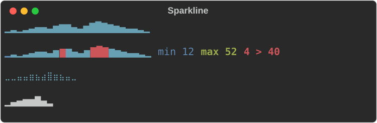
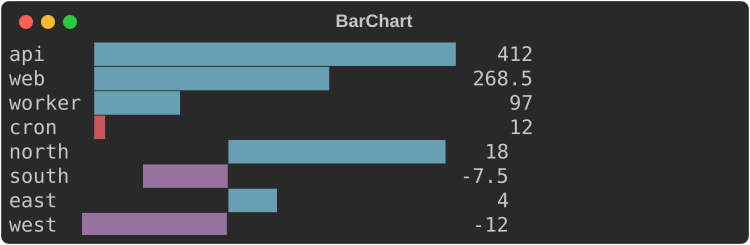
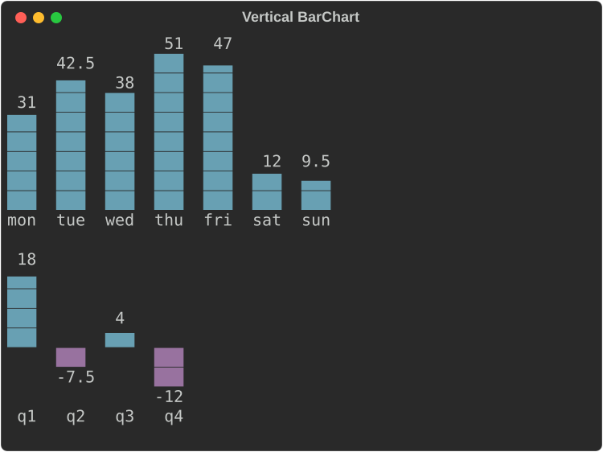
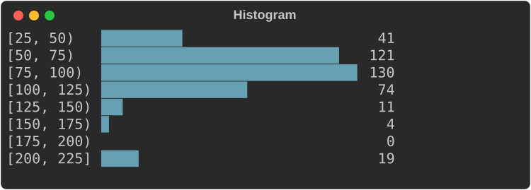
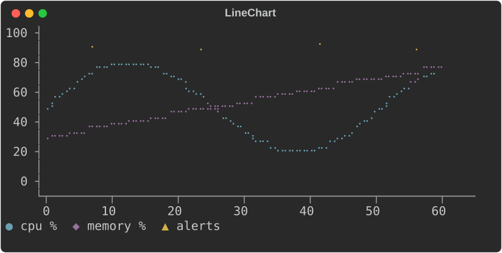
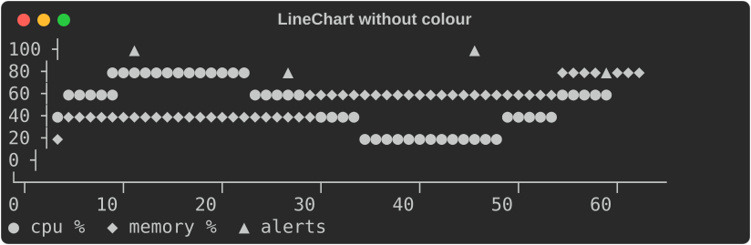
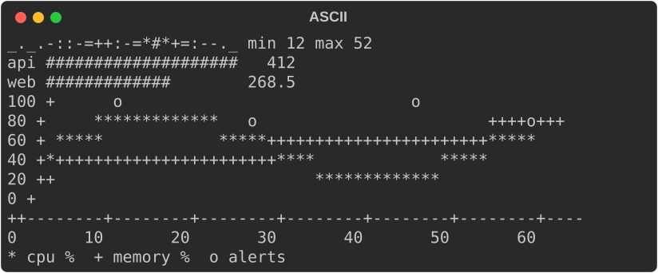
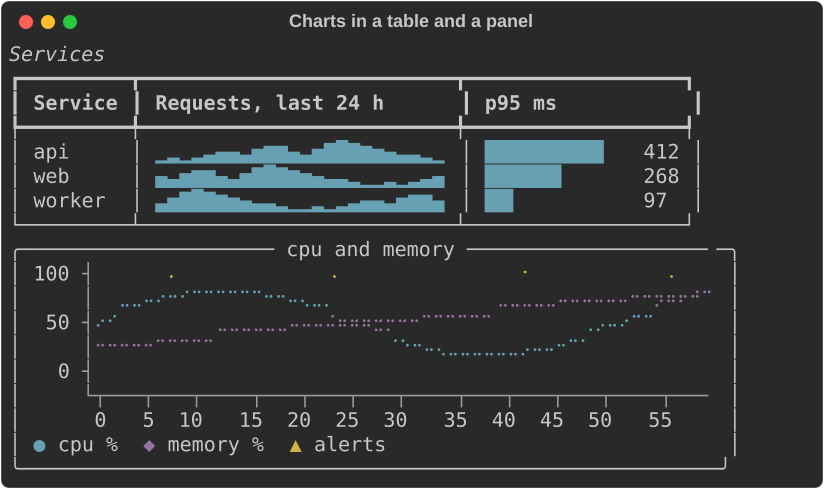

# Charts

`rich_ext::chart` draws data with text:

- **`Sparkline`**: one line, one cell per value.
- **`BarChart`**: a label, a bar and a value per row.
- **`Histogram`**: raw values counted into bins, drawn as bars.
- **`LineChart`**: one or more series as lines or scattered points, with
  axes and a legend.

Each chart is a renderable. It measures itself, so it works in a `Table`
cell, a `Panel` or a `Live` display. It never writes a line wider than the
width it is given: when space is short it drops labels, values and axes
before it drops data.

The examples come from
[`guide_charts.rs`](https://github.com/buchochelliq-labs/rs-rich-cli/blob/main/crates/rich-ext/examples/guide_charts.rs).
The module needs no feature:

```bash
cargo run -p rs-rich-ext --example guide_charts
cargo run -p rs-rich-ext --example charts            # every chart on one screen
cargo run -p rs-rich-ext --example charts -- --ascii
```

The styles are theme keys (`chart.*`). Pass `rich_ext::extended_theme()` to
the console builder to get them, or define them in your own theme. Without
them the same defaults are used.

## Sparklines

`Sparkline::new(values)` draws each value as a cell whose height shows where
it falls between the smallest and largest value:

```rust
--8<-- "crates/rich-ext/examples/guide_charts.rs:sparkline"
```



- It is one cell per value wide. Given fewer cells, it **resamples**: the
  values are split into as many equal buckets as there are cells, and each
  cell shows the mean of its bucket's values.
- `.min_max(true)` styles the lowest and highest cell (`chart.min`,
  `chart.max`) and writes `min 12 max 52` after the line.
- `.threshold(40.0)` styles the cells above 40 with `chart.over` and writes
  `4 > 40` (four values are above it).
- The words are what make the extremes and the threshold readable without
  colour. They are the first thing left out when the line does not fit.
- `.range(min, max)`, `.min(v)` and `.max(v)` fix the scale; values outside
  it are clamped. NaN and infinite values are gaps.

## Bars

`BarChart` draws a row per bar: the label, the bar and the value.

```rust
--8<-- "crates/rich-ext/examples/guide_charts.rs:bars"
```



- Bars are measured from zero. The scale runs from the smallest to the
  largest value and always includes zero; `.max(100.0)` or `.range(..)`
  fix it.
- Blocks give eighth-cell precision (`█▉▊▋▌▍▎▏`). A value above zero always
  shows at least a sliver.
- Negative values extend left of zero, at whole-cell precision, in
  `chart.negative`. The written value keeps its minus sign, so the chart
  reads the same without colour.
- `Bar::new(label, value).style(..)` styles one bar; `.style(..)` on the
  chart styles them all. Both take a theme key or a style definition.
- The bar is 40 cells by default (`.bar_width(n)`). When the width is short
  the bar shrinks to 4 cells, then the values go, then the labels are cut
  with `…`.
- `.show_values(false)` leaves the values out; `.format(ValueFormat::Fixed(1))`
  writes them with one decimal instead of the compact form (`1.2k`, `3.4M`).

### Vertical bars

`.orientation(Orientation::Vertical)` stands the bars up side by side, with
the labels underneath:

```rust
--8<-- "crates/rich-ext/examples/guide_charts.rs:vertical"
```



- `.bar_width(rows)` is the tallest bar's height here, 8 rows by default.
- Blocks give eighth-row precision (`▁▂▃▄▅▆▇█`), Braille half rows (`⣤⣿`),
  ASCII `#` and a half `.`. A value above zero always shows at least a
  sliver.
- Each bar gets a slot as wide as the widest label or value, with a cell
  between slots, and is up to 3 cells thick. Each value sits just above
  its bar.
- Negative values hang below the zero line at whole-row precision, their
  values under them.
- When the width is short the values go first, then the labels are cut
  (and left out below two cells), then the gaps between bars. Bars that
  still do not fit are left off the right.
- `Histogram` takes `.orientation(..)` too.

## Histograms

`Histogram::new(values).bins(n)` counts raw values into `n` bins of equal
width and draws them as a `BarChart`:

```rust
--8<-- "crates/rich-ext/examples/guide_charts.rs:histogram"
```



- Each label is `[low, high)`, and the last `[low, high]`, so every value
  falls in exactly one bin.
- Without `.range(min, max)`, the bin width is rounded up to 1, 2, 2.5 or 5
  times a power of ten and the first edge down to a multiple of it, so the
  labels are round numbers. The last bins may then be empty.
- With `.range(min, max)` the bins split that range exactly, and values
  outside it are not counted. NaN and infinite values are never counted.
- `.counts()` and `.edges()` return the numbers; `.to_bar_chart()` the chart.

## Line and scatter charts

A `LineChart` plots one or more `Series`. `Series::line(name, points)` joins
its points, `Series::scatter(name, points)` does not, and
`Series::from_values(name, values)` puts the values at x = 0, 1, 2, …

```rust
--8<-- "crates/rich-ext/examples/guide_charts.rs:line"
```



- The plot is Braille by default: each cell holds 2×4 dots, so a chart 60
  cells wide has 120 points across.
- Every row and column of the plot stands for one exact value, at its
  centre. Axis labels sit on evenly spaced rows and columns, and each label
  is the value of the row or column it is on; nothing is rounded to fit.
- Without `.y_range(..)` and `.x_range(..)`, each scale rounds out to a
  step of 1, 2, 2.5 or 5 times a power of ten that falls on whole rows or
  columns. The x scale may then run a little past the last point.
- With a fixed range, a row or column gets a label only when the format
  writes its value exactly, so a range must divide into the rows for every
  label to show: `.y_range(0.0, 100.0)` on 11 rows labels every 20, on 10
  rows only `0` and `100`. `.y_format(..)` and `.x_format(..)` write the
  labels.
- It is `.height(rows)` rows of plot, an axis line, a row of x labels and
  the legend. Without `.height(..)` it takes 6 to 10 rows, near 8, picking
  the height its y labels divide best. It fills the width it is given, or
  `.width(n)`. When the width is short it drops the y labels, then the
  axes.
- A NaN or infinite value breaks a line.

### Without colour

Series are told apart by colour (`chart.series.1` to `chart.series.5`) and
by marker: the legend shows each series' marker in its colour. Braille dots
have no shape, so when the console shows no colour and there is more than
one series, the chart plots at cell resolution with each series' marker
instead:

```rust
--8<-- "crates/rich-ext/examples/guide_charts.rs:plain"
```



"No colour" is the console's [fidelity](capabilities.md) below `Rich`: no
colour system, `NO_COLOR`, or `no_color(true)`. `Series::marker('#')` picks
a series' marker; `.charset(Charset::Blocks)` asks for markers even with
colour.

## ASCII

`Charset` picks the glyphs: `Blocks`, `Braille` or `Ascii`. The default,
`Auto`, is blocks for sparklines and bars and Braille for line charts. An
ASCII-only console (its encoding is not UTF-8, or its fidelity is `Ascii`)
always gets `Ascii`, whatever the chart asks for, and its output holds no
character above U+007F:

```rust
--8<-- "crates/rich-ext/examples/guide_charts.rs:ascii"
```



| Chart | ASCII |
|---|---|
| `Sparkline` | the ramp `_.-:=+*#`, lowest to highest |
| `BarChart`, `Histogram` | `#` for a cell, `=` for half a cell |
| `LineChart` | `*`, `+`, `o`, `x`, `.` per series; axes drawn with `-`, `+` and a vertical bar |

Labels with characters above U+007F are written with `?` in their place, as
[`fidelity::ascii_text`](capabilities.md) does.

## In tables and panels

A sparkline measures to one cell per value and a bar chart to its label, bar
and value, so they fit table columns. A line chart takes the width it is
given, or `.width(n)`:

```rust
--8<-- "crates/rich-ext/examples/guide_charts.rs:table"
```



## The shared pieces

| Type | What it does |
|---|---|
| `Scale` | A linear scale. `Scale::from_values` skips NaN and infinities and never has an empty range: when every value is `v` the range is twice as wide as `v` with `v` in the middle (`0..1` for 0), and no values gives `0..1`. `.nice(n)` widens to round bounds; `.ticks(n)` gives about `n` round values inside it; `.normalize(v)` maps to 0..1 |
| `ValueFormat` | `Compact` (`950`, `0.25`, `1.2k`, `3.4M`) or `Fixed(decimals)` |
| `Charset` | `Auto`, `Blocks`, `Braille`, `Ascii` |
| `DotCanvas` | The Braille canvas the line chart draws on: set dots, draw lines, read cells |

Theme keys:

| Key | Default | Used for |
|---|---|---|
| `chart.axis` | `bright_black` | Axes and ticks |
| `chart.label`, `chart.value` | none | Labels, tick labels and values |
| `chart.bar` | `cyan` | Bars |
| `chart.negative` | `magenta` | Bars below zero |
| `chart.spark` | `cyan` | Sparklines |
| `chart.over` | `bold red` | Sparkline values above the threshold |
| `chart.min`, `chart.max` | `blue`, `bold green` | Sparkline extremes |
| `chart.series.1` … `.5` | `cyan`, `magenta`, `yellow`, `green`, `blue` | Series, by position (they cycle) |
