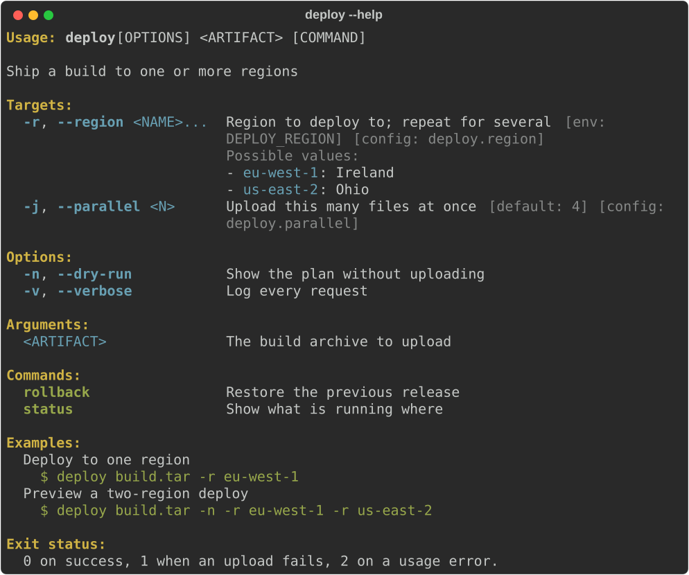
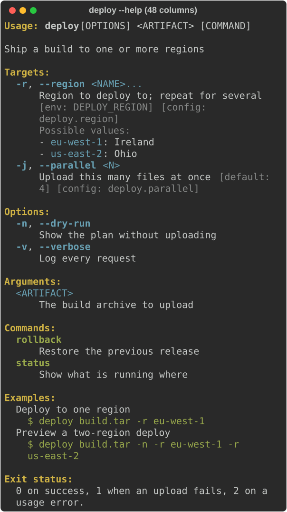
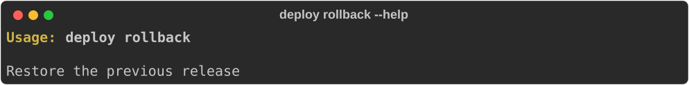
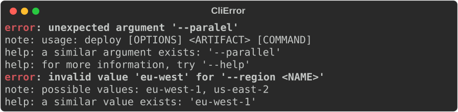
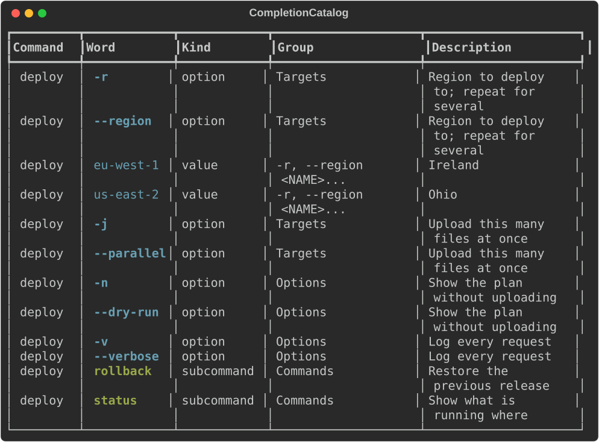
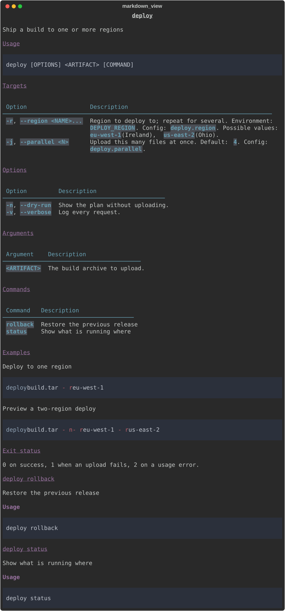
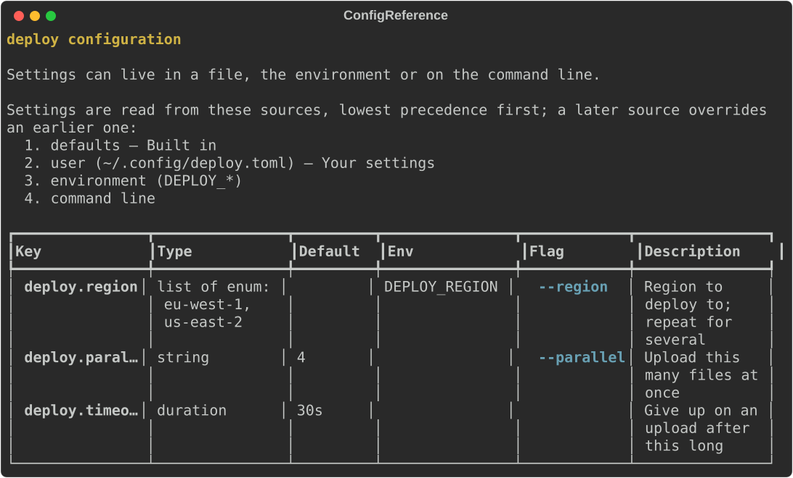
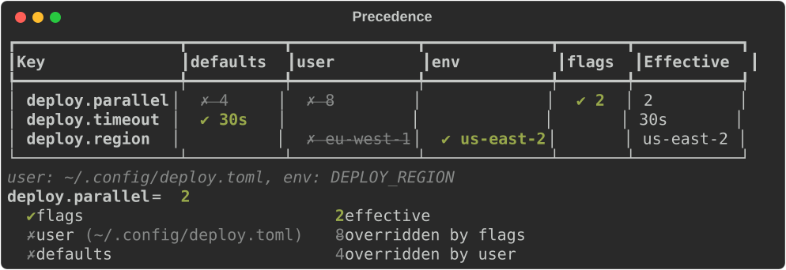
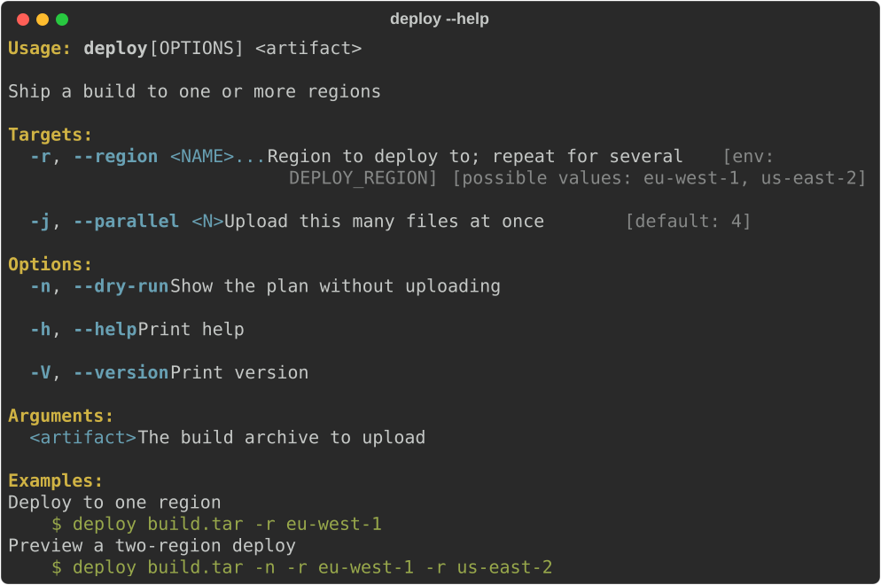
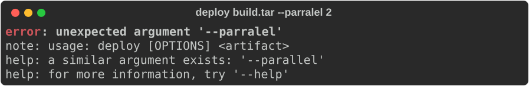

# CLI authoring

`rich_ext::cli_doc` describes a command line once and produces everything a
user reads about it:

- help, rendered through rich and wrapped to the terminal;
- usage errors with "a similar argument exists" suggestions;
- completion scripts for Bash, Zsh, Fish and PowerShell;
- Markdown and man pages;
- a configuration reference, and an explanation of which layer set each value.

The description is plain data (`CommandSpec`, `ArgSpec`) with no parser
behind it, so any argument parser can use it. With the `clap` feature,
`CommandSpec::from_clap` builds the description from a `clap::Command`.

The `rich` binary uses this module itself. `rich --help`, `rich completions`,
`rich docs markdown|man|config`, `rich config reference` and
`rich config explain` all come from one `CommandSpec` of the whole CLI. Drift
tests keep that spec and the real parser in step.

The examples come from
[`guide_cli.rs`](https://github.com/buchochelliq-labs/rs-rich-cli/blob/main/crates/rich-ext/examples/guide_cli.rs)
(no features needed) and
[`guide_clap.rs`](https://github.com/buchochelliq-labs/rs-rich-cli/blob/main/crates/rich-ext/examples/guide_clap.rs)
(`--features clap`).

## Describe the command

`CommandSpec` is the command and `ArgSpec` is one argument. There are three
ways to create an argument:

- `ArgSpec::flag("dry-run")`: a switch that takes no value;
- `ArgSpec::option("region")`: `--region <REGION>`;
- `ArgSpec::positional("artifact")`: `<ARTIFACT>`.

```rust
--8<-- "crates/rich-ext/examples/guide_cli.rs:spec"
```

`ArgSpec` builders:

| Method | Effect |
|---|---|
| `short('r')`, `long("…")`, `alias("…")` | Switch names |
| `value_name("NAME")` | The metavar (default: the id in capitals) |
| `value(ValueHint::File)` | What the value is, for help and completion: `Any`, `File`, `Dir`, `Path`, `Command`, `Url` |
| `choices([...])`, `choice(value, help)` | Allowed values, with optional help each |
| `default_value("4")` | Shown as `[default: 4]` |
| `env("DEPLOY_REGION")` | Shown as `[env: DEPLOY_REGION]` |
| `config_key("deploy.region")` | Shown as `[config: …]`, and listed by `ConfigReference` |
| `required(true)`, `multiple(true)`, `hidden(true)` | Usage, `...` suffix, left out of help |
| `heading("Targets")` | Group the argument under its own heading |
| `help(…)`, `long_help(…)` | Short help, and the longer form for `--help` |

`CommandSpec` builders: `version`, `about`, `long_about`, `alias`, `usage`
(to replace the generated usage line), `arg`/`args`, `subcommand`,
`example(command, description)`, `section(title, body)`,
`heading_note(heading, text)`, `subcommand_heading`, `subcommand_required` and
`hidden`.

## Help

`HelpView` renders the usage line, the about text, each heading's arguments
with their hints, the subcommands, the examples and the extra sections:

```rust
--8<-- "crates/rich-ext/examples/guide_cli.rs:help"
```

From `STACK_BELOW` (60) columns up, arguments sit in two columns:



Below 60 columns, each description is stacked under its switches:



`HelpView::for_path(&root, &["rollback"])` shows a subcommand's help, with the
full command path in its usage. `long(true)` is the `--help` form: it uses
`long_about` and `long_help` where they are set, and puts a blank line between
entries.

```rust
--8<-- "crates/rich-ext/examples/guide_cli.rs:help-sub"
```



Styles come from the console theme and fall back to `cli_doc::STYLES`
(`help.usage`, `help.heading`, `help.option`, `help.metavar`, …). Help is
plain text on a console without colour.

## Errors

`CliError` describes a usage error and renders it as a
[diagnostic](diagnostics.md). Constructors fill in suggestions for you:

- `CliError::unknown_in(&spec, "--paralel")` checks switches (for `-…`) or
  subcommand names and takes the usage line from the spec;
- `unknown_argument`, `unknown_subcommand` and `invalid_value` take explicit
  candidates;
- `missing_value` and `missing_required` report missing input;
- `CliError::new(kind, message)` covers anything else.

```rust
--8<-- "crates/rich-ext/examples/guide_cli.rs:errors"
```



`suggest(input, candidates)` is the matcher on its own. It uses Jaro-Winkler
similarity above 0.7 with leading dashes ignored, as clap does, and returns at
most three candidates, best first. `exit_code()` is `2`, the usage-error
status clap uses.

## Shell completions

`generate(&spec, shell)` returns a completion script for `Shell::Bash`,
`Zsh`, `Fish` or `PowerShell`. Scripts complete subcommands, switches,
choices (with their help as descriptions) and file or directory values.
`"pwsh".parse::<Shell>()` also works.

```rust
--8<-- "crates/rich-ext/examples/guide_cli.rs:completions"
```

A program usually prints the script from a `completions <shell>`
subcommand, as `rich completions bash` does. Install locations:

| Shell | Where the script goes |
|---|---|
| Bash | `~/.local/share/bash-completion/completions/<name>` |
| Zsh | a directory on `$fpath`, as `_<name>` |
| Fish | `~/.config/fish/completions/<name>.fish` |
| PowerShell | dot-source it from `$PROFILE` |

`CompletionCatalog::from_spec` exposes the same words as data (path, word,
description, group and kind) for other completion systems, and renders as a
table:

```rust
--8<-- "crates/rich-ext/examples/guide_cli.rs:catalog"
```



## Markdown and man pages

`to_markdown(&spec)` writes a reference page, with a table per heading and a
section per subcommand. `markdown_view` returns it as core's `Markdown`
renderable. `to_man(&spec, section, date)` writes one roff page, and
`to_man_pages` writes one page per subcommand (`deploy.1`,
`deploy-rollback.1`, …). The man pages pass `mandoc -T lint` and
`groff -ww`. Pass a date for reproducible output; `None` leaves it out.

```rust
--8<-- "crates/rich-ext/examples/guide_cli.rs:docs"
```



This site's [CLI reference](../../cli-reference.md) is generated this way from
the `rich` binary's spec.

## Configuration reference

`ConfigReference` lists the settings a program reads: key, type, default,
environment variable, flag and description, with the sources in precedence
order. `ConfigReference::from_spec` collects every argument that has a
`config_key`. Add `ConfigEntry`s for settings that have no flag. Render it,
or call `to_markdown()`.

```rust
--8<-- "crates/rich-ext/examples/guide_cli.rs:config-reference"
```



`from_spec` guesses each key's type from the argument: `bool` for flags,
`enum` for choices, `path`, `url` or `command` from the value hint, otherwise
`string`, and `list of …` for repeatable arguments. Use `ConfigEntry::new`
when you want a precise type such as `integer`.

## Precedence

`Precedence` answers "why is this setting what it is?". Add a `Layer` for
each source, lowest priority first. A later layer wins. `view()` shows every
key across the layers, with `✔` on the winner and `✗` on overridden values
(`*` and `x` on ASCII consoles), so the table still reads correctly without
colour. `explain(key)` shows one key's chain, highest priority first.

```rust
--8<-- "crates/rich-ext/examples/guide_cli.rs:precedence"
```



`resolve()` returns the same information as data: each key's value, the
winning layer's index and the values it overrode. `rich config explain [KEY]`
is this view over the binary's defaults, `NO_COLOR`, config file, profile and
command line.

## With clap

Enable the `clap` feature. `rs-rich-ext` depends on clap 4.5 with
`default-features = false`, so rich renders help and colour rather than
clap's own formatter. The adapter:

- `CommandSpec::from_clap(&cmd)` maps names, aliases, value names, possible
  values (with help), value hints, defaults, environment variables, headings,
  and hidden, required and positional arguments, plus `about`,
  `long_about`, `version` and `after_help`. `Count` and `Append` actions
  make an argument `multiple`;
- `CliError::from_clap(&err, Some(&cmd))` maps a `clap::Error`, including
  clap's own suggestions;
- `parse_or_exit(cmd)` and `parse_or_exit_with_spec(cmd, &spec)` parse
  `std::env::args_os()`. On `--help`, `--version` or an error, they print
  through rich and exit with 0 or 2, as clap does;
- `try_parse_from(cmd, args)`, `try_parse_with(&console, cmd, args)` and
  `try_parse_with_spec(…)` return a `ParseExit` (the clap error, the rendered
  output, which stream it belongs on and the exit code) instead of printing.

A small program:

```rust
--8<-- "crates/rich-ext/examples/guide_clap.rs:command"
```

clap has no notion of examples or config keys, so add them to the derived
spec:

```rust
--8<-- "crates/rich-ext/examples/guide_clap.rs:spec"
```

```rust
--8<-- "crates/rich-ext/examples/guide_clap.rs:main"
```

```bash
cargo run -p rs-rich-ext --example guide_clap --features clap -- --help
```



In tests, use `try_parse_with` with a console you control:

```rust
--8<-- "crates/rich-ext/examples/guide_clap.rs:test"
```



## Gotchas

- **Keep the spec and the parser in step.** A hand-written spec can drift
  from the parser it describes. `from_clap` avoids that; otherwise write a
  test that checks each parser flag appears in `spec.switch_names()`, and
  the other way round, as the `rich` binary's drift tests do.
- **`from_clap` includes clap's generated `-h/--help` and `-V/--version`**,
  as the clap help screenshot shows.
- **Suggestions include short switches.** An unknown argument is compared
  with `-r` as well as `--region`. A typo whose first letter matches a
  single-letter short flag can therefore suggest that flag too, for example
  `--paralel` suggests both `--parallel` and `-r`.

## See also

- [`rich_ext::cli_doc` on docs.rs](https://docs.rs/rs-rich-ext/latest/rich_ext/cli_doc/index.html)
- [`CommandSpec`](https://docs.rs/rs-rich-ext/latest/rich_ext/cli_doc/struct.CommandSpec.html),
  [`HelpView`](https://docs.rs/rs-rich-ext/latest/rich_ext/cli_doc/struct.HelpView.html),
  [`CliError`](https://docs.rs/rs-rich-ext/latest/rich_ext/cli_doc/struct.CliError.html),
  [`cli_doc::clap`](https://docs.rs/rs-rich-ext/latest/rich_ext/cli_doc/clap/index.html)
- [Diagnostics](diagnostics.md): the renderable behind `CliError`
- [Using the CLI](../../cli.md#shell-completions-and-generated-docs) and the
  [CLI reference](../../cli-reference.md): the output of this module for `rich`
