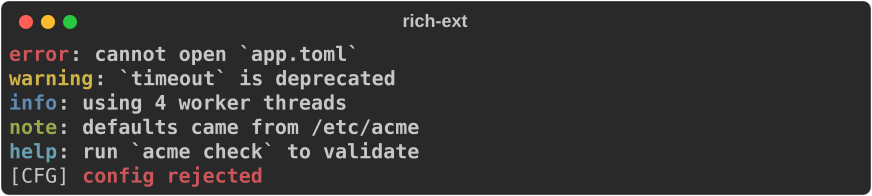
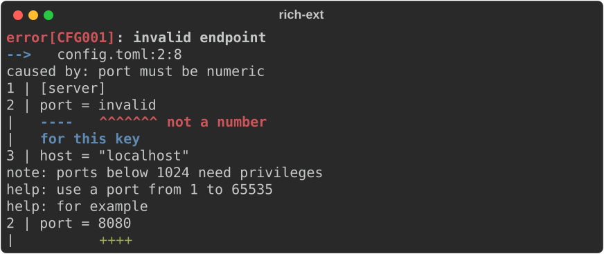
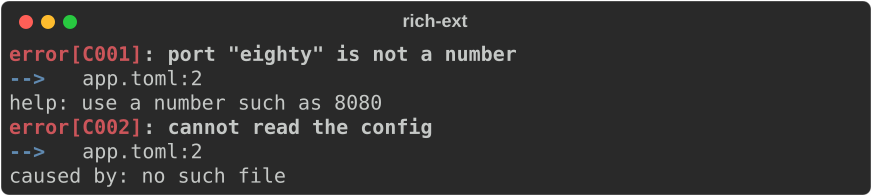
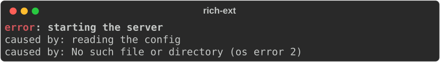
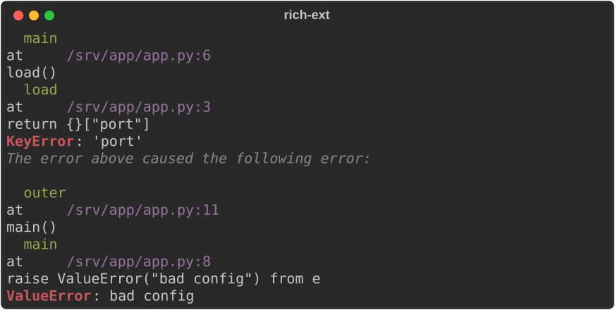
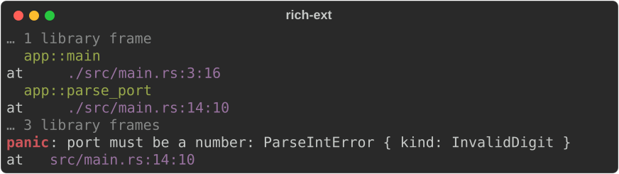
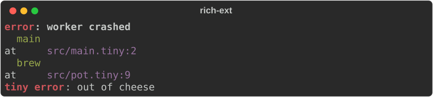
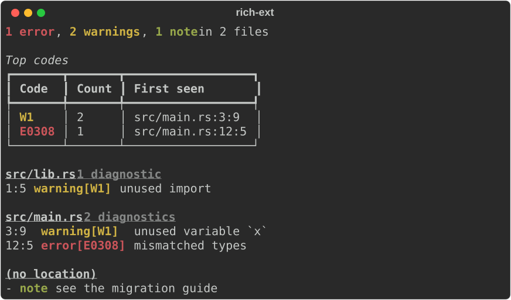

# Diagnostics

`rich_ext::diagnostic::Diagnostic` renders errors the way compilers do:

```text
error[E0308]: mismatched types
  --> src/main.rs:12:5
```

with optional source snippets, labelled spans, suggested edits, notes, help and
a stack trace. The same module family parses stack traces from Rust, Python,
Java and JavaScript, installs a rich panic hook, and summarises many
diagnostics in a dashboard.

Use it for anything that reports a problem to a person: a CLI that rejects a
config file, a linter, a build tool, a failed request in a log.

No feature flag is needed. Enable `anyhow` for `Diagnostic::from_anyhow`.

!!! note "Nothing is read behind your back"

    A diagnostic renders only what you give it. It never opens source files,
    reads the clock or inspects the environment, so the same diagnostic renders
    the same way everywhere.

## The smallest diagnostic

```rust
--8<-- "crates/rich-ext/examples/guide_diagnostics.rs:quickstart"
```

![error\[E0308\] header, location and cause](../../media/guide/guide_diagnostics-quickstart.svg)

A `Diagnostic` is a builder: every method takes `self` and returns it. It
implements `Renderable`, so print it like any other renderable.

## Levels and codes

`Diagnostic::error` and `Diagnostic::warning` set the level for you; any level
can be set with `.level(Level::…)`. The level is the header's first word and
picks its colour.

```rust
--8<-- "crates/rich-ext/examples/guide_diagnostics.rs:levels"
```



- `.code("E0308")` shows as `error[E0308]`. `.code_url(url)` links the code to
  its documentation.
- Without a level, the header is just the message (with `[CODE]` in front if
  there is a code), in the `diagnostic.message` style.
- `Level` is ordered: `Error < Warning < Info < Note < Help`, most serious
  first. The [dashboard](#many-diagnostics-at-once) uses that order to filter.

## Compact and expanded views

A diagnostic has two views, chosen with `.view(EventView::…)`:

| View | Shows |
|---|---|
| `Compact` (default) | header, `--> location`, `caused by:` lines |
| `Expanded` | all of that, then labels, source snippets, metadata, notes, help, suggestions and the stack trace |

!!! warning "Snippets, notes and help need the expanded view"

    If a snippet or `help:` line is missing from your output, you are almost
    certainly rendering the compact view. Add `.view(EventView::Expanded)`.

## Source snippets, labels and suggestions

A `SourceSnippet` quotes the source you supply and underlines byte ranges of
it: `^^^` for primary spans, `---` for secondary ones, each with an optional
label. A `Suggestion` shows a line as it would read after an edit.

```rust
--8<-- "crates/rich-ext/examples/guide_diagnostics.rs:snippet"
```



`SourceSnippet::new(name, source, span, context_lines)`:

- `span` is a **byte** range into `source`. It must lie on UTF-8 character
  boundaries; otherwise `new`, `primary` and `secondary` return
  `Err(DiagnosticError::InvalidSpan)`.
- `context_lines` is how many unmarked lines to show around the marked ones.
- `primary_label` labels the first span; `primary(span, label)` and
  `secondary(span, label)` add more. A label sits after the rightmost marker
  on a line; the others get their own row below.
- `location()` returns the 1-based line and column (in characters) of the
  first span, handy for `.location(...)`. Without an explicit location,
  `get_location()` falls back to it.
- Tabs are expanded and a span that starts inside a grapheme cluster marks the
  whole cluster, so markers line up under wide and combining characters.
- At narrow widths the source row and its marker row are cropped together, so
  markers never drift under the wrong column.

`Suggestion::new(message)` is a `help:` line; `Suggestion::replace(message,
source, span, replacement)` also prints the edited line with `+++` under the
replacement.

Other builders:

| Builder | Output |
|---|---|
| `.location(Location::new(path, line, column))` | `--> path:line:column`, linked when a `Hyperlinker` is set |
| `.cause(message)` | `caused by: message` (compact view too) |
| `.note(message)`, `.help(message)` | `note: …`, `help: …` |
| `.label(message)` | a free-standing line in the expanded view |
| `.metadata(key, Value)` | `key=value` in the expanded view |
| `.hyperlinker(Hyperlinker::new())` | links the location, snippet names and trace frames |
| `.overflow(OverflowPolicy::…)` | how long lines fit the width (default `Fold`) |

## From an error type: `DiagnosticInfo`

Building diagnostics by hand at every error site gets old. Implement
`DiagnosticInfo` on your error type instead, and every value of it knows how to
become a diagnostic. Every method has a default, so implement only what you
have. It works well with a `thiserror` enum:

```rust
--8<-- "crates/rich-ext/examples/guide_diagnostics.rs:info"
```

```rust
--8<-- "crates/rich-ext/examples/guide_diagnostics.rs:info-use"
```



- The message is the error's `Display`.
- The `source()` chain becomes `caused by:` lines. `to_diagnostic()` follows up
  to 16 causes; `Diagnostic::from_info(&error, max_depth)` sets the limit.
- The trait methods are `level` (default `Error`), `code`, `code_url`, `help`,
  `notes` and `location`.
- The result is an ordinary `Diagnostic`: keep adding snippets or suggestions.

For an error that does not implement the trait,
`Diagnostic::from_error(&error, max_depth)` maps just the message and causes.
Past `max_depth` it adds a `[truncated]` cause, and a source chain that loops
back on itself ends with `[cycle]`.

## From `anyhow` (feature `anyhow`)

```toml
rs-rich-ext = { version = "…", features = ["anyhow"] }
```

```rust
--8<-- "crates/rich-ext/examples/guide_diagnostics.rs:anyhow"
```



The outermost context is the message and each inner context is a cause. When
the `anyhow::Error` captured a backtrace (`RUST_BACKTRACE=1`), it becomes the
diagnostic's stack trace, shown in the expanded view.

## Stack traces

`stacktrace::parse` recognises a Rust, Python, Java or JavaScript trace and
normalises it into one `StackTrace`:

- `kind` and `message` (`ValueError`, `bad config`);
- `frames`, **most recent call last** in every language, each with
  `function`, `path`, `line`, `column`, the quoted `source` line when there is
  one, and a `library` flag for standard-library, runtime and dependency
  frames;
- `cause`: the chained error (Python `raise … from` and implicit chaining,
  Java `Caused by:`, JavaScript `[cause]`), with `cause_kind` saying which
  relation it is.

```rust
--8<-- "crates/rich-ext/examples/guide_diagnostics.rs:trace-python"
```



Causes print first, then the error they caused, like Python does. Library
frames are dimmed and runs of them collapse into `… N library frames`:

```rust
--8<-- "crates/rich-ext/examples/guide_diagnostics.rs:trace-rust"
```



| Method | Purpose |
|---|---|
| `trace.origin()` | The most recent application frame: where to look first |
| `trace.chain()` | This trace, then its causes |
| `trace.render_options()` | A `StackTraceView` to configure |
| `.show_library(true)` | Show every library frame |
| `.hyperlinker(linker)` | Link frame locations (default: `file://` links) |

What counts as a library frame:

| Language | Library when |
|---|---|
| Rust | the function is in `std`, `core`, `alloc` or `backtrace` (or is a `__rust…` symbol), or the path is under `/rustc/` or `.cargo/registry` |
| Python | the path contains `site-packages` or `/lib/python`, or starts with `<` (`<frozen …>`) |
| Java | the class is in `java.`, `javax.`, `jdk.`, `sun.`, `com.sun.` or `kotlin.` |
| JavaScript | the path starts with `node:` or contains `node_modules` |

### Your own trace format

Each language is a `TraceParser`. Add one with `Parsers::with_parser`; it is
tried before the built-in parsers:

```rust
--8<-- "crates/rich-ext/examples/guide_diagnostics.rs:parser"
```

```rust
--8<-- "crates/rich-ext/examples/guide_diagnostics.rs:parser-use"
```



### A rich panic hook

`stacktrace::panic_hook(console)` returns a hook that prints a panic as a
`StackTrace`. Installing it is up to you:

```rust
--8<-- "crates/rich-ext/examples/guide_diagnostics.rs:panic-hook"
```

- `stacktrace::capture(message)` builds the current thread's trace with
  `Backtrace::force_capture`, so the hook always has frames, whatever
  `RUST_BACKTRACE` says. File locations need debug info.
- The hook prints to the console you give it. Give it a stderr console
  (as above) to keep panics off standard output.
- The captured trace currently includes the hook's own frames
  (`panic_hook::{closure}`, `capture`) and the C runtime's start-up frames as
  application frames. Try it: `cargo run -p rs-rich-ext --example
  guide_diagnostics --features anyhow -- --panic`.

## Many diagnostics at once

`dashboard::DiagnosticsDashboard` takes many diagnostics and prints one
overview: counts by level, the most frequent codes, then every diagnostic
grouped by file in line order.

```rust
--8<-- "crates/rich-ext/examples/guide_diagnostics.rs:dashboard"
```



| Builder | Default | Effect |
|---|---|---|
| `push(d)`, `extend(ds)` | | Add diagnostics (take `&mut self`) |
| `min_level(Level::Warning)` | all | Hide less serious diagnostics |
| `top_codes(n)` | 5 | Rows in the top-codes table; `0` hides it |
| `hyperlinker(linker)` | none | Link file headings and locations |

`counts()` returns the per-level totals as a `BTreeMap`, for exit codes or CI
summaries. Diagnostics without a level count as errors; ones without a location
are listed under `(no location)`.

## Diagnostics in log events

A `StructuredEvent` can carry diagnostics under its message line. See
[Logging](logging.md#attaching-diagnostics).

## Run the example

```bash
cargo run -p rs-rich-ext --example guide_diagnostics --features anyhow
```

## See also

- [Logging](logging.md): structured events and the `RichHandler`.
- [Extensions](extensions.md#hyperlinks): `Hyperlinker` and editor links, and
  the `diagnostic.*` and `stacktrace.*` theme keys.
- [CLI authoring](cli-authoring.md): command-line errors rendered as
  diagnostics.
- [Structured data](structured-data.md): parse errors that convert to
  diagnostics.
- API: [`diagnostic`](https://docs.rs/rs-rich-ext/latest/rich_ext/diagnostic/index.html),
  [`DiagnosticInfo`](https://docs.rs/rs-rich-ext/latest/rich_ext/diagnostic/trait.DiagnosticInfo.html),
  [`stacktrace`](https://docs.rs/rs-rich-ext/latest/rich_ext/stacktrace/index.html),
  [`DiagnosticsDashboard`](https://docs.rs/rs-rich-ext/latest/rich_ext/dashboard/struct.DiagnosticsDashboard.html).
