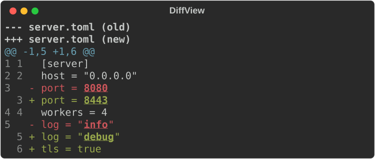
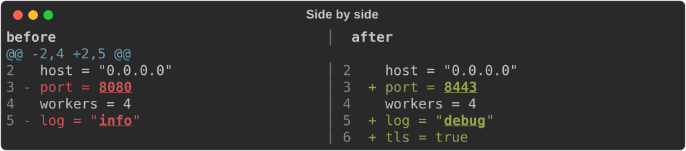
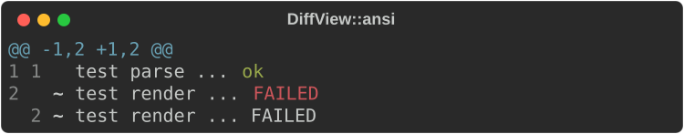
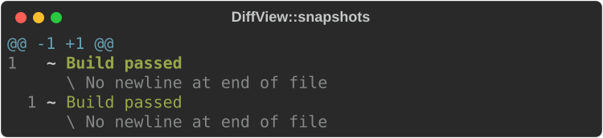
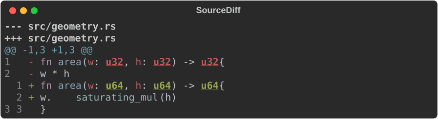
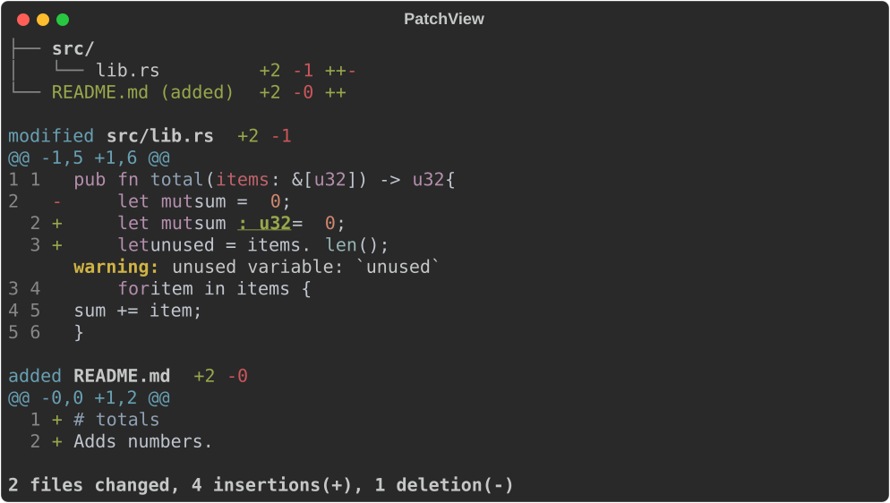
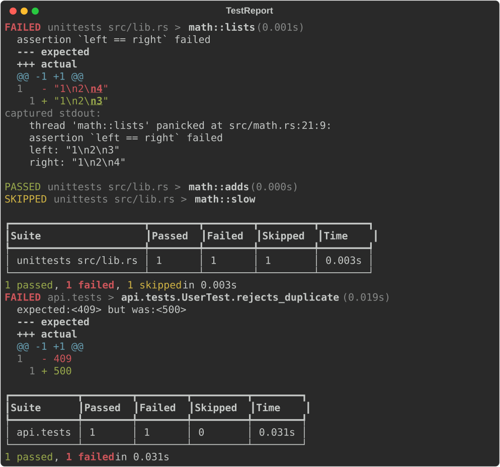
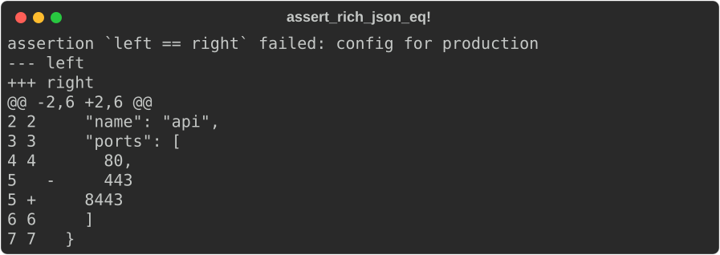

# Diffs and test reports

`rich_ext::diff` compares text and shows the result in the terminal:

- **`TextDiff`**: a line diff whose unified output matches `diff -u`;
- **`DiffView`**: a renderable diff of plain text, ANSI captures or render
  snapshots, unified or side by side;
- **`SourceDiff`**: a syntax-highlighted diff of two versions of a file;
- **`git::PatchView`**: a review-style view of `git diff` output, with
  annotations and links;
- **`TestReport`** (feature `test-report`): JUnit XML and libtest JSON
  results, failures first;
- **`assert_rich_eq!` and friends** (feature `testing`): assertions that
  fail with a rendered diff.

Every view marks changed lines with `-`, `+` or `~` (a style-only change), so
diffs stay readable without colour.

The examples come from
[`guide_diff.rs`](https://github.com/buchochelliq-labs/rs-rich-cli/blob/main/crates/rich-ext/examples/guide_diff.rs):

```bash
cargo run -p rs-rich-ext --example guide_diff --features testing,test-report
```

The diff engine, `DiffView`, `SourceDiff` and `PatchView` need no feature.

## The engine

`TextDiff::new(old, new)` runs a linear-space Myers diff over lines.
`context(n)` sets how many unchanged lines surround each change (default 3).
`stats()` returns `(added, removed)`, `hunks()` returns the grouped hunks,
and `unified(old_name, new_name)` returns the patch text. The result is
empty when the inputs are equal, as with `diff`.

```rust
--8<-- "crates/rich-ext/examples/guide_diff.rs:text-diff"
```

```text
--- a/server.toml
+++ b/server.toml
@@ -2,4 +2,5 @@
 host = "0.0.0.0"
-port = 8080
+port = 8443
 workers = 4
-log = "info"
+log = "debug"
+tls = true
```

Lower-level functions work on any data: `diff_slices` diffs any `Hash + Eq`
items, `diff_lines` diffs `&str` lines, `diff_words` and `diff_chars` diff
within a line, and `group_hunks` groups the resulting `Op`s into `Hunk`s.

## DiffView

`DiffView::new(old, new)` renders a diff with line numbers, hunk headers and
word-level emphasis on the parts of a line that changed:

```rust
--8<-- "crates/rich-ext/examples/guide_diff.rs:unified"
```



| Method | Effect |
|---|---|
| `layout(Layout::SideBySide)` | Old on the left, new on the right (default `Layout::Unified`) |
| `titles(old, new)` | `---`/`+++` headers, or column headings side by side |
| `context(n)` | Unchanged lines around each change (default 3) |
| `line_numbers(false)` | Hide the line-number gutters |
| `wrap(false)` | Truncate long lines with `…` instead of wrapping |
| `emphasis(false)` | Turn off word-level emphasis |

```rust
--8<-- "crates/rich-ext/examples/guide_diff.rs:side-by-side"
```



`is_equal()`, `stats()` (added, removed, restyled) and
`style_changed_lines()` let a caller decide what to do before rendering.
`DiffView::from_diff(&text_diff)` views an existing `TextDiff`.

### ANSI captures

`DiffView::ansi(old, new)` compares captured terminal output by its visible
text. A line whose text is the same but whose styling changed is marked `~`,
and each side keeps its own colours:

```rust
--8<-- "crates/rich-ext/examples/guide_diff.rs:ansi"
```



### Render snapshots

With the `testing` feature, `DiffView::snapshots(&old, &new)` compares two
`RenderSnapshot`s through their ANSI output. A styling regression that leaves
the plain text alone still shows:

```rust
--8<-- "crates/rich-ext/examples/guide_diff.rs:snapshots"
```



`RenderSnapshot::diff(&other)` returns the same comparison as unified text.

## Source diffs

`SourceDiff` highlights each side as a whole file with core's `Syntax`, then
splits it into lines, so multi-line strings and comments keep their colours.
Changed tokens are emphasised on top of the highlighting. The language comes
from `language("rust")` or the extension of `path(…)`.

```rust
--8<-- "crates/rich-ext/examples/guide_diff.rs:source"
```



`link_template("vscode://file/{path}:{line}")` links each line number to an
editor (`{column}` is always 1). `hyperlinker(Hyperlinker)` uses `file://`
links instead. `paths(old, new)` names a renamed file, and `titles(false)`
hides the headers. `layout`, `line_numbers`, `wrap` and `context` work as on
`DiffView`, and `view()` returns the underlying `DiffView`.

## Git patches

`git::parse_unified` reads `git diff` output and plain `diff -u` output. It
handles new, deleted, renamed and copied files, mode changes, binary files
and `\ No newline at end of file`. The result is a `Patch` of `FilePatch`es,
each with its status, paths, modes, similarity, hunks and
addition/deletion counts.

`PatchView` renders a patch the way a code review shows it:

- a file tree with per-file counts;
- each file's header and syntax-highlighted hunks;
- `Annotation`s (a level and a message) under their lines;
- a summary line at the end.

```rust
--8<-- "crates/rich-ext/examples/guide_diff.rs:patch"
```



`links(provider)` links paths and new-side line numbers.
`TemplateLinks` fills `{path}`, `{line}` and any `{name}` you set with
`var`, which is enough for GitHub, GitLab or Gitea URLs. A `Hyperlinker` also
works as a provider (local `file://` or editor links). Implement
`LinkProvider` for anything else. `tree(false)`, `highlight(false)` and
`emphasis(false)` turn parts off.

On the command line, `git diff | rich diff -` renders a patch this way, and
`rich diff OLD NEW` compares any two text files.

## Test reports

With the `test-report` feature, `junit::parse` reads JUnit XML (Maven
Surefire, pytest, jest-junit and nested suites). `libtest::parse` reads the
JSON stream from libtest (`cargo +nightly test -- -Z unstable-options
--format json`). Both return the same `TestRun` of `Suite`s and `Case`s.

`TestReport` renders a run:

- failures first, each with its message and captured output;
- a diff of expected against actual, when the message contains both. libtest's
  `left`/`right`, JUnit 4's `expected:<a> but was:<b>` and Jest's
  `Expected:`/`Received:` are recognised;
- a per-suite summary table and a totals line.

```rust
--8<-- "crates/rich-ext/examples/guide_diff.rs:test-report"
```



| Method | Effect |
|---|---|
| `show_passed(true)` | List passing and skipped cases after the failures |
| `show_output(false)` | Hide captured output |
| `diff_context(n)` | Context lines in expected/actual diffs (default 3) |

`TestRun::totals()`, `time()` and `is_success()` summarise a run, and
`to_junit_xml()` writes normalized JUnit for CI systems that read it.
Implement `TestAdapter` to add another format. Include cargo's stderr in the
libtest stream (`2>&1`) so its `Running unittests src/lib.rs (…)` lines name
the suites; without them suites are called `suite 1`, `suite 2`, …

## Assertions

With the `testing` feature, four macros compare values and, when they differ,
panic with a rendered diff instead of two long debug strings:

| Macro | Compares |
|---|---|
| `assert_rich_eq!(left, right)` | Two strings (anything `AsRef<str>`) |
| `assert_rich_json_eq!(left, right)` | Two `Serialize` values as pretty JSON |
| `assert_render_eq!(renderable, expected, width = 40)` | A renderable's plain output (default width 80; trailing spaces ignored) |
| `assert_snapshot_eq!(left, right)` | Two `RenderSnapshot`s, styles included |

Each accepts a trailing format message, as `assert_eq!` does. This is a real
failure, caught and printed:

```rust
--8<-- "crates/rich-ext/examples/guide_diff.rs:assert"
```



The diff layout and colour come from the environment:

| Variable | Effect |
|---|---|
| `RICH_ASSERT_LAYOUT=side-by-side` | Side-by-side diffs (default unified) |
| `RICH_ASSERT_COLOR=1` / `0` | Force colour on or off. By default it is on when stdout is a terminal and `CI` is unset. |

Without colour the message is plain ASCII, which keeps CI logs readable.

## Gotchas

- **Snapshots and captures without a final newline** show
  `\ No newline at end of file` on both sides, as `diff` does. This is
  expected, not a change.
- **`stats()` order differs.** `TextDiff::stats` returns `(added, removed)`,
  `Patch::stats` returns `(additions, deletions)`, and `DiffView::stats` also
  counts restyled lines.
- **libtest JSON needs nightly** (`-Z unstable-options`). On stable, use a
  JUnit reporter such as `cargo nextest`'s.
- **A truncated JUnit file is an error.** When the XML ends with elements
  still open (a runner killed mid-write), `junit::parse` fails instead of
  returning the cases it saw, so a cut-off report never reads as a success.
- **Decoded controls are shown, not obeyed.** Git's quoted paths
  (`"b/\033[2J"`), JUnit's `&#x1b;` and JSON's `\u001b` decode to real
  control characters. The parsed `Patch` and `TestRun` keep them, while
  `PatchView` and `TestReport` show paths, names, messages and output with
  terminal and bidi controls made visible (`␛[2J`). Line *content* in a
  `PatchView` is shown as given: sanitize untrusted patch text (for example
  with `rich_ext::sanitize_terminal_controls`) before parsing it.
- **Hunk headers must be possible.** `@@ -0,1 …` (a non-empty range at line
  0) and ranges whose end overflows are parse errors.

## See also

- [`rich_ext::diff` on docs.rs](https://docs.rs/rs-rich-ext/latest/rich_ext/diff/index.html)
- [`DiffView`](https://docs.rs/rs-rich-ext/latest/rich_ext/diff/struct.DiffView.html),
  [`git::PatchView`](https://docs.rs/rs-rich-ext/latest/rich_ext/diff/git/struct.PatchView.html),
  [`test_report::TestReport`](https://docs.rs/rs-rich-ext/latest/rich_ext/diff/test_report/struct.TestReport.html)
- [Quality assurance](qa.md): screenshot approvals use these diffs
- [Structured data](structured-data.md#diff): leaf-level diffs of documents
- [Using the CLI](../../cli.md): `rich diff`
