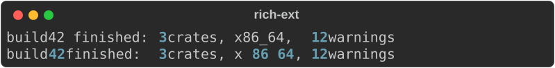
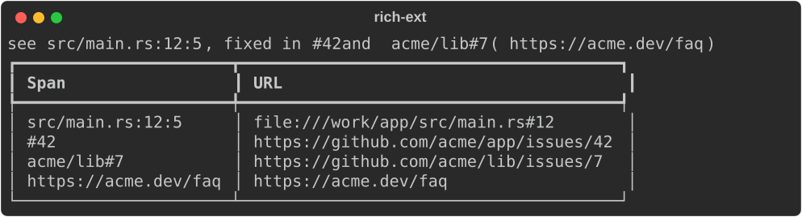
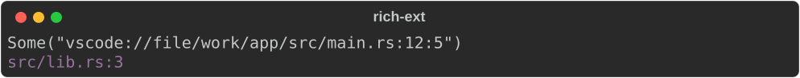
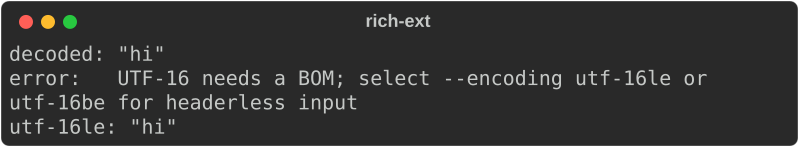

# Extensions

`rs-rich-ext` is where everything that is *not* in Python `rich` lives:
semantic styles, extra highlighters, hyperlinks, diagnostics, logging, macros
and more. This page covers the pieces every other ext feature builds on: the
extension registry, the extended theme, highlighters, hyperlinks and the
input-safety helpers.

```bash
cargo add rs-rich rs-rich-ext
```

The packages are `rs-rich` and `rs-rich-ext`; the `use` lines are `rich` and
`rich_ext`.

## Why a separate crate

`rs-rich` (the core) is a faithful mirror of upstream `rich`: its default
behaviour matches the Python library, and golden tests check covered output
byte for byte. That is what lets the port absorb a new upstream release as a
diff instead of a merge.

So the rule is: **the core never learns about our features.** Our additions
live in `rs-rich-ext` and reach the core only through its public API and a few
extension-point traits (`Renderable`, `Highlighter`, `RenderEnvironment`).
The dependency only goes one way:

```text
rs-rich-ext ──▶ rs-rich        (the core has no idea rs-rich-ext exists)
```

In practice this means:

- A plain `rich::Console` behaves like Python `rich`. Nothing in this crate
  changes it until you opt in.
- Opting in is explicit: install extensions onto a console, pass a theme, wrap
  a renderable. There is no global state and no auto-discovery.
- Anything here renders through ordinary core types, so it mixes freely with
  `Table`, `Panel`, `Text` and the rest.

See [Extending](../../PLUGINS.md) for the design and the roadmap to a public
plugin API.

## Installing the default extensions

`ConsoleExt::install_extensions` registers this crate's default extensions on a
console. Today that is `NumberHighlighter`, which styles every run of ASCII
digits, including ones inside words that core's `ReprHighlighter` leaves
alone:

```rust
--8<-- "crates/rich-ext/examples/guide_extensions.rs:install"
```



The first line is the core alone: `3` and `12` are numbers to
`ReprHighlighter`, but `build42` and `x86_64` are not. The second line adds the
ext highlighter.

In an application you would normally write:

```rust
use rich::Console;
use rich_ext::ConsoleExt;

let mut console = Console::new();
console.install_extensions();
console.print_str("build42 finished");
```

!!! note "Highlighters only run on markup strings"

    Registered highlighters run in `print_str`, `render_str_to_string` and
    `build_text`: the paths that parse console markup. Printing a `Text`,
    `Table` or other renderable with `print` does not re-highlight it.

## The extension registry

`ExtensionRegistry` holds *factories*, not instances. `install` calls each
factory and adds the result to a console, so one registry can set up any
number of consoles, in a fixed order.

```rust
--8<-- "crates/rich-ext/examples/guide_extensions.rs:registry"
```

Install it and print as usual:

```rust
--8<-- "crates/rich-ext/examples/guide_extensions.rs:registry-use"
```


- `ExtensionRegistry::new()` is empty; `ExtensionRegistry::with_defaults()`
  holds what `install_extensions` installs.
- `register_highlighter` returns `&mut Self`, so calls chain.
- Highlighters must be `Send`, so the console stays `Send` (a `Live` display
  may move it to a refresh thread).
- The registry only knows highlighters today. The registry API is usable but
  not yet a stability promise; see [Extending](../../PLUGINS.md).

## Writing a highlighter

A highlighter is any type implementing the core `Highlighter` trait: it gets
the plain text of a `Text` and adds style spans to it.

```rust
--8<-- "crates/rich-ext/examples/guide_extensions.rs:highlighter"
```

Useful `Text` methods for highlighters:

| Method | What it does |
|---|---|
| `highlight_words(&words, style, case_sensitive)` | Style every occurrence of any word |
| `highlight_regex(pattern, Some(style), prefix)` | Style regex matches; named groups get `prefix` + group name as a theme key |
| `stylize(style, start, end)` | Style a byte range of `plain()` |

Gotchas:

- Spans are byte offsets into `text.plain()`, not character or cell indexes.
- Registered highlighters run *before* the built-in `ReprHighlighter`, and
  explicit markup is applied last, so `[green]42[/]` stays green.
- Styles can be theme names (`"repr.number"`): they are resolved when the text
  is rendered, against the console's theme.

## The extended theme

Core's default theme is upstream's list of styles and nothing more. Upstream
has no `[error]` or `[warning]` style, so neither does the core.
`rich_ext::theme::extended_theme()` returns upstream's theme plus our names:

```rust
--8<-- "crates/rich-ext/examples/guide_extensions.rs:theme"
```

```rust
--8<-- "crates/rich-ext/examples/guide_extensions.rs:theme-use"
```


What it adds:

| Names | Styles | Used by |
|---|---|---|
| `error`, `warning`, `info`, `success` | `bold red`, `yellow`, `cyan`, `bold green` | your markup (`EXTRA_STYLES`) |
| `help.*`, `config.*` | usage, headings, options, metavars, config winners | [CLI authoring](cli-authoring.md) (`cli_doc::STYLES`) |
| `diff.*`, `test.*` | added/removed lines, hunks, test states | [Diffs and test reports](diffs-and-test-reports.md) (`diff::STYLES`) |

Other ext renderables look up their own keys and fall back to a built-in style
when the theme does not define them, so they work with any theme. To restyle
them, insert the key into your theme:

| Prefix | Keys | Renderable |
|---|---|---|
| `diagnostic.` | `error`, `warning`, `info`, `note`, `help`, `message`, `headline`, `gutter`, `secondary`, `suggestion` | [`Diagnostic`](diagnostics.md) |
| `stacktrace.` | `error`, `function`, `location`, `library`, `bridge` | [`StackTrace`](diagnostics.md#stack-traces) |
| `event.` | `message`, `field`, `value`, `severity.<level>` | [`StructuredEvent`](logging.md#structured-events) |

```rust
let mut theme = rich_ext::theme::extended_theme();
theme.insert("diagnostic.error", rich::Style::parse("bold magenta").unwrap());
```

## Hyperlinks

`hyperlink::Hyperlinker` finds linkable things in text and turns them into
[OSC 8](https://gist.github.com/egmontkob/eb114294efbcd5adb1944c9f3cb5feda)
terminal hyperlinks:

- `http://` and `https://` URLs (trailing punctuation is left out);
- file paths: absolute, `./`, `../`, `~/`, `dir/file.ext`, and a bare
  `file.ext` when a line follows;
- `path:line` and `path:line:column` locations;
- `#123` and `owner/repo#123` references, once you set a repository.

```rust
--8<-- "crates/rich-ext/examples/guide_extensions.rs:hyperlinks"
```



Links are style attributes, so they cost nothing where they cannot be shown:
a console that is not a terminal prints the same text with no escape codes.
(The screenshot cannot show links; in a terminal that supports OSC 8, the
spans are clickable.)

### Options

| Builder | Default | Effect |
|---|---|---|
| `urls(bool)` | on | Link `http(s)://` URLs |
| `paths(bool)` | on | Link paths and `path:line:col` |
| `base_dir(dir)` | none | Resolve relative paths against `dir` |
| `repository(url)` | none | Enable `#123` references, linked to `url/issues/123` |
| `editor(template)` | none | Link files through an editor URL instead of `file://` |
| `enabled(bool)`, `disabled()` | enabled | The plain fallback, chosen explicitly |

`find(text)` returns the `Link`s (byte `start`, `end` and `url`) without
touching anything; `link(&mut text)` adds the link spans; `file_url` and
`reference_url` build single URLs.

### Editor links

With an editor template, file links open in your editor at the right place.
`{path}`, `{line}` and `{column}` are replaced; a missing line or column
becomes 1.

```rust
--8<-- "crates/rich-ext/examples/guide_extensions.rs:editor"
```



!!! tip "No slash after `file`"

    `{path}` is an absolute path that already starts with `/` (Windows paths
    become `/C:/…`), so write `vscode://file{path}:{line}:{column}`.
    `vscode://file/{path}…` produces a double slash.

`location(path, line, column, style)` builds a `path:line:col` label that is
already linked; diagnostics, the diagnostics dashboard and stack traces use it
for their locations.

### Anywhere a highlighter is accepted

`Hyperlinker` implements `Highlighter`, so it can be registered on a console
or handed to the [log handler](logging.md#handler-options):

```rust
use rich_ext::{hyperlink::Hyperlinker, RichHandler};

let handler = RichHandler::new(rich::Console::new())
    .highlighter(Some(Box::new(Hyperlinker::new())));
```

## Sanitizing untrusted text

Core `rich` keeps the ESC character, as upstream does, so text that contains
escape sequences can move the cursor or clear the screen when printed. When you
display file names, log lines or other text you did not write, pass it through
`sanitize_terminal_controls` first:

```rust
--8<-- "crates/rich-ext/examples/guide_extensions.rs:sanitize"
```


- ESC becomes `␛`, other C0 controls become their Unicode control pictures
  (`␇`, `␍`), DEL becomes `␡`, and C1 controls become `\u{009B}`-style text.
- Newlines and tabs are kept: they are layout, not attacks.
- It does not touch markup. For untrusted text passed to `print_str`, also
  escape it with `rich::markup::escape` (see
  [Markup and style](../../tutorial/02-markup.md)).

## Decoding input explicitly

`encoding::Encoding` decodes bytes strictly, in an encoding you choose. It
never guesses:

```rust
--8<-- "crates/rich-ext/examples/guide_extensions.rs:encoding"
```



| Variant | Accepts |
|---|---|
| `Utf8` | UTF-8, with or without a BOM |
| `Utf16` | UTF-16 **with** a BOM (the BOM picks the byte order) |
| `Utf16Le`, `Utf16Be` | That byte order, with or without a matching BOM |

Malformed input, an odd byte count, an unpaired surrogate, a BOM that
contradicts the chosen byte order and UTF-32 signatures are all errors
(`io::ErrorKind::InvalidData`). `Encoding` parses from `utf-8`, `utf-16`,
`utf-16le` and `utf-16be`, which is how the `rich` CLI's `--encoding` option
uses it.

## Run the example

```bash
cargo run -p rs-rich-ext --example guide_extensions
```

## See also

- [The ext crate at a glance](index.md): every module and its feature flag.
- [Diagnostics](diagnostics.md) and [Logging](logging.md), which link their
  locations with `Hyperlinker`.
- [Markup and style](../../tutorial/02-markup.md) for themes and highlighting in
  the core.
- [Extending](../../PLUGINS.md): the extension points and plugin roadmap.
- API: [`ConsoleExt`](https://docs.rs/rs-rich-ext/latest/rich_ext/trait.ConsoleExt.html),
  [`ExtensionRegistry`](https://docs.rs/rs-rich-ext/latest/rich_ext/registry/struct.ExtensionRegistry.html),
  [`theme`](https://docs.rs/rs-rich-ext/latest/rich_ext/theme/index.html),
  [`Hyperlinker`](https://docs.rs/rs-rich-ext/latest/rich_ext/hyperlink/struct.Hyperlinker.html),
  [`sanitize_terminal_controls`](https://docs.rs/rs-rich-ext/latest/rich_ext/sanitize/fn.sanitize_terminal_controls.html),
  [`Encoding`](https://docs.rs/rs-rich-ext/latest/rich_ext/encoding/enum.Encoding.html),
  [`Highlighter`](https://docs.rs/rs-rich/latest/rich/protocol/trait.Highlighter.html).
