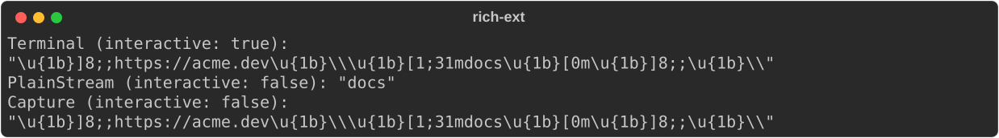
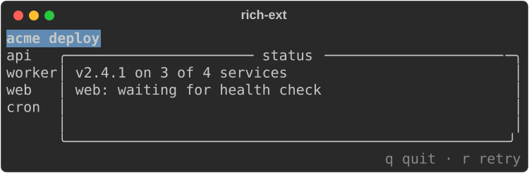
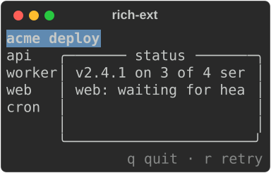
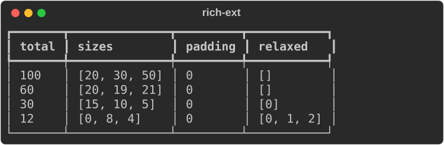
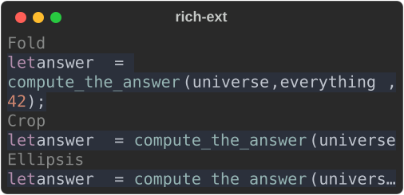
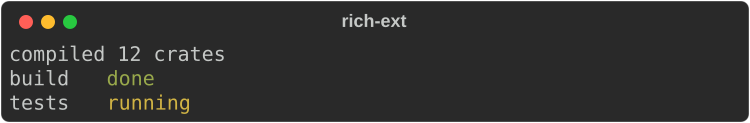

# Live regions and bounded layout

Three ext modules give you strict control over *where* output goes and *how
much room* it gets:

- **`target`**: `RenderTarget` describes a destination (a terminal, a plain
  stream, a capture, HTML, SVG) completely, so rendering never depends on
  what the process happens to be attached to.
- **`layout`**: `LayoutNode` splits a region into rows and columns with
  min/max/preferred/flex constraints and an explicit overflow policy per cell.
  `Overflowing` gives any renderable that overflow policy.
- **`live`**: `LiveCoordinator` owns one writer and keeps several updating
  regions at the bottom of the terminal while ordinary lines print above them.

None needs a feature flag. They sit beside the core's `Layout` and `Live`,
which keep upstream's behaviour; reach for these when you need hard bounds or
several live regions.

## Why rendering here is deterministic

A plain `Console::new()` looks at the process: is stdout a terminal, how wide
is it, what colours does it support. That is right for a quick script, and it
is what upstream does. It is wrong for tests, for rendering the same thing to
two places, and for any renderable nested inside another: a nested renderable
cannot know where its output will end up.

So the ext crate separates **observing** from **rendering**:

1. Observe once, at the edge of your program (`is_terminal()`, the terminal
   size, your `--color` flag, or [`Capabilities`](capabilities.md) detection).
2. Describe the destination in a `RenderTarget`.
3. Render against the target. Nothing below this point probes the
   environment, so the same target and input always give the same bytes.

## Render targets

```rust
--8<-- "crates/rich-ext/examples/guide_live_layout.rs:target"
```

`TargetCapabilities` is plain data from the core's `protocol` module: `width`,
`height`, `color_system`, `interactive`, `unicode`, `hyperlinks` and `sixel`.
`TargetKind` then applies a policy on top:

| Kind | Policy |
|---|---|
| `Terminal` | as described |
| `Custom` | as described; your writer declares its own capabilities |
| `PlainStream` | no colour, no links, not interactive |
| `Capture`, `Html`, `Svg` | not interactive (no cursor control, no sixel) |

```rust
--8<-- "crates/rich-ext/examples/guide_live_layout.rs:targets"
```



What a target gives you:

- `target.console()`: a `Console` configured from the capabilities (width,
  height, colour, `ascii_only` when not Unicode, no emoji without Unicode,
  automatic highlighting off). It carries the target as its
  `RenderEnvironment`, so nested renderables can ask for the capabilities.
- `target.segments(&renderable)`: rendered segments with the policy applied:
  control segments dropped when not interactive, links stripped when
  hyperlinks are off.
- `target.text(&renderable)`: those segments as a string.
- A zero width or height renders nothing, without calling the renderable.

`target::resolve_capabilities(observations, overrides)` merges what you
observed with explicit overrides and records where each value came from
(`Configured`, `Detected`, `Inferred`, `Default`), still without reading the
environment itself.

## Bounded layouts

A `LayoutNode` is either a leaf holding a renderable or a split of child nodes
along an `Axis`. Every node has a width and a height `Constraint`.

```rust
--8<-- "crates/rich-ext/examples/guide_live_layout.rs:dashboard-layout"
```

```rust
--8<-- "crates/rich-ext/examples/guide_live_layout.rs:layout"
```



The same layout at 30 columns: the header and footer keep one row, the
sidebar keeps its content width, and the panel takes what is left, clipped at
its boundary:



Node builders:

| Builder | Effect |
|---|---|
| `LayoutNode::leaf(Box<dyn Renderable>)` | A cell holding a renderable |
| `LayoutNode::split(axis, children)` | Columns (`Axis::Horizontal`) or rows (`Axis::Vertical`) |
| `.width(c)`, `.height(c)` | The node's constraint on that axis |
| `.content_width()`, `.content_height()` | Prefer the content's natural size (still within min/max) |
| `.align(horizontal, vertical)` | `Alignment::Start`, `Center` or `End` inside the allocated cell |
| `.overflow(OverflowPolicy::…)` | How a leaf's lines fit its width (default `Fold`) |
| `.validate()` | Check every constraint in the tree |

Gotchas:

- **A layout fills the height it is given.** Printed plainly it takes the
  console's height (the whole terminal); pass a height with
  `print_with(&layout, &console.options().update_dimensions(w, h))`.
- **Invalid constraints render nothing.** Rendering validates the tree and
  returns no output on failure; call `validate()` yourself to get the
  `ConstraintError`.
- A leaf is rendered with no-wrap and then fitted with the node's overflow
  policy. A `Text` leaf wraps or folds; a `Panel` leaf draws its border at the
  cell size and crops content that is too wide for it.
- Every container clips at its boundary, even with `OverflowPolicy::Visible`.
  A cell that gets zero columns or rows skips its children.
- Leaves receive their region's height, as in upstream `Layout`, so a `Panel`
  fills its cell. Use `.content_height()` for natural height.

### Constraints and allocation

A `Constraint` has four fields:

| Field | Meaning |
|---|---|
| `min` | Never below this, unless the total is smaller than all minimums |
| `max` | Never above this (`None`: unbounded) |
| `preferred` | A fixed size request (`Constraint::fixed(n)`); needs `flex: 0` |
| `flex` | Share of leftover space (default 1); needs `preferred: None` |

`layout::allocate(total, &constraints)` is the allocator on its own. It
returns an `Allocation` with the `sizes`, the `padding` left over (when
maxima cap growth) and which indexes were `relaxed` below their request:

```rust
--8<-- "crates/rich-ext/examples/guide_live_layout.rs:allocate"
```



- With room to spare, requests are met and flexible items share the rest by
  weight, up to their `max`.
- Under pressure, requests shrink toward their `min`, in proportion to how
  far above the minimum they were (the `30` row).
- When even the minimums do not fit, sizes are proportional to the minimums
  (the `12` row).
- `allocate` returns `ConstraintError::InvalidBounds`,
  `InvalidPreference`, `InvalidWeight` or `ArithmeticOverflow` rather than
  guessing.

### Overflow policies

`OverflowPolicy` is shared by layouts, events, diagnostics and
`Overflowing`:

| Policy | Long lines |
|---|---|
| `Wrap` | wrap at spaces; a word longer than the width is cropped |
| `Fold` | wrap at spaces; a word longer than the width continues on the next line |
| `Crop` | cut at the width |
| `Ellipsis` | cut and end with `…` |
| `Visible` | not cut by the node (the container still clips) |

Wide characters are never split. `Overflowing::new(renderable, policy)`
applies a policy to any renderable. The core's `Syntax` never wraps its lines
and `Json` wraps like text; wrapped in `Overflowing`, both follow the policy
you choose:

```rust
--8<-- "crates/rich-ext/examples/guide_live_layout.rs:overflow"
```



Output that already fits is returned byte for byte as the core renders it.
`layout::fit_segments(segments, width, policy)` is the same fitting for
segments you produced yourself.

## Coordinated live regions

`LiveCoordinator` keeps a stack of regions at the bottom of an inline
display. You add, update and remove regions, print ordinary lines through the
coordinator, and call `refresh` when you want the screen redrawn:

```rust
--8<-- "crates/rich-ext/examples/guide_live_layout.rs:live"
```

```rust
--8<-- "crates/rich-ext/examples/guide_live_layout.rs:live-run"
```

A frame from the middle of that run: the printed line has scrolled up and both
regions sit below it.



How it behaves:

- **One writer.** The coordinator owns the writer. Print through
  `live.print(…)` (or `live.handle().print(…)`), never with `Console::print`
  or another `Live` on the same stream, or the display tears.
- **Explicit refresh.** `add` and `update` only record content;
  `refresh` redraws, repainting only the rows that changed. `print` clears the
  regions, writes the lines, and repaints.
- **Opaque ids.** `add` returns a `RegionId`. `update` and `remove` take it by
  value, so clone it to use it again. An id from another coordinator is
  rejected with `LiveError::InvalidRegion`.
- **Safe viewport.** Regions get `width - 1` columns and `height - 1` rows: one
  guard column avoids terminal auto-wrap and one row is left for insertion.
  Region rows are cropped, printed lines are folded.
- **Plain content only.** Content with control segments, control characters
  (other than newline and tab) in its text, or any control character in a
  style's link is rejected with `LiveError::UnsupportedControl`.
- **Non-interactive targets.** With `interactive: false` (a `PlainStream`,
  say) nothing is repainted: printed lines are written as they come and
  `finish` writes the regions' final state once, every row of it whatever
  the target's height, so logs stay readable.
- **Resize.** `resize(width, height)` updates the viewport and repaints;
  rerender your region content for the new width yourself. Interactivity and
  the writer are fixed for the coordinator's lifetime: finish it and create a
  new one to switch.
- **Cleanup.** `finish` clears the regions, shows the cursor again and reports
  I/O errors. `Drop` does the same on a best-effort basis, including during
  unwinding, but nothing can run after `SIGKILL` or an abort.

## Run the example

```bash
cargo run -p rs-rich-ext --example guide_live_layout
```

The `layout` and `live_regions` examples in `crates/rich-ext/examples` are
smaller versions; `live_regions -- --script` drives a coordinator from stdin.

## See also

- [Progress and live output](../../tutorial/05-live.md) and
  [Layout](../../tutorial/04-layout.md) in the tutorial: the core `Live`,
  `Progress` and `Layout`.
- [Capabilities](capabilities.md): detect what a terminal supports, with
  provenance, before building a target.
- [QA](qa.md): screenshots, stress tests and fuzzing, all rendered through
  explicit targets.
- [Logging](logging.md) and [Diagnostics](diagnostics.md): the other users of
  `OverflowPolicy`.
- API: [`target`](https://docs.rs/rs-rich-ext/latest/rich_ext/target/index.html),
  [`layout`](https://docs.rs/rs-rich-ext/latest/rich_ext/layout/index.html),
  [`live`](https://docs.rs/rs-rich-ext/latest/rich_ext/live/index.html),
  [`TargetCapabilities`](https://docs.rs/rs-rich/latest/rich/protocol/struct.TargetCapabilities.html).
