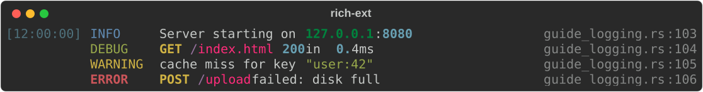
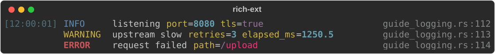
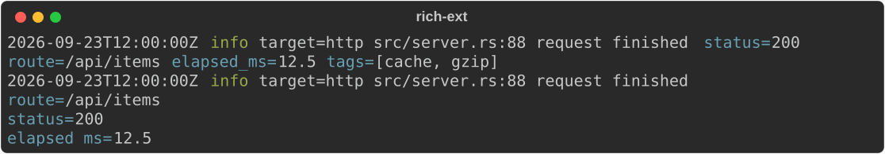
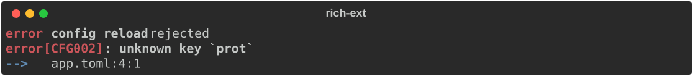

# Logging

Three pieces turn log records into rich output:

- **`StructuredEvent`** (`rich_ext::event`): one log record as data: a
  message, typed fields and context (time, severity, target, source location).
  It renders on its own as a compact or expanded line.
- **`RichHandler`**: lays events out like Python rich's `logging.RichHandler`:
  time, level, message, and the source file on the right.
- **Adapters** (features `log` and `tracing`): `LogAdapter` and `EventLayer`
  turn `log` records and `tracing` events into `StructuredEvent`s and hand them
  to an `EventSink`, such as a `RichHandler`.

```toml
rs-rich-ext = { version = "…", features = ["log"] }        # the log facade
rs-rich-ext = { version = "…", features = ["tracing"] }    # tracing + tracing-subscriber
```

`StructuredEvent` and `RichHandler` need no feature.

## `log` through `RichHandler`

Create the handler, then install a `LogAdapter` that sends records to it.
Nothing is installed for you: your application decides which logger is
global.

```rust
--8<-- "crates/rich-ext/examples/guide_logging.rs:install-log"
```

```rust
--8<-- "crates/rich-ext/examples/guide_logging.rs:handler"
--8<-- "crates/rich-ext/examples/guide_logging.rs:handler-install"
```

```rust
--8<-- "crates/rich-ext/examples/guide_logging.rs:log-lines"
```



Reading a line from left to right:

- **Time**: blanked when it repeats the previous line's time.
- **Level**: padded to 8 cells in `logging.level.<name>`. Python's names are
  used (`WARNING`, `CRITICAL`); `log::Level::Trace` shows as `TRACE`.
- **Message**: run through `ReprHighlighter` (numbers, strings, paths, IPs),
  with HTTP methods (`GET`, `POST`, …) in `logging.keyword`.
- **Path**: the file name and line, linked to the full path.

`LogAdapter::new(sink, level)` drops records above `level`, and so should
`log::set_max_level`. Leaking the adapter with `Box::leak` is the usual way to
get the `&'static` logger `log::set_logger` wants; `log` has no other way to
uninstall a logger anyway.

## `tracing` through `RichHandler`

`EventLayer` is a `tracing_subscriber::Layer`. Compose it with a subscriber you
own, globally or for a scope:

```rust
--8<-- "crates/rich-ext/examples/guide_logging.rs:tracing"
```

```rust
--8<-- "crates/rich-ext/examples/guide_logging.rs:tracing-lines"
```



- The `message` field becomes the message; every other field is appended as
  `key=value`.
- Integers keep their type, including unsigned and 128-bit values; floats and
  bools too. Fields recorded with `Debug` (`?value`) become strings.
- Spans are not recorded, only events.

## Handler options

`RichHandler` mirrors upstream's constructor arguments as builder methods:

```rust
--8<-- "crates/rich-ext/examples/guide_logging.rs:options"
```


| Builder | Default | Upstream |
|---|---|---|
| `show_time(bool)`, `show_level(bool)`, `show_path(bool)` | all on | `show_time`, `show_level`, `show_path` |
| `omit_repeated_times(bool)` | on | `omit_repeated_times` |
| `level_width(Option<usize>)` | `Some(8)` | fixed at 8 upstream |
| `markup(bool)` | off | `markup`: parse messages as console markup |
| `highlighter(Option<Box<dyn Highlighter + Send + Sync>>)` | `ReprHighlighter` | `highlighter`; `None` disables it |
| `keywords(words)` | HTTP methods | `keywords` |
| `enable_link_path(bool)` | on | `enable_link_path` |
| `time_format(closure)` | UTC `[HH:MM:SS]` | `log_time_format` |

Any highlighter works, including a [`Hyperlinker`](extensions.md#hyperlinks)
that makes issue references, paths and URLs in messages clickable:

```rust
--8<-- "crates/rich-ext/examples/guide_logging.rs:links"
```


!!! note "Differences from Python rich"

    - Time is **UTC** by default: local time would need a time-zone
      dependency. Supply `time_format` for local time or another format; an
      event's own `context.timestamp` always wins.
    - `rich_tracebacks` has no counterpart. Render errors as
      [diagnostics](diagnostics.md) instead.

Beyond the facades, a handler can be used directly:
`handler.emit_event(&event)` prints one event to the handler's console, and
`handler.render(&event)` returns the laid-out row as a `Table` for you to print
elsewhere.

## Your own sink

The adapters talk to an `EventSink`, a one-method trait. Implement it to send
events anywhere: a file, a channel, a test buffer.

```rust
--8<-- "crates/rich-ext/examples/guide_logging.rs:sink"
```

Pass it as `Arc::new(Recorder::default())` to `LogAdapter::new` or
`EventLayer::new`. The screenshots on this page were made that way: records go
to a `Recorder`, and `RichHandler::render` lays them out on an SVG console.

Errors returned by `emit` are dropped, never logged: logging a logging failure
could recurse forever.

## Structured events

A `StructuredEvent` is plain data that renders itself. The adapters build them
for you, but you can make them directly:

```rust
--8<-- "crates/rich-ext/examples/guide_logging.rs:event"
```



- **Message**: `Message::Literal(text)` prints as written;
  `Message::Markup(text)` is parsed as console markup. Literal is the safe
  choice for anything user-supplied.
- **Fields**: `.field(key, Value)` appends a field; setting an existing key
  replaces its value in place. `Value` covers null, bool, signed and unsigned
  integers (64 and 128 bits), floats, strings, lists and maps.
- **Order**: fields render in insertion order; `field_order(keys)` moves the
  named ones first and `hide_fields(keys)` leaves some out.
- **Context**: `EventContext` holds `timestamp`, `severity`, `target`,
  `module`, `source`, `thread`, `task` and `correlation_id`. All optional,
  and nothing is filled in implicitly: no clock, thread or environment reads.
- **View**: `Compact` (default) puts fields on the message line;
  `Expanded` gives each field its own line and pretty-prints lists and maps.
- **Overflow**: `.overflow(OverflowPolicy::…)` picks how long lines fit
  (default `Fold`); see [bounded layout](live-and-layout.md#overflow-policies).

Theme keys: `event.message`, `event.field` (default cyan), `event.value` and
`event.severity.<trace|debug|info|warn|error|fatal>`.

### Attaching diagnostics

An event can carry any number of [diagnostics](diagnostics.md), rendered
under its line:

```rust
--8<-- "crates/rich-ext/examples/guide_logging.rs:event-diagnostic"
```



## Run the example

```bash
cargo run -p rs-rich-ext --example guide_logging --features log,tracing
```

## See also

- [Diagnostics](diagnostics.md): errors, snippets and stack traces.
- [Extensions](extensions.md#hyperlinks): `Hyperlinker` and the theme keys.
- [Macros](macros.md#printing): `rich_trace!` for quick, non-logging trace
  lines.
- The `log_adapter`, `tracing_adapter` and `rich_handler` examples in
  `crates/rich-ext/examples`.
- API: [`RichHandler`](https://docs.rs/rs-rich-ext/latest/rich_ext/log_handler/struct.RichHandler.html),
  [`event`](https://docs.rs/rs-rich-ext/latest/rich_ext/event/index.html),
  [`adapters`](https://docs.rs/rs-rich-ext/latest/rich_ext/adapters/index.html),
  [`LogRender`](https://docs.rs/rs-rich/latest/rich/log_render/struct.LogRender.html).
