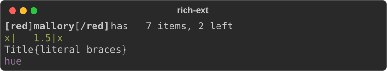
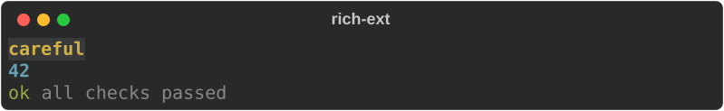
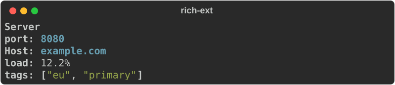
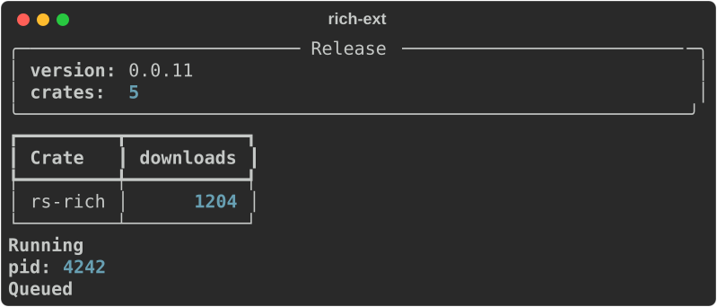
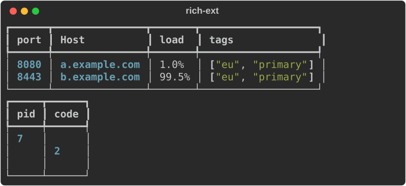
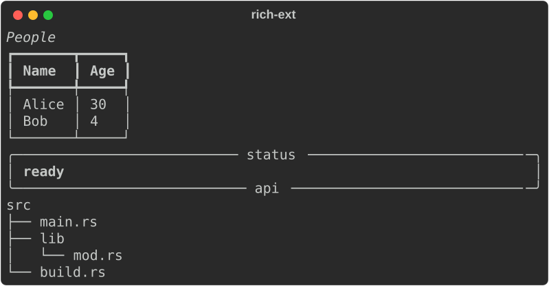
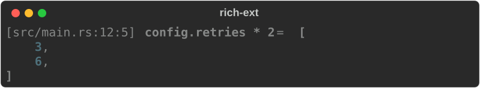

# Macros

`rs-rich-ext` has two groups of macros:

- **Checked macros** (feature `macros`): `richf!`, `style!`, `theme_key!`,
  `markup!`, `#[derive(Rich)]` and the print macros `rich_println!`,
  `rich_eprintln!` and `rich_trace!`. They check markup and styles **at compile
  time**, so a typo in a tag is a build error instead of silently unstyled
  output.
- **Builder macros** (no feature): `rich_table!`, `rich_panel!`, `rich_tree!`,
  `rich_progress!` and `rich_dbg!`, shorthands for common core types.

```toml
rs-rich-ext = { version = "…", features = ["macros"] }
```

The procedural macros live in the `rs-rich-macros` crate. Do not depend on it
directly: `rs-rich-ext` re-exports them and provides the runtime they expand
to.

## `richf!`: `format!` for markup

`richf!` takes a markup string with `format!`-style placeholders and returns a
`rich::Text`:

```rust
--8<-- "crates/rich-ext/examples/guide_macros.rs:richf"
```



- **Values are escaped.** A value containing `[red]` prints the brackets; it
  cannot inject markup. This is the main reason to prefer `richf!` over
  `print_str(&format!(…))`.
- Placeholders work as in `format!`: implicit captures (`{name}`), positions
  (`{0}`), named arguments (`{v}` with `v = …`), format specs (`{count:>3}`,
  `{v:>width$}`) and `{{`/`}}` for literal braces. Unused arguments are an
  error.
- A placeholder *inside* a tag (`[{colour}]`) is inserted as markup, so the
  style can be chosen at run time. That tag is checked at run time only.
- Tags must be balanced and properly nested, and each tag must be a style
  (`bold red on blue`, `#ff8800`), a `[link=…]` or `[@…]` tag, or a key in the
  **default** theme (`repr.number`, `logging.level.info`).
- For your own theme keys, including the [extended theme](extensions.md#the-extended-theme)'s
  `error` or `warning`, declare them first: `richf!(keys["app.title", "error"], …)`.

### What a mistake looks like

A misspelt style is a compile error that points at the literal. Compiling

```rust
let text = richf!("[bodl]hello[/] {name}");
```

gives:

```text
error: unknown style or theme key `[bodl]`: it would render unstyled. Use a style such as `bold red`, a default theme key such as `repr.number`, or declare custom keys with `keys["bodl"]`
 --> src/main.rs:5:23
  |
5 |     let text = richf!("[bodl]hello[/] {name}");
  |                       ^^^^^^^^^^^^^^^^^^^^^^^
```

Other compile errors: a closing tag that matches no open tag
(`[bold]x[/italic]`), a tag left open at the end, a malformed placeholder and an
unused argument.

!!! note "Stricter than the runtime"

    The macros use the core's own markup and style parsers, so anything they
    accept renders the same at run time. They are deliberately stricter in two
    ways: an unknown style name and an unclosed tag are errors, where the
    runtime would render them as no-ops.

## Checked literals: `style!`, `theme_key!`, `markup!`

```rust
--8<-- "crates/rich-ext/examples/guide_macros.rs:literals"
```



| Macro | Returns | Checks |
|---|---|---|
| `style!("bold red on white")` | `rich::Style` | parses as a style |
| `theme_key!("repr.number")` | `&'static str` | exists in the default theme |
| `markup!("[green]ok[/]")` | `&'static str` | valid, balanced markup with known tags; accepts `keys[…]` like `richf!` |

## `#[derive(Rich)]`

Derive `Rich` on a struct or enum to print it as labelled fields. The derive
implements `Renderable`, so the value goes straight to `console.print`:

```rust
--8<-- "crates/rich-ext/examples/guide_macros.rs:derive"
```

```rust
--8<-- "crates/rich-ext/examples/guide_macros.rs:derive-use"
```



Field options, in `#[rich(…)]`:

| Option | Effect |
|---|---|
| `skip` | Leave the field out (secrets, internals) |
| `label = "Host"` | The label, instead of the field name |
| `style = "bold cyan"` | Style the value; checked at compile time |
| `display` | Format with `Display` instead of `Debug`. The default for `String`, `str`, `char` and `Cow` fields |
| `format = "{:.1}%"` | Format with this `format!` spec |
| `justify = "right"` | Alignment in table presentations: `left`, `center` or `right` |
| `order = N` | Sort key; fields default to their position, so `-1` moves one first |

`Debug` values without a style are coloured by `ReprHighlighter`: numbers,
strings, booleans and collections are highlighted as in `Pretty`.

### Panels, tables and enums

Type-level options choose the presentation:

| Option | Presentation |
|---|---|
| (none) | a bold title line, then a label/value grid |
| `#[rich(panel)]` | the grid inside a panel, titled |
| `#[rich(table)]` | a one-row table with the labels as headers |
| `title = "…"` | the title. Without it, a panel uses the type name and other structs have none; on an enum it replaces every variant name |

Enums use the variant name as the title and the variant's fields as rows.

```rust
--8<-- "crates/rich-ext/examples/guide_macros.rs:derive-presentations"
```

```rust
--8<-- "crates/rich-ext/examples/guide_macros.rs:derive-presentations-use"
```



### Many records as a table

`rich_ext::derive::table` lays out a slice of records as one table, with a
column per label:

```rust
--8<-- "crates/rich-ext/examples/guide_macros.rs:derive-table"
```



Columns are the union of all labels in first-seen order; each takes the
justification of its first field.

### Without the derive

The derive implements the `derive::RichRecord` trait: a title and a list of
`derive::Field`s, plus a `Presentation`. Implement it by hand for types you
cannot annotate, then use `derive::render` in your own `Renderable` impl or
pass the values to `derive::table`. `derive::table` works on hand-written
impls without the `macros` feature.

## Builder macros

These need no feature. Each returns the ordinary core type, so you can keep
configuring it:

```rust
--8<-- "crates/rich-ext/examples/guide_macros.rs:builders"
```



| Macro | Builds |
|---|---|
| `rich_table!([headers…], [cells…], …)` | `Table`; cells are anything `Display` |
| `rich_panel!("markup", title = …, subtitle = …)` | `Panel` around markup; any `name = value` calls that builder method |
| `rich_panel!(renderable, …)` | `Panel` around any renderable expression |
| `rich_tree!("root" => ["leaf", "branch" => ["leaf"]])` | `Tree` |
| `rich_progress!(iter, "description")` | core `track(iter, description)`: iterate with a progress bar |

`rich_panel!` with a string literal parses it as markup at run time (it is not
checked); unparseable markup falls back to the literal text.

## Printing

```rust
--8<-- "crates/rich-ext/examples/guide_macros.rs:print"
```

| Macro | Writes | Feature |
|---|---|---|
| `rich_println!(…)` | `richf!(…)` to stdout | `macros` |
| `rich_eprintln!(…)` | `richf!(…)` to stderr | `macros` |
| `rich_trace!(…)` | a dim `file:line` then `richf!(…)` to stderr | `macros` |
| `rich_dbg!(expr)` | `[file:line:col] expr = value` to stderr, value through `Pretty`; returns the value | none |

`rich_dbg!` works like `std::dbg!`: it takes ownership and hands the value
back, accepts several expressions (returning a tuple), and prints just the
location when called with none. Its line looks like this:



The stderr macros colour their output only when stderr is a terminal.

Placeholders capture local variables as they do in `format!`:
`rich_println!("{name}")`, `{name:>5}` and `{name:>width$}` all work, as do
positional and named arguments.

`rich_trace!` is for quick, temporary trace lines. For real logging, route
`log` or `tracing` through [`RichHandler`](logging.md).

## Run the example

```bash
cargo run -p rs-rich-ext --example guide_macros --features macros
```

## See also

- [Markup and style](../../tutorial/02-markup.md): the markup these macros
  check.
- [Extensions](extensions.md#the-extended-theme): extra theme keys to declare
  with `keys[…]`.
- [Structured data](structured-data.md): `print_table` and friends for `serde`
  types, when you would rather not derive.
- API: [`rich_ext` macros](https://docs.rs/rs-rich-ext/latest/rich_ext/#macros),
  [`derive`](https://docs.rs/rs-rich-ext/latest/rich_ext/derive/index.html),
  [`rs-rich-macros`](https://docs.rs/rs-rich-macros/latest/rich_macros/).
