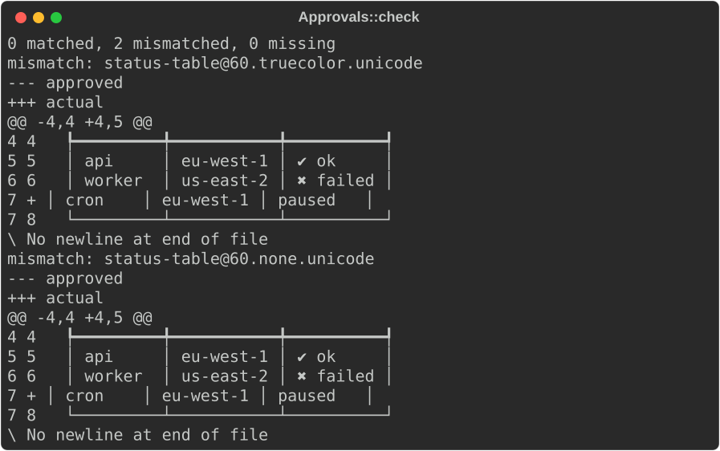
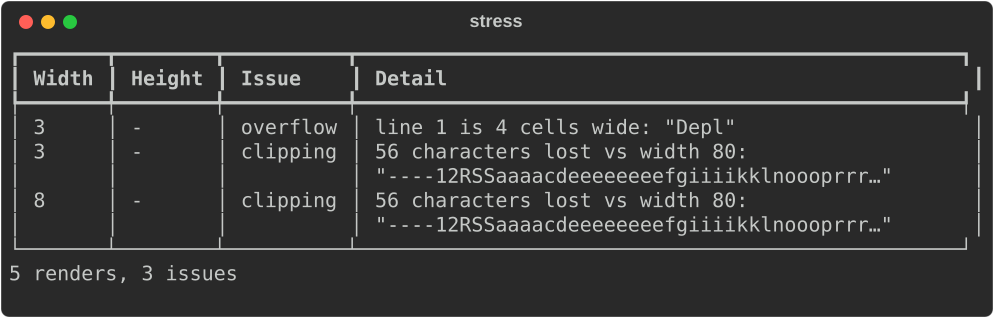
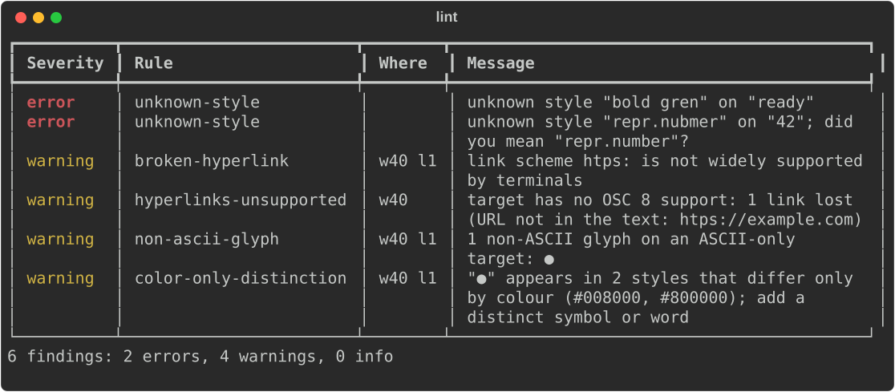
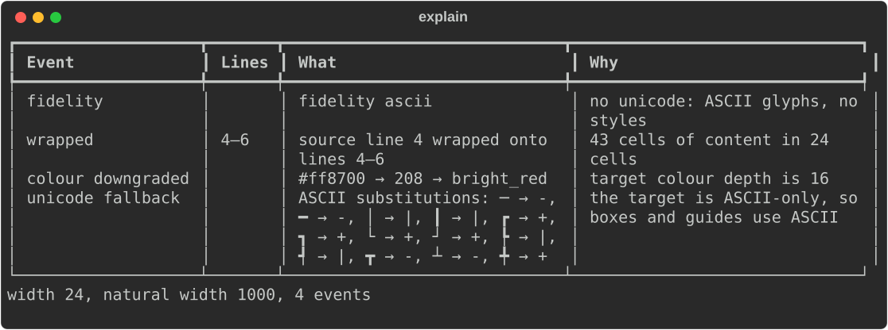
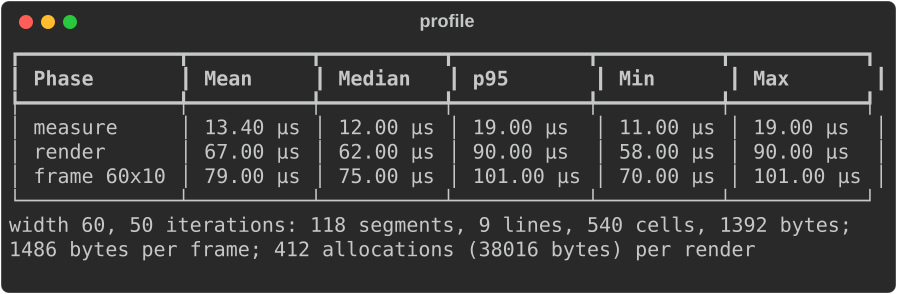
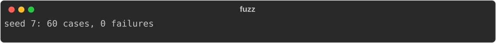
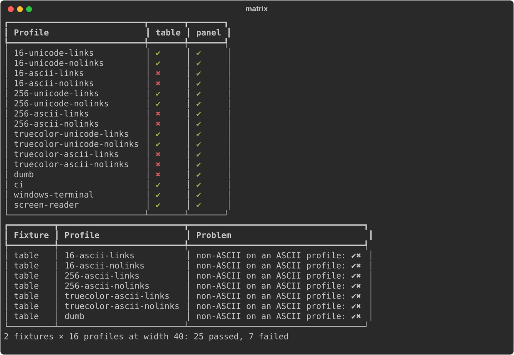
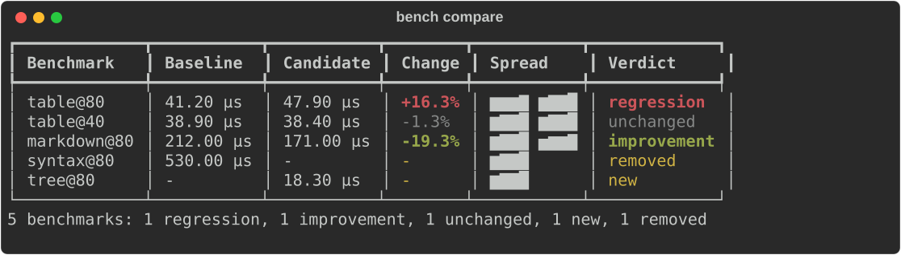

# Quality assurance

`rich_ext::qa` tests how your output renders, not only what it says. It
renders a renderable through explicit capabilities, never the real terminal,
so results are the same on every machine and in CI.

| Module | Answers |
|---|---|
| `screenshot` | Did the output change? Approved text files, with a review workflow |
| `stress` | Does it survive every width and height? |
| `lint` | Is anything clipped, mis-styled, colour-only or unsupported by the target? |
| `explain` | Why did it wrap, truncate, lose colour or fall back to ASCII? |
| `profile` | How long do measure, render and a live refresh take, and how much do they allocate? |
| `fuzz` | Do random renderables break any invariant? |
| `matrix` | Does it hold across 16 terminal profiles? |
| `bench` | Did it get slower than the baseline? |

Everything here needs the `testing` feature. Add it as a dev-dependency so
it never reaches your release build:

```toml
[dev-dependencies]
rs-rich-ext = { version = "0.0.9", features = ["testing"] }
```

The examples come from
[`guide_qa.rs`](https://github.com/buchochelliq-labs/rs-rich-cli/blob/main/crates/rich-ext/examples/guide_qa.rs):

```bash
cargo run -p rs-rich-ext --example guide_qa --features testing
```

They all use this fixture:

```rust
--8<-- "crates/rich-ext/examples/guide_qa.rs:fixture"
```

## Wire it into `cargo test`

Each tool returns a report you can assert on, so a render test is an
ordinary `#[test]`:

```rust
--8<-- "crates/rich-ext/examples/guide_qa.rs:tests"
```

The sections below explain each tool.

## Screenshot approvals

`Screenshot::capture(name, &renderable, &matrix)` renders once per
combination of a `Matrix`: widths × colour depths × Unicode on or off. The
default matrix is 40, 80 and 120 columns × truecolor and no colour × Unicode
and ASCII, which gives 12 shots. Each `Shot` has a key such as
`status-table@80.truecolor.unicode`.

`Approvals::new(dir)` stores approved shots as `<dir>/<name>/<key>.txt`:

- no-colour shots are the plain text;
- colour shots are the ANSI output with escapes written visibly (`\e[1m`),
  so the files are printable and diff line by line.

`check(&shots)` compares shots with those files. A shot that differs, or has
no approved file yet, is written beside it as `<key>.new`. The workflow:

1. Run the tests. New or changed output fails, and `.new` files appear.
2. Review the `.new` files (or the diff in the failure message).
3. Rerun with `RICH_APPROVE=1` to accept them. `approve_all()` does the same
   from code, and `approving(true)` accepts during a check.
4. Commit the `.txt` files. A later match removes stale `.new` files.

```rust
--8<-- "crates/rich-ext/examples/guide_qa.rs:approvals"
```



`assert_screenshots(name, &renderable)` does all of this with the default
matrix. It keeps files in `RICH_SCREENSHOT_DIR`, else
`$CARGO_MANIFEST_DIR/tests/screenshots`, and panics with the diffs.
`assert_screenshots_with(&approvals, name, &renderable, &matrix)` takes your
own directory and matrix.

## Stress

`stress(&renderable, &options)` renders at many widths and heights and
reports:

- **overflow**: a line wider than the width;
- **clipping**: content lost compared with a wide render;
- **unstable wrapping**: more lines at a larger width;
- **panics**;
- **measure mismatch**: output that disagrees with `measure()`.

`StressOptions::default()` uses widths 1, 2, 3, 4, 10, 20, 40, 80, 120 and
200, with the height unset, 5 and 24. `StressOptions::widths([…])` picks
widths with the height unset.

```rust
--8<-- "crates/rich-ext/examples/guide_qa.rs:stress"
```



`report.is_clean()` is the usual assertion. `report.of(IssueKind::Overflow)`
filters the issues by kind.

## Lint

`lint(&renderable, &LintOptions)` renders for a described target and checks:

- **layout**: stress at the lint widths (default 20, 40 and 80);
- **hyperlinks**: empty, malformed or unsafe URLs (`javascript:`), unknown
  schemes, and links with blank text;
- **colour-only distinctions**: the same status symbol or word (`●`, `✔`,
  `ok`, `error`, …) in two colours with nothing else to tell them apart;
- **capabilities**: colours deeper than the target, non-ASCII glyphs on an
  ASCII target, links on a target without OSC 8, and `blink`.

A theme name that does not exist renders as nothing, so it cannot be found
after rendering. `lint_markup(markup, &theme)` and `lint_text(&text, &theme)`
check the source instead and suggest the nearest name.

```rust
--8<-- "crates/rich-ext/examples/guide_qa.rs:lint"
```



`LintOptions::default()` describes a 16-colour Unicode terminal without
links. `LintOptions::capable()` describes truecolor with links. Adjust with
`widths`, `color`, `unicode`, `hyperlinks` and `layout`. `LintReport` counts
findings by severity, has `has_errors()`, and round-trips through
`to_json()` / `from_json()` for CI annotations.

## Explain

`explain(&renderable, &target)` answers "why does it look like that?" for a
`RenderTarget`. It reports which lines wrapped and from where, truncation and
cropping, each colour downgrade with its mapping (`#ff8700 → 208 →
bright_red`), the fidelity level and why, ASCII substitutions, and dropped
links. `explain_console` explains for an existing console, and
`explain_with_report` adds each capability's source from a
[capability report](capabilities.md).

```rust
--8<-- "crates/rich-ext/examples/guide_qa.rs:explain"
```



## Profile

`profile(&renderable, &console, &options)` times `measure()` and
`rich_render()` over `iterations` runs (default 20, after 2 warm-up runs). It
counts segments, lines, cells and ANSI bytes. With `frame(width, height)` it
also times a live-style refresh: render at a fixed size, shape to exactly
that many rows and encode, as `Live` does on every frame.

To count allocations, install `CountingAllocator` as the global allocator of
the test or bench binary. The library never installs it:

```rust
--8<-- "crates/rich-ext/examples/guide_qa.rs:allocator"
```

```rust
--8<-- "crates/rich-ext/examples/guide_qa.rs:profile"
```



The counters are process-wide. Parallel tests allocate at the same time, so
treat the numbers as an upper bound, or run with `--test-threads=1`. The
numbers in the screenshot are made up, so this page does not change with
the machine that built it.

## Fuzz

`fuzz(seed, cases, &invariants)` generates random renderable trees from a
seed: styled text with wide, combining and zero-width characters, tables,
panels, padding, alignment, columns and trees. It renders each tree at a
random width and checks the `Invariants`:

- no panic;
- no line wider than the width;
- a second render is identical;
- `measure()` bounds hold;
- your own checks, added with `custom(name, check)`.

A failure is shrunk while the same invariant still fails. It keeps its seed
and case index, so `Case::generate(seed, index, &options)` rebuilds it
exactly, and `failure.minimized` is a Rust reproduction to paste into a
test. `fuzz_with` takes `GenOptions`: widths, depth, children, words, a
shrink budget, and which node kinds to generate (`kinds`, `without`).

```rust
--8<-- "crates/rich-ext/examples/guide_qa.rs:fuzz"
```



A failure lists the case, the width, the broken invariant and a shrunk
reproduction you can paste into a test, like this one:

```text
// seed 7, case 12, width 1
let renderable = Columns::new(vec!["su".to_string()]);
```

That reproduction is from a real bug the fuzzer found: `Columns` used to
overflow with an item wider than the width, and `Tree` guides overflowed
below about 8 columns. Both are fixed in core, matching rich 15.0.0.

## Capability matrix

`matrix::regression(fixtures, &profiles, width)` renders each fixture under
each `CapabilityProfile` and checks the structure: nothing wider than the
width, no colour codes on a no-colour profile, no OSC 8 links on a no-link
profile, and no non-ASCII on an ASCII profile. `CapabilityProfile::standard()`
is 16 profiles: 16, 256 and truecolor × Unicode or ASCII × links or not,
then `dumb`, `ci`, `windows-terminal` and `screen-reader`.

A fixture is a name and a `fn() -> Box<dyn Renderable>`:

```rust
--8<-- "crates/rich-ext/examples/guide_qa.rs:matrix"
```



The status table fails on ASCII profiles because `✔` and `✖` are not ASCII.
Pick status symbols per profile with an
[`AccessibilityPolicy`](accessibility.md#policies), or wrap the output in
[`Degrade`](capabilities.md#degrade-any-renderable).

`matrix::run(…, Some(&approvals))` also checks every cell against approved
screenshots.

## Benchmarks

`Bench::new(name).run(|| …)` samples a closure until a target time (default
1 s, at least 10 samples) and returns a `Measurement` with the mean, median,
standard deviation, p95, min and max. `bench_renderable(name, &renderable,
width)` benchmarks a render plus ANSI encoding. A `BenchRun` holds the
measurements and saves to a stable JSON format (`save`, `load`). It can also
read criterion output with `from_criterion_dir`.

`compare(&baseline, &candidate, &CompareOptions)` gives each benchmark a
verdict: regression, improvement, unchanged, new or removed. A change must
exceed `threshold_pct` (default 5) and, by default, the combined standard
deviation. `ComparisonView` renders it with a min/median/p95/max sparkline
per side.

```rust
--8<-- "crates/rich-ext/examples/guide_qa.rs:bench"
```



From the command line, `rich bench compare BASE CAND [--threshold PCT]`
prints the same table and exits with status 5 when anything regressed, which
makes it a CI gate:

```bash
rich bench compare baseline.json candidate.json --threshold 10
rich bench compare target/criterion-main target/criterion
```

## Gotchas

- **Determinism.** Every tool renders through capabilities you pass, never
  the environment. Fix the widths and profiles in tests, and do not assert on
  timings.
- **Approval files for colour shots are escaped ANSI.** Review them as text:
  `\e[1;31mred\e[0m` is the escape it looks like.
- **`RICH_ASSERT_COLOR`** controls colour in approval diffs, as it does for
  the [assertion macros](diffs-and-test-reports.md#assertions).
- **Natural width.** `explain` takes the natural width from `measure()` at a
  very wide probe. Core `Table` and `Panel` do not implement `measure()` yet,
  so for them the summary line reports the probe's width (1000), as in the
  screenshot above. The wrap events themselves count the real content width.

## See also

- [`rich_ext::qa` on docs.rs](https://docs.rs/rs-rich-ext/latest/rich_ext/qa/index.html)
- [`qa::screenshot`](https://docs.rs/rs-rich-ext/latest/rich_ext/qa/screenshot/index.html),
  [`qa::fuzz`](https://docs.rs/rs-rich-ext/latest/rich_ext/qa/fuzz/index.html),
  [`qa::bench`](https://docs.rs/rs-rich-ext/latest/rich_ext/qa/bench/index.html)
- [Diffs and test reports](diffs-and-test-reports.md): the diffs in failure
  messages, and assertion macros
- [Capabilities and fidelity](capabilities.md): the profiles and targets
  these tools render for
- [Accessibility](accessibility.md): status symbols that pass the matrix
