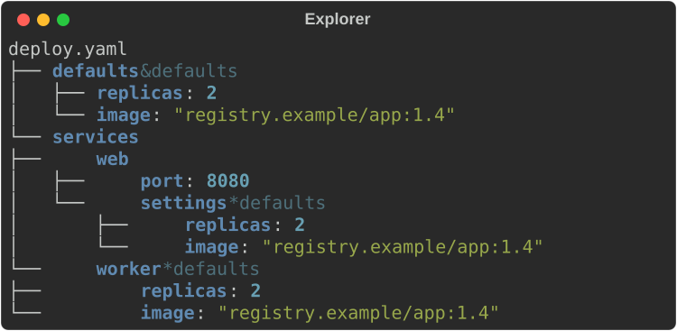
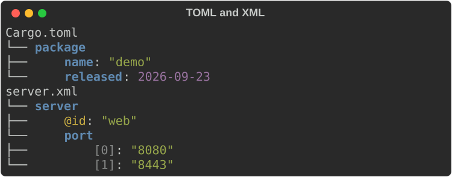
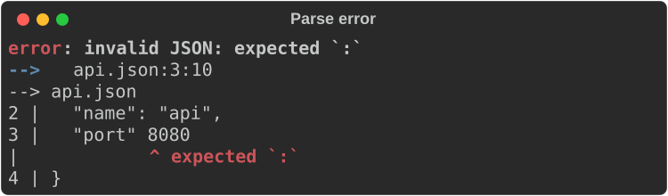
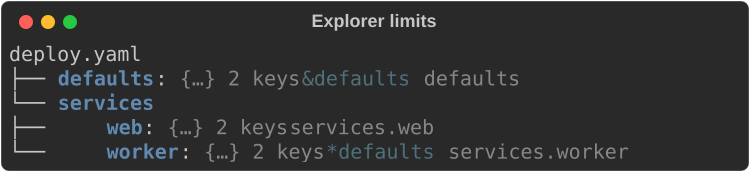
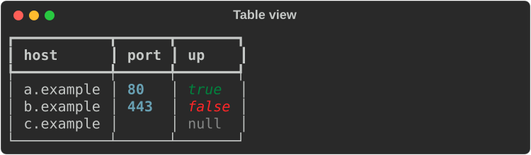
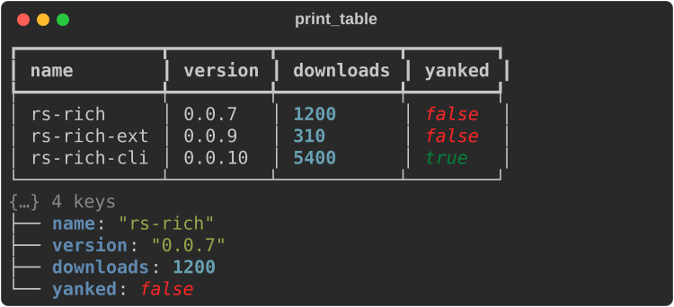
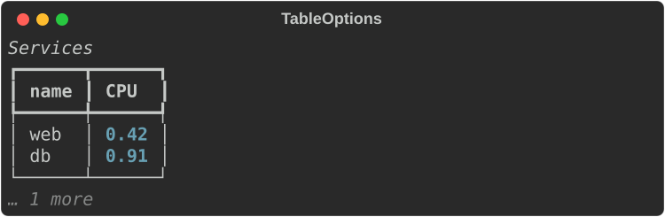
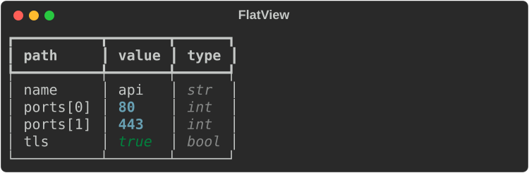
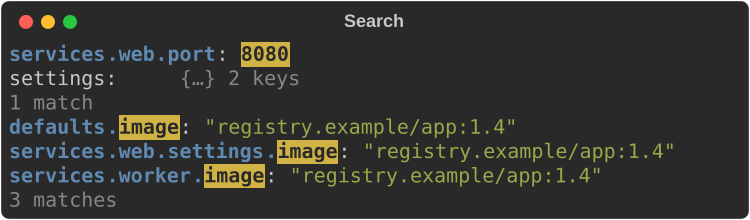
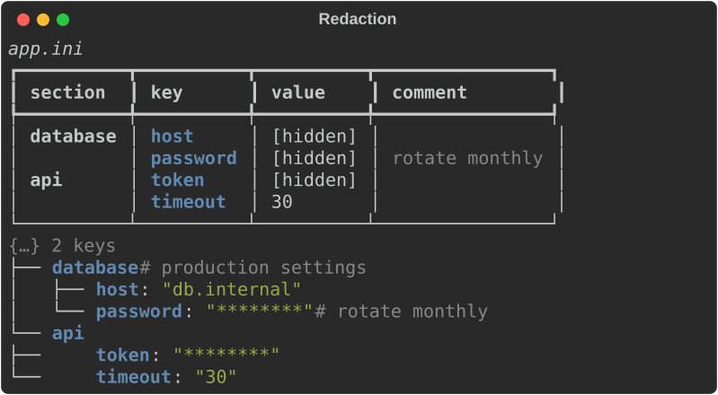

# Structured data

`rich_ext::data` reads JSON, YAML, TOML, XML, INI and dotenv into one document
tree, then shows it as a tree, a table, a flat `path = value` list, search
results or a diff. It also prints any `serde::Serialize` value as a table or
tree with no setup.

Use it when a program has to show configuration, API responses or records to
a person: a `--show-config` flag, a debug dump, a report. The `rich inspect`
command is built on it.

## Enable it

| Feature | Adds |
|---|---|
| `data` | The document model, every view, the serde helpers, and the JSON, INI and dotenv parsers |
| `yaml` | YAML parsing (anchors, aliases and positions are kept) |
| `toml` | TOML parsing (dates keep their text) |
| `xml` | XML parsing (attributes become `@name` keys) |
| `jsonpath` | The built-in JSONPath backend for selection |

```toml
[dependencies]
rs-rich = "0.0.7"
rs-rich-ext = { version = "0.0.9", features = ["data", "yaml"] }
```

`yaml`, `toml`, `xml` and `jsonpath` each turn on `data`. The examples on
this page come from
[`guide_data.rs`](https://github.com/buchochelliq-labs/rs-rich-cli/blob/main/crates/rich-ext/examples/guide_data.rs):

```bash
cargo run -p rs-rich-ext --example guide_data --features data,yaml,toml,xml,jsonpath
```

## The smallest example

Parse a document and print it as a tree:

```rust
--8<-- "crates/rich-ext/examples/guide_data.rs:explorer"
```



## The document model

Every parser produces the same types:

- **`Node`**: a `Value` plus `Meta`.
- **`Value`**: `Null`, `Bool`, `Int`, `UInt` (above `i64::MAX`), `Float`,
  `String`, `DateTime` (TOML dates as written), `Seq(Vec<Node>)` and
  `Map(Vec<(String, Node)>)`. Maps keep document order.
- **`Meta`**: the source `Position` (line and column), a YAML `anchor` or
  `alias`, an INI/dotenv `comment`, and for XML what the node was
  (`XmlKind::Element`, `Attribute` or `Text`).
- **`Path`**: a route from the root. It displays as `servers[0].name` (keys
  that are not identifiers are quoted: `a["weird key"]`) and parses back from
  the same syntax with `str::parse`.
- **`Format`**: `Json`, `Yaml`, `Toml`, `Xml`, `Ini` and `Dotenv`.

Look nodes up with `get(key)`, `index(i)` or `at(&path)`; walk every node
with `walk`; convert with `to_json()`.

```rust
--8<-- "crates/rich-ext/examples/guide_data.rs:parse"
```

`parse(format, text)` dispatches on the format. Each format also has its own
function: `parse_json`, `parse_yaml`, `parse_toml`, `parse_xml`, `parse_ini`
and `parse_dotenv`. A format whose feature is off returns an error that names
the feature; `Format::is_enabled` checks first.

### What each format keeps

| Format | Notes |
|---|---|
| JSON | Numbers become `Int`, `UInt` or `Float`. |
| YAML | YAML 1.2 core schema. Anchors (`&name`) and aliases (`*name`) are recorded in `Meta`; an alias holds a copy of its anchor's value. Merge keys (`<<`) stay ordinary keys and are not merged. Several documents parse to a sequence. Comments are dropped. |
| TOML | Tables keep document order. Dates and times stay as written (`Value::DateTime`). |
| XML | The document becomes `{root: …}`. Attributes are `@name` keys, repeated child elements become sequences, and mixed text goes under `#text`. Comments and processing instructions are dropped. |
| INI | Sections become maps. Values are always strings, and inline comments are not stripped. A comment line directly above an entry becomes its `Meta::comment`. |
| dotenv | `KEY=VALUE` and `export KEY=VALUE`. Values are strings with no variable expansion (`$HOME` stays `$HOME`). |

Deep nesting (over 512 levels in YAML or XML) is an error, and YAML alias
expansion stops after one million copied nodes, so hostile input cannot
exhaust memory.



```rust
--8<-- "crates/rich-ext/examples/guide_data.rs:formats"
```

### Detecting the format

`Format::detect(text, name_hint)` guesses cautiously. When the file name hint
maps to an enabled format, that format wins. Otherwise the text is tried as
JSON, XML, TOML, dotenv, INI, then YAML. The more distinctive formats go first
because YAML accepts almost anything. Prose, Markdown, CSV and single lines
return `None` rather than a wrong guess.

`Format::from_name`, `from_extension` and `from_file_name` map names such as
`yml`, `.cfg` or `.env.local` to a format.

## Parse errors

A `DataError` carries the format, a message and, when known, a `Position`.
`Display` gives one line; `to_diagnostic(source, name)` gives a
[diagnostic](diagnostics.md) with the offending character underlined:

```rust
--8<-- "crates/rich-ext/examples/guide_data.rs:errors"
```



## The explorer

`Explorer` draws a tree with the same guides as core's `Tree`. Scalars use
core's JSON styles (`json.key`, `json.str`, `json.number`, …), so a JSON theme
applies here too. Every line is cut to the width: long strings shrink first
(keeping their quotes), then the line ends in `…`. Nothing wraps.

| Method | Effect |
|---|---|
| `max_depth(n)` | Fold containers `n` levels down to a summary such as `{…} 3 keys` |
| `max_length(n)` | Show at most `n` children per container, then `… N more` |
| `max_string(n)` | Cut strings to `n` characters |
| `fold(path)` | Fold one container |
| `show_paths(true)` | Append each leaf's path, dim |
| `show_types(true)` | Append each node's type (`str`, `int`, `map`, …) |
| `root_label(s)` | Replace the root line |
| `view(View::Table)` | Lay the document out as a table instead |

```rust
--8<-- "crates/rich-ext/examples/guide_data.rs:explorer-limits"
```



`View::Table` shows a sequence of maps as rows, and anything else as
`path | value` rows:

```rust
--8<-- "crates/rich-ext/examples/guide_data.rs:explorer-table"
```



`Explorer::new` takes either `&Node` or an owned `Node`, so a view can own a
freshly built document.

## Serde values

`print_json`, `print_table` and `print_tree` print any `Serialize` value to
standard output. `print_json_to`, `print_table_to` and `print_tree_to` print
to a given console. `json`, `table` and `tree` return the renderable instead,
and `from_serialize` returns the `Node`.

```rust
--8<-- "crates/rich-ext/examples/guide_data.rs:serde"
```



Table columns are the union of the records' keys in first-seen order. A
missing field leaves its cell empty, nested values show as compact JSON,
all-number columns are right-justified and nulls are dim.

### Table options

`TableOptions` (or the same methods on `TableView`) chooses and orders
columns, renames headers, sets justification, adds a title and limits rows
and string length:

```rust
--8<-- "crates/rich-ext/examples/guide_data.rs:table-options"
```



## Flatten and unflatten

`flatten` lists every leaf with its path in document order. Scalars and empty
containers count as leaves. `unflatten` rebuilds the tree. It returns an
`UnflattenError` for input that cannot be one tree: no leaves, a duplicate
path, a path that is both a leaf and a container, a container with both keys
and indexes, or a sequence with a missing index. `FlatView` renders the
leaves as a table.

```rust
--8<-- "crates/rich-ext/examples/guide_data.rs:flatten"
```



## Search

A `SearchQuery` matches by key (substring), path (glob) or value
(substring), or by `text`, which matches any of them. Combine criteria with
`and_key`, `and_path`, `and_value` and `and_text`; all of them must match.
Matching is case-sensitive unless you call `case_insensitive(true)`.

Path globs: `*` is one segment, `[*]` any index, `**` any number of segments,
and `*` or `?` inside a key are wildcards: `servers[*].name`, `**.port`,
`db_*.host`.

`search` returns the matches. `SearchResults` renders them with the match
highlighted, and `context(n)` adds up to `n` sibling entries around each
match:

```rust
--8<-- "crates/rich-ext/examples/guide_data.rs:search"
```



## Selection (JSONPath)

Selection runs an expression language over a document. `SelectorBackend`
compiles an expression into a `Selector`, and `Selectors` is a registry of
backends by name, so a tool can offer `--select jsonpath:…` now and other
languages later. With the `jsonpath` feature, `Selectors::default()` includes
the built-in `JsonPath` backend.

The built-in JSONPath supports `$`, `.key`, `['key']`, `[n]`, `[-n]`, `[*]`,
`.*`, recursive descent (`..key`, `..*`), slices (`[a:b:step]`), unions
(`[0,2]`) and filters (`[?(@.k > 1)]` with `==`, `!=`, `<`, `<=`, `>`, `>=`,
`&&`, `||`, `!`). The leading `$` is optional. A `SelectError` names the
column of the problem: ``expected `]` at column 10``.

```rust
--8<-- "crates/rich-ext/examples/guide_data.rs:select"
```

### A custom backend

Implement `SelectorBackend` and `Selector` to add a language:

```rust
--8<-- "crates/rich-ext/examples/guide_data.rs:backend"
```

`register` replaces any backend with the same name.

## Diff

`diff(old, new)` compares two documents leaf by leaf, ignoring metadata. It
returns `Change`s (`Added`, `Removed`, `Changed`) with the path and the old
and new leaves, in document order. `DiffView` renders them with `+`, `-` and
`~` markers, so they read correctly without colour:

```rust
--8<-- "crates/rich-ext/examples/guide_data.rs:diff"
```


For line diffs of text, source and patches, see
[Diffs and test reports](diffs-and-test-reports.md).

## Redaction and config files

`Redaction` masks string and number leaves whose key matches a pattern
(case-insensitive substring, or a whole-key glob when the pattern contains
`*` or `?`). `Redaction::secrets()` starts from `SECRET_KEYS`: password,
secret, token, key and similar. `pattern` adds a pattern and `mask` changes
the replacement (default `********`). Structure, booleans and nulls are left
alone.

`node.redacted(&redactor)` returns a masked copy for any view.
`ConfigFileView` shows INI and dotenv files as a `section | key | value |
comment` table and takes a redactor directly:

```rust
--8<-- "crates/rich-ext/examples/guide_data.rs:redact"
```



`Redactor` is a trait, and closures of type `Fn(&Path, &Node) -> Option<Node>`
implement it, so you can redact by path or value shape as well as by key.

## Gotchas

- **Nothing wraps in the explorer.** Lines are cut to the width. Use
  `max_string` or `FlatView` when values are long.
- **INI and dotenv values are strings.** Parse numbers and booleans yourself.
- **Merge keys are not merged.** `<<: *base` shows as a `<<` key holding a
  copy of `base`.
- **XML text is a string.** `<port>8080</port>` gives `"8080"`, not a number.
- **Theme keys.** This module's own style names and their defaults are listed
  in `DATA_STYLES`.

## See also

- [`rich_ext::data` on docs.rs](https://docs.rs/rs-rich-ext/latest/rich_ext/data/index.html)
- [`Explorer`](https://docs.rs/rs-rich-ext/latest/rich_ext/data/struct.Explorer.html),
  [`TableOptions`](https://docs.rs/rs-rich-ext/latest/rich_ext/data/struct.TableOptions.html),
  [`Redaction`](https://docs.rs/rs-rich-ext/latest/rich_ext/data/struct.Redaction.html),
  [`Selectors`](https://docs.rs/rs-rich-ext/latest/rich_ext/data/select/struct.Selectors.html)
- [Diagnostics](diagnostics.md): what `DataError::to_diagnostic` returns
- [Diffs and test reports](diffs-and-test-reports.md): line and patch diffs
- [Using the CLI](../../cli.md): `rich inspect` and `--format`
