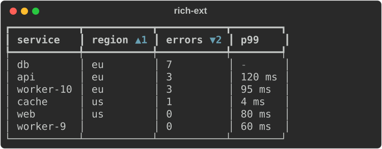
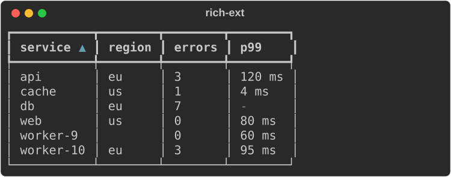
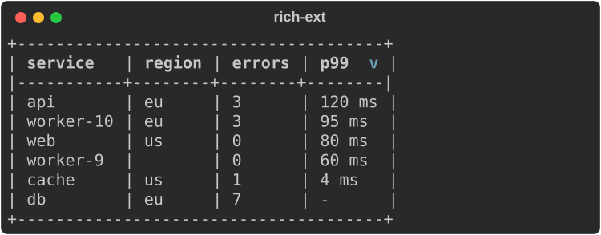
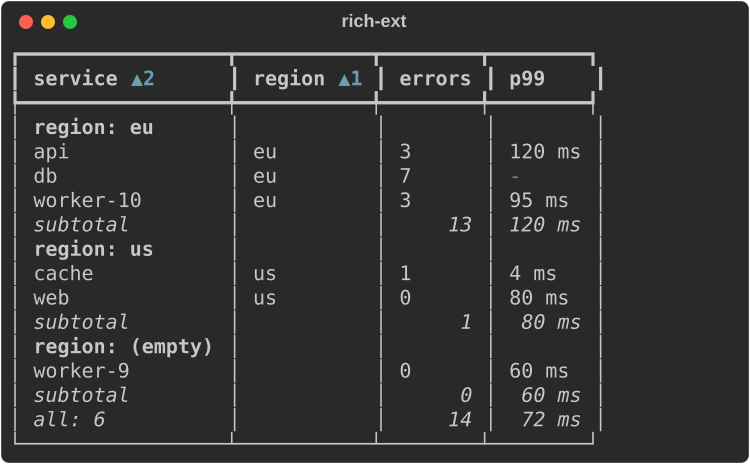
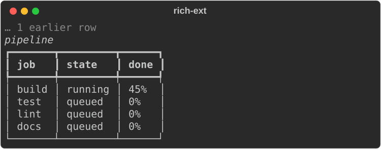

# Sorting, grouping and streaming tables

The core `Table` is a faithful port of upstream's: it lays out whatever rows
you give it, in the order you give them. `rich_ext::table` adds the data
operations upstream leaves to you, and a table for rows that keep changing:

- **`TableData`**: typed rows under column definitions, with a stable
  multi-column sort, grouping with per-group aggregates, and a totals row.
- **`StreamingTable`**: rows under stable keys for append/update workloads
  under a live display. A frame re-renders only the rows that changed.
- **`sort`** and **`group`**: the same operations as functions over plain
  rows, for building a core `Table` yourself.

Every view here *builds* core tables; none has its own table renderer. So the
output looks exactly like a core `Table`, box styles, column options, ASCII
fallback and all. No feature flag is needed.

## Values and columns

A cell is a `Value`: `Null`, `Int`, `Float`, `Str` (literal text, never
markup) or `Text` (styled). The type decides how the cell sorts and
aggregates. The column decides how it looks:

```rust
--8<-- "crates/rich-ext/examples/guide_tables_ext.rs:data"
```

- `Column::new(header)` is left-justified. `.justify(..)` sets the
  justification and `.options(ColumnOptions { .. })` sets any core column
  option (width, ratio, `no_wrap`, style, …).
- `.format(|value| Text)` controls how a column displays its values, as here
  for milliseconds or with `rich_ext::format` for byte sizes. Aggregates are
  displayed through the same formatter, except counts.
- `Value` converts from `&str`, `String`, `Text`, the integer types, `f64`
  and `Option<T>` (`None` is `Null`). A row shorter than the columns is
  padded with `Null`, and extra cells are dropped.

## Sorting

`sort_by` takes `SortKey`s in priority order. Later keys break ties between
rows that are equal on the earlier ones:

```rust
--8<-- "crates/rich-ext/examples/guide_tables_ext.rs:sort"
```



- **Stable.** Rows that are equal on every key keep the order they were added
  in.
- **Empty cells last.** A `Null` or empty string sorts after every other value
  in either direction, like the missing region above.
- **Natural by default.** Numbers compare numerically, and so do strings that
  are numbers (`"10"` after `"9"`). Other strings compare case-insensitively,
  with runs of digits compared by value, so `worker-9` sorts before
  `worker-10`. Numbers sort before text. `SortKey::asc(i).lexical()` compares
  the plain strings byte by byte instead.
- **Header indicators.** Each sorted column's header gets `▲` or `▼` (styled
  `table.sort_indicator`). When there is more than one key, the indicator also
  shows the key's priority (`▲1`, `▼2`).

```rust
--8<-- "crates/rich-ext/examples/guide_tables_ext.rs:natural"
```



On a console that can only render ASCII, the indicators are `^` and `v`, and
the core table switches to an ASCII box:

```rust
--8<-- "crates/rich-ext/examples/guide_tables_ext.rs:ascii"
```



## Grouping and aggregates

`GroupBy::new(column)` splits the rows into groups by the value in that
column. Each group renders as three parts:

1. A header row. It holds the group's key in the first column, styled
   `table.group`. When the grouped column is not the first column, the
   column's name is prefixed (`region: eu`). Empty cells form one group,
   shown as `(empty)`.
2. The group's rows.
3. A summary row with the group's aggregates, styled `table.aggregate`. This
   row appears only when the grouping has aggregates.

Groups appear in the order of their first row. To get groups in key order,
sort by the grouped column first.

```rust
--8<-- "crates/rich-ext/examples/guide_tables_ext.rs:group"
```



| Aggregate | Result |
|---|---|
| `Aggregate::count(col)` | The number of non-empty cells, shown as a plain integer |
| `Aggregate::sum(col)` | The sum of the numeric cells: an `Int` if every cell is an integer, otherwise a `Float` |
| `Aggregate::min(col)`, `max(col)` | The smallest or largest non-empty cell, in natural order |
| `Aggregate::mean(col)` | The mean of the numeric cells |
| `Aggregate::custom(col, f)` | `f(&[&Value]) -> Value` over the group's cells |

Summary and totals rows:

- Each aggregate is placed in its own column. If a column has more than one
  aggregate, they are joined with `, `.
- The summary label (`subtotal` by default, set with `GroupBy::label`) goes
  in the first cell. If the first column has its own aggregate, the label is
  prefixed to it (`all: 6`).
- `TableData::totals(label, aggregates)` adds one final row computed over
  every row.

To compute groups without rendering them, call
`GroupBy::groups(&rows, &order)`. It returns each group's key, its row
indices and its aggregate values.

### Plain rows and a core `Table`

`sort::sort_rows`, `sort::sorted_indices` and `sort::compare_rows` work on any
rows that are `AsRef<[Value]>`, such as `Vec<Vec<Value>>`. They let you keep
building the core `Table` yourself:

```rust
use rich::Table;
use rich_ext::table::{sort::sort_rows, SortKey, Value};

let mut rows = vec![
    vec![Value::from("v1.10"), Value::Int(2)],
    vec![Value::from("v1.9"), Value::Int(5)],
];
sort_rows(&mut rows, &[SortKey::desc(1), SortKey::asc(0)]);
let mut table = Table::new();
table.add_column("version").add_column("n");
for row in &rows {
    table.add_row_text(row.iter().map(Value::to_text).collect());
}
```

## Streaming tables

`StreamingTable<K>` keeps its rows under stable keys of type `K`, such as a
job name, a path or a sequence number:

| Method | Effect |
|---|---|
| `upsert(key, row)` | Adds a new key at the end. For an existing key, replaces the row in place, keeping its position |
| `update_cell(&key, col, value)` | Changes one cell |
| `remove(&key)` | Removes the row and returns its cells |
| `set_sort(keys)` | Shows the rows sorted (stable over insertion order), with indicators |
| `window(Window::Tail(n))` | Shows the last `n` rows, below an `… N earlier rows` line |
| `window(Window::Head(n))` | Shows the first `n` rows, above an `… N more rows` line |
| `capacity(n)` | Evicts the oldest rows beyond `n`. Evicted rows count as earlier rows |

```rust
--8<-- "crates/rich-ext/examples/guide_tables_ext.rs:stream"
```



`StreamingTable` implements `Renderable`, so you can put it anywhere a
renderable goes, including a `LiveCoordinator` region (see
[Live and layout](live-and-layout.md#coordinated-live-regions)):

```rust
--8<-- "crates/rich-ext/examples/guide_tables_ext.rs:live"
```

```rust
--8<-- "crates/rich-ext/examples/guide_tables_ext.rs:live-run"
```

### What a frame renders again

Each row caches three things: its formatted cells, their widths and its
rendered lines. Rendering a frame works like this:

- Only rows written since the last frame are formatted again.
- If no column's width changed, only those rows are laid out again. The rest
  are copied from the cache.
- If a column's width did change, every visible row is laid out again. That
  happens when a new row widens a column, when the widest row is removed, or
  when the available width changes.
- Writing a value equal to the current one is not a change. `Value::Text`
  cells are the exception: they always count as changed, because their base
  style cannot be compared.
- Sorting only reorders cached rows. A change to the window only drops or adds
  rows.

`stats()` returns counters for this (`frames`, `rows_prepared`,
`rows_rendered`, `relayouts`), so tests can assert what a frame re-rendered.
The streamed output is byte for byte what `to_table()` (a core `Table` of the
same rows, built from scratch) renders, apart from the window's indicator
line. The test suite checks that equality after every step of a mixed
workload.

How this stays exact: the core sizes a column from the widest cell in it and
nothing else. Each changed row is rendered by a core table that holds the row
plus one extra row made of each column's widest cell. So the row gets exactly
the widths the full table would give it.

Gotchas:

- Cached lines keep the styles they were rendered with. If you render the
  same table on consoles with different themes, call `invalidate()` between
  them.
- Row separators (`show_lines`) are not supported. A frame can have a title,
  a caption, a box style, and `show_edge`, `expand` and `border_style`.
- `to_data()` takes a snapshot of the rows in display order as a `TableData`,
  for grouping and aggregates.

## Styles

| Key | Default | Used for |
|---|---|---|
| `table.group` | `bold` | Group header rows |
| `table.aggregate` | `italic` | Summary and totals rows |
| `table.sort_indicator` | `cyan` | `▲`/`▼` in headers |
| `table.more` | `dim` | The window's `… N more rows` line |

These keys are listed in `table::STYLES` and included in `extended_theme()`.
If a theme lacks a key, the renderers fall back to the default in this table.
The names don't clash with upstream's `table.header`, `table.footer`,
`table.cell`, `table.title` and `table.caption`. Everything reads the same
without colour.

## Accessibility

`TableData` and `StreamingTable` implement `a11y::AccessibleText` through
their core `Table`. The result is the same `Table with N rows, columns: …`
summary that a core table produces.
