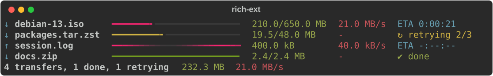
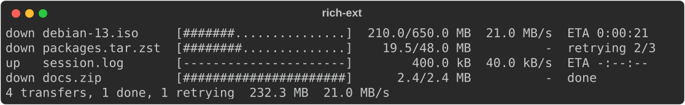
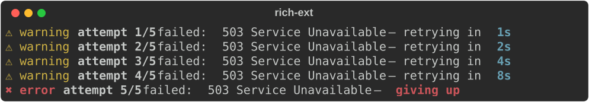
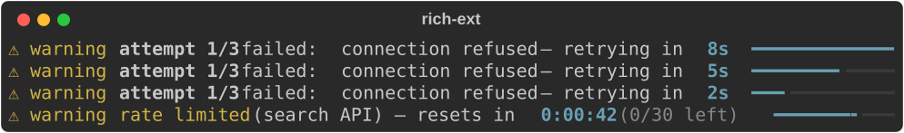
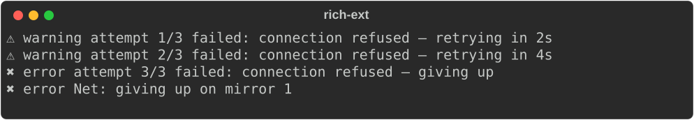
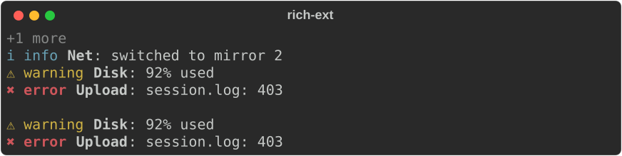

# Transfers, retries and notifications

Three ext modules cover the status output of a command-line app that moves
data over a network, without a full-screen UI:

- **`transfer`**: `Transfer` and `Transfers` show downloads and uploads with
  a smoothed rate, an ETA, retries and cancellation. `TransferReader` and
  `TransferWriter` count bytes as they pass; `transfer_columns()` sets up
  the core `Progress` for transfers instead.
- **`countdown`**: `Backoff` computes retry delays; `RetryStatus`,
  `RateLimit` and `CountdownBar` show them; `CountdownWait` waits while
  showing the time left and stops when a `CancelToken` is cancelled.
- **`notify`**: `Notification` and `Notifications` show short toasts under
  live output that disappear when they expire.

None needs a feature flag. The styles are in `extended_theme()` under
`transfer.*`, `countdown.*` and `notify.*`; without them each renderer falls
back to built-in defaults.

Two rules hold for all three:

1. **Nothing reads the clock for you.** Every update takes `now`, a
   `Duration` since a start time you choose (usually `start.elapsed()` of
   one `Instant`). Tests pass fixed times and get exact output.
2. **Colour is never the only signal.** Every state is shown as a word or a
   symbol (from the accessibility `SymbolSet`). Without colour, bars are drawn
   in brackets. When motion is off, a status is printed once instead of
   redrawn.

## Transfers

A `Transfer` holds a name, a `Direction` (`Download` or `Upload`), an
optional total, the bytes done so far, the attempt number and a
`TransferState`: `Active`, `Paused`, `Retrying`, `Done`, `Failed` or
`Cancelled`. `Transfers` renders several with aligned columns and an
optional totals line:

```rust
--8<-- "crates/rich-ext/examples/guide_transfers.rs:group"
```



Each line is `direction name  bar  done/total  rate  ETA-or-state`:

| Part | Detail |
|---|---|
| bar | The core `ProgressBar` (`bar.*` styles). It is up to `bar_width` cells (default 24), shrinks to fit the width and is dropped when fewer than 8 cells are left. An unknown total pulses. |
| sizes | `12.3/45.6 MB` in the total's unit, like the core `DownloadColumn`; just `12.3 MB` when the total is unknown |
| rate | `format::rate` of the smoothed rate, `-` before there are two samples or while not active |
| ETA | `ETA 0:00:14`, or `-:--:--` when the rate or total is unknown; `(attempt 2/3)` is added after a retry |
| state | `↻ retrying 2/3`, `‖ paused`, `✔ done`, `✖ failed: reason`, `↷ cancelled` |

The rate is averaged over a moving window (`rate_window`, default 5 s):
the bytes gained since the oldest sample in the window, divided by the time
since then. A burst or a stall stops counting once it leaves the window.
`RateMeter` is public if you need the same average elsewhere.

State changes:

| Call | Effect |
|---|---|
| `advance(bytes, now)`, `set_completed(bytes, now)` | Count progress. A paused or retrying transfer becomes active again. Going backwards (restarting from zero) resets the rate. |
| `pause(now)` | Paused; the rate resets so resuming starts clean. |
| `retry(reason)` | Moves to the next attempt and returns `true`, or fails and returns `false` if `max_attempts` is used up. Keeps the bytes done (a resume); call `set_completed(0, now)` to restart. |
| `finish(now)`, `fail(reason)`, `cancel()` | End states. Later calls are ignored. |

### Without colour

```rust
--8<-- "crates/rich-ext/examples/guide_transfers.rs:plain"
```



On an ASCII-only console the Unicode symbols switch to their ASCII forms by
themselves: `v`/`^` for the direction and `[DONE]`, `[RETRY]` and so on for
the state.

### With the core `Progress`

If you already use `rich::Progress`, keep it. `transfer_columns()` sets
the columns to description, a 30-cell bar, `DownloadColumn`,
`TransferSpeedColumn` and time remaining. `Transfer::task_update()` copies a
transfer's total, bytes done and state into a task (the description gets
`(retry 2/3)` and similar, with markup escaped):

```rust
--8<-- "crates/rich-ext/examples/guide_transfers.rs:progress"
```


### Counting bytes and cancelling

`TransferReader` and `TransferWriter` wrap any `Read` or `Write` and count
into a `SharedTransfer` (an `Arc<Mutex<Transfer>>`), so another thread can
draw it:

```rust
use std::sync::{Arc, Mutex};
use rich_ext::cancel::CancelToken;
use rich_ext::transfer::{is_cancelled, Transfer, TransferReader};

let shared = Arc::new(Mutex::new(Transfer::download("blob").total(len)));
let token = CancelToken::new();
let mut reader = TransferReader::new(response, shared.clone()).cancel(token.clone());
match std::io::copy(&mut reader, &mut file) {
    Err(e) if is_cancelled(&e) => { /* the transfer shows ↷ cancelled */ }
    Err(e) => { /* the transfer shows ✖ failed: <e> */ }
    Ok(_) => { /* the reader hit EOF: ✔ done */ }
}
```

- A read of 0 bytes (end of file) marks the transfer done, and an I/O error
  marks it failed. For a writer, call `finish` yourself.
- The wrappers read a real clock by default. Pass `.clock(Arc::new(|| ...))`
  to supply your own times in tests.
- The cancellation error has kind `ErrorKind::Other`, not `Interrupted`.
  `io::copy` and `read_to_end` retry `Interrupted` errors forever, so that
  kind would never stop them. Use `is_cancelled(&error)` to recognise it.

## Retries and rate limits

`Backoff` is plain arithmetic. The delay after failed attempt `n` is
`initial × factorⁿ⁻¹`, capped at `max`. `attempts(n)` sets the limit, and
`delay(n)` returns `None` after the last attempt. `jitter(fraction, seed)`
shortens each delay by a pseudo-random part of up to `fraction`. The same
seed always gives the same delays, so tests stay exact. In production, seed
from something that varies between clients (the clock or the process id) so
they don't all retry at once.

```rust
--8<-- "crates/rich-ext/examples/guide_transfers.rs:backoff"
```



`backoff.status(attempt, reason)` builds the `RetryStatus` line: a warning
with `retrying in 4s` while attempts remain, or an error with `giving up`
after the last one. The time left is shown in whole seconds, rounded up, and
switches to `1m 05s` from one minute. `RateLimit` shows a limit that resets
at a known time, with an optional scope and quota. Both can draw a
`CountdownBar` that shrinks as time runs out (`.bar(total)`). The bar gets
the space left on the line and is dropped when there is not enough.

```rust
--8<-- "crates/rich-ext/examples/guide_transfers.rs:countdown"
```



The renderables are snapshots: `status.at(left)` is the same status with
`left` remaining, which is how you build each frame of an animation.

### Waiting with a countdown

`CountdownWait` blocks for a duration. On every tick (250 ms by default) it
reports the time left and checks its `CancelToken`. It measures time by
adding up its own sleeps. The default sleeper is `std::thread::sleep`, and
`.sleeper(|d| ...)` replaces it, so a test runs instantly.

- `run(on_tick)` calls you with the time left and returns
  `WaitOutcome::Elapsed` or `WaitOutcome::Cancelled`.
- `run_live(&mut live, &target, motion, |left| frame)` shows the frame through
  a `LiveCoordinator`:
  - With `Motion::Animated` the frame goes in a new region, is redrawn each
    tick and is removed at the end.
  - With `Motion::Static` the first frame is printed once as an ordinary line.

`Motion::for_target(&target, &policy)` picks `Static` for a
non-interactive target, or when the `AccessibilityPolicy` asks for reduced
motion or no animation (`RICH_A11Y=reduced-motion`). A log then gets
exactly one line per attempt:

```rust
--8<-- "crates/rich-ext/examples/guide_transfers.rs:log"
```



## Notifications

A `Notification` has a level (an accessibility `Status`: `Ok`, `Info`,
`Warning`, `Error`, `Pending`, `Skipped`), an optional title, a message and
an optional time to live. Each line starts with the status symbol, so the
level can be read without colour: `✔ ok`, `[WARN]`, or `error:` with
`SymbolSet::Words`.

`Notifications` is the stack:

| Method | Effect |
|---|---|
| `push(n, now)` | Post a notification; returns a `NotificationId` |
| `expire(now)` | Drop every notification whose TTL is up (the default TTL is 5 s; `default_ttl(None)` keeps them until dismissed) |
| `dismiss(id)` | Remove one now |
| `next_expiry()` | When to redraw next |
| `max_visible(n)` | Show the newest `n` (default 3) and a `+N more` line |

```rust
--8<-- "crates/rich-ext/examples/guide_transfers.rs:toasts"
```



`ToastStyle::Panel` draws a small panel with a border in the level's colour
in place of the single line:

```rust
--8<-- "crates/rich-ext/examples/guide_transfers.rs:toast-panel"
```


### Under live output

`present(&mut live, &target, &mut region, now)` does one tick: it prints any
queued lines, expires old toasts and redraws the rest. `region` starts as
`None`. While there are toasts to show, a region is added after the
coordinator's other regions, so toasts appear below the live content. When
the last toast expires the region is removed, because `LiveCoordinator`
would draw an empty region as a blank row. To put toasts above other
content, render the stack into your own first region with
`target.segments(&stack)` and keep that region even when it is empty.

`Notifications::for_target(&target)` stacks toasts only on an interactive
target. On a pipe or a log file, each notification is instead printed once
as a normal line the next time `present` runs, so nothing is lost. The last
line of the log example above shows this.

## Try it

```bash
cargo run -p rs-rich-ext --example transfers            # animated in a terminal
cargo run -p rs-rich-ext --example transfers | cat      # the log fallback
RICH_A11Y=reduced-motion cargo run -p rs-rich-ext --example transfers
```

The example runs three simulated transfers. One drops its connection
halfway, waits out a retry countdown and resumes, and toasts appear as each
transfer completes.
