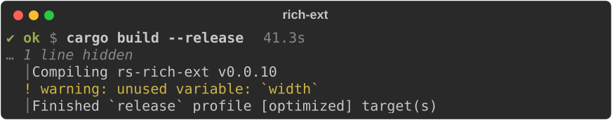
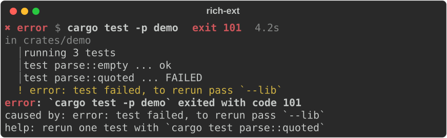
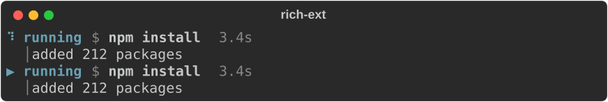
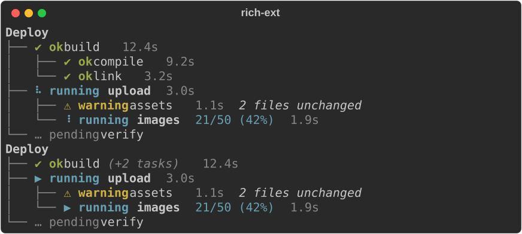
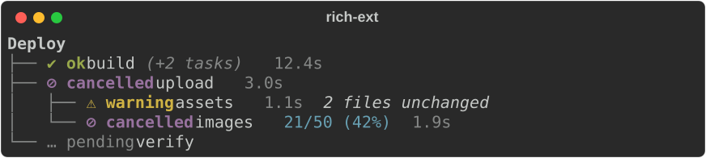
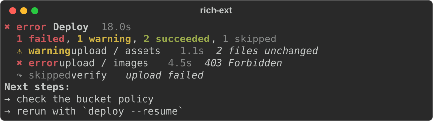
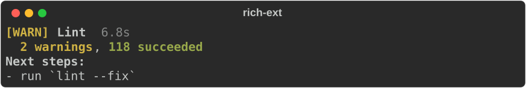

# Workflows: commands, task trees and summaries

`rich_ext::workflow` covers what build, deploy and install tools show while
they work:

- **Commands**: what ran, what it printed, how it ended, and a
  diagnostic when it failed.
- **Task trees**: nested tasks with live status, progress, durations and
  cancellation.
- **Completion summaries**: one closing block with the overall result,
  counts, the items that need attention and the next steps.

No feature flag is needed. Each part keeps its data model separate from its
view. A `CommandRecord`, `TaskTree` or `CompletionSummary` is plain data that
you can build by hand, test, or keep for later. Rendering it is a separate
step.

!!! note "Status never depends on colour"

    Every marker is a symbol and a word (`✔ ok`, `✖ error`), a bracketed tag
    (`[OK]`, `[ERROR]`) or a word (`ok:`, `error:`), chosen with
    `.symbols(SymbolSet::…)` or `.policy(&AccessibilityPolicy)`. With the
    ASCII and word sets, guides, bullets, ellipses and `µs` switch to ASCII
    as well. Under reduced motion, no animation or a screen reader, the
    running spinner becomes a static `▶ running` marker.

## Commands

A `CommandRecord` holds the program and arguments, the working directory,
stdout and stderr lines in the order they arrived, the exit status and the
duration. Its view prints a header (status, `$ command`, exit detail,
duration), then the output folded to its last lines:

```rust
--8<-- "crates/rich-ext/examples/guide_workflow.rs:command"
```



- A `!` gutter marks stderr lines and a `│` gutter marks stdout lines, so you
  can tell the streams apart without colour. Stderr lines also get the
  `workflow.stderr` style.
- ANSI styling in the output is decoded into styles. Cursor movement and
  other control sequences are dropped, and a carriage return keeps only the
  text after it, as a terminal would show it.
- `.tail(n)` sets how many lines stay visible (10 by default). `.show_all()`
  shows every line.

### Failures

By default a failed run (a non-zero exit, a signal, or a program that could
not start) shows **all** of its output and ends with a
[diagnostic](diagnostics.md). The diagnostic names the command and how it
ended, and uses the last stderr line as its cause:

```rust
--8<-- "crates/rich-ext/examples/guide_workflow.rs:failure"
```



- `.full_on_failure(false)` keeps the tail limit on failures too.
- `.show_diagnostic(false)` leaves out the diagnostic.
- `.help(..)` adds `help:` lines to the diagnostic.
- `.show_cwd(false)` hides the `in <dir>` line.
- `record.diagnostic()` returns the `Diagnostic` so you can print or collect
  it yourself.

### While it runs

A record whose status is `CommandStatus::Running` renders a spinner and the
time elapsed so far. The spinner frame comes from the record's duration, not
from a clock, so a redraw moves it and a test can pin it:

```rust
--8<-- "crates/rich-ext/examples/guide_workflow.rs:running"
```



### Running a real process

`CommandRunner` fills a record from a `std::process::Command`:

```rust
--8<-- "crates/rich-ext/examples/guide_workflow.rs:runner"
```

- Stdout and stderr are read on two threads and merged in the order lines
  arrive. The pipes do not guarantee exact ordering between the two streams.
- Stdin is closed.
- `on_update` receives the record after every line and every `tick`
  (100 ms by default). Render `record.view()` into a
  [`LiveCoordinator`](live-and-layout.md) region there.
- When the `CancelToken` is cancelled, the runner kills the child, and the
  record ends as `CommandStatus::Cancelled`. Ticks and cancellation keep
  working if the child closes its output and keeps running.
- After the child exits, the runner reads output for about one more second.
  A background process that inherited the pipes cannot keep `run` waiting,
  and cancelling in that second does not change the recorded exit status.
- A program that cannot start gives a record with
  `CommandStatus::FailedToStart(reason)`. The runner does not panic or return
  an error.

## Task trees

A `TaskTree` holds tasks under optional parents. Leaves move from pending to
running and then to succeeded, warning, failed, skipped or cancelled. A
parent's state comes from its children, so only leaves need transitions:

```rust
--8<-- "crates/rich-ext/examples/guide_workflow.rs:tree"
```

```rust
--8<-- "crates/rich-ext/examples/guide_workflow.rs:tree-print"
```



How a parent's state is aggregated from its children:

| Children | Parent |
|---|---|
| any running, or some finished and some pending | running |
| all pending | pending (running if the parent was started) |
| all finished | the worst: failed, cancelled, warning, succeeded |
| all skipped | skipped |

An explicit `fail` or `cancel` on the parent itself always wins.

Times come from a `Clock`. `TaskTree::new()` uses the wall clock. A
`ManualClock` moves only when you advance it, which gives exact durations in
tests and screenshots. A parent's duration runs from its first child's start
to its last child's finish.

`.collapse_finished(true)` shrinks each finished subtree that has no failure,
warning or cancellation to one line. `(+2 tasks)` shows how many tasks are
hidden. Long lines end in an ellipsis instead of wrapping, so the guides stay
aligned.

### Cancellation

Every task has a `CancelToken` (from `rich_ext::cancel`) that
is a child of its parent's token. Give `tree.token(id)` to the code doing
the task:

```rust
--8<-- "crates/rich-ext/examples/guide_workflow.rs:cancel"
```



- `tree.cancel(id)` cancels that task's subtree and marks each unfinished
  task in it as cancelled. The rest of the tree carries on.
- `tree.cancel_all()` cancels every task.
- If the cancellation comes from elsewhere, for example from a Ctrl-C handler
  that holds `tree.root_token()`, call `tree.sync_cancelled()` to update the
  tree's states.

### Live display

A tree view is an ordinary renderable. Give it a `LiveCoordinator` region and
update the region on every change and on a timer, so the spinners move.
`cargo run -p rs-rich-ext --example workflow` shows a full live run: a tree,
a real command and a summary. Set `RICH_A11Y=reduced-motion` or
`RICH_A11Y=screen-reader` to see the fallbacks.

## Completion summaries

`CompletionSummary::from(&tree)` summarises a finished tree:

- The title is the tree's title.
- The overall status and duration come from the tree.
- Each leaf becomes an item, labelled with its path.

By default, only the items that need attention are listed. The counts cover
the rest.

```rust
--8<-- "crates/rich-ext/examples/guide_workflow.rs:summary"
```



You can also build a summary by hand:

- `.item(state, label)` or `.push(SummaryItem)` adds items.
- `.count(state, n)` sets counts when there are too many items to list.
- `.status(state)` overrides the derived overall state.
- `.show_all_items(true)` lists successes too.
- `SummaryItem::from(&CommandRecord)` turns a command run into an item.

With the ASCII set, the summary carries its meaning in a log file:

```rust
--8<-- "crates/rich-ext/examples/guide_workflow.rs:summary-plain"
```



## Theme keys

The views use these keys, listed in `workflow::STYLES` and included in
`extended_theme()`. If a console's theme lacks a key, the view falls back to
the key's default style.

| Key | Default | Used for |
|---|---|---|
| `workflow.status.ok` / `.warning` / `.error` | bold green / bold yellow / bold red | markers |
| `workflow.status.running` / `.cancelled` | bold cyan / bold magenta | markers |
| `workflow.status.pending` / `.skipped` | dim | markers |
| `workflow.prompt`, `workflow.command` | dim, bold | `$ command` |
| `workflow.cwd`, `workflow.duration`, `workflow.hidden` | dim | details |
| `workflow.stderr`, `workflow.stdout`, `workflow.gutter` | yellow, none, dim | output lines |
| `workflow.guide` | dim | tree guides |
| `workflow.task.label`, `workflow.task.running` | none, bold | task labels |
| `workflow.task.progress`, `workflow.task.note` | cyan, italic | progress, notes |
| `workflow.summary.title`, `workflow.summary.next`, `workflow.summary.counts` | bold, bold, none | summaries |
