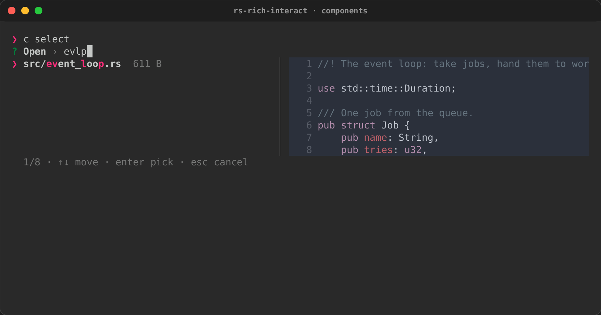
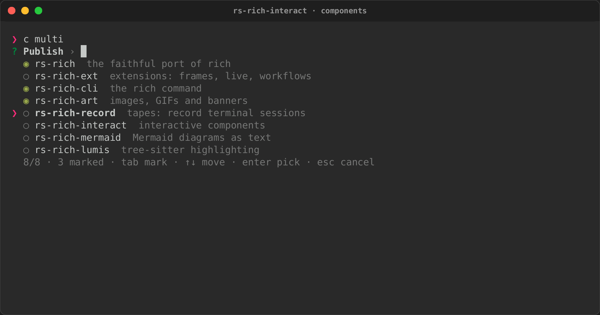
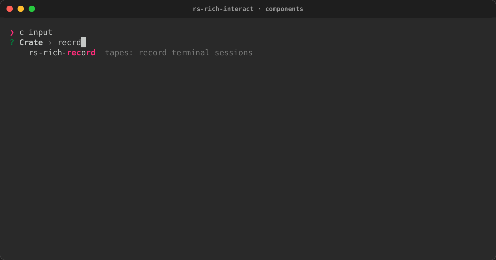
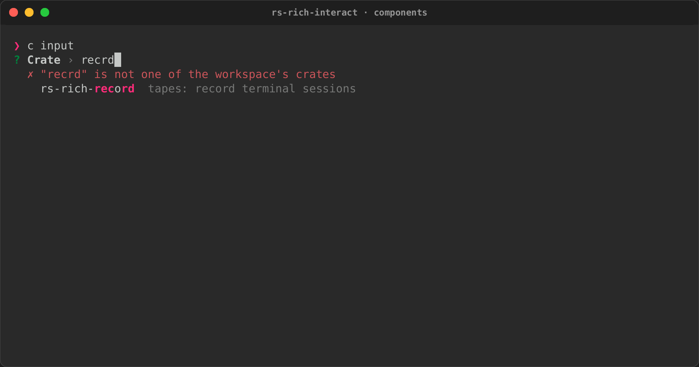
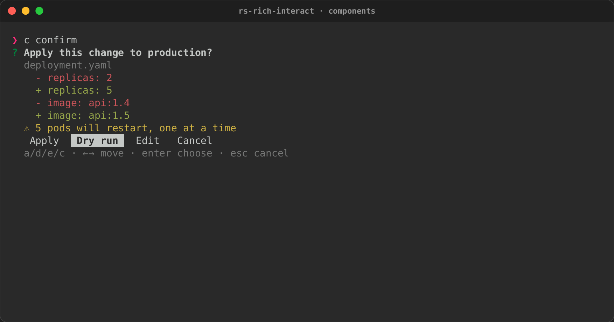
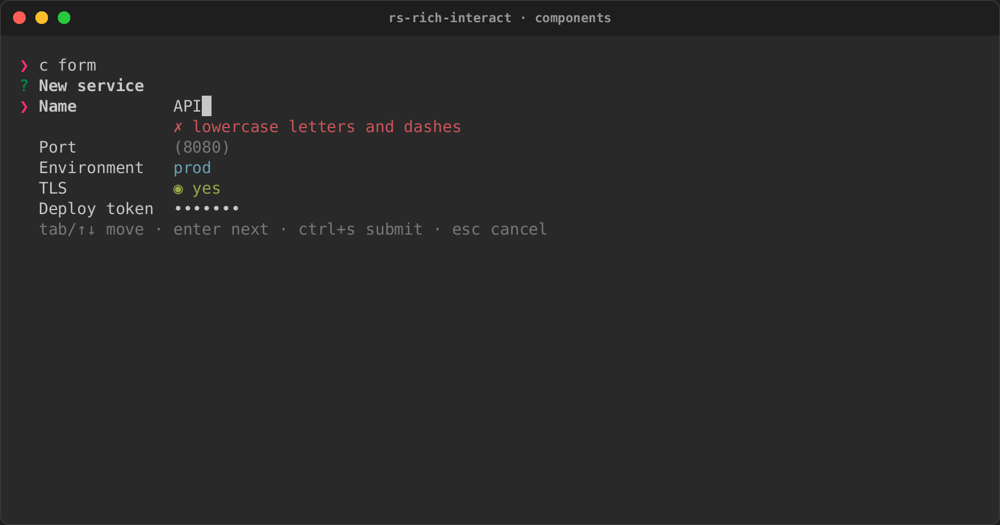
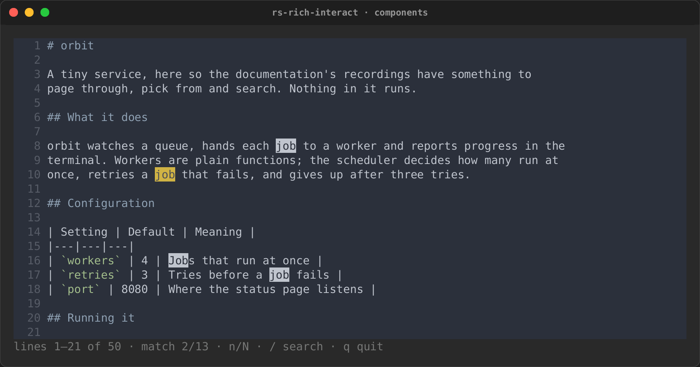

# Interactive components (rs-rich-interact)

`rs-rich-interact` (`rich_interact`) is the layer between printing and a full
TUI framework: small interactive components that take the terminal, get an
answer, and give the terminal back. `rich` has no interactive components, so
this crate is an rs-rich addition, not a port.

## Components

A component is a state machine. It handles one `Event` (a key, the mouse, a
resize, a paste, a tick) and returns a `Flow`:

- `Continue`;
- `Done(value)`;
- `Cancel`;
- `Handoff(command)`, to lend the terminal to another program.

It renders its state as a `View`: lines of segments, plus where the caret
goes.

```rust
use rich_interact::{Component, Context, Event, Flow, KeyCode, View};

/// Counts Up presses; Enter returns the count, Escape cancels.
struct Counter(u32);

impl Component for Counter {
    type Output = u32;

    fn handle(&mut self, event: &Event, _: &Context<'_>) -> Flow<u32> {
        match event.key().map(|key| key.code) {
            Some(KeyCode::Up) => self.0 += 1,
            Some(KeyCode::Enter) => return Flow::Done(self.0),
            Some(KeyCode::Escape) => return Flow::Cancel,
            _ => {}
        }
        Flow::Continue
    }

    fn render(&self, context: &Context<'_>) -> View {
        View::new(context.markup(&format!("count: [bold]{}[/]", self.0)))
    }
}
```

`Context` carries the console to render with and the space available.
`context.lines(&renderable)` renders any rich renderable (a `Table`, a
`Panel`, `Markdown`) into lines.

A component can also implement `start`, which runs once before its first
paint and gets the same `Context`. Use it for work that needs the terminal's
size, such as rendering content at the width. It can also finish the
component straight away, without waiting for a key. The `Pager` renders its
content there, and a `Form` with no fields returns from it.

## Ready-made components

Each of these is a `Component`, so it runs under `run`, in an event loop and
headless. Each also has a line-based form for when there is no terminal. All
are styled by one `Theme`. When finished, each collapses to a one-line answer
(`? Open › src/main.rs`), so a sequence of prompts reads like a transcript.
The screenshots come from the
[components tape](../../recordings.md#components), which runs
`--example components`.

### Select and MultiSelect

A fuzzy picker over [items](#items):

- typing filters, with smart case, and highlights what matched;
- the arrows, PageUp and PageDown move, and Enter picks;
- `MultiSelect` marks with Tab (Ctrl+A marks every match) and returns what was
  marked;
- an item's actions pick it by their key, and `select.action()` says which one
  was used.

When the focused item has a preview, a pane shows it: beside the list from 72
columns, below it on a narrower terminal. The preview can be text, markup, or
any renderable, such as a `Syntax`.

```rust
use rich_interact::{run, Item, Preview, RunOptions, Select};

let items = paths.into_iter().map(|path| {
    let preview = Preview::Renderable(Arc::new(Syntax::new(read(&path), "rust")));
    Item::new(path.clone(), path.display().to_string()).preview(preview)
});
let picked = run(Select::new("Open", items), &RunOptions::default())?;
```





### Input

One line, which edits like a shell's: the arrows, Home and End, Ctrl+A, Ctrl+E,
Ctrl+U and Ctrl+W.

- **Placeholder, default and password.** A placeholder shows while the line is
  empty; `default` answers an empty line; `Input::password` masks what is
  typed.
- **Validation.** A validator's message shows under the line, and Enter waits
  until it passes.
- **History.** Up and Down walk earlier answers.
- **Suggestions.** They come from a fixed list, filtered as you type, or from a
  `provider` that runs on a background thread, so a slow lookup (a registry, a
  file system) never stalls typing. The input keeps one such thread. It runs
  one lookup at a time and, when free, takes only the latest text, so fast
  typing never piles up lookups. Tab accepts one. Suggestions work the same
  inside a `Form` field.

```rust
let input = Input::new("Crate")
    .suggestions(["serde", "serde_json", "tokio"])
    .validate(|text| if text.is_empty() { Err("required".into()) } else { Ok(()) });
```





### Confirm

A confirmation sheet: what will happen, then a choice.

- **Body:** any renderables (a diff, a table of affected files), in a
  scrollable viewport.
- **Warnings:** listed under the body.
- **Choices:** as many as needed, each with a key: `Apply`, `Dry run`, `Edit`,
  `Cancel`. `Confirm::new` alone is yes or no.

```rust
let sheet = Confirm::new("Apply this change to production?")
    .body(diff)
    .warning("5 pods will restart, one at a time")
    .choices([
        Choice::new("apply", "Apply", 'a'),
        Choice::new("dry-run", "Dry run", 'd'),
    ])
    .default("dry-run");
```



### Form

Several fields answered together.

- **Field kinds:** text (any configured `Input`), passwords, a choice among
  options, and yes/no toggles.
- **Moving:** Tab and the arrows move between fields; Enter moves on and, on
  the last field, submits.
- **Errors:** submitting checks every field, puts each failure's message under
  its field, and focuses the first one.

The result, `Answers`, gives each value by field name.

```rust
let form = Form::new("New service")
    .input("name", Input::new("Name").validate(lowercase))
    .input("port", Input::new("Port").default("8080"))
    .choice("env", "Environment", ["dev", "staging", "prod"])
    .toggle("tls", "TLS", true);
let answers = run(form, &options)?.value();
```



### Pager

Pages any renderable at the terminal's width, and renders it again after a
resize.

- **Moving:** it scrolls like the viewport; `q` or Escape closes it.
- **Searching:** `/` starts a search. Matches are marked in place, the current
  one in yellow, and `n` and `N` jump between them.
- **Without a terminal:** it writes the content out in full.



## Running one

`run` is the blocking driver:

1. It starts a terminal session.
2. It drives the component to an `Outcome`: `Done(value)`, `Cancelled`, or
   `Interrupted` on Ctrl+C.
3. It restores the terminal.

```rust
use rich_interact::{run, Outcome, RunOptions};

match run(Counter(0), &RunOptions::default())? {
    Outcome::Done(count) => println!("counted {count}"),
    Outcome::Cancelled | Outcome::Interrupted => {}
}
```

By default the component paints inline, below the cursor, and its last view
stays on screen. The options can change that:

- `SessionOptions { alternate_screen: true, .. }` takes over the whole screen
  and restores it afterwards;
- `mouse: true` reports clicks and the wheel;
- `bracketed_paste: true` delivers a paste as one event;
- `LoopOptions { transient: true, .. }` clears the region at the end;
- `height` limits how many rows the inline region may take.

## Several at once: the event loop

`EventLoop` runs several mounted components together:

- it stacks their views;
- it sends keys to the first one still running;
- it delivers each component's ticks (`Component::tick`) and the loop's
  timers (`EventLoop::every`).

It repaints only what changed. The painter writes the cells that
`Frame::diff` reports, so an idle loop writes nothing at all. `run` is this
loop with one component.

The loop is deliberately small (events, timers, repaint on change), so that
the intuiTUIve track can build its component tree, reactive state and focus
routing on top of it.

## The terminal is always given back

A session turns on raw mode and, optionally, the alternate screen, mouse
reporting and bracketed paste. It undoes all of them on every way out:

- when the component finishes;
- on an early return or `?`, when the session is dropped;
- on Ctrl+C, which ends the loop as `Interrupted`;
- on a panic, through a hook that restores the terminal before the panic
  message prints.

A component can lend the terminal to another program by returning
`Flow::Handoff(command)`. The session is left, the command runs with the
terminal as it was, and the session comes back. The component then receives
`Event::Returned(exit_code)`. That is how "open in `$EDITOR`" works.

Only one session runs at a time, because the terminal's modes belong to the
whole process. A component that calls `run` from inside another gets an
`io::ErrorKind::ResourceBusy` error, and the outer session carries on
unchanged. Mount both components on one `EventLoop` instead.

PTY tests check each of these by running `stty -a` in the same terminal
afterwards.

## No terminal, no blocking

A component needs a terminal on both ends. `run` degrades instead of starting
a session when any of these holds:

- stdin or stdout is redirected;
- `CI` is set;
- `TERM=dumb`;
- the caller turned interactive mode off.

What happens then is the `Policy` fallback:

| Fallback | Then |
|---|---|
| `Prompt` (default) | `Component::prompt` asks line by line: prompts on stderr, answers from stdin. A component without a line form returns its default |
| `Default` | `Component::default_value` |
| `Error` | `Error::NotInteractive` with the reason |

Nothing emits control sequences or waits on a pipe.

## Viewport

`Viewport` is a scrollable window over rendered lines. It moves with:

- the arrow keys and `j`/`k`, by a line;
- PageUp/PageDown and Space, by a page;
- Home/End and `g`/`G`, to the ends;
- the mouse wheel.

A component keeps one and renders its visible lines. Because repaints are
cell diffs, scrolling rewrites only what moved. On its own it is a minimal
pager:

```bash
cargo run -p rs-rich-interact --example viewport -- README.md
```

## Items

`Item<T>` is the one model behind every picker: file pickers, command
palettes and history search alike. It holds:

- a value;
- a label;
- a description;
- `key: value` metadata;
- a preview (text, markup or any renderable);
- actions bound to keys;
- extra search keywords.

`Item::search_text()` is what a filter matches against.

```rust
use rich_interact::{Action, Item, Key, Preview};

let item = Item::new(path, "main.rs")
    .description("the entry point")
    .meta("size", "2 KB")
    .preview(Preview::Text(source))
    .action(Action::new("edit", "Open in $EDITOR", Key::ctrl('e')));
```

## Testing components

The headless driver runs the same event loop with:

- scripted events;
- a virtual clock, so a `wait` makes ticks and timers fire without sleeping;
- a recorder that keeps every paint, both as the exact bytes and as plain
  text.

```rust
use rich_interact::headless::{self, Script};

let script = Script::new().keys("up up enter");
let (outcome, record) = headless::run(Counter(0), script, 40, 5);
assert_eq!(outcome.unwrap(), Outcome::Done(2));
assert_eq!(record.frames, ["count: 0", "count: 1", "count: 2"]);
```
