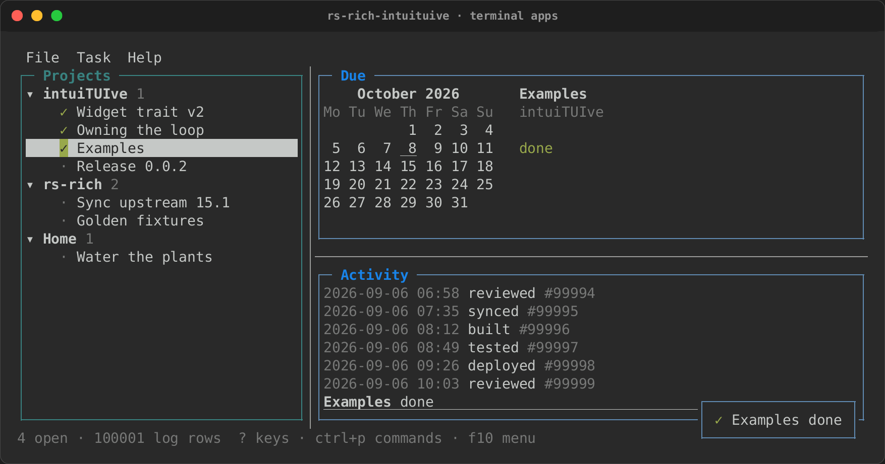
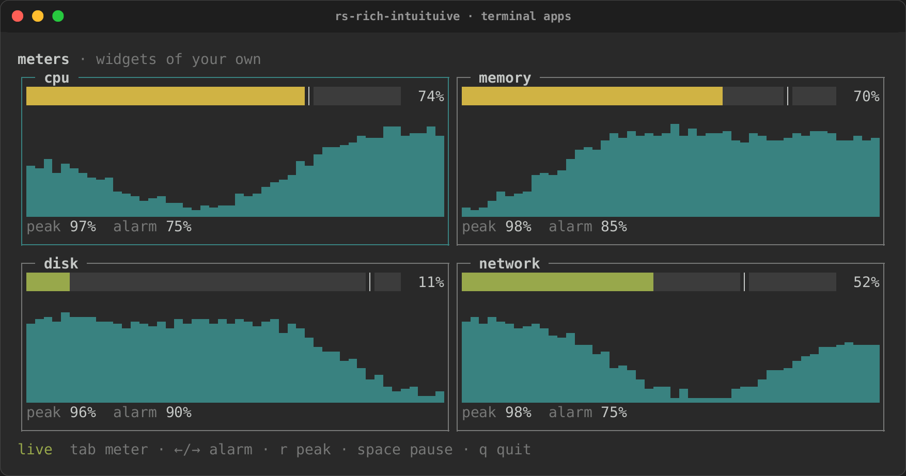
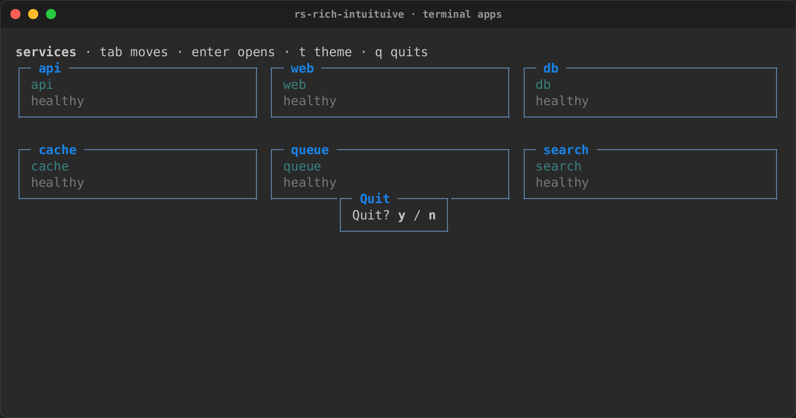
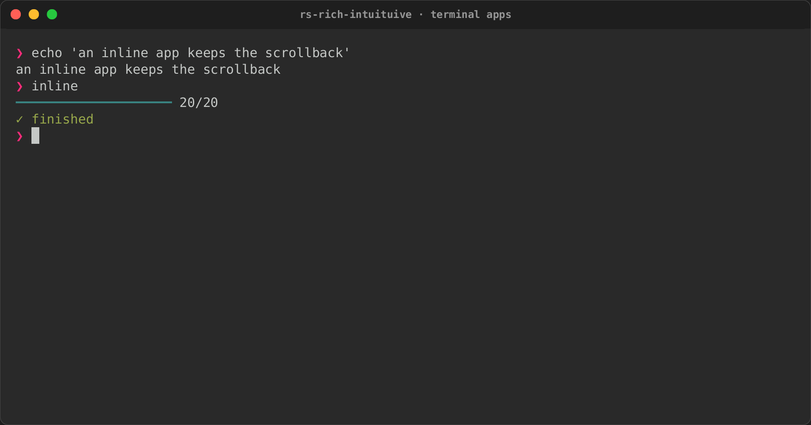
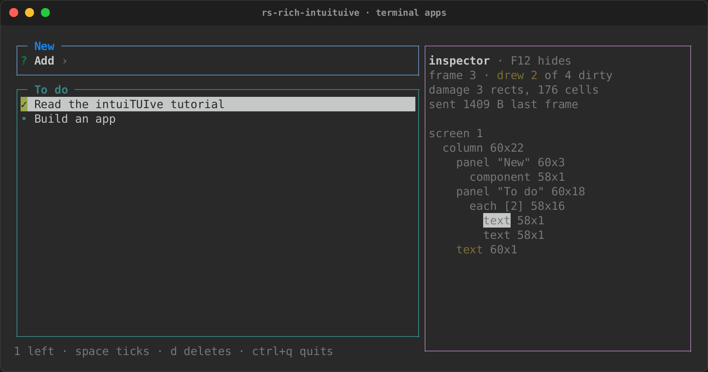

# Terminal apps (intuiTUIve)

`rs-rich-intuituive` (`intuituive`, new and early) is a framework for
terminal apps, full-screen or inline. You describe the screen once as a tree of nodes
and keep your state in **signals**. When a signal changes, the nodes that
read it draw again, and only the cells that changed are sent to the
terminal. You never write a draw loop, a layout pass, or "what changed"
bookkeeping.

It builds on `rs-rich-interact`, so its sessions, its headless test driver
and its components (inputs, selectors, forms, pagers) all work inside an
app. Any rich renderable (tables, Markdown, syntax, charts) is a node.

```toml
[dependencies]
rs-rich-intuituive = "0.0.2"
```

One dependency is enough: `intuituive::rich` is rs-rich and
`intuituive::interact` is rs-rich-interact. New here? The
[tutorial](tutorial.md) builds a to-do app step by step, and the template
starts a project with one command. Coming from ratatui?
[Porting a ratatui app](porting.md) maps every concept and walks through a
Yazi-style file manager rebuilt on intuiTUIve.

```bash
cargo generate --git https://github.com/buchochelliq-labs/rs-rich-cli templates/intuituive-app
```

## A first app

```rust
use intuituive::prelude::*;

fn main() -> std::io::Result<()> {
    App::new(|| {
        let count = signal(0);
        column([
            text!("[b]Count:[/] {count}").panel("Counter"),
            label("[dim]+ adds one · q quits"),
        ])
        .on_key("+", move |_| count.update(|c| *c += 1))
        .on_key("q", |cx| cx.quit())
    })
    .run()
}
```

The closure passed to `App::new` runs once. It creates the state (`count`)
and returns the root node. The rest happens on its own:

- `text!` reads `count`, so pressing `+` redraws that one line;
- the label and the panel's border are not touched;
- the terminal receives the one changed digit.

`App::run` takes the screen and restores the terminal on every way out,
including Ctrl+C and a panic.

## Nodes

| Builder | What it shows |
|---|---|
| `text!("…{signal}…")` | Console markup with `format!` arguments; signals format as their value and are read reactively |
| `text(move \|\| …)` | Markup from any closure; every signal it reads is tracked |
| `label("…")` | Markup that never changes |
| `renderable(move \|\| table)` | Any rich renderable, rebuilt when the signals it read change |
| `column([...])`, `row([...])` | Children laid out down or across |
| `grid([sizes], [...])` | Children in rows and columns (see [Grids](#grids)) |
| `each(move \|\| keys, \|key\| node)` | One child per key, kept by key across reorders |
| `switch(move \|\| key, \|key\| node)` | One child at a time, chosen by key; the others are kept (tabs, wizard steps) |
| `list(move \|\| rows, selected)` | A scrolling list with a selected row (`selected` is a `Signal<usize>`); ↑↓ jk, Home/End and PageUp/PageDown move it |
| `log.view()` | A streaming [`Log`](#logs) |
| `component(Input::new("Name"), on_done)` | A `rich-interact` component (see [Components](#components)) |
| `repeating(\|\| Input::new("Add"), on_done)` | The same, built fresh after each answer (an entry box) |

`.panel("Title")` wraps a node in a rounded border that is highlighted
while the focus is inside it, and `.padding(1, 2)` leaves space round it
(rows above and below, columns either side).

## Layout

A child's size along its parent's axis:

- `.fixed(3)`: exactly 3 cells;
- `.percent(40)`: 40% of the parent;
- `.auto()`: as big as its content (the lines a text wraps to, a panel's
  content and border, a list's rows). When a signal the content reads
  changes, the parent lays out again, and the nodes after it move;
- `.flex(2)`: a weighted share of what is left. A node with no size is
  `flex(1)`.

Any of them can be clamped with `.min_size(n)` and `.max_size(n)`. A
flexible child that reaches a clamp keeps it, and the others share the rest,
as CSS flexbox does. When the children ask for more than there is, they
shrink from the last one, to their minimums first.

```rust
column([
    text!("{status}").auto(),                    // as tall as the status
    row([
        sidebar.percent(25).min_size(20),
        main.flex(1),
    ]),
    label("[muted]q quits").fixed(1),
])
.gap(1)
```

`.gap(1)` leaves a row (or, in a `row`, a column) between neighbours.

### Grids

```rust
grid(
    [Size::Fixed(12), Size::Flex(1), Size::Flex(1)],
    [
        label("logo").span(1, 2),     // one column, two rows
        label("title").span(2, 1),    // two columns
        cpu.panel("CPU"),
        memory.panel("Memory"),
    ],
)
.rows([Size::Auto])
.gap(1)
```

- Children fill the grid row by row; each takes the first place it fits.
- Columns are the sizes given. Rows share the height evenly unless
  `.rows([...])` sizes them, and rows past the last size given take that
  size, so `.rows([Size::Auto])` makes every row as tall as its content.

## State

```rust
let selected = signal(0usize);
let is_first = memo(move || selected.get() == 0);
```

- `get()` reads a value, and `set(v)` or `update(|v| …)` writes it. A node
  that reads a signal while drawing subscribes to it, and a write redraws
  exactly those nodes. `set` with an equal value does nothing.
- `watch(move || source, move |value, cx| …)` runs a callback when a value
  changes (and once at the start), between frames, with a `Ctx`: load a
  preview when the selection moves, save when a document changes. A watch
  made while a screen is built stops when the screen closes.
- A `memo` derives a value and notifies its readers only when the result
  changes. In a list where each row reads `memo(move || selected.get() == i)`,
  a move redraws two rows, not all of them.
- Signals are `Copy`: move them into as many closures as you need. Two
  apps in one program (two panes of a ratatui app, say) can share one: a
  write redraws the readers in both.

Writing signals, and the cycles the runtime stops:

- **Inside `update`**, the closure may read and write other signals.
  Readers see every change once the outermost update is done. Reading the
  signal being updated panics: use the value the closure is given.
- **A memo only computes.** Writing a signal while a memo (or a watch's
  source) computes panics with a message that says so: write in a handler,
  a watch's callback or a task.
- **A node that writes a signal it reads while it draws** draws again, once
  (a scroll moving to keep the focus in view does this). One that does it
  frame after frame would draw forever: after a few frames its own writes
  stop drawing it again, and a toast names it.
- **A watch whose callback changes its own source** runs at most 100 rounds
  in a row; then what is left is dropped and a toast says so.

## Input and focus

```rust
column([
    label("one").focusable().on_key("x", |_| { /* … */ }).panel("One"),
    label("two").focusable().panel("Two"),
])
.on_key("q", |cx| cx.quit())
```

- **Keys** go to the focused node first, then bubble up through its
  ancestors until a binding uses them.
- **Tab** and **Shift+Tab** move the focus through focusable nodes. A
  handler can move it too, with `cx.focus_next()` or `cx.focus(id)`.
- **Which node has the focus first:** the first focusable one, unless a
  node asks with `.autofocus()` (a search box, the list a screen is
  about).
- **Clicks:** `.on_click(|cx| …)` gets the clicks inside the node and
  focuses it. The app remembers where each node was drawn, so you never
  store rectangles yourself.
- **Key names** are the ones `rs-rich-interact` uses: `"q"`, `"ctrl+s"`,
  `"up k"` (either key). Spaces separate names, so the space key is
  `"space"`; a binding with no keys, or a name that is not a key (`"f99"`,
  `"ctrl-s"`), panics when the binding is made. A name means the key:
  `"shift+a"` is `"A"`, and `"ctrl+i"` is Ctrl+I, not Tab. A terminal
  without the kitty keyboard protocol sends some keys alike (Tab and
  Ctrl+I, Enter and Ctrl+M, Esc and Ctrl+[), so its Tab fires a `"tab"` or
  a `"ctrl+i"` binding (on one node, `"tab"` wins). With the protocol,
  which the app turns on when the terminal has it (`.legacy_keys(true)`
  keeps it off), Tab fires only `"tab"` and Ctrl+I only `"ctrl+i"`.
- **Key releases** reach widgets as `WidgetEvent::KeyUp`, from a terminal
  with the kitty protocol; bindings fire on presses (and repeats) only.
  Typed text stays text, so a plain letter or digit (or Enter, Tab and
  Backspace) has no release: Escape, arrows, function keys and keys with
  Ctrl or Alt do.
- **Ctrl+C** quits, unless a node on the focused path binds it: then the
  binding runs, and quitting is up to you.
- **Ctrl+Z** suspends the app on Unix, as the shell expects, and `fg`
  draws it again (inline, in a new region below the shell's lines), unless
  a node on the focused path binds it: then the binding runs.
- **When the focused node goes** (a row deleted from an `each`), the focus
  moves to the next one in the Tab order, or the one before it if it was
  last.
- **Out of the Tab order:** `.no_focus()` keeps a list or component you only
  show from taking the focus.
- **Showing the focus:** panels highlight their border while the focus is
  inside them. Any node can show it too: `.focus_style("reverse")` (any
  style or theme name) restyles it, filled to its full width and over its
  children, while it has the focus, which is how a list shows its selected
  row.

## Components

```rust
use rich_interact::Input;

let name = signal(String::new());
column([
    component(Input::new("Name"), move |value, _| name.set(value)).fixed(1),
    text!("Hello, {name}"),
])
```

- A focused component takes keys first. Keys it does not use bubble on, and
  the terminal caret follows its cursor.
- Its answer (Enter in an `Input`, a pick in a `Select`) goes to the
  closure.
- `.on_cancel(|cx| …)` handles Esc. Without it, Esc bubbles to your own
  bindings.
- A component answers once and then shows its answer. For an entry box
  that takes one entry after another, use `repeating(make, on_done)`: it
  builds a fresh component after each answer.

## Logs

```rust
let log = Log::new(1_000);           // keeps the last 1,000 lines
log.push("[green]started[/]");
log.view().panel("Log")
```

A log renders each line once. On an append it moves the rows already on
screen up and renders only the new lines. That is why a log tail costs less
than redrawing every row, which is ratatui's approach.

## Tables, tabs and scrolling

```rust
use intuituive::widgets::{table, tabs, Column};

let selected = signal(0usize);
let tab = signal(0usize);
column([
    tabs(|| vec!["Files".into(), "Log".into()], tab).fixed(1),
    switch(move || tab.get(), move |tab| match tab {
        0 => table(
            vec![Column::new("Name", Size::Flex(1)), Column::new("Size", Size::Auto)],
            move || files.with(|f| f.iter().map(|f| vec![f.name.clone(), f.size()]).collect()),
            selected,
        ),
        _ => scroll(text(move || log.get())),
    }),
])
```

- **`table(columns, rows, selected)`**:
  - The header row stays in view, and each column is sized like a child
    in a row (cells, a percentage, a share, or `Size::Auto` to fit what
    is in view).
  - One row is selected. ↑/↓ (or k/j), PgUp/PgDn and Home/End move it, a
    click selects a row, and the wheel moves it.
  - `virtual_table(columns, len, row, selected)` asks only for the rows in
    view, so a million rows cost a screenful.
- **`tabs(titles, selected)`** is a strip of titles. ←/→ and 1–9 move the
  selection, and so does a click. Pair it with `switch` on the same
  signal for the content.
- **`scroll(child)`** is a viewport onto a child laid out at its full
  height (up to 4000 rows).
  - The arrow keys, PgUp/PgDn, Home/End and the wheel scroll it, and a
    scrollbar appears when the child does not fit.
  - The focus moving to a node inside scrolls that node into view.
  - The child draws into an offscreen screen with its own damage, so only
    what changed inside draws, and the rows in view are copied out.
  - `scroll_with(child, offset)` puts the first row in view in a signal
    you can read and set.
- **`scroll_x(child)`** scrolls across instead, for content wider than
  the view (up to 2000 columns), and **`scroll_both(child)`** both ways,
  with a bar along the bottom too. ←/→, Shift+wheel and Shift+PgUp/PgDn
  move across. `scroll_both_with(child, x, y, across, down)` puts both
  offsets in signals.

#### Sorting, resizing and a cell cursor

`table_with(columns, rows, selected, options)` takes the rest as
`TableOptions`:

```rust
use intuituive::widgets::{table_with, Order, TableOptions};

let sort = signal(Some((1, Order::Descending)));
let cell = signal(0usize);
table_with(
    columns,
    move || files.get(),
    selected,
    TableOptions::default().sort_rows(sort).cells(cell).resizable(),
)
```

- **`.sort(signal)`** puts the sort column and order in a signal. A click
  on a header sorts by it, a second click reverses the order, and `s`
  sorts by the cell cursor's column. The header shows ▲ or ▼. Your rows
  closure reads the signal and sorts, so `selected` stays an index into
  your own rows.
- **`.sort_rows(signal)`** sorts plain string rows for you instead.
  Numbers compare as numbers; everything else compares as lowercase text.
- **`.cells(signal)`** adds a cell cursor. ←/→ move it, a click puts it on
  the cell, and the theme's `selected.cell` style draws it.
- **`.resizable()`** lets the columns be resized by dragging the gap after
  a header.

### Trees, split panes, calendars and lists

```rust
use intuituive::widgets::{calendar, hsplit, tree, virtual_list, Date, TreeItem};

let path = signal(Vec::<usize>::new());
let ratio = signal(0.3);
let day = signal(Date::new(2026, 10, 7));
hsplit(
    tree(|| vec![TreeItem::new("src").children([TreeItem::new("main.rs")])], path),
    column([
        calendar(day).fixed(8),
        virtual_list(|| 100_000, |i| format!("line {i}"), signal(0usize)),
    ]),
    ratio,
)
```

- **`tree(items, selected)`** shows nested `TreeItem`s with the selection
  as a path of indices. ↑/↓ move, → expands, ← collapses or goes to the
  parent, Enter or Space toggles, and a click on an arrow toggles it. `tree_with` puts the
  expanded paths in a signal of your own. Keys a leaf does not use (Enter
  on it, ← at the top) bubble up to your bindings.
- **`hsplit(first, second, ratio)`** puts two panes side by side, and
  `vsplit` stacks them. Dragging the divider moves it, and so do Alt+←/→
  (Alt+↑/↓ when stacked) from inside either pane. `split_with` sets the
  smallest size of a pane (three cells by default).
- **`calendar(selected)`** is a month grid of a `Date` signal: the arrows
  move by day and week, PgUp/PgDn by month, a click picks a day and the
  wheel changes month. `Date` has the date arithmetic it needs (weekday,
  adding days and months, month lengths).
- **`virtual_list(len, row, selected)`** is the list form of
  `virtual_table`: it asks only for the rows in view.
- **`tree_lazy(roots, children, selected)`** loads each level when it is
  opened. `children(key)` runs on another thread, so it can read a
  directory or ask a server, and returns the level's `LazyItem`s
  (`LazyItem::leaf` or `LazyItem::branch`). The tree shows
  "loading…" until they arrive, and shows an error in red if loading
  fails. `selected` holds the key of the selected item.

The `planner` example puts them together under a menu bar: projects and
their tasks in a tree, the selected task's due date on a calendar, and a
log of a hundred thousand rows, in panes whose dividers drag
(`cargo run -p rs-rich-intuituive --example planner`).



## The mouse

Every mouse event (press, release, drag, movement, the wheel) goes to the
deepest node under the pointer, in that node's own coordinates, and
bubbles up through its ancestors until one uses it.

- **A press** first focuses the deepest focusable node under the pointer.
- **`.on_click(handler)`** handles a left click.
- **`.on_mouse(|cx, mouse| …)`** handles every mouse event. It returns
  whether it used the event. On a table, list, tree or calendar, a right
  click selects what is under it and then reaches this handler, so a
  `context_menu` it opens is about the row it selected.
- **A drag** can be kept by the widget it started in, even when the
  pointer leaves it: call `capture_mouse()` from its handler.
- **Hover** is state. A widget that asks whether it is hovered draws again
  when the pointer enters or leaves it. The terminal's movement reports
  are turned on only once something asks.
- **`.hover_style(style)`** lays a style over a node while the pointer is
  over it, the way `.focus_style(style)` does for the focus. It works on
  containers too.

### Tooltips

`.tooltip(markup)` shows a small box by the pointer once the pointer has
rested on the node for 600 ms. F1 shows the focused node's tooltip below
the node at once, unless a binding takes F1. A key, a click or moving to
another node hides it.

The box draws over everything, in the theme's `tooltip` style (reverse
unless the theme sets it). It wraps to fit the screen and goes above the
pointer when there is no room below.

### Drag-and-drop

```rust
let done = signal(Vec::<Task>::new());
column([
    each(move || todo.get(), |task| label(task.title.clone()).draggable(task)),
    text(move || format!("{} done", done.with(Vec::len)))
        .on_drop(move |task: &Task, _| done.update(|d| d.push(task.clone()))),
])
```

- **`.draggable(value)`** lets a node be dragged with the left button,
  carrying `value`. A press still focuses and clicks as before; the drag
  starts once the pointer moves a cell.
- **`.on_drop(|value: &T, cx| …)`** takes values of type `T`. A drag
  carrying another type passes the node by: it is not highlighted, and
  nothing drops.
- While a drag lasts, its source is dimmed and the target under the
  pointer is lit in the theme's `drop.target` style (reverse unless set).
- Letting go over a target drops the value there; anywhere else, nothing
  happens. Esc cancels.

### Selecting and copying text

Turning on the mouse usually costs the terminal's own text selection. In
an intuiTUIve app, a drag that starts where nothing uses the press selects
the text under it, shown reversed, and copies it when the button is let
go, with OSC 52, so it works over SSH too, in terminals that allow it. A
toast says how much was copied. `App::selectable(false)` turns this off.
A handler puts text of its own on the clipboard with `cx.copy(text)` (the
`files` example yanks a path with `y`), with the same toast.

## Your own widgets

Anything the built-in nodes do, a widget of yours can do too. It
implements `Widget`, and `widget(w)` makes a node of it, which takes every
builder (`.flex`, `.panel`, `.on_key`, `.name`):

```rust
use intuituive::widget::{widget, Canvas, DrawCx, EventCx, MouseExt, Used, Widget, WidgetEvent};

/// A counter that a click or `+` counts up.
struct Counter(u32);

impl Widget for Counter {
    fn name(&self) -> &'static str {
        "counter"
    }

    fn draw(&mut self, cx: &mut DrawCx, canvas: &mut Canvas) {
        let style = cx.style("accent", "bold");
        canvas.print(0, 0, &format!("count {}", self.0), Some(&style));
    }

    fn event(&mut self, cx: &mut EventCx, event: &WidgetEvent) -> Used {
        match event {
            WidgetEvent::Key(key) if *key == Key::char('+') => {}
            WidgetEvent::Mouse(mouse) if mouse.is_press() => {}
            _ => return Used::No,
        }
        self.0 += 1;
        cx.redraw();
        Used::Yes
    }

    fn focusable(&self) -> bool {
        true
    }
}
```

What a widget can do:

- **`draw`** writes cells on a `Canvas`, the widget's rectangle in its own
  coordinates. It writes with `print`, `set`, `fill`, `clear`, `lines`
  (rendered rich segments) and `render` (any rich renderable). It can also
  write one row of markup with `markup`, draw a rounded edge with `border`,
  lay a style over cells with `restyle`, and move everything up with
  `scroll_up`. Signals read here make it draw again.
- **`event`** gets these events:
  - keys while the focus is on it or inside it (with nothing focused,
    while the pointer is over it), and `KeyUp` when one is let go (from a
    terminal with the kitty keyboard protocol, for keys other than plain
    text, Enter, Tab and Backspace);
  - mouse events over it, and pasted text;
  - `Focus`, `Hover` and `Resize` when the focus or the pointer comes or
    goes, or its size: after the frame it is first laid out in, and
    whenever its size changes (a widget drawing that first frame reads its
    size from the canvas);
  - `Preview`: keys on their way to the focused node inside it, first,
    when its `previews_keys` is true (a container's shortcuts that win
    over its children's).

  Keys, releases, the mouse and paste it does not use bubble on. `cx.redraw()`
  draws it again after a change to its own state, and `cx.app()` can
  quit, open a screen or move the focus.
- **Hover and the pointer:**
  - `cx.hovered()` in `draw` redraws the widget only when the pointer
    enters or leaves it.
  - `cx.pointer()` gives the pointer's cell inside it, for hover effects
    on a part.
  - `cx.report_movement()` turns on movement events without redrawing on
    them.
- **`measure`** says how big it wants to be, for `Size::Auto` and for
  modals sized to their content. `MeasureCx::measure`, `extent` and
  `stack` measure and lay out children as the built-in nodes do.
- **`children` and `layout`** make it a container. Its children are
  ordinary nodes, drawn after it, so it can draw chrome round them (a
  header, a scrollbar). `layout` runs each time the widget draws, before
  `draw`, and the signals it reads lay it out again.
- **`retained`** keeps what it drew. When only its own state changed, the
  canvas is not cleared, only the cells it writes are sent, and its
  children redraw only where it drew over them. `cx.repaint()` says when
  it must draw everything. A border that changes colour on focus, or a
  log that scrolls, costs a few cells.
- **`viewport` and `scroll`** show its children through a window. They
  are laid out at their full size, drawn offscreen with their own damage,
  and copied out where the widget looks. Clicks and the caret are
  translated through it.
- **`caret`** places the text caret while it has the focus.

Every built-in node is a widget built on this trait: text, labels,
renderables, columns, rows, grids, panels, padding, `each`, `switch`,
logs, hosted components and `scroll`, as well as `table`, `tabs`, `tree`,
the split panes, the calendar and the menus. `leaf` is still the shortest
way to a node that only draws, and `component` hosts rs-rich-interact
components, which also run outside an app.

The `meters` example is a whole board of widgets of their own
(`cargo run -p rs-rich-intuituive --example meters`). Each meter keeps
what it drew and redraws only its inside rows on a new sample; it redraws
its border on `Focus`, sizes its sparkline on `Resize`, reads the sample
under the pointer, and eases its gauge with an animation. The board that
holds them sees keys first (`previews_keys`), and while it is paused it
keeps them from the meters.



## Screens and modals



An app is a stack of screens. A handler opens one with `cx.push`, and
`cx.pop` goes back:

```rust
fn detail(id: u32) -> Node {
    let count = signal(0);
    text!("item {id}: {count}")
        .on_key("+", move |_| count.update(|c| *c += 1))
        .on_key("esc", |cx| cx.pop())
}

label("home").on_key("enter", |cx| cx.push(|| detail(7)))
```

- The screen below is kept, with its state and its focus, and comes back as
  it was.
- A screen's closure can create signals and call `every`; its timers stop
  when it closes.
- `cx.replace(build)` swaps the top screen, as a wizard's steps do.

A modal is a screen in a box over the one below, which keeps drawing:

```rust
.on_key("q", |cx| {
    cx.modal(Size::Auto, Size::Auto, || {
        label("Quit? [b]y[/] / [b]n[/]")
            .padding(0, 1)
            .panel("Quit")
            .on_key("y", |cx| cx.quit())
            .on_key("n esc", |cx| cx.pop())
    })
})
```

Its width and height are cells (`Size::Fixed`), a share of the screen
(`Size::Percent`), the content's size (`Size::Auto`), or the whole screen
(`Size::Flex`). Keys and clicks reach only the top screen.

### Pop-ups

`cx.popup(anchor, placement, width, height, build)` opens a box like a
modal, but next to a node rather than in the middle of the screen: below,
above, right or left of `anchor` (a node's `id()`), flipped to the other
side when there is no room. Esc that nothing used, or a press outside it,
closes it. Dropdowns, menus and autocomplete lists start here.

```rust
let field = label("Colour: red").focusable();
let at = field.id();
field.on_key("enter", move |cx| {
    cx.popup(at, Placement::Below, Size::Fixed(12), Size::Auto, || {
        label("red\ngreen\nblue").panel("Pick").on_key("q", |cx| cx.pop())
    })
})
```

The anchor can also be a `Rect` of the screen, for a pop-up at a place
rather than a node: `EventCx::rect()` gives a widget its own, and
`Ctx::pointer()` gives where the mouse event being handled happened.

### Menus

```rust
use intuituive::menu::{context_menu, menu_bar, Menu, MenuItem};

column([
    menu_bar(vec![
        Menu::new("File", vec![
            MenuItem::new("Save", |cx| save(cx)).hint("ctrl+s"),
            MenuItem::separator(),
            MenuItem::new("Quit", |cx| cx.quit()),
        ]),
    ])
    .fixed(1),
    body.on_mouse(|cx, mouse| {
        if mouse.kind != MouseKind::Down(Button::Right) {
            return false;
        }
        context_menu(cx, vec![MenuItem::new("Copy", copy), MenuItem::new("Paste", paste)]);
        true
    }),
])
```

- **`menu_bar(menus)`**: ←/→ move between titles while it has the focus,
  and Enter, ↓ or a click opens a menu below its title.
- **A menu**: ↑/↓ move past separators, Enter or a click runs an item
  (the menu closes first, so the item may open a screen), the pointer
  moves the selection, and Esc or a press outside closes it.
- **`context_menu(cx, items)`** opens at the pointer from a mouse handler,
  and **`open_menu(cx, at, placement, items)`** next to a node or a `Rect`.

### The command palette and help

Every binding made with `.bind(keys, description, handler)` is a command.
`cx.palette()` lists the ones on the focused node and its
ancestors, searched as you type, and runs the one picked as its key would.
`cx.help()` lists the same bindings with their keys. Keys open either:

```rust
App::new(build).palette_key("ctrl+p").help_key("?")
```

Bindings made with `.on_key` have no description and stay out of both.
Name a node (`.name("Editor")`) to group its commands under that name.

## Toasts and animations

- **`cx.toast(markup)`** shows a message at the bottom right for three
  seconds, and `toast_for(markup, duration)` for as long as you say.
  Toasts stack and do not take the focus. On a screen too small for a
  toast's box, the newest shows reversed on the bottom row.
- **`cx.animate(signal, to, duration, easing)`** moves a `Signal<f64>` to
  `to` over `duration`, setting it every frame, so whatever reads it moves
  with it: a split's ratio, a gauge, a scroll offset. `Easing` is `Linear`,
  `EaseIn`, `EaseOut` or `EaseInOut`. A new animation of the same signal
  takes over from where it is. While one runs, the app draws at about 60
  frames a second, and it goes back to waiting for input when they end.

```rust
let ratio = signal(0.5);
hsplit(left, right, ratio).on_key("z", move |cx| {
    cx.animate(ratio, 0.8, Duration::from_millis(200), Easing::EaseOut)
})
```

## Timers and background work

```rust
App::new(|| {
    let seconds = signal(0);
    every(Duration::from_secs(1), move |_| seconds.update(|s| *s += 1));
    text!("up {seconds}s")
})
```

- **Timers:** `every` runs a handler on a schedule. Call it inside
  `App::new`'s closure (or a screen's), next to the signals it writes. A
  timer that fell behind (the clock jumped, the laptop slept) ticks once,
  not once for every tick it missed, and keeps to its step after that.
- **Tasks:** `spawn(work, done)` runs `work` on its own thread and `done`
  with the result back on the app's thread, where it can write signals,
  open a screen or quit. `spawn_future` does the same for a future that does
  not need a particular async runtime. Both return a `Task`, which you can
  `cancel()` (its result is dropped).

```rust
.on_key("r", move |_| {
    spawn(fetch_report, move |report, cx| {
        cx.push(move || report_screen(report));
    });
})
```

- **Resources:** `resource(fetch)` loads a value in the background and
  holds `Load::Loading`, `Load::Ready(value)` or `Load::Failed(error)`. A
  node that reads it redraws when it arrives; `reload()` fetches again and
  drops any older result still on its way.

```rust
let user = resource(|| api::user(42));
text(move || match user.get() {
    Load::Loading => "[muted]loading…".into(),
    Load::Ready(user) => format!("Hello, {}", user.name),
    Load::Failed(error) => format!("[bad]{error}"),
})
.on_key("r", move |_| user.reload())
```

- **Other threads:** signals live on the app's thread. Work you start
  yourself (a tokio runtime, a file watcher) sends closures through a
  `Proxy` from `cx.proxy()` or `app.proxy()`: `proxy.run(move ||
  status.set(body))`, or `proxy.run_with(|cx| …)` for a `Ctx` too.

## Themes

A `Theme` styles what the framework draws (borders, the focused border,
panel titles) and names styles for markup. The presets, `Theme::dark()` (the
default), `Theme::light()` and `Theme::mono()`, each define `accent`,
`muted`, `good`, `warn` and `bad`:

```rust
label("[accent]ops[/] · [good]12 up[/] · [bad]1 down[/]")
```

Add your own with `Theme::dark().style("brand", Style::parse("bold magenta")?)`,
set it with `App::theme`, and switch at run time with `cx.set_theme(theme)`;
everything is drawn again in the new theme.

### Theme files, reloaded live

```rust
app.theme_file("theme.ini").run()
```

```ini
[styles]
accent = bold magenta
border.focused = bright_green
```

The file is rich's theme format: a `[styles]` section of `name = style`
lines. `border`, `border.focused` and `title` restyle the framework's parts,
and every name works in markup. The app reads the file again whenever it
changes, so you can tune colours while it runs. A file that does not parse
leaves the last good styles in place, and the [inspector](#inspector) shows
the error. `Theme::load(path)` and `theme.with_config(text)` read the same
format without watching.

## Stylesheets

A stylesheet styles and lays out nodes from outside the code, in a subset
of CSS:

```rust
App::new(build).stylesheet_file("app.tcss").run()
```

```css
/* app.tcss */
#status { dock: bottom; size: 1; background: $accent; color: black; }
#preview { size: 3fr; padding: 0 1; border: round $accent; border-title: Preview; }
.danger:focus { background: red; text-style: bold; }
panel table:hover { text-style: underline; }
```

**Selectors** match a node's kind (`label`, `text`, `table`, `panel`,
`column`, `row`, `grid`: what the [inspector](#inspector) shows), its
`.name("…")` as `#name`, its classes as `.class`, and its states:

- `:focus` and `:focus-within`;
- `:hover`, for the node under the pointer and its ancestors;
- `:selected` and `:disabled`, while `.selected_when(…)` or
  `.disabled_when(…)` holds.

Spaces separate a node from its ancestors (`panel label`). Sibling
selectors and `!important` are not supported. The more specific rule wins,
then the later one.

`.class("warn big")` gives a node fixed classes, and
`.class_when("danger", move || load.get() > 90)` gives it a class while a
condition holds, following the signals the condition reads.

**Properties:**

| | |
|---|---|
| `color`, `background` | a colour (`red`, `#ff8800`, `grey23`) or a theme style's colour (`$accent`) |
| `text-style` | `bold`, `dim`, `italic`, `underline`, `reverse`, `strike`, `blink`, `none` (every one off); a later rule's replaces an earlier one's |
| `border`, `border-title` | `round`, `square`, `heavy`, `double`, `ascii` or `none` (which takes a panel's own border and its cells away), then a colour; a title |
| `size`, `min-size`, `max-size` | `3`, `50%`, `2fr`, `auto`, along the parent's axis |
| `padding` | one to four numbers, as in CSS |
| `gap`, `grid-columns`, `grid-rows` | a stack's or grid's spacing; a grid's tracks |
| `display` | `none` hides the node and what is inside, takes it out of the Tab order, and out of a grid's cells |
| `dock` | `top` or `bottom` in a column, `left` or `right` in a row: kept at that edge |

**How it applies:**

- **Colours inherit, as in CSS.** They go under what a node draws, so a
  widget's own colours and markup's `[green]` stay, and they fill in the
  rest of the node's area, gaps included.
- **Code wins.** `.fixed(3)` beats `size: 5`, and `.focus_style()` and
  `.hover_style()` go over the sheet's colours. A node whose code sets no
  size takes the sheet's.
- **What follows states.** States and `class_when` change colours and text
  styles. Layout is decided by a node's kind, name and fixed classes.
- **Borders.** A `border` on a panel restyles the panel's own box. On
  another node it draws a box round it, inside its area.
- **Live.** A sheet file is read again whenever it changes. One that does
  not parse is reported in a toast with its line and column, and the last
  good sheet stays. `App::stylesheet(css)` takes a string.
  `Stylesheet::parse` checks one in a test.
- **Cost.** Rules are matched once per node and sheet, and a node's style
  is worked out only when it draws. An app without a sheet does none of
  it.

## Accessibility

There are two modes for assistive technology:

- `App::accessible(true)` draws the screen as text, with the cursor on the
  focus. It is on by default when `INTUITUIVE_ACCESSIBLE` is set (to
  anything but `0` or `linear`), or when rs-rich's `RICH_A11Y` names
  `screen-reader`.
- `App::linear(true)` draws no screen: it writes lines of text (see
  [Linear mode](#linear-mode)). It is on by default when
  `INTUITUIVE_ACCESSIBLE=linear`.

How to try both with Orca, NVDA and VoiceOver, and what each should say,
is in [Testing with screen readers](screen-readers.md).

- **The cursor is on what has the focus.** The terminal's real cursor sits
  on the focused item: an input's caret, a list's or table's selected row,
  a table's cell, a tree's item, the selected tab, the menu entry, the
  calendar's day. NVDA, VoiceOver and Orca read the line the cursor is on,
  so they follow the app with no bridge. The cursor is hidden while a frame
  is written, so a screen reader does not read the cells it passes. It is
  shown again once it is back on the focus. A frame that changes nothing on
  the screen does not move it.
- **Text mode:**
  - Boxes are drawn as blanks (titles stay), so no line characters are
    read out.
  - There is no colour, so no meaning rests on it.
  - The selected item in a list, table, tree or tab strip is marked with
    `>`.
  - Menu separators and a split's divider are blank.
  - Animations jump to their end.
- **Roles and names.** Every node has a role (`Widget::role`, set by every
  built-in: `list`, `table`, `tree`, `tablist`, `menu`, `region` for a
  panel, `button` for a clickable label, `textbox` for an `Input` or a
  `TextArea`, …) and a name: `.label("Save")`, else the text it shows,
  else a panel's title. `.role(Role::MenuBar)` sets a role in code. A node
  named by the text it shows (a live row, a button) speaks for what is
  inside it, so its children are not listed again.
  `Driver::accessibility()` returns the tree: depth, role, name, what is
  selected in it, focus, states and place. rs-rich-web's
  [DOM renderer](web.md#the-dom-renderer) carries it to a browser's screen
  reader; a screen reader bridge could render it too.
- **States.** Each node in the tree has an `AccessState`: `expanded`,
  `checked`, `selected`, `busy`, and `position`, the selected item's place
  (`3 of 10`). In a widget of items, the states are those of its selected
  item.

    | Widget | States it sets |
    |---|---|
    | `list`, `table`, `virtual_list`, `tabs`, menus, the menu bar | `selected`, `position` |
    | `tree`, `tree_with` | the same, and `expanded` for an item with children |
    | `tree_lazy` | the same, and `busy` while a level loads |
    | `calendar` | `selected` |

    Code sets them with `.selected_when(…)`, `.expanded_when(…)`,
    `.checked_when(…)` (which makes the role `checkbox` unless one is set;
    use `Role::Switch` for a toggle) and `.busy_when(…)`, each taking a
    condition that may read signals. `Widget::access_state` is the hook
    for a widget of your own. `AccessNode::aria_attributes()` maps them to
    ARIA (`aria-expanded`, `aria-checked`, `aria-selected`, `aria-busy`,
    `aria-disabled`, `aria-posinset`, `aria-setsize`) for a browser.
- **Hidden from assistive technology.** `.access_hidden(true)` (ARIA's
  `aria-hidden`) leaves a node, and everything inside it, out of the tree,
  linear mode's lines, announcements and the names of what holds it, and
  out of the Tab order and the focus a screen gives when it opens (a click
  still reaches it). It is still drawn. Use it for decoration: a divider, a
  spinner's glyph, a logo.
- **Announcements.** Toasts, a screen or dialog opening, `.live()` nodes
  whose text changes (a status line), and `cx.announce(text, urgent)` go to
  the app's `App::announcer(…)` as they happen, and wait in
  `Driver::take_announcements()` for a loop that reads them (the
  [DOM renderer](web.md#the-dom-renderer) puts them in an ARIA live
  region).

```rust
App::new(|| {
    column([
        text!("{done} of {total} done").live(),
        list(move || tasks.get(), selected).label("Tasks"),
    ])
})
.announcer(|a: &Announcement| eprintln!("say: {}", a.text))
```

### Linear mode

In linear mode the app draws no screen. It writes the accessibility tree
as plain lines of text, in reading order: no cursor addressing, no
alternate screen, no mouse, no colour and no synchronized output. After each event it writes only
the lines of the nodes that changed, like a transcript, and a screen reader
reads new output as it arrives. Keys work as usual.

- Each line is `AccessNode::describe()`: the name, the role (left out for
  text and a status), the selected item's place, the value after a colon,
  then the states.
- The focus moving is written as `→` and the focused node's line.
- Toasts and `cx.announce(…)` are written as their text. A live node's
  change and a dialog opening are written as their lines only.
- Closing a dialog writes only what changed on the screen below, and where
  the focus is.

Here is the `access` example
(`cargo run -p rs-rich-intuituive --example access -- --linear`), with the
keys pressed in brackets, shortened (the whole run is pinned by a test in
`tests/linear.rs`):

```text
[start]
Notes
→ Sections, tab list, 1 of 2: Files, selected
Folders, region
Folders, tree, 1 of 3: src, selected, collapsed
Files, region
Files, list, 1 of 10: notes-1.md, selected
10 files, loaded once
Save, button
Delete, button
Reload, button
tab moves · space ticks · s saves · d deletes · r reloads · q quits
[tab]
→ Folders, tree, 1 of 3: src, selected, collapsed
[right]
Folders, tree, 1 of 5: src, selected, expanded
[down]
Folders, tree, 2 of 5: main.rs, selected
[s]
Saved
[right on the tab strip]
Sections, tab list, 2 of 2: Settings, selected
Settings, region
Wrap lines, check box, checked
Dark theme, switch, not checked
[space on Wrap lines]
Wrap lines, check box, not checked
[d]
Delete, dialog
Delete notes-1.md? y / n
[n]
→ Wrap lines, check box, not checked
```

`Driver::render()` returns the lines in linear mode (each ends with
`\r\n`, as the terminal is in raw mode), so a test or a bridge can read
them.

## Inline apps



```rust
App::new(|| progress_view()).inline(3).run()
```

`App::inline(rows)` runs in a few rows under the prompt instead of the
alternate screen, like a command's progress output. Only those rows are
drawn, with cursor moves relative to them, so the scrollback above is left
alone. When the app ends, its last frame stays, and the prompt continues
below it. The mouse is left to the terminal.

## Backends

`App::run` drives the terminal with crossterm. `App::run_with` picks the
library instead: termion (Unix) or termwiz, each behind this crate's
feature of the same name, off by default.

```toml
rs-rich-intuituive = { version = "0.0.3", features = ["termion"] }
```

```rust
use intuituive::interact::BackendKind;

app.run_with(BackendKind::Termion)?;
```

The app behaves the same on each: the alternate screen or the inline
region, the mouse, pastes, Ctrl+Z, and the terminal given back on every way
out. What differs is what the library reads: termion reads keys as a
legacy terminal sends them, even in a terminal with the kitty keyboard
protocol (so `"tab"` and `"ctrl+i"` both fire for Tab), and reports no
modifiers with the mouse and no movement without a button, so hover does
not show; termwiz reads the kitty protocol's keys but not their releases,
so widgets get no `WidgetEvent::KeyUp`. [The interact
guide](../interact/index.md#backends-crossterm-termion-termwiz) compares
them.

## Synchronized output

Where the terminal has synchronized output (DEC private mode 2026: kitty,
WezTerm, iTerm2, foot, Alacritty, Ghostty, Windows Terminal and others),
`App::run` sends each frame as one synchronized update: the terminal holds
the screen until the whole frame, cursor and all, has arrived, then shows
it at once. Nothing tears, and a screen reader following the cursor sees
it move once, to the focus, instead of across every cell that changed. A
frame that changes nothing sends nothing.

The terminal is asked at start-up, in the same round trip as the kitty
keyboard query, so detecting it costs no wait. With
[`legacy_keys(true)`](#input-and-focus) there is no such query, and none is
sent: synchronized output stays off unless forced. `RICH_SYNC_OUTPUT=1`
forces it on (for a terminal that has it but does not answer the
question), `RICH_SYNC_OUTPUT=0` off, and `App::synchronized_output(Some(true))`
or `Some(false)` does the same from code, over the environment. With the
termion backend, which asks nothing, it is on only when forced. The
terminal is never left inside an update: quitting, a panic, Ctrl+Z and a
signal all end it. Headless, `Headless::synchronized_output` wraps the
recorded writes, so a test can assert them. [The interact
guide](../interact/index.md#synchronized-output) has the details.

## Owning the loop

`App::run` owns the loop: it reads the terminal, runs timers and draws.
To keep a loop of your own (an existing crossterm or termion loop, a game
loop, a socket, another framework), use `App::driver`. Each turn:

```rust
use std::time::Instant;
use intuituive::interact::event::from_crossterm;

let mut driver = app.driver(width, height);
let start = Instant::now();
loop {
    driver.update(start.elapsed()); // timers, animations, task results
    if driver.is_done() {
        break;
    }
    if let Some(bytes) = driver.render() {
        out.write_all(bytes.as_bytes())?; // only what changed
    }
    if crossterm::event::poll(driver.timeout(start.elapsed()))? {
        if let Some(event) = from_crossterm(crossterm::event::read()?) {
            driver.event(event);
        }
    }
    for text in driver.take_copies() {
        // put text selected with the mouse on the clipboard; when that
        // worked, `driver.copied(&text)` shows a toast saying so
    }
}
out.write_all(driver.finish().as_bytes())?;
```

- **`update(now)`** brings the app up to `now`: the timers that are due,
  animations, results from other threads, the watches they set off, and
  toasts that are over. Time is yours, so a test or a replay can run it
  faster than the clock.
- **`render()`** draws what changed and returns the escape sequences that
  show it, or `None` when nothing did.
- **`timeout(now)`** is how long you may wait for an event: until the next
  timer, a frame while something animates, at most 50 ms.
- **`event(e)`** takes a key, mouse event, paste or resize;
  `resize(w, h)` sets the size directly.
- **`screen()`** is the frame as cells, and `screen().lines()` as styled
  rich segments, to draw it somewhere else.
- **`suspend()`** returns the bytes to write before you give the terminal
  away for a while (Ctrl+Z, a command run in it); once it is back, call
  `resize(w, h)` and the next `render` draws everything again.

Reading termion or termwiz instead of crossterm, translate with
`event::from_termion` or `event::from_termwiz`, which take a `HeldButton`
to remember the mouse button between events.

`run` and `run_on` are this loop, written for you, so an app behaves the
same either way.

### Inside a ratatui app

A ratatui program can host an intuiTUIve app in part of its frame. Give
the app the pane's size, call `render` for its frame, and copy its lines
into the ratatui buffer with rs-rich-ratatui's `lines_to_buffer`.
`examples/in_ratatui.rs` does this, with ratatui drawing the left half and
owning the loop:

```rust
terminal.draw(|frame| {
    let [left, right] = Layout::horizontal([Constraint::Fill(1), Constraint::Percentage(50)])
        .areas(frame.area());
    frame.render_widget(Paragraph::new("ratatui").block(Block::bordered()), left);
    rich_ratatui::lines_to_buffer(&driver.screen().lines(), right, frame.buffer_mut());
})?;
```

## Testing

`render_with` runs an app headless, pressing keys, and returns the last
screen:

```rust
let screen = app.render_with(&["+", "+", "q"], 30, 2)?;
assert_eq!(screen[0].trim_end(), "Count: 2");
```

For more control, such as clicks, resizes, waits on a virtual clock, or the
exact bytes sent, use `App::run_on` with `rs-rich-interact`'s `Headless`
backend. `App::wait_for_tasks(true)` waits for background tasks before each
scripted event, so a test sees a task's result however fast the machine is.

## Inspector



```bash
INTUITUIVE_INSPECT=1 cargo run      # any app, no code change
```

or `App::inspector(true)` in code. The inspector docks on the right, and
the app is laid out in the space to its left. F12 shows and hides it. It
shows:

- the node tree as it is, each node's builder (or its `.name("…")`), what
  it holds (a panel's title, a list's length, a grid's shape) and its size,
  or `hidden`;
- in yellow, the nodes that drew in the last frame; reversed, the focused
  node;
- the frame's cost: nodes drawn of those made dirty, damaged rectangles and
  cells, and the bytes sent;
- the theme file's state, and its error if the last edit did not parse.

It is the quickest way to see that a change redraws what it should and
nothing more.

## Against ratatui

`tests/versus_ratatui.rs` draws the same ops dashboard with ratatui 0.30 and
with intuiTUIve, and asserts that intuiTUIve is no slower and sends no more
bytes.

| 80x24, release | ratatui | intuiTUIve |
|---|---:|---:|
| status tick | 95 µs, 37 B | **15 µs, 18 B** |
| selection move | 97 µs, 184 B | **39 µs, 118 B** |
| log append | 94 µs, 443 B | **47 µs, 428 B** |

[The design note](../../design/intuituive.md) explains why. It also lists
the architectural problems in ratatui that intuiTUIve is built to avoid:
redraw-everything frames, state kept apart from widgets, hand-written event
routing and hit-testing, and per-widget styling.

Coming from ratatui? [Using rich with ratatui](../ratatui.md) covers
`rs-rich-ratatui`, the interop crate: rich renderables drawn as ratatui
widgets in an existing app, and ratatui widgets run inside rs-rich-interact.

## Status

This is an early slice (0.0.x), so the API will change. An app can be
[served to a browser](web.md) with rs-rich-web, drawn by xterm.js or by a DOM
renderer that carries its accessibility tree as ARIA, and so can any terminal
program (`rich serve -- htop`). It can also be written [in Python](python.md),
with `rs_rich.tui` in the `rs-rich` wheel.
