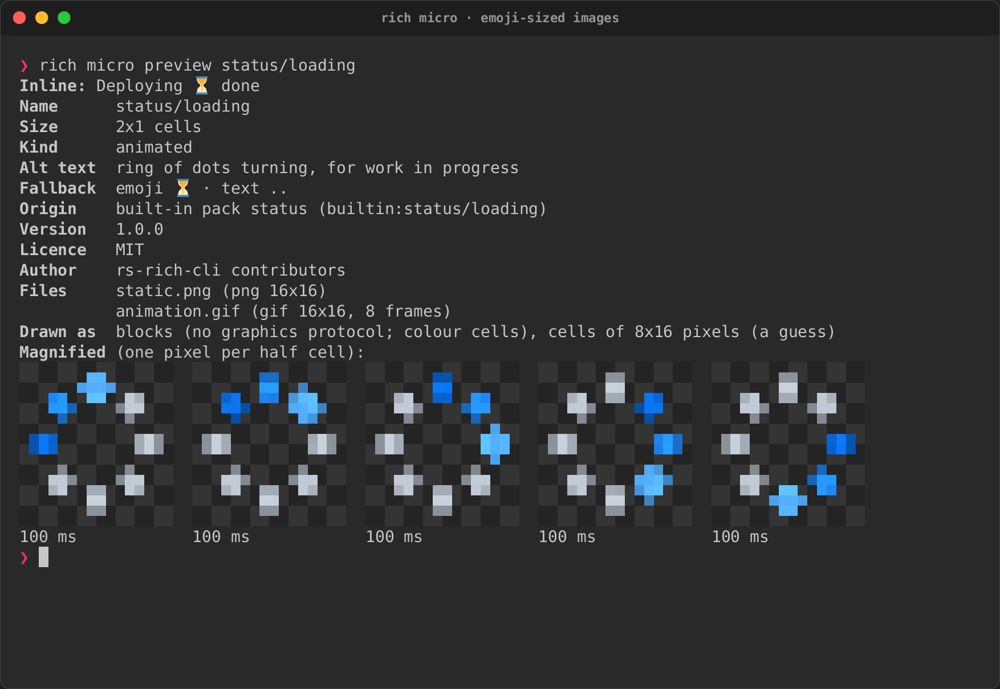

# Authoring micro assets

A micro asset is small: 2×1 cells by default, which a terminal with the
usual 8×16-pixel cells draws from a **16×16-pixel** image (1×1 is 8×16).
Anything you give it is scaled to exactly that, so an asset reads best when
it is drawn for that size: a bold silhouette, two or three colours, a
one-pixel outline, nothing thinner than a pixel.

This page covers making one: the pipeline (`rich micro create`, or
`rich_micro::pipeline` in code), the package it writes, what to put in the
manifest, and how to check it before you share it. See
[the CLI](cli.md) for every `rich micro` command.

## From an image to a package

```sh
rich micro create logo.png --name team/logo --alt "our logo, a blue fox" \
    --emoji 🦊 --text TL --license MIT --add
```

`create` reads a PNG, APNG, GIF or JPEG (up to 8192 pixels a side and
32 MiB), runs every frame through the pipeline, and writes a package the
registry accepts; it reads the package back before it reports success, and
removes it if it would not load. By default it writes `./team.logo/` (the
name, with `/` as `.`); `--output PATH` puts it elsewhere, `--archive`
writes one `.richmicro` zip file, and `--add` writes it into your user layer
(`~/.config/rich/micro/`, or the project's `.rich/micro/` with `--project`).

The pipeline, in order, for every frame:

| Step | Options | Default |
|---|---|---|
| Adjust | `--brightness F`, `--contrast F`, `--gamma F`, `--grayscale` | as is |
| Transparency from a background colour | `--transparency key:#rrggbb` | off |
| Fit to the cells | `--fit contain\|cover\|stretch`, `--anchor center\|top\|…\|bottom-right`, `--size 2x1\|1x1`, `--cell WxH` | contain, 2x1, 8x16 |
| Sharpen | `--sharpen RADIUS` (an unsharp mask, e.g. `0.8`) | off |
| Transparency | `--transparency threshold[:ALPHA]\|keep\|flatten:#rrggbb` | `threshold:128` |
| Palette | `--colors truecolor\|256\|16\|grayscale`, `--dither none\|floyd-steinberg\|bayer\|atkinson` | truecolor |

Then an animation is deduplicated (a frame equal to the one before it only
lengthens it) and rate-limited (frames under 40 ms merge into the next), up
to 240 frames. Everything here is `rs-rich-art`'s image code: the same
fitting, adjustments and dithering `rich --image` uses.

Some advice:

- **Fit.** `contain` keeps the whole picture and leaves transparent margins;
  `cover` fills the cells and crops (use `--anchor` to keep the part that
  matters); `stretch` distorts. A square source in 2×1 cells fits exactly.
- **Downscaling blurs.** A 512-pixel logo shrunk to 16 pixels loses its
  edges; `--sharpen 0.6` to `1.0` brings them back. Better still, start from
  a source drawn small.
- **Transparency.** Terminal backgrounds vary, so leave the background
  transparent. GIF animations and most terminal protocols draw pixels either
  on or off, which is why the default cuts alpha at half; `keep` keeps soft
  edges in the still PNG only. A JPEG has no alpha: `key:#ffffff` makes its
  white background transparent.
- **Palette.** `--colors 256` makes an asset look the same on a 256-colour
  terminal as on a true-colour one.

In code the pipeline is `rich_micro::pipeline::Pipeline` and the writer
`rich_micro::create::write_package`:

```rust
use rich_art::image::{DynamicImage, Rgba, RgbaImage};
use rich_micro::create::{write_package, PackageSpec};
use rich_micro::pipeline::Pipeline;
use rich_micro::CellSize;

let image = DynamicImage::ImageRgba8(RgbaImage::from_pixel(32, 32, Rgba([0, 160, 0, 255])));
let processed = Pipeline::new(CellSize::default()).process_image(&image);
let spec = PackageSpec::new("team/ok", "a green square").text("ok");
let asset = write_package(std::path::Path::new("team.ok"), &spec, &processed, false)?;
```

From Python, `rs_rich.micro.micro_create_package(image, dest, name=…, alt=…)`
does the same.

## Preview at the real cell size

```sh
rich micro preview team/logo        # an asset by name
rich micro preview team.logo        # a package on disk
rich micro preview logo.png --fit cover --sharpen 0.8   # the pipeline, before you create
```

`preview` draws the asset inline (`Deploying ▯▯ done`) the way this terminal
shows it, and magnified: one image pixel per half cell, over a dark
checkerboard where it is transparent, fitted to **this terminal's** cell
size in pixels (from `RICH_CELL_PIXELS`, the window size, or a `CSI 16 t`
query), which is what a graphics protocol will show. An animation shows its
frames side by side with their times. Give an image file instead and it
shows what the pipeline would make of it, with the same options as
`create`.



The recording is from a PTY with no image protocol, so the inline asset is
its emoji fallback; the magnified frames are half-blocks on any colour
terminal.

## The manifest

`create` writes the manifest for you. By hand, a package is a folder (or a
zip file ending `.richmicro`) holding `manifest.json` and its images:

```json
{
  "schema_version": 1,
  "name": "team/logo",
  "alt": "our logo, a blue fox",
  "size": "2x1",
  "kind": "static",
  "fallback": { "emoji": "🦊", "text": "TL" },
  "static": "static.png",
  "animation": "animation.gif",
  "version": "1.0.0",
  "license": "MIT",
  "author": "Team"
}
```

- **name**: lowercase letters, digits, `_` and `-`, with `/` between
  namespaces. Use a namespace of your own (`team/…`): names are what people
  type, and a bare name like `rocket` reads like the emoji code `:rocket:`.
  None of the built-in names is an emoji code, and yours should not be one
  either.
- **alt**: mandatory, at most 200 characters, describing what the picture
  shows (`green circle with a white check mark`), not what it means. Screen
  readers, logs and plain exports show it where nothing else fits.
- **fallback**: an emoji, a short text, or both. Each must fit the asset's
  columns (two for 2×1) with no spaces. The emoji is what most terminals
  without graphics show; the text is for consoles that cannot show emoji.
  Give both.
- **license**: an SPDX identifier. Say what you may share it under; do not
  package logos or artwork you have no right to redistribute.
- **aliases** (optional): other names, resolved within the same layer.

Packages are untrusted input and are read under hard limits: 8 MiB for an
archive, 2 MiB a file, 256 pixels a side, 240 frames, 32 MiB decoded. Keep
yours far below them: a 16×16 PNG is a few hundred bytes.

## Packs

A pack is a folder or zip file with a `pack.json` and its packages:

```json
{ "schema_version": 1, "name": "team", "version": "1.0.0",
  "license": "MIT", "packages": ["logo", "deploy.richmicro"] }
```

`rich micro install PATH` copies one into your user layer (`--project` for
the project's), `rich micro packs` lists what each layer has, and
`rich micro uninstall NAME` removes it. One bad package does not reject the
pack: it is reported, and the rest load.

## The built-in library

The built-in assets are drawn for this project, in code:
`crates/rich-micro/examples/gen_builtin.rs` describes each one as shapes on
a 16×16 grid, renders them at 64×64 with supersampling and runs the result
through the same pipeline. Run it after changing a drawing:

```sh
cargo run -p rs-rich-micro --example gen_builtin
```

It rewrites `crates/rich-micro/builtin/` (the packs, and `files.rs`, the
table the crate embeds). A test regenerates everything and fails when the
committed files do not match; another checks every built-in asset has alt
text, an emoji and a text fallback and a licence, and that no name is an
emoji code or a third-party logo.

| Pack | Assets |
|---|---|
| `status` | `status/success`, `status/warning`, `status/error`, `status/info`, `status/loading` (animated) |
| `dev` | `dev/bug`, `dev/branch`, `dev/terminal`, `dev/package` |
| `fun` | `fun/heart` (animated), `fun/star`, `fun/cat`, `fun/coffee` (animated) |

[The built-in library](library.md) shows each one magnified, with its
animation. All are MIT, like the rest of the project. There are no third-party logos
(git, Rust, Python, Docker and the like): their trademark and licence terms
keep them out of a default library. Package them yourself if you have the
right to.
