# The built-in library

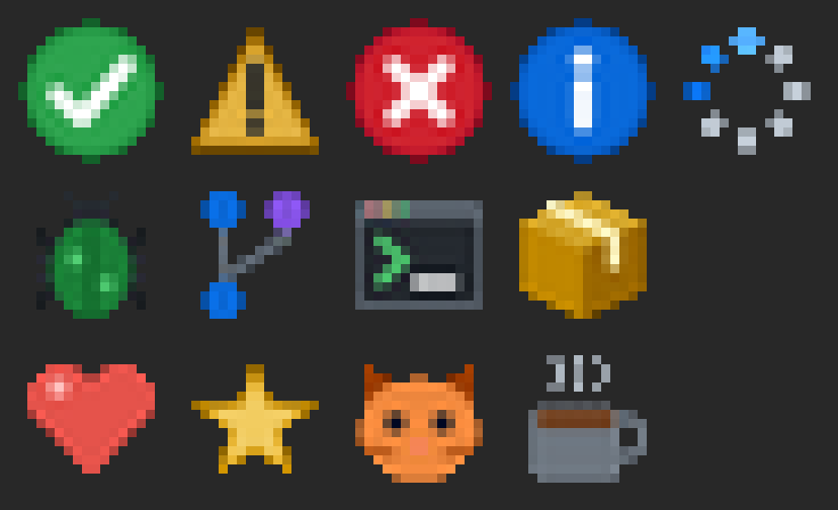

`rs-rich-micro` ships thirteen assets in three packs, drawn for this project
and licensed MIT. Each image below is the asset's own file, magnified ten
times so each of its 16×16 pixels shows as a square. Animated assets play
their real frames at their real timings.

In a terminal, an asset takes two cells, the space of one emoji. What fills
those cells depends on the terminal: see
[Drawing modes, side by side](#drawing-modes-side-by-side) below.

```sh
rich micro list --layer built-in        # the same list, in your terminal
rich micro preview fun/heart            # one asset, inline and magnified
rich -p --emoji "Deploy :micro:status/success: done"
```

<!-- micro-gallery:begin (generated by scripts/micro_gallery.py) -->

| Image | Name | Alt text | Fallback | Kind | Licence |
|---|---|---|---|---|---|
| { width=80 } | `:micro:status/success:` | green circle with a white check mark | ✅ `OK` | static | MIT |
| 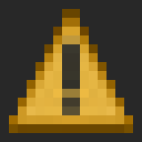{ width=80 } | `:micro:status/warning:` | amber triangle with an exclamation mark | ⚠ `!!` | static | MIT |
| 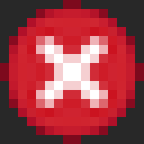{ width=80 } | `:micro:status/error:` | red circle with a white cross | ❌ `XX` | static | MIT |
| { width=80 } | `:micro:status/info:` | blue circle with a white letter i | ℹ `i` | static | MIT |
| 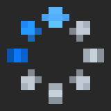{ width=80 } | `:micro:status/loading:` | ring of dots turning, for work in progress | ⏳ `..` | animated, 8 frames, 800 ms a loop | MIT |
| 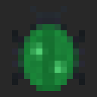{ width=80 } | `:micro:dev/bug:` | green bug with six legs | 🐛 `#!` | static | MIT |
| 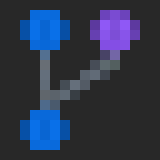{ width=80 } | `:micro:dev/branch:` | branching line with three commit dots | 🔀 `Y` | static | MIT |
| 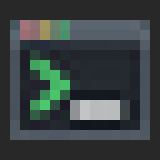{ width=80 } | `:micro:dev/terminal:` | terminal window with a prompt | 💻 `>_` | static | MIT |
| 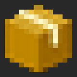{ width=80 } | `:micro:dev/package:` | closed cardboard box | 📦 `[]` | static | MIT |
| 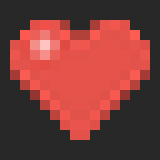{ width=80 } | `:micro:fun/heart:` | red heart, beating | 💖 `<3` | animated, 4 frames, 1000 ms a loop | MIT |
| 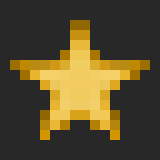{ width=80 } | `:micro:fun/star:` | yellow five-pointed star | ⭐ `*` | static | MIT |
| 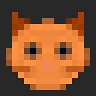{ width=80 } | `:micro:fun/cat:` | orange cat face | 🐱 `=^` | static | MIT |
| 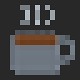{ width=80 } | `:micro:fun/coffee:` | steaming cup of coffee | ☕ `c[` | animated, 3 frames, 750 ms a loop | MIT |

<!-- micro-gallery:end -->

The fallback column is what a terminal with no image protocol shows by
default: the emoji, or the text where emoji are turned off. Alt text is what
screen readers, logs and plain exports get.

## Drawing modes, side by side

What fills an asset's two cells depends on the terminal, chosen once per
terminal (see [Terminal compatibility](terminals.md)):

| Mode | Chosen when | What fills the cells |
|---|---|---|
| `kitty`, `iterm`, `sixel` | the terminal speaks that image protocol | the image above, in pixels, fitted to exactly its cells |
| `blocks` | a colour terminal with no image protocol | the asset's emoji; with `RICH_MICRO=blocks`, its image scaled to 2×2 colour samples, one per half cell |
| `text` | `TERM=dumb` or no colour, and always for pipes, log files and exports | the text fallback, else the alt text |

The recording below is real: the same line with the emoji, then with
`RICH_MICRO=blocks`, then `rich micro preview fun/heart` with both
fallbacks and its four frames magnified. A pseudo-terminal speaks no image
protocol, so the pixel modes are the one thing it cannot record: a Kitty,
iTerm2 or Sixel terminal draws the images in the table above, in the same
cells.


`RICH_MICRO=kitty|iterm|sixel|blocks|text` forces a mode, and `rich doctor`
says which one your terminal got and why. Half-blocks at this size keep an
asset's colours, not its shape, which is why the emoji comes first: they
are there for an asset with no emoji, or when you ask for them.

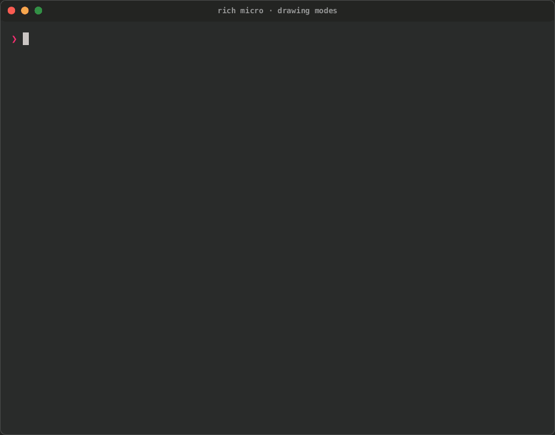

[Tape](../../tapes/micro-modes.tape) · [Cast](../../media/tapes/micro-modes/micro-modes.cast) · [GIF](../../media/tapes/micro-modes/micro-modes.gif) · [Page](../../media/tapes/micro-modes/micro-modes.html) · more in [Terminal recordings](../../recordings.md#micro-assets)

## Making your own

[Authoring micro assets](authoring.md) takes an image of any size through
the same pipeline that made these: fitted to the cells, with contrast,
sharpening and transparency, into a package the registry loads.
`crates/rich-micro/examples/gen_builtin.rs` draws the built-in assets; the
page you are reading is regenerated from them with:

```sh
python3 scripts/micro_gallery.py
```

CI runs it with `--check`, so this page cannot fall behind the library.
