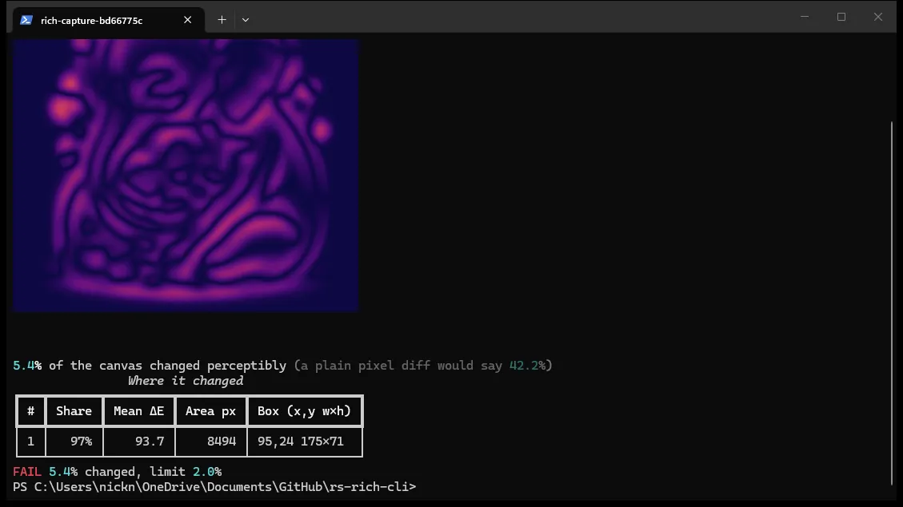
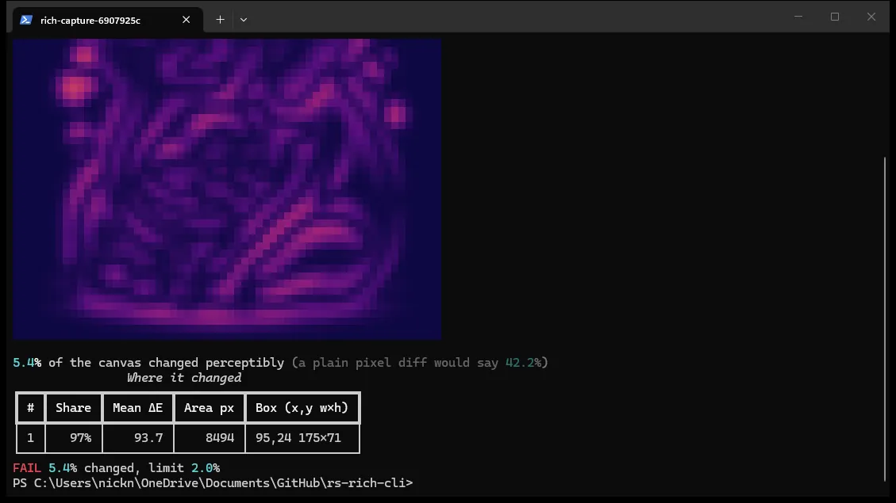
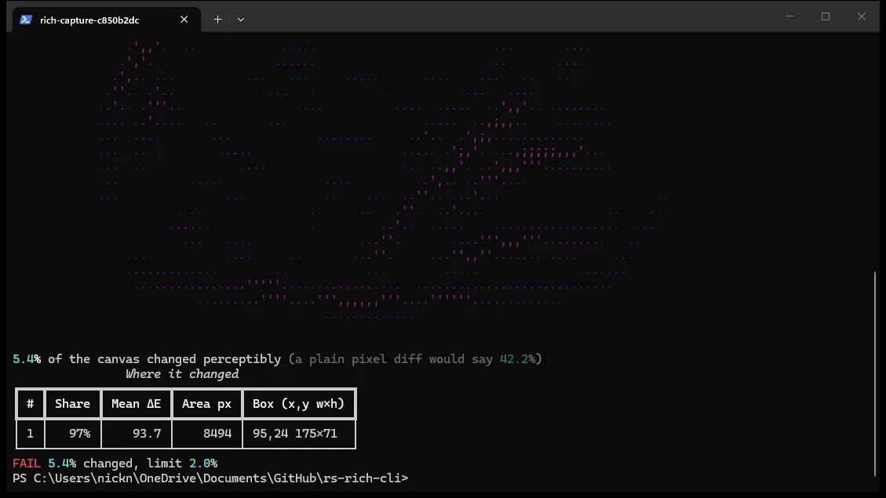

# Comparing images

```bash
rich --diff before.png after.png
```

`--diff` answers a question a pixel comparison cannot: **would a person notice,
and where?**

Compare two images byte for byte and anything regenerated — artwork,
anti-aliased text, a re-encoded screenshot — reports as almost entirely
changed. On the pair used throughout this page a plain comparison calls **42%**
of the canvas different, with a bounding box covering three quarters of the
frame. True, and useless.

The perceptual pipeline reports **5%**, and points at the one region that
matters.

## How it decides

1. **Blur** both images, so sub-pixel noise and re-encoding artefacts stop
   registering as change.
2. **Convert to CIELAB**, where Euclidean distance approximates perceived
   difference. In RGB a shift in dark blue and the same numeric shift in
   mid-green look identical to the arithmetic and nothing alike to the eye.
3. **ΔE per pixel** (CIE76), then threshold.
4. **Morphological open** — erode, then dilate — dropping speckle while leaving
   surviving areas their original size.
5. **Label connected components** and rank them by area × severity, so the
   report leads with what a person would point at first.

## The output

Two parts. The picture shows *where*; the table is the part that survives a
pipe, a log, and a CI transcript.



`Share` is the region's portion of all changed pixels — including components
too small to be listed, so the shares do not sum to 100%. `Mean ΔE` is how
*strong* the change is, independent of how large.

## Choosing how the picture is drawn

```bash
rich --diff before.png after.png --image-mode sixel
```

| mode | what it does |
|---|---|
| `auto` | Sixel where it looks supported, else `blocks`, else `ascii` (default) |
| `sixel` | Real pixels via the Sixel graphics protocol |
| `blocks` | Half-block characters — any truecolour terminal |
| `ascii` | A character ramp; the only mode that needs no colour |
| `none` | Numbers only |

**`blocks`** packs two pixel rows into each character cell as `▀`, foreground
over background. Every cell is painted, so there are no gaps, but a cell can
only carry two colours — hence the visible stair-stepping.



**`ascii`** maps each pixel to a character from a ramp. Dark pixels become
spaces, so a heat map arrives full of holes. It is the right answer for line art
and for terminals with no colour at all, and the wrong one for anything
photographic — included here because that trade-off is worth seeing rather than
being told about.



### Why this is a picker and not just detection

There is no reliable way to ask a terminal whether it renders Sixel. The correct
probe is a DA1 query needing a round trip on a tty, which is unavailable when
output is piped, and terminals that ignore the query leave you waiting. `auto`
is therefore a **heuristic over environment variables** and will be wrong
somewhere.

So the guess is overridable at every level: `--image-mode` beats everything, and
`RICH_SIXEL=0`/`1` beats the heuristic.

**Every mode degrades rather than failing.** Sixel is a control sequence, so it
only works on a terminal — redirected or exported, it falls back to blocks (or
ASCII without colour). Blocks need colour, so without it they fall back to
ASCII, since a half-block render with no colour is a rectangle of identical
characters carrying no information. Each downgrade prints a line to **stderr**
saying what it did, so the change is visible rather than mysterious, and stderr
keeps it out of a redirected report.

## As a CI gate

```bash
rich --diff baseline.png current.png --threshold 2 --image-mode none
```

Exits non-zero when more than 2% of the canvas has changed perceptibly, so
visual regressions fail a build. The threshold is compared against the
*perceptual* figure, never the naive one — gating on a byte comparison is what
makes visual regression testing unusable, because every re-render trips it.

The comparison uses the percentage **as printed**, to one decimal place, so a
limit equal to the reported figure passes and the verdict never contradicts the
number beside it. A threshold outside 0–100, or one that is not a real number,
is rejected: `NaN` parses successfully as a float and compares false against
everything, so accepting it would silently switch the gate off and report a pass.

Everything the gate prints goes to **stdout**; only the downgrade notices above
use stderr.

## Tuning

**These are not exposed on the command line yet** — they are listed so the
output can be interpreted, not adjusted. `--threshold` gates the *result*; it
does not change the ΔE threshold below. Callers of the `rich-art` crate can set
all four through `DiffSettings`.

Defaults are tuned for regenerated artwork, where noise is heavy. Screenshot
pairs are far cleaner and would tolerate a much lower ΔE threshold.

| setting | default | effect |
|---|---|---|
| blur radius | 6.0 | higher ignores more fine detail |
| ΔE threshold | 60.0 | higher reports only stronger changes |
| open kernel | 11 | larger discards bigger speckles |
| minimum region | 400 px | smaller regions are not listed |

Images of differing sizes are refused rather than compared: every pixel past the
smaller extent would read as changed, which is not a meaningful answer.

## Accuracy

The pipeline is verified against a Python reference implementation using
`scipy.ndimage`, in the same arrangement `capture_golden.py` provides for render
parity. On the full-size reference pair the two agree on region count and rank
order, positions to within 1–3 px, areas to within 0.1–2.1%, and mean ΔE to one
decimal place.

The residual is one known difference: PIL's `GaussianBlur` approximates a
Gaussian with three box passes, where this uses a true separable Gaussian. That
moves the ΔE threshold boundary by a pixel or so, which nudges region edges. The
parity test pins the agreement rather than claiming it is exact.
