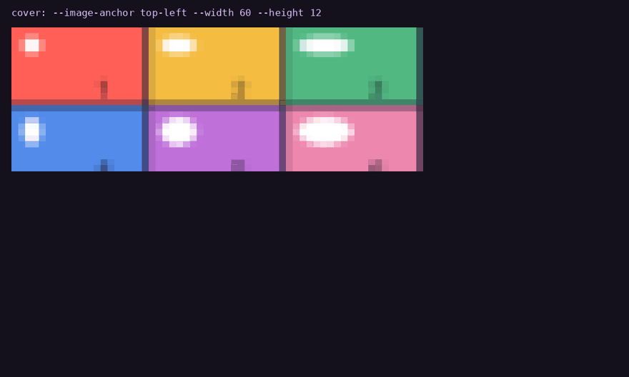

# rs-rich

<div class="project-badges" markdown="1">

[](https://github.com/buchochelliq-labs/rs-rich-cli/actions/workflows/ci.yml)
[](https://crates.io/crates/rs-rich)
[](https://docs.rs/rs-rich)
[](https://github.com/buchochelliq-labs/rs-rich-cli#develop)
[](https://github.com/buchochelliq-labs/rs-rich-cli/blob/main/LICENSE)
[](https://github.com/buchochelliq-labs/rs-rich-cli)

</div>

A Rust port of Python's [`rich`](https://github.com/Textualize/rich) — rich text,
colour, tables, markdown and progress bars in the terminal — plus a port of the
[`rich-cli`](https://github.com/Textualize/rich-cli) tool.



**[Watch the CLI and art videos](demos.md)** · [Browse the gallery](gallery.md) ·
[Start with the CLI](cli.md) · [Learn the library](tutorial/index.md) · [Read the full guide](guide/index.md)

The preview shows `rich-art` cover cropping, recorded with CLI 0.0.8. The
[0.0.11 demo tour](demos.md) walks through the newer tools: `inspect`, `diff`,
`view`, the `hex`, `unicode` and `ansi explain` inspectors, a theme file, a
redacted `capture`, and the new image modes.

```bash
cargo install rs-rich-cli
rich --print '[bold magenta]Hello[/] [green]World[/]'
```

For Rust applications: `cargo add rs-rich`. Read [Getting started](getting-started.md)
for a complete library example.

## Output in motion


Progress and spinner animations replay exported library frames. The
[gallery](gallery.md) pairs output with links to the relevant guides.

## Release history and development

The [0.0.9 cohort](releases/0.0.9-expanded.md) is published. The
[0.0.10 cohort](releases/0.0.10.md) is published too. It adds
Progress time, rate and spinner columns, upstream's theme stack, `~~~` strikethrough
parity, multi-file watch, and quadrant, ANSI16 and grayscale image modes.
The [0.0.11 cohort](releases/0.0.11.md) (core 0.0.7, macros 0.0.1 (new),
ext 0.0.9, art 0.0.9, CLI 0.0.11) is published. It adds
diagnostics, structured data, checked-markup macros, `clap` and `tracing`
integration, workflow renderables, and the `inspect`, `diff`, `view`, `hex`,
`unicode`, `env` and `capture` commands.
The [roadmap](ROADMAP.md) tracks subsequent work. Manifest versions below
identify this checkout; the crates.io badges identify published packages.

## What it does

<div class="grid cards" markdown>

- **Console markup**

    `[bold red]text[/]` — nested tags, themes, emoji shortcodes, and automatic
    highlighting of numbers, paths, URLs and booleans.

- **Layout**

    Tables, panels, trees, columns, rules, alignment and padding, all of which
    measure and wrap correctly against terminal cell widths.

- **Documents**

    Markdown, JSON and syntax-highlighted source, rendered to the terminal.

- **Live output**

    Progress bars, spinners and status displays that refresh in place.

- **The `rich` command**

    Render files from the shell, plus tools: `inspect` structured data, `diff`
    text and patches, `view`, `hex`, `unicode`, `env`, `capture` and `doctor`.
    See the [CLI guide](guide/cli/walkthrough.md).

- **Rust ergonomics**

    Diagnostics and stack traces, checked-markup macros, `clap` help, `tracing`
    and `log` handlers, and serde-driven structured data, in `rs-rich-ext`.

- **Workflow renderables**

    Command steps, task trees, transfers, countdowns, badges, size bars and
    formatters for build and deploy tools. See [Workflows](guide/ext/workflows.md).

- **Art**

    FIGlet banners, images and GIFs as ASCII, Braille, blocks, quadrants or
    Sixel, with dithering and alpha backgrounds. See [Art](guide/art/index.md).

- **Accessibility and capabilities**

    Detect what the terminal supports, degrade to a fidelity level, render
    decoration-free text for screen readers and check theme contrast. See
    [Capabilities](guide/ext/capabilities.md) and
    [Accessibility](guide/ext/accessibility.md).

</div>

## Byte-parity with Python rich

Golden fixtures compare covered output against Python `rich` 15.0.0 in CI.
Coverage and known differences are documented in [Module status](PORTING.md)
and [Divergences](DIVERGENCES.md); not every implemented feature is byte-identical.

That promise is why the honest bits matter:

!!! warning "Early releases with independent crate versions"

    The API takes breaking changes regularly, and the port is deliberately
    incomplete. What is implemented is parity-tested; what isn't is listed
    plainly in [Module status](PORTING.md), and what deliberately differs is in
    [Divergences](DIVERGENCES.md) — most notably syntax highlighting, which uses
    `syntect` rather than Pygments and is therefore *not* byte-identical.

## Released crates

The badges below show the versions currently available on crates.io.

| crate | version | docs | what it is |
|---|---|---|---|
| [`rs-rich`](https://crates.io/crates/rs-rich) | [](https://crates.io/crates/rs-rich) | [docs.rs](https://docs.rs/rs-rich) | the library — `use rich::…` |
| [`rs-rich-cli`](https://crates.io/crates/rs-rich-cli) | [](https://crates.io/crates/rs-rich-cli) | — | the `rich` command |
| [`rs-rich-ext`](https://crates.io/crates/rs-rich-ext) | [](https://crates.io/crates/rs-rich-ext) | [docs.rs](https://docs.rs/rs-rich-ext) | extensions + plugin registry |
| [`rs-rich-macros`](https://crates.io/crates/rs-rich-macros) | [](https://crates.io/crates/rs-rich-macros) | [docs.rs](https://docs.rs/rs-rich-macros) | checked markup and derive macros, used through `rs-rich-ext` |
| [`rs-rich-art`](https://crates.io/crates/rs-rich-art) | [](https://crates.io/crates/rs-rich-art) | [docs.rs](https://docs.rs/rs-rich-art) | FIGlet text, image→ASCII, GIFs |

<a id="versions-prepared-in-this-checkout"></a>

### Versions in this checkout

These manifest versions describe the source tree, not publication status.
Each crate versions independently; see [Branching and releases](BRANCHING.md).

<!-- BEGIN MANIFEST VERSIONS -->
| Package | Manifest version |
|---|---|
| [`rs-rich`](https://crates.io/crates/rs-rich) | `0.0.8` |
| [`rs-rich-macros`](https://crates.io/crates/rs-rich-macros) | `0.0.2` |
| [`rs-rich-ext`](https://crates.io/crates/rs-rich-ext) | `0.0.10` |
| [`rs-rich-cli`](https://crates.io/crates/rs-rich-cli) | `0.0.12` |
| [`rs-rich-art`](https://crates.io/crates/rs-rich-art) | `0.0.10` |
<!-- END MANIFEST VERSIONS -->

## Install

=== "Library"

    ```bash
    cargo add rs-rich
    ```

    The package is `rs-rich` because `rich` was taken on crates.io. The library
    target keeps the short name, so you write:

    ```rust
    use rich::{Console, Table};
    ```

=== "CLI"

    ```bash
    cargo install rs-rich-cli
    ```

    Installs a binary called `rich`.

## A first look

```rust
use rich::Console;

let console = Console::new();
console.print_str("[bold magenta]Hello[/] [green]World[/] — 42");
```

Then read the [tutorial](tutorial/index.md), or skim the
[gallery](gallery.md) to see what is available.
