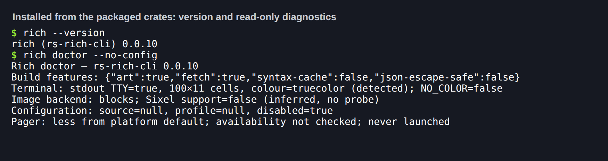
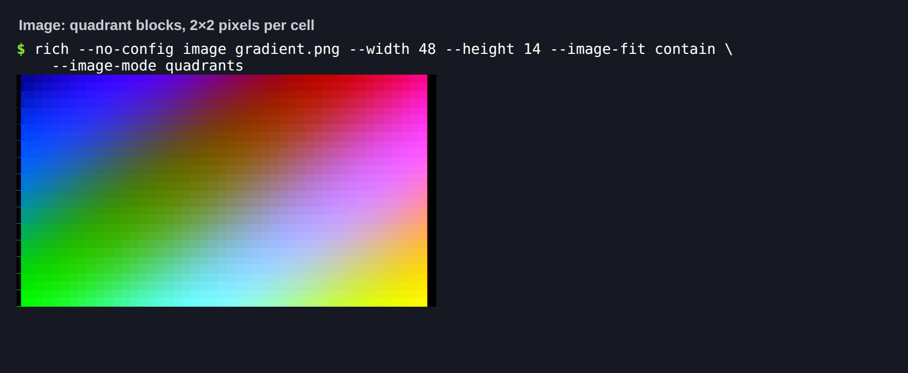
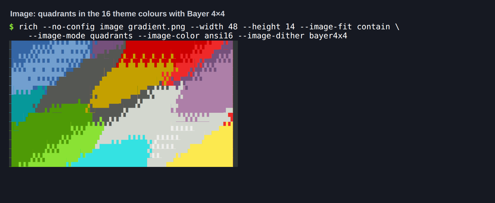
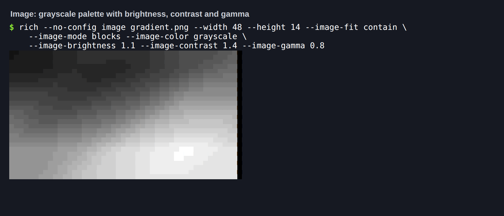
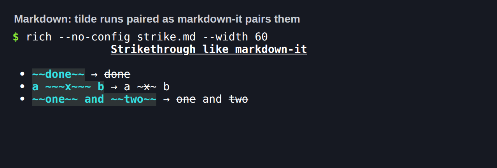
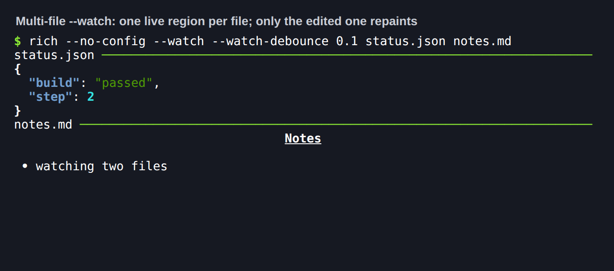

# 0.0.10 cohort — progress you can ship with

**Prepared on `main`; not published.** No tags or registry uploads are part of this
preparation. The cohort is core 0.0.6, ext 0.0.8, art 0.0.8 and CLI 0.0.10. The
previous [0.0.9 cohort](0.0.9-expanded.md) is published.

## Independent package versions

| Package | Version | Release role |
|---|---|---|
| `rs-rich` | 0.0.6 | Progress time/rate/spinner columns and task model, theme stack and theme files, `~~~` strikethrough parity, Spinner/Status animation state, Syntax/JSON measurement |
| `rs-rich-ext` | 0.0.8 | Real error chains, fill-region layouts, explicit `Overflowing` wrapper |
| `rs-rich-art` | 0.0.8 | ANSI16 and grayscale palettes, quadrant blocks, stretch fit, size caps, brightness/contrast/gamma |
| `rs-rich-cli` | 0.0.10 | Multi-file debounced `--watch`, the new image flags, `toml` 1.x |

Internal requirements are exact `0.0.x` pins, so the four move together and
`cargo tree` holds one `rs-rich`.

## What changed

Each item links the pull request that carries its evidence. The
[0.0.10 plan](../plans/0.0.10.md#delivered) records the differences from plan.

- **Progress (#6, #383 via #496):** an injectable clock (upstream `get_time`), task
  start/stop/finish times, the 30-second speed window, the task-driving API, and
  `TimeElapsed`, `TimeRemaining`, `TransferSpeed`, `FileSize`, `TotalFileSize`,
  `Spinner` and `TaskProgress` columns. `Progress::new()` now uses upstream's default
  columns, which include time remaining. Golden: `progress_time.tsv`.
- **Theme stack (#3, #231):** `Console::push_theme`, `pop_theme` and `use_theme` (a guard
  that pops on drop), plus `Theme::from_file`/`read`/`config` for upstream theme files.
  Golden: `theme_stack.tsv`.
- **Strikethrough (#9, #381):** tilde runs pair as markdown-it pairs them, so
  `a ~~~x~~~ b` renders `a ~` + struck `x` + `~ b`. Golden: `markdown_strike.tsv`.
- **Spinner and Status (#15, #496):** the first render starts the animation, `update`
  works mid-animation, and text is markup. Goldens: `live_status.tsv`.
- **Measurement and overflow (#149, #436):** upstream `__rich_measure__` for `Syntax`
  and `Json`, and `rich_ext::layout::Overflowing` with one explicit policy. Golden:
  `measure.tsv`.
- **Layouts and diagnostics (#134, #146, #151, #436):** layout leaves fill their region
  as upstream `Layout` does, and `Diagnostic::from_error` reports real error chains
  instead of `[cycle]`.
- **Image modes (#125, #126, #199, #437):** ANSI16 and grayscale palettes with every
  dither, quadrant blocks (also for `--diff`), stretch fit, `--image-max-width`/`height`,
  and brightness, contrast and gamma in a fixed order. With the new options unset,
  149 existing invocations were byte-identical to the previous binary.
- **Watch (#139, #438):** several local files, one Live region each, file events from
  `notify` with a per-file debounce and a polling fallback.
- **Parity tooling (#34, #450):** Table, Rule, Padding and Align differential
  generators and a nightly 20,000-case run. Its first findings are filed as #442–#449.
- **Release hardening (#201):** crates.io Trusted Publishing, Node 24 action majors,
  `icy_sixel` 0.7 and `toml` 1.x.

## Migration

- `Status::renderable` returns `&Spinner`. A spinner built fresh for every frame now
  always shows its first frame; keep one spinner for the whole animation.
- `Progress::new()` adds a time-remaining column. Pass `.columns(…)` to keep the old set.
- ext layouts with height-aware leaves (such as `Panel`) now fill their region. Wrap a
  leaf in `.content_height()` for the old natural height.
- Exhaustive matches need the new `RichError::{ThemeStack, ThemeConfig}`,
  `ImageMode::Quadrants`, `ImageFit::Stretch`, `ImageColorMode::{Ansi16, Grayscale}`
  and `ImageArtError::InvalidAdjustment` variants. `ImageTransforms` is no longer `Eq`;
  struct literals need `..Default::default()`.

## Release test (2026-09-23)

Run on the integrated tree (`main` through #231, plus this branch's release
fixes), with Rust 1.98.1 stable and `NO_COLOR` unset.

| Check | Result |
|---|---|
| `python scripts/validate_release.py --tag rs-rich-cli-v0.0.10` | All 15 steps pass: fmt, three Clippy configurations, 908 Rust tests (0 failed), lean CLI tests, 36 Python release tests, version and CLI-reference checks, locked build and check, staged packages, tag plan |
| `capture_golden.py` against real `rich` 15.0.0 (dedicated venv, no rich-cli) | All 16 fixture files regenerate byte-identically |
| `release.py plan` per tag | `rs-rich-v0.0.6`, `rs-rich-ext-v0.0.8`, `rs-rich-art-v0.0.8`, `rs-rich-cli-v0.0.10` each select exactly their own package |
| `release.py plan v0.0.10` | Rejected: `rs-rich: manifest says 0.0.6, tag says 0.0.10` (and ext, art) |
| crates.io API | 404 for all four new versions; 200 for the published 0.0.9 cohort (core 0.0.5, ext 0.0.7, art 0.0.7, CLI 0.0.9) |
| Existing tags | None of the four new tags exist; every 0.0.9-cohort tag is annotated on the remote |
| Consumer install | `cargo install` from the packaged `rs-rich-cli-0.0.10` source, with siblings patched only to their packaged `.crate` contents: release build succeeds, `rich --version` reports 0.0.10 |
| Library consumer | A fresh crate pinned to `=0.0.6`/`=0.0.8` packaged core/ext: theme stack guard and base-pop error, `a ~~~x~~~ b` strikethrough, Progress speed/remaining on an injected clock (checked against rich 15.0.0), Spinner start-at-first-render, `Overflowing` crop |
| CI scripts against the final optimized binary | `test_cli_terminal.py` (3), `test_demo_pty.py` (5 process checks), `test_batch_v9.py`, `snapshot_cli.py` (6 workflow snapshots), `test_watch_workflows.py` (12), `test_live_regions_pty.py`, and the differential corpus (21 of 21 match rich 15.0.0) |
| Docs | `mkdocs build --strict` passes; `gen_versions.py --check` and `gen_cli_reference.py --check` match |

The patched consumer stands in for registry resolution until the dependencies are
published; the release workflow's exact-version registry consumers remain required.

### What the release test found and fixed

- **Stale staged packages (release tooling).** The first gate run failed: `rs-rich-ext`
  was verified against a core 0.0.6 that lacked `fit_to_measurement`. Cargo's staging
  registry had reused the core 0.0.6 it unpacked when #201 was packaged, and the build
  of it, because it treats registry versions as immutable. The same trap can also pass
  a tree that uses a removed API. `check_packages.py` now drops cached copies of
  staged-only versions before verifying; a real-Cargo regression fails without the fix.
- **Watch retry hint.** With several files and `--watch-exit-on-error`, the failing
  region still said "watch will retry after the next change" just before the watch
  exited. It now matches the single-file path; the PTY test asserts it.
- **Demo.** The guided tour now shows 0.0.10: a pushed theme, `~~~` strikethrough, a
  two-file watch with Live regions, plus the Progress and art sections the feature PRs
  added. The watch ends on its own through `--watch-exit-on-error`.

### Tags to publish

Independent, annotated tags on the merged `main` commit that includes this pull
request, in this order. Verify each registry consumer before tagging dependents.
Do not use a coordinated `v0.0.10`; the release script rejects it.

1. `rs-rich-v0.0.6`
2. `rs-rich-ext-v0.0.8` and `rs-rich-art-v0.0.8`
3. `rs-rich-cli-v0.0.10`

Before the first tag, each of the four crates needs a Trusted Publishing entry on
crates.io (repository `buchochelliq-labs/rs-rich-cli`, workflow `release.yml`,
environment `crates-io`); see [Registry authentication](../BRANCHING.md#registry-authentication-trusted-publishing).
Delete the old `CARGO_REGISTRY_TOKEN` secret after the first trusted publish succeeds.

### Installed-binary screenshots

Each image is a real PTY run of the installed consumer binary (`TERM=xterm-256color`,
truecolor); the captured bytes are replayed verbatim into xterm.js in headless Chromium.
Only the caption line is added. Hashes of the raw PTY bytes, PNGs, binary and packaged
crates are in [`provenance.json`](../media/release-0.0.10/provenance.json); reproduce
with `scripts/terminal_shots/make_cases.py --release 0.0.10`.

In the ANSI16 image, the letterbox column is the terminal theme's colour 0 (grey in
xterm.js), not black: ANSI16 output follows the user's theme by design. The watch
capture ends with SIGINT (exit 130); its raw bytes show the first frame drawing both
files, the edit repainting only `status.json`, and the final frame kept on exit.

The [guided tour recording](../demos.md) is also re-recorded from the 0.0.10 build.

## Issue disposition

| Issue | State after merge | Suggested disposition |
|---|---|---|
| #3 theme stack | Closed | Done |
| #15 parity harness | Closed | Done |
| #125 image colour | Closed | Done for this slice; Atkinson, perceptual distance and Braille/Sixel/GIF colour modes were deferred in the plan |
| #134 layout constraints | Closed | Done |
| #139 watch | Closed | Done |
| #126 image transforms | Open | #437 said "Closes", but GitHub closes only the first issue in a list. Alpha/checkerboard modes were deferred in the plan: keep open, or close and file the remainder |
| #199 quadrant blocks | Open | Delivered by #437: close |
| #146, #151 diagnostics | Open | Delivered by #436 (the chain fix, snapshots and depth tests): close |
| #149 overflow policies | Open | Delivered by #436 as the maintainer chose: close |
| #6 Progress | Open | Keep open: `RenderableColumn`, Live-driven Progress, `track()` and the pulse bar remain |
| #9 Markdown | Open | Keep open: inline styling in table cells remains |
| #34 differential fuzzing | Open | Generators and the nightly shipped (#450); keep open while #442–#449 are fixed, or close and track those |
| #144 art in the CLI | Open | Keep open for future renderer and backend APIs |
| #198 tracker | Open | Close after publication |

## Known gaps

The nightly differential run will report #442–#449 until they are fixed: Padding,
Align, Rule, Table header, printed-Text joining, tabs with full justify, emoji
matching and a zero-width Panel. They are pre-existing core divergences, not
regressions in this cohort. Windows is covered by CI (`windows-latest`), not by
this local run.
